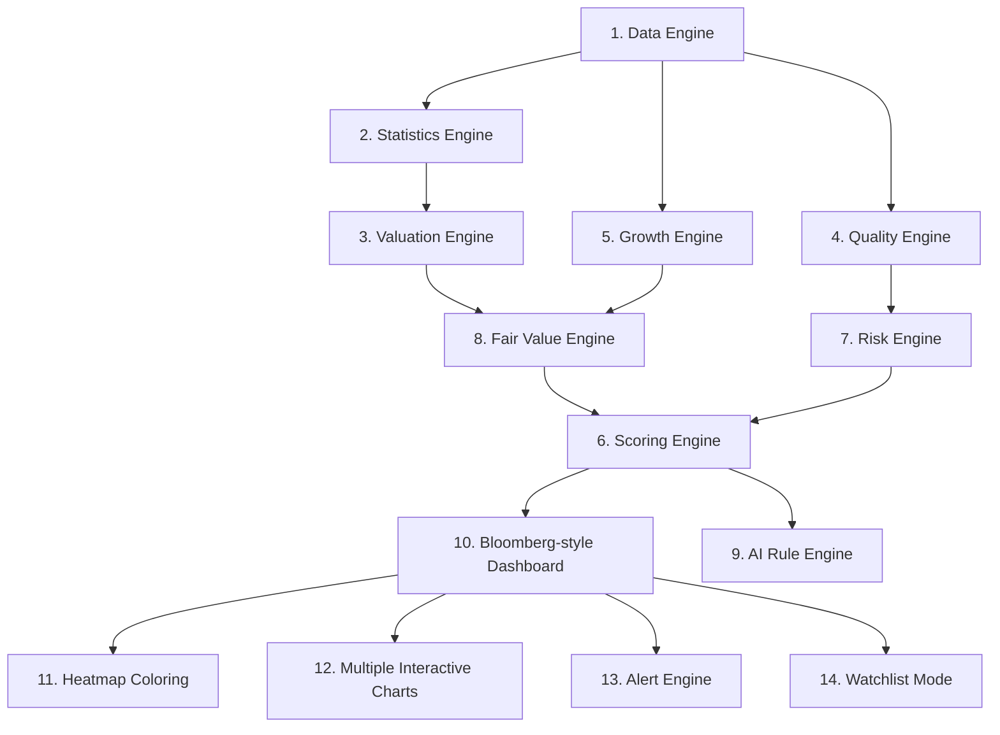

# Fundamental Intelligence Platform (FIP)
> **Slogan:** *"Convierte TradingView en una plataforma profesional de valoración empresarial."*

---

## 📌 Visión General
FIP no es un simple indicador de PER ni un script de trading. Es una **plataforma modular de análisis fundamental** integrada en TradingView, diseñada para responder de un vistazo a las preguntas clave del inversor de valor (*Value Investor*):

*   ¿La empresa está cara o barata respecto a su propia historia?
*   ¿Tiene un crecimiento sostenible en sus líneas de negocio?
*   ¿El mercado está exigiendo una valoración razonable o excesiva?
*   ¿Cuál es su valor intrínseco estimado (Precio Justo)?
*   ¿Es preferible asignar capital a la Empresa A o a la Empresa B?
*   ¿Qué empresas de un mismo sector ofrecen mejores múltiplos de entrada?

**FIP se enfoca 100% en el Análisis Fundamental y la Inversión a Largo Plazo; no está diseñado para hacer trading de corto plazo.**

---

## 📐 Arquitectura General de la Plataforma



---

## 🧩 Descripción de Módulos y Motores

### 1. Data Engine (El Corazón de FIP)
Centraliza la ingesta, limpieza y normalización de todas las variables financieras. **Ningún cálculo matemático debe estar disperso en el código; todo se consume desde este motor.**
*   **Precios:** Cierre (`Close`), Máximos (`High`), Mínimos (`Low`).
*   **Beneficios & Margen:** EPS Diluido, EPS Básico, EPS TTM.
*   **Ingresos:** Revenue, Revenue TTM, Crecimiento interanual.
*   **Flujos de Caja:** Flujo de Caja Operativo (OCF), Flujo de Caja Libre (FCF), Crecimiento de FCF.
*   **Balance Situacional:** Activos, Pasivos, Patrimonio Neto (`Equity`), Valor en Libros (`Book Value`), Deuda Total, Efectivo (`Cash`), Acciones en Circulación (`Shares Outstanding`).
*   **Dividendos:** Rentabilidad por Dividendo (`Dividend Yield`), Crecimiento del Dividendo, Ratio de Pago (`Payout Ratio`).

### 2. Statistics Engine
Trabaja exclusivamente con series de datos temporales de forma genérica. No tiene conocimiento conceptual sobre múltiplos (ej. no sabe qué es el PER); solo calcula estadística pura:
*   Media y Mediana.
*   Máximos y Mínimos.
*   Varianza y Desviación Estándar ($\sigma$).
*   Percentiles y puntuación Z (`Z-Score`).
*   Coeficiente de Variación, Rango, Asimetría (*Skewness*) y Curtosis.

### 3. Valuation Engine (Múltiplos de Valoración)
Calcula y normaliza los múltiplos financieros tradicionales:
*   **PER** (Price to Earnings).
*   **P/S** (Price to Sales).
*   **P/B** (Price to Book Value).
*   **P/FCF** (Price to Free Cash Flow).
*   **EV/EBITDA** y **EV/Sales**.
*   **PEG** (Price/Earnings-to-Growth).
*   **Yields:** Dividend Yield, FCF Yield, Book Yield, Earnings Yield.

### 4. Quality Engine (Análisis de Calidad)
Evalúa la eficiencia operativa, rentabilidad y solidez del negocio para generar un **Quality Score (0-100)**:
*   **Eficiencia:** ROIC, ROE, ROA.
*   **Márgenes:** Margen Bruto, Margen Operativo, Margen Neto.
*   **Liquidez & Solvencia:** Cobertura de Intereses, Deuda/Patrimonio, Cash Ratio, Current Ratio, Quick Ratio.
*   **Modelos de Quiebra/Fraude:** Altman Z-Score, Piotroski F-Score.

### 5. Growth Engine (Análisis de Crecimiento)
Mide la aceleración y consistencia del crecimiento histórico del negocio para generar un **Growth Score (0-100)**:
*   **CAGR de 3 y 5 años:** Revenue CAGR, EPS CAGR, FCF CAGR, Book Value CAGR, Dividend CAGR.
*   **Retorno al accionista:** Ritmo de recompra de acciones (*Share Buyback*).
*   **Consistencia:** Tendencia de márgenes operativos y consistencia general del crecimiento.

### 6. Scoring Engine
Unifica y pondera los resultados de todos los motores de puntuación individuales para ofrecer métricas consolidadas:
*   Métricas individuales (PER Score, P/S Score, PEG Score, FCF Score, etc.).
*   Score Combinado de Valor Intrínseco.
*   Puntuación de Calidad / Crecimiento / Riesgo.

### 7. Risk Engine
Evalúa la fragilidad del negocio ante escenarios de estrés financiero para generar un **Risk Score (0-100)**:
*   Niveles de Deuda y apalancamiento.
*   Volatilidad del precio de la acción y Beta histórica.
*   Cobertura de intereses e índices de liquidez rápida (`Quick Ratio`).
*   Puntuaciones Altman Z y Piotroski bajas.
*   *Resultado ejemplo:* **Score: 32 (Riesgo Bajo)**.

### 8. Fair Value Engine (Estimador de Precio Justo)
Calcula el Valor Intrínseco empleando diversos enfoques de valoración para compararlo con la cotización actual:
*   Precio Justo por múltiplos históricos: PER, P/S, P/B, PEG.
*   Descuento de Flujos de Caja (DCF) Simplificado.
*   Precio Justo Combinado (Media ponderada de los métodos anteriores).
*   *Resultado ejemplo:* **Intrinsic Value: $315** | **Precio Actual: $290** | **Upside: +8.6%**.

### 9. AI Engine (Motor de Reglas Estáticas)
Genera un análisis sintetizado de la situación del ticker sin recurrir a APIs de Inteligencia Artificial externas, utilizando un sistema estructurado de reglas lógicas.
> **Ejemplo de Salida (MSFT):**
> * "La empresa cotiza ligeramente por encima de su media histórica."
> * "El crecimiento del EPS sigue siendo fuerte."
> * "El margen operativo continúa aumentando."
> * "La valoración es exigente pero justificable."
> * **Score General:** 82/100 | **Recomendación:** **BUY** (Compra).

### 10. Dashboard
Muestra la información de forma compacta y visual, al estilo de una terminal Bloomberg en la esquina del gráfico de TradingView:

```
╔══════════════════════════════════════╗
║        FUNDAMENTAL INTELLIGENCE      ║
║  Score: 84                [ BUY ]    ║
║ ──────────────────────────────────── ║
║  VALUATION                           ║
║   PER: 25   | P/S: 11  | PEG: 1.1    ║
║ ──────────────────────────────────── ║
║  QUALITY                             ║
║   ROIC: 31% | ROE: 39% | Debt: Low   ║
║ ──────────────────────────────────── ║
║  GROWTH                              ║
║   Revenue: 18% | EPS: 24% | FCF: 20% ║
║ ──────────────────────────────────── ║
║  FAIR VALUE                          ║
║   Intrinsic Value: $320              ║
║   Precio Actual:   $301              ║
║   Upside:          +6.4%             ║
╚══════════════════════════════════════╝
```

### 11. Heatmap
Aplica una codificación cromática en los parámetros de la interfaz y las celdas de datos para agilizar el diagnóstico visual:
*   🟢 **Verde:** Excelente / Infravalorado / Alta Calidad.
*   🟡 **Amarillo:** Neutro / Valoración justa / Promedio.
*   🔴 **Rojo:** Malo / Sobrevalorado / Alto Riesgo.

### 12. Charts (Gráficos Interactivos)
Permite graficar de manera opcional en TradingView líneas de ayuda histórica:
*   Evolución del PER junto a su Media histórica y bandas de desviación estándar ($\pm 1\sigma, \pm 2\sigma$).
*   Historial de Precio vs. Precio Justo estimado.
*   Evolución histórica de EPS, Ingresos y Quality Score.

### 13. Alert Engine
Envía alertas nativas de TradingView ante eventos fundamentales críticos:
*   El múltiplo PER entra en el percentil 10 histórico de la compañía.
*   El Valor Intrínseco cambia significativamente.
*   El Quality Score cae o el Growth Score mejora.
*   Se alcanzan nuevos máximos/mínimos de valoración relativa.

### 14. Watchlist Mode
Muestra un resumen de recomendación y puntuación general para una lista predefinida de empresas:
*   `MSFT: 86 (BUY)` | `NVDA: 69 (HOLD)` | `NOW: 74 (BUY)` | `AAPL: 62 (HOLD)` | `GOOG: 90 (STRONG BUY)`
*   > [!IMPORTANT]
    > **Limitación de Pine Script:** Nativamente, Pine Script no puede leer la Watchlist dinámica activa del usuario ni hacer peticiones cruzadas a cientos de símbolos. Este módulo se implementará mediante una lista fija configurable en el panel de parámetros del script, o consumiendo datos a través de una API en la nube (v4.0).

---

## 🗺️ Hoja de Ruta (Roadmap)

### 🚀 v1.0 (Core & MVP)
*   **Motor de Datos:** Implementación base del Data Engine.
*   **Estadística:** Módulo básico de estadísticas (Media, Mediana, Desviación).
*   **PER:** Histórico y relativo.
*   **Fair Value:** Cálculo básico de Precio Justo basado en PER histórico.
*   **Dashboard:** Interfaz gráfica al estilo Bloomberg integrada en el gráfico.
*   **Alertas:** Alertas básicas por cruce de PER o percentiles.

### 📈 v2.0 (Valoración Avanzada & Puntuación)
*   **Nuevos Múltiplos:** Soporte para P/S, P/B, FCF Yield y Earnings Yield.
*   **Módulo de Calidad:** Introducción del Quality Score (ROIC, márgenes, Altman Z).
*   **Módulo de Crecimiento:** Introducción del Growth Score (CAGR a 3/5 años).

### 🛡️ v3.0 (Consolidación)
*   **Precio Justo Combinado:** Ponderación integrada de múltiplos e Intrinsic Value.
*   **Personalización:** Sistema de pesos y puntuaciones configurable por el usuario.
*   **Comparación de Pares:** Comparativa rápida frente a la media de la industria (dentro de las capacidades de Pine).

### 🌐 v4.0 (API Integration / Azure App)
*   **Integración Externa:** Conexión con un backend externo en la nube (ej. API en Azure/Python) para realizar cálculos complejos que exceden los límites de Pine Script (como simulaciones Monte Carlo para DCF, base de datos sectorial dinámica, consenso de analistas financieros y sincronización de watchlists complejas).

---

## 📂 Recomendación de Arquitectura de Archivos en Pine Script v5

Para mantener una separación limpia de responsabilidades (*Clean Architecture*) y facilitar el mantenimiento y automatización, el proyecto estructurará sus bibliotecas y módulos de la siguiente forma:

```
Fundamental Intelligence Platform
│
├── config.pine                 # Parámetros de configuración del usuario, pesos y colores.
├── constants.pine              # Constantes globales, conversiones y mapeos estáticos.
├── data_engine.pine            # Extracción y estructuración de datos fundamentales financieros.
├── statistics_engine.pine      # Funciones puras de cálculo matemático y series estadísticas.
├── valuation_engine.pine       # Modelado de ratios e indicadores de múltiplos.
├── quality_engine.pine         # Lógica para auditoría de balances, ROIC, Piotroski y Altman Z.
├── growth_engine.pine          # Lógica para cálculo de CAGR históricos y consistencia.
├── risk_engine.pine            # Análisis de volatilidad, beta y apalancamiento.
├── fair_value_engine.pine      # Modelos de descuento y estimación de precios justos.
├── scoring_engine.pine         # Consolidación y ponderación de scores individuales.
├── dashboard.pine              # Diseño, dibujo y colocación de tablas e interfaz gráfica.
├── alerts.pine                 # Programación y activación de disparadores de alerta.
├── utils.pine                  # Funciones auxiliares de formateo de texto, fechas y layouts.
└── main.pine                   # Orquestador del script, carga de librerías y renderizado final.
```
