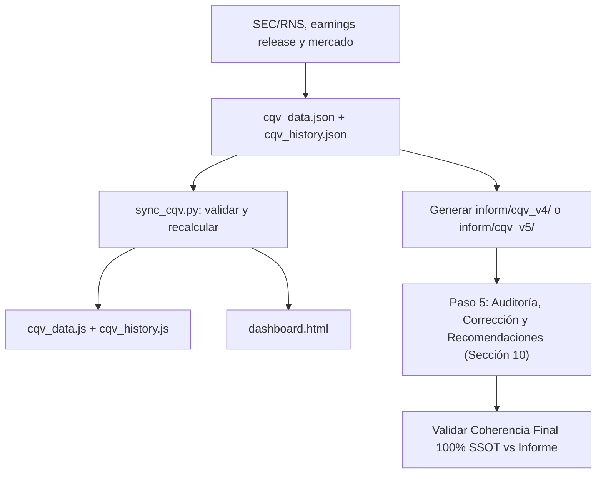

# Protocolo SSOT y flujo de actualización CQV v4.0

**Versión:** 2.1  
**Ámbito:** datasets, cálculos, dashboard e informes de tesis.  
**Principio:** ningún dato se inventa ni se completa con valores por defecto.

## 1. Arquitectura y responsabilidades

El SSOT es `cqv_data.json` para el estado actual y `cqv_history.json` para las series históricas trimestrales. Los archivos `cqv_data.js` y `cqv_history.js` son copias derivadas para el dashboard.

El flujo tiene cinco capas:

1. Fuentes primarias: SEC 10-Q/10-K, earnings release, presentaciones oficiales y mercado con fecha.
2. Verificar previamente que exista el informe solicitad, es decir que la accion haya presentado el informe para el periodo solicitado.
3. SSOT: datos de entrada, puntuaciones, valoración y metadatos en JSON.
4. Pipeline: recalcula métricas derivadas, valida reglas y sincroniza JS/dashboard.
5. Informe: se genera desde el SSOT y se audita; el pipeline no redacta narrativas ni inventa cifras.
6. Auditoría y Corrección: validación matemática, verificación de coherencia SSOT vs informe, auto-corrección de discrepancias y recomendaciones explícitas.



## 2. Datos obligatorios por acción

El registro debe contener, con fuente y fecha:

### 2.1 Calidad

`ticker`, `name`, `sector`, `quarter`, `f1` a `f8`, `data_confidence`. Cada F1-F8 debe tener evidencia en el informe. Si un factor no puede justificarse, se marca `N/D`; no se asigna una cifra por defecto.

### 2.2 Mercado y crecimiento

`price`, `pe`, `pe_forward`, `eps_growth_ntm_pct`. El crecimiento EPS se expresa en puntos porcentuales: 42.1 significa 42.1%, no 0.421. PER Forward y crecimiento deben corresponder a la misma fecha y horizonte NTM.

### 2.3 Flujo de caja y valoración

`ocf`, `maintenance_capex`, `market_cap`, `intrinsic_value`, `score_fcf_yield`, `score_mos`. También deben registrarse escenarios y supuestos DCF: WACC, tasa terminal, horizonte y fuente de cada entrada. Si falta un dato crítico, el resultado dependiente es `N/D`.

``Owner Earnings = OCF - Maintenance CapEx``  
``FCF Yield = Owner Earnings / Capitalización bursátil``

Los scores FCF Yield y MoS solo pueden introducirse con una rúbrica documentada. No se sustituyen por PER ni por una fórmula improvisada.

### 2.4 Historial trimestral obligatorio

`cqv_history.json` debe usar la estructura:

```json
{
  "TICKER": {
    "2026": {
      "Q1": { "quarter": "Q1 2026", "cqv_v4": 8.50 },
      "Q2": { "quarter": "Q2 2026", "cqv_v4": 8.70 },
      "Q3": null,
      "Q4": null
    }
  }
}
```

Cada actualización debe añadir o corregir únicamente el trimestre solicitado y conservar los demás trimestres. Los registros anuales antiguos se conservan en `annual_legacy` como referencia, pero nunca se asignan automáticamente a Q1, Q2, Q3 o Q4. Un trimestre sin evidencia queda como `null`/`N/D`.

Cada snapshot trimestral debe conservar, cuando estén disponibles, `quarter`, `period_end`, `valuation_date`, F1-F8, las versiones CQV, precio, PER, PER Forward, PEG, Value Score, veredicto, fuentes y confianza. No se permite derivar una puntuación trimestral a partir de una puntuación anual.

Al redactar la **Sección 8** del informe de tesis (`inform/cqv_v4/[ACCION]_[AÑO]_[Q?]_CQVv4.md` o `inform/cqv_v5/[ACCION]_[AÑO]_[Q?]_CQVv5.md`), es obligatorio consumir todo el árbol `TICKER → AÑO → Q1/Q2/Q3/Q4` de `cqv_history.json` y listar una fila separada por cada trimestre disponible (ej. `2025 Q1`, `2025 Q2`, `2025 Q3`, `2025 Q4`), reflejando esa misma serie temporal trimestral en el gráfico Mermaid.

### 2.5 Fecha de publicación y precio histórico (Anclaje Temporal Obligatorio)

Todo informe y valoración en la metodología CQV debe elaborar congelado en la fecha exacta en la que se publicó el informe financiero o earnings release analizado (`publication_date`), utilizando como referencia de precio de mercado exclusivamente el cierre de esa misma fecha (`price_date` / `valuation_date`). Para evitar cualquier sesgo retrospectivo (*look-ahead bias*):

- `publication_date` registra cuándo se publicó el informe o earnings release analizado.
- `valuation_date` coincide obligatoriamente con `publication_date`, salvo una excepción documentada.
- `price_date` coincide con `valuation_date` y debe ser el precio de cierre de mercado en esa fecha exacta.
- Si la publicación ocurre después del cierre, se utiliza el cierre de esa misma sesión; si no hubo sesión, se utiliza la sesión anterior y se documenta el motivo.
- Deben registrarse `price_source`, `price_market`, `price_currency` y, cuando exista, la hora de publicación.
- Capitalización, PER, PER Forward, PEG, Value Score, DCF y MoS deben utilizar entradas compatibles congeladas a esa misma fecha.
- Está estrictamente prohibido utilizar el precio o capitalización actual para un informe histórico.
- Si el precio de la fecha correcta no puede verificarse, las métricas dependientes quedan como `N/D` y no se emite recomendación afirmativa.

## 3. Cálculos oficiales

### 3.1 CQV Calidad

```
CQV = F1×0.20 + F2×0.15 + F3×0.15 + F4×0.15
    + F5×0.10 + F6×0.10 + F7×0.05 + F8×0.10
```

Si F2 < 4.0 o F4 < 4.0, el CQV máximo es 6.99. Si falta F2 o F8, CQV y veredicto son `N/D`.

**Regla Rígida de Redondeo y Coherencia SSOT:**
- El score CQV v4.0 se redondea estrictamente a dos decimales (`round(sum(F_i * w_i), 2)`).
- `sync_cqv.py` es la autoridad única de cálculo SSOT. Está prohibido utilizar redondeos manuales o estimaciones preliminares en el informe Markdown que difieran del valor generado por `sync_cqv.py`.
- La cifra del CQV v4.0 debe ser 100% idéntica en todas las partes del sistema: `cqv_data.json`, `cqv_history.json`, `dashboard.html` y las Secciones 1, 2, 8, 9 y 10 del informe en Markdown.

### 3.2 Valoración

```
PEG Bruto = (eps_growth_ntm_pct / pe_forward) × 10
Score PEG = min(10, max(0, PEG Bruto))
MoS = (intrinsic_value - price) / intrinsic_value × 100
Value Score = 0.40×score_fcf_yield + 0.30×Score PEG + 0.30×score_mos
```

Si el crecimiento EPS es menor o igual a cero, Score PEG = 0. Si PER Forward es menor o igual a cero o falta, PEG = `N/D`. El PEG bruto puede superar 10; el Score PEG queda limitado a 10.

### 3.3 Veredicto

- CQV >= 9.00 y MoS >= 25%: Comprar / Candidato Prioritario.
- CQV >= 9.00 y MoS >= 18%: Comprar / Acumular.
- CQV >= 8.00 y MoS >= 10%: Acumular / Compra escalonada.
- CQV >= 8.00 y MoS < 10%: Mantener.
- CQV < 8.00 o filtro rígido activo: Evitar / En observación.

Si CQV, MoS o un dato crítico es `N/D`, no se emite recomendación afirmativa.

## 4. Secuencia operativa única

### Paso 1 — Recopilar y documentar

Leer fuentes primarias. Guardar dato, unidad, fecha, periodo, `publication_date`, `valuation_date`, `price_date`, mercado, fuente y notas de normalización. No usar cifras estimadas sin identificarlas como estimaciones. Para un informe histórico, congelar el análisis en la información y el precio disponibles en la fecha de valoración.

### Paso 2 — Actualizar el SSOT

Actualizar `cqv_data.json` y el nodo `ticker/año/trimestre` correspondiente de `cqv_history.json`. Para una acción, usar el modo selectivo `--ticker TICKER`; para varias acciones, validar todas antes de publicar cambios. Nunca reemplazar el historial completo de una acción al actualizar un solo trimestre. La ficha SSOT debe conservar `publication_date`, `valuation_date`, `price_date` y la trazabilidad del precio.

### Paso 3 — Ejecutar el pipeline

Ejecutar `python sync_cqv.py --ticker TICKER` para una acción o `python sync_cqv.py` para todo el dataset. El script debe validar el formato `Q1`–`Q4`, rechazar errores estructurales o datos no numéricos, no usar defaults y propagar `N/D` cuando falte una entrada de valoración. Debe recalcular las métricas posibles, registrar el snapshot en el trimestre correcto, conservar los trimestres previos, generar `cqv_data.js` y `cqv_history.js`, y actualizar todas las inyecciones de `dashboard.html`: `window.companiesData`, `window.cqvHistoryData` y `let companies`. Si faltan datos críticos, el resultado dependiente queda `N/D` y no se emite recomendación afirmativa. El dashboard no se edita manualmente: sus datos deben proceder únicamente del SSOT.

El pipeline **no redacta informes Markdown**.

### Paso 4 — Generar o actualizar informes

Usar obligatoriamente la plantilla maestra [`inform/template.md`](file:///e:/DeveloperGitHub/repo/finance-cqv-find/inform/template.md). Todo informe trimestral ("informe Q") debe cumplir íntegramente con el formato, la estructura en 10 secciones y los bloques oficiales de salida exigidos en `inform/template.md`.

El archivo de informe debe seguir **estrictamente la convención oficial de nombres**:
`inform/cqv_v4/[ACCION]_[AÑO]_[Q?]_CQVv4.md` o `inform/cqv_v5/[ACCION]_[AÑO]_[Q?]_CQVv5.md`

Donde:
- `[ACCION]`: Es el **código de stock o ticker en MAYÚSCULAS** (ejemplo: `MSFT`, `LIN`, `FICO`, `BSX`, `CPRT`, `NFLX`, `MSI`, `ORCL`, `PYPL`, `RACE`, `FTNT`, `MSCI`, `MU`), **nunca** el nombre completo de la empresa ni en minúsculas.
- `[AÑO]`: Año de 4 dígitos (ejemplo: `2026`).
- `[Q?]`: Identificador trimestral en MAYÚSCULAS (`Q1`, `Q2`, `Q3` o `Q4`).

El informe debe copiar exclusivamente valores del SSOT y añadir evidencia narrativa. La salida 9.6 debe mostrar CQV, Value Score, PEG Bruto, Score PEG normalizado, valor intrínseco, precio, MoS, confianza y veredicto.

Debe incluir también Owner Earnings, Maintenance CapEx, FCF Yield, componentes del Value Score, supuestos DCF, escenarios, sensibilidad, riesgos y fuentes.

### Paso 5 — Auditoría de Integridad, Auto-Corrección y Recomendaciones

El analista/sistema debe ejecutar una **auditoría experta previa a la publicación definitiva**:

1. **Auditoría Matemática y de Coherencia SSOT vs Informe:** Verificar coincidencia exacta en $F_1 \dots F_8$, nota CQV ponderada, PER Forward, PEG Bruto, Score PEG, Owner Earnings, FCF Yield, Score FCF Yield, Score MoS, Value Score, Valor Intrínseco, Margen de Seguridad (%) y Veredicto.
2. **Auto-Corrección Automática:** Si se detecta cualquier discrepancia numérica o error tipográfico entre la base SSOT y el informe Markdown, se debe corregir inmediatamente el informe y re-ejecutar `python sync_cqv.py --ticker TICKER` para garantizar 100% de coherencia.
3. **Registro de Observaciones y Advertencias de Datos (`N/D`):** Identificar cualquier falta de evidencia, partida no disponible (`N/D`), sesgo de estimación o advertencia de confianza financiera.
4. **Sección 10 Obligatoria:** Toda auditoría debe reflejarse explícitamente en el informe en la **Sección 10: Auditoría, Observaciones y Recomendaciones del Analista / Auditor** (incorporada en `inform/template.md`).

Una discrepancia no corregida o un dato crítico ausente sin indicar su motivo e impacto bloquea la publicación.

## 5. Reglas de integridad

- Todo informe trimestral ("informe Q") debe cumplir obligatoriamente y al 100% el formato, estructura y secciones de `inform/template.md`.
- `peg_score` es histórico/deprecado; el campo oficial es `score_peg`.
- No usar defaults como precio=100, PER=25, valor intrínseco=precio×1.25 o PEG=10.
- No calcular FCF Yield a partir del PER.
- No presentar Value Score sin sus tres componentes.
- No presentar DCF sin supuestos y escenarios.
- `N/D` es válido y preferible a una cifra inventada.
- No reutilizar métricas de otro trimestre sin indicarlo y justificarlo.

## 6. Prompt completo para una acción

> Actualiza **[TICKER]** para **[PERIODO]** bajo CQV v4.0 y aplica el flujo SSOT completo.
>
> Usa fuentes primarias o claramente identificadas: SEC/RNS, earnings release, presentaciones oficiales y mercado con fecha. No inventes datos, no uses defaults y no rellenes campos faltantes: usa `N/D` y explica el impacto.
>
> Actualiza `cqv_data.json` y `cqv_history.json` con fuentes, fechas, F1-F8, EPS Growth NTM, OCF, Maintenance CapEx, Market Cap, valor intrínseco y supuestos DCF. Calcula CQV, PEG Bruto, Score PEG, Owner Earnings, FCF Yield, Score FCF Yield, Score MoS, Value Score, MoS, confianza y veredicto.
>
> Ejecuta `python sync_cqv.py`. Genera o actualiza `inform/[ticker]_[periodo].md` desde `inform/template.md`. El informe debe incluir evidencia para F1-F8, desglose del Value Score, PEG bruto y normalizado, FCF Yield, DCF por escenarios, sensibilidad, riesgos y fuentes.
>
> Valida que informe, JSON, JS y dashboard coincidan exactamente. Si existe una discrepancia o un dato crítico está ausente, detén el proceso y repórtalo. Devuelve archivos modificados, fuentes, campos N/D y validaciones ejecutadas.

## 7. Prompt completo para varias acciones

> Actualiza estas acciones para **[PERIODO]** bajo CQV v4.0: **[TICKER1], [TICKER2], [TICKER3]**.
>
> Aplica exactamente `flujo_actualizacion_datos.md`. Procesa en modo transaccional: recopila y valida todas primero; publica solo si no existe ningún error crítico.
>
> Para cada acción usa fuentes fechadas, no inventes ni uses defaults, calcula F1-F8, CQV, PEG bruto, Score PEG, Owner Earnings, FCF Yield, Value Score, DCF, MoS y veredicto; usa `N/D` cuando falte evidencia; actualiza SSOT, JS, dashboard e informe Markdown; y valida identidad exacta entre ellos.
>
> Antes de publicar, entrega una tabla por ticker con estado, CQV, Value Score, PEG bruto, Score PEG, MoS, veredicto, confianza, campos N/D y fuentes. Si una acción falla, no publiques cifras parciales ni ocultes el error.

## 8. Resultado esperado

La actualización solo termina cuando el SSOT es trazable, el pipeline termina sin errores, JS/dashboard coinciden, cada informe coincide con el SSOT y toda cifra crítica tiene fuente, fecha y unidad.
