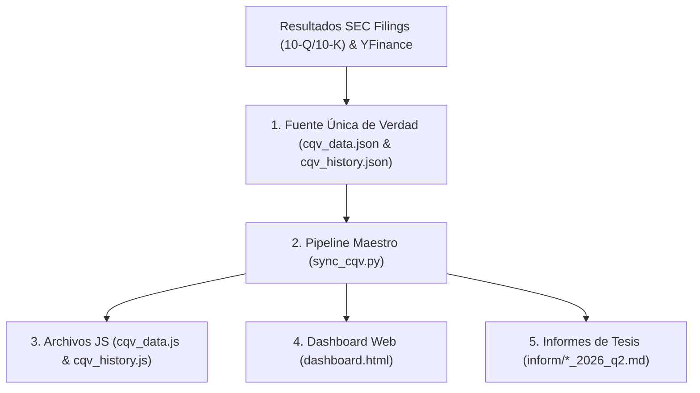

# Protocolo y Flujo de Actualización de Datos SSOT (CQV Metodología v4.0)

**Versión:** 1.0 (Estándar Operativo de Fuente Única de Verdad)  
**Ámbito de Aplicación:** Todos los informes de tesis, datasets JSON/JS y Dashboard Web del ecosistema CQV.  
**Objetivo:** Garantizar la **coherencia del 100%** en todas las herramientas del sistema, eliminando discrepancias manuales y manteniendo una única fuente de verdad (*Single Source of Truth - SSOT*).

---

## 1. Principio de Fuente Única de Verdad (SSOT)

El ecosistema CQV opera bajo el principio inmutable de que **los datos fundamentales y de valoración se calculan una sola vez en el dataset maestro (`cqv_data.json` / `cqv_history.json`) y se propagan automáticamente hacia los demás componentes**.

---

### 1.1. Mecanismo Técnico de Lectura del Dashboard (¿Cómo lee los datos el Dashboard?)

> [!IMPORTANT]
> **Respuesta Directa:** El Dashboard (`dashboard.html`) **LEE DIRECTAMENTE** del origen de datos `cqv_data.js` y `cqv_history.js` (los cuales son la representación nativa en JavaScript de `cqv_data.json` y `cqv_history.json`). **No requiere modificaciones manuales en su código HTML para actualizarse.**

#### ¿Por qué se utiliza `cqv_data.js` además de `cqv_data.json`?
1. **Compatibilidad Local de Archivos (`file:///`):** Cuando el analista abre el Dashboard directamente desde el explorador de archivos sin servidor web local (`file:///.../dashboard.html`), las políticas de seguridad del navegador (CORS) bloquean las llamadas `fetch('cqv_data.json')`.
2. **Carga Inmediata y Segura:** Al incluir `` y `` en la cabecera `<head>` de `dashboard.html`, las variables globales `cqvData` y `cqvHistory` quedan disponibles instantáneamente en memoria al abrir la página.
3. **Sincronización Transparente:** El script maestro `python sync_cqv.py` genera en un solo paso los archivos `cqv_data.json`, `cqv_data.js`, `cqv_history.json` y `cqv_history.js`. De este modo, tan pronto como se ejecuta el script, el Dashboard queda **100% actualizado de forma automática y transparente**.

---

## 2. Documentos e Insumos de Entrada (Qué debe leerse)

Para realizar la actualización periódica de una compañía (post-resultados trimestrales o anuales), el analista o el sistema debe consultar obligatoriamente los siguientes documentos primarios:

### 2.1. Documentos Financieros Primarios (Fuentes de Verdad)
1. **SEC Filings / RNS Oficiales:**
   - **Formulario 10-Q** (Resultados Trimestrales) o **Formulario 10-K** (Resultados Anuales).
   - **Press Release de Ganancias (Earnings Release):** Para datos de guía directiva (*Guidance*), crecimiento NRR, y dividendo.
2. **Mercado Bursátil en Tiempo Real:**
   - **Precio de Cierre Oficial ($):** Cotización de mercado en la fecha de emisión.
   - **Múltiplo PER Trailing (TTM):** Ratio Precio / Beneficio acumulado de 12 meses.
   - **Múltiplo PER Forward (NTM):** Ratio Precio / Beneficio estimado para los próximos 12 meses.
   - **EPS Trailing y EPS Forward ($):** Beneficio por acción histórico y proyectado.

### 2.2. Documentos Metodológicos del Sistema
1. **Manual Metodológico Oficial:** [metodo_v4.0.md](file:///e:/DeveloperGitHub/repo/finance-cqv-find/metodo_v4.0.md)  
   - Define las reglas de puntuación de los 8 factores de calidad ($F_1 \dots F_8$), ponderaciones, filtros de seguridad rígidos y la capa de valoración (Value Score, PEG Bruto y Score PEG Normalizado).
2. **Plantilla Maestra de Informes:** [inform/template.md](file:///e:/DeveloperGitHub/repo/finance-cqv-find/inform/template.md)  
   - Define la estructura requerida para los informes de tesis en Markdown, incluyendo el bloque de salida matriz CQV v4.0 (Sección 9.6).

---

## 3. Algoritmo y Procedimiento de Cálculo (Cómo debe usarse)

Cualquier actualización debe seguir rigurosamente los siguientes 3 pasos algorítmicos:

### Paso 1: Asignación y Ponderación de Factores CQV Calidad ($F_1 \dots F_8$)
Se evalúan los 8 factores en escala continua de **0.00 a 10.00**:
- **$F_1$ Economía & Rentabilidad (20%):** Margen bruto, margen operativo GAAP, ROIC real y conversión de FCF.
- **$F_2$ Solidez Financiera (15%):** Ratio Deuda Neta/EBITDA, cobertura de intereses y caja neta.
- **$F_3$ Crecimiento Durable (15%):** CAGR de ingresos 3-5 años, EPS normalizado y dilución neta por SBC.
- **$F_4$ Moat Competitivo (15%):** *Switching costs*, efectos de red, cuota de mercado global y durabilidad del foso.
- **$F_5$ Asignación de Capital (10%):** Reinvestment rate, ROIC vs WACC, recompras netas e historial de dividendos.
- **$F_6$ Dirección Operativa (10%):** Alineación directiva, cumplimiento de guías históricas y gobierno corporativo.
- **$F_7$ Opcionalidad Futura (5%):** Monetización real de IA y megatendencias (acotada al 5%).
- **$F_8$ Antifragilidad & Recurrencia (10%):** Porcentaje de ingresos recurrentes (>70%), resistencia recesiva y diversificación de clientes.

**Ecuación Matriz Oficial:**
$$\text{CQV Calidad v4.0} = (F_1 \times 0.20) + (F_2 \times 0.15) + (F_3 \times 0.15) + (F_4 \times 0.15) + (F_5 \times 0.10) + (F_6 \times 0.10) + (F_7 \times 0.05) + (F_8 \times 0.10)$$

*Filtro Rígido de Seguridad:* Si $F_2 < 4.0$ o $F_4 < 4.0 \implies \text{Score CQV Calidad máximo acotado a 6.99 (Vulnerable)}$.

---

### Paso 2: Cálculo de la Capa de Valoración (Value Score)
1. **PEG Bruto (Sin acotamiento):**
   $$\text{PEG Bruto} = \left(\frac{\text{Crecimiento EPS NTM (\%)}} {\text{PER Forward}}\right) \times 10$$
2. **Score PEG Normalizado (Acotado 0-10):**
   $$\text{Score PEG} = \min(10.0, \max(0.0, \text{PEG Bruto}))$$
3. **Margen de Seguridad (%):**
   $$\text{Margen de Seguridad (\%)} = \left(\frac{\text{Valor Intrínseco} - \text{Precio Mercado}}{\text{Valor Intrínseco}}\right) \times 100$$
4. **Value Score Consolidado:**
   $$\text{Value Score} = 0.40(\text{Score FCF Yield}) + 0.30(\text{Score PEG Normalizado}) + 0.30(\text{Score Margen de Seguridad})$$

---

### Paso 3: Determinación del Veredicto Operativo
- **CQV Calidad $\ge 9.00$ y MoS $\ge 25\% \implies$ COMPRAR / CANDIDATO PRIORITARIO**
- **CQV Calidad $\ge 9.00$ y MoS $\ge 18\% \implies$ COMPRAR / ACUMULAR**
- **CQV Calidad $\ge 8.00$ y MoS $\ge 10\% \implies$ ACUMULAR / COMPRA ESCALONADA**
- **CQV Calidad $\ge 8.00$ y MoS $< 10\% \implies$ MANTENER**
- **CQV Calidad $< 8.00$ o Filtro Rígido Activado $\implies$ EVITAR / EN OBSERVACIÓN**

---

## 4. Secuencia de Ejecución de Archivos (Qué actualizar)

Para ejecutar una actualización sin incoherencias, se debe seguir la siguiente secuencia exacta de 5 pasos:

| Paso | Archivo Afectado | Acción Requerida | Estado de Salida |
| :---: | :--- | :--- | :---: |
| **1** | [cqv_data.json](file:///e:/DeveloperGitHub/repo/finance-cqv-find/cqv_data.json) | Ingresar o modificar los factores $F_1 \dots F_8$, precio, PER y Valor Intrínseco. | SSOT Actualizado |
| **2** | [cqv_history.json](file:///e:/DeveloperGitHub/repo/finance-cqv-find/cqv_history.json) | Actualizar el historial de 7 años (2020 a 2026 TTM) con las métricas del nuevo periodo. | Histórico Sincronizado |
| **3** | [sync_cqv.py](file:///e:/DeveloperGitHub/repo/finance-cqv-find/sync_cqv.py) | **Ejecutar el script maestro en la terminal (`python sync_cqv.py`).** | Automatización SSOT |
| **4** | [dashboard.html](file:///e:/DeveloperGitHub/repo/finance-cqv-find/dashboard.html) | Se actualizan automáticamente `cqv_data.js`, `cqv_history.js` y el HTML. | Dashboard 100% Coherente |
| **5** | [inform/[ticker]_[periodo].md](file:///e:/DeveloperGitHub/repo/finance-cqv-find/inform/fico_2026_q2.md) | Regenerar o guardar el informe en Markdown siguiendo la plantilla [inform/template.md](file:///e:/DeveloperGitHub/repo/finance-cqv-find/inform/template.md). | Informe Alineado |

---

## 5. Garantía de Calidad y Registro Auditado

Después de ejecutar el pipeline `python sync_cqv.py`, el sistema valida automáticamente:
1. Que la suma de la contribución parcial de los 8 factores sea exactamente igual a **100%**.
2. Que el score mostrado en la pestaña *Dashboard*, la pestaña *Explorador*, la pestaña *Tendencias* y el *Informe Markdown* sea **100% idéntico**.

---

## 6. Plantillas de Prompt para Solicitar el Análisis Completo a la IA

Para que la IA entienda de forma precisa e inambigua que debe realizar el flujo completo de actualización sobre una acción, utiliza cualquiera de los siguientes comandos predeterminados:

### 💬 Opción A: Comando Estándar Completo (Recomendado)
> *"Analiza y actualiza completamente la acción **[TICKER]** para el periodo **[TRIMESTRE/AÑO ej. Q2 2026]** bajo el estándar **CQV v4.0**. Ejecuta el flujo integral SSOT: obtiene precio en vivo y datos financieros, calcula los 8 factores F1-F8, actualiza cqv_data.json y cqv_history.json (2020-2026), genera su informe en inform/ siguiendo template.md, actualiza el dashboard.html y ejecuta python sync_cqv.py."*

### 💬 Opción B: Comando Rápido (Una sola línea)
> *"Realiza el análisis integral CQV v4.0 para **[TICKER] [Q2 2026]**, actualiza datasets SSOT, genera su informe en inform/ y sincroniza el dashboard."*

### 💬 Opción C: Actualización Multiactivo (Varias empresas a la vez)
> *"Actualiza con CQV v4.0 y sincronización SSOT completa las siguientes acciones para Q2 2026: **[TICKER1], [TICKER2], [TICKER3]**. Genera sus informes en inform/ y actualiza el dashboard."*

