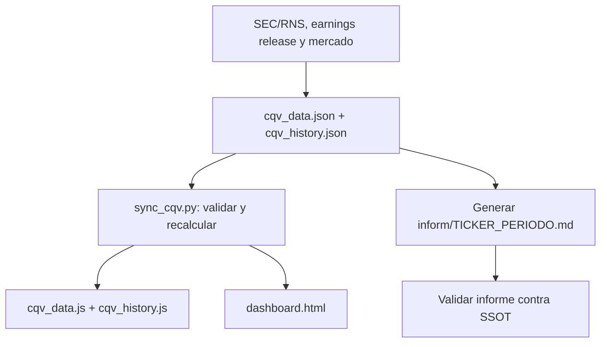

# Protocolo SSOT y flujo de actualización CQV v4.0

**Versión:** 2.0  
**Ámbito:** datasets, cálculos, dashboard e informes de tesis.  
**Principio:** ningún dato se inventa ni se completa con valores por defecto.

## 1. Arquitectura y responsabilidades

El SSOT es `cqv_data.json` para el estado actual y `cqv_history.json` para las series históricas. Los archivos `cqv_data.js` y `cqv_history.js` son copias derivadas para el dashboard.

El flujo tiene cuatro capas:

1. Fuentes primarias: SEC 10-Q/10-K, earnings release, presentaciones oficiales y mercado con fecha.
2. SSOT: datos de entrada, puntuaciones, valoración y metadatos en JSON.
3. Pipeline: recalcula métricas derivadas, valida reglas y sincroniza JS/dashboard.
4. Informe: se genera desde el SSOT y se valida; el pipeline no redacta narrativas ni inventa cifras.



## 2. Datos obligatorios por acción

El registro debe contener, con fuente y fecha:

### 2.1 Calidad

`ticker`, `name`, `sector`, `quarter`, `f1` a `f8`, `data_confidence`. Cada F1-F8 debe tener evidencia en el informe. Si un factor no puede justificarse, se marca `N/D`; no se asigna una cifra por defecto.

### 2.2 Mercado y crecimiento

`price`, `pe`, `pe_forward`, `eps_growth_ntm_pct`. El crecimiento EPS se expresa en puntos porcentuales: 42.1 significa 42.1%, no 0.421. PER Forward y crecimiento deben corresponder a la misma fecha y horizonte NTM.

### 2.3 Flujo de caja y valoración

`ocf`, `maintenance_capex`, `market_cap`, `intrinsic_value`, `score_fcf_yield`, `score_mos`. También deben registrarse escenarios y supuestos DCF: WACC, tasa terminal, horizonte y fuente de cada entrada. Si falta un dato crítico, el resultado dependiente es `N/D`.

``Owner Earnings = OCF - Maintenance CapEx``  
``FCF Yield = Owner Earnings / Capitalización bursátil``

Los scores FCF Yield y MoS solo pueden introducirse con una rúbrica documentada. No se sustituyen por PER ni por una fórmula improvisada.

## 3. Cálculos oficiales

### 3.1 CQV Calidad

```
CQV = F1×0.20 + F2×0.15 + F3×0.15 + F4×0.15
    + F5×0.10 + F6×0.10 + F7×0.05 + F8×0.10
```

Si F2 < 4.0 o F4 < 4.0, el CQV máximo es 6.99. Si falta F2 o F8, CQV y veredicto son `N/D`.

### 3.2 Valoración

```
PEG Bruto = (eps_growth_ntm_pct / pe_forward) × 10
Score PEG = min(10, max(0, PEG Bruto))
MoS = (intrinsic_value - price) / intrinsic_value × 100
Value Score = 0.40×score_fcf_yield + 0.30×Score PEG + 0.30×score_mos
```

Si el crecimiento EPS es menor o igual a cero, Score PEG = 0. Si PER Forward es menor o igual a cero o falta, PEG = `N/D`. El PEG bruto puede superar 10; el Score PEG queda limitado a 10.

### 3.3 Veredicto

- CQV >= 9.00 y MoS >= 25%: Comprar / Candidato Prioritario.
- CQV >= 9.00 y MoS >= 18%: Comprar / Acumular.
- CQV >= 8.00 y MoS >= 10%: Acumular / Compra escalonada.
- CQV >= 8.00 y MoS < 10%: Mantener.
- CQV < 8.00 o filtro rígido activo: Evitar / En observación.

Si CQV, MoS o un dato crítico es `N/D`, no se emite recomendación afirmativa.

## 4. Secuencia operativa única

### Paso 1 — Recopilar y documentar

Leer fuentes primarias. Guardar dato, unidad, fecha, periodo, fuente y notas de normalización. No usar cifras estimadas sin identificarlas como estimaciones.

### Paso 2 — Actualizar el SSOT

Actualizar `cqv_data.json` y `cqv_history.json`. En una actualización múltiple, validar todas las acciones antes de publicar cambios.

### Paso 3 — Ejecutar el pipeline

Ejecutar `python sync_cqv.py`. El script debe rechazar campos obligatorios ausentes o inválidos, recalcular métricas, no usar defaults, generar `cqv_data.js` y `cqv_history.js`, y actualizar todas las inyecciones de `dashboard.html`: `window.companiesData`, `window.cqvHistoryData` y `let companies`. Si hay errores, debe detenerse antes de escribir. El dashboard no se edita manualmente: sus datos deben proceder únicamente del SSOT.

El pipeline **no redacta informes Markdown**.

### Paso 4 — Generar o actualizar informes

Usar `inform/template.md`. El informe debe copiar exclusivamente valores del SSOT y añadir evidencia narrativa. La salida 9.6 debe mostrar CQV, Value Score, PEG Bruto, Score PEG normalizado, valor intrínseco, precio, MoS, confianza y veredicto.

Debe incluir también Owner Earnings, Maintenance CapEx, FCF Yield, componentes del Value Score, supuestos DCF, escenarios, sensibilidad, riesgos y fuentes.

### Paso 5 — Validar coherencia

Verificar identidad entre SSOT e informe para F1-F8, CQV, precio, PER, PEG, Score PEG, valor intrínseco, MoS, FCF Yield, Value Score y veredicto. Una discrepancia bloquea la publicación.

## 5. Reglas de integridad

- `peg_score` es histórico/deprecado; el campo oficial es `score_peg`.
- No usar defaults como precio=100, PER=25, valor intrínseco=precio×1.25 o PEG=10.
- No calcular FCF Yield a partir del PER.
- No presentar Value Score sin sus tres componentes.
- No presentar DCF sin supuestos y escenarios.
- `N/D` es válido y preferible a una cifra inventada.
- No reutilizar métricas de otro trimestre sin indicarlo y justificarlo.

## 6. Prompt completo para una acción

> Actualiza **[TICKER]** para **[PERIODO]** bajo CQV v4.0 y aplica el flujo SSOT completo.
>
> Usa fuentes primarias o claramente identificadas: SEC/RNS, earnings release, presentaciones oficiales y mercado con fecha. No inventes datos, no uses defaults y no rellenes campos faltantes: usa `N/D` y explica el impacto.
>
> Actualiza `cqv_data.json` y `cqv_history.json` con fuentes, fechas, F1-F8, EPS Growth NTM, OCF, Maintenance CapEx, Market Cap, valor intrínseco y supuestos DCF. Calcula CQV, PEG Bruto, Score PEG, Owner Earnings, FCF Yield, Score FCF Yield, Score MoS, Value Score, MoS, confianza y veredicto.
>
> Ejecuta `python sync_cqv.py`. Genera o actualiza `inform/[ticker]_[periodo].md` desde `inform/template.md`. El informe debe incluir evidencia para F1-F8, desglose del Value Score, PEG bruto y normalizado, FCF Yield, DCF por escenarios, sensibilidad, riesgos y fuentes.
>
> Valida que informe, JSON, JS y dashboard coincidan exactamente. Si existe una discrepancia o un dato crítico está ausente, detén el proceso y repórtalo. Devuelve archivos modificados, fuentes, campos N/D y validaciones ejecutadas.

## 7. Prompt completo para varias acciones

> Actualiza estas acciones para **[PERIODO]** bajo CQV v4.0: **[TICKER1], [TICKER2], [TICKER3]**.
>
> Aplica exactamente `flujo_actualizacion_datos.md`. Procesa en modo transaccional: recopila y valida todas primero; publica solo si no existe ningún error crítico.
>
> Para cada acción usa fuentes fechadas, no inventes ni uses defaults, calcula F1-F8, CQV, PEG bruto, Score PEG, Owner Earnings, FCF Yield, Value Score, DCF, MoS y veredicto; usa `N/D` cuando falte evidencia; actualiza SSOT, JS, dashboard e informe Markdown; y valida identidad exacta entre ellos.
>
> Antes de publicar, entrega una tabla por ticker con estado, CQV, Value Score, PEG bruto, Score PEG, MoS, veredicto, confianza, campos N/D y fuentes. Si una acción falla, no publiques cifras parciales ni ocultes el error.

## 8. Resultado esperado

La actualización solo termina cuando el SSOT es trazable, el pipeline termina sin errores, JS/dashboard coinciden, cada informe coincide con el SSOT y toda cifra crítica tiene fuente, fecha y unidad.
