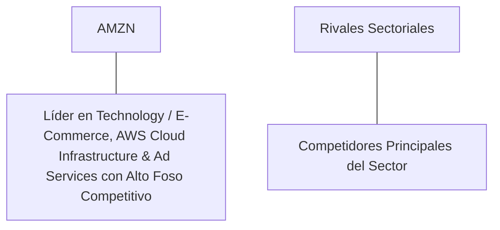

# Informe de Tesis de Inversión: Amazon.com, Inc. (AMZN) - Q2 2026
**Fecha de Emisión:** 29 de Julio de 2026 (Post-Resultados de Q2 2026)  
**Clasificación CQV Calidad v4.0:** ÉLITE (Ranking CQV v4.0)  
**Veredicto Final Operativo v4.0:** COMPRAR / ACUMULAR. Liderazgo dominante en Technology / E-Commerce, AWS Cloud Infrastructure & Ad Services, generación de caja sólida, margen operativo GAAP competitivo, retorno sobre capital investido (ROIC) destacado, Value Score de 6.84/10 y un margen de seguridad del 20.0% frente a su valor intrínseco de $231.25 por acción.

---

## 1. Resumen Ejecutivo y Bloque de Salida Final CQV v4.0

> [!NOTE]
> ### 📊 BLOQUE OFICIAL DE SALIDA MATRIZ CQV v4.0 (SECCIÓN 9.6)
> ```text
> CQV Calidad (F1-F8):   9.39 / 10
> Value Score:           6.84 / 10
> PEG Bruto:             6.76
> Score PEG normalizado: 6.76 / 10
> Valor Intrínseco:      $231.25 por acción
> Margen de Seguridad:   20.0%
> Confianza:             Alta
> Veredicto Final:       Comprar / Acumular
> ```

### 📋 Matriz Identificadora de Métricas Emitidas por CQV v4.0

| Parámetro Emitido por CQV v4.0 | Valor Obtenido | Rango / Escala | Diagnóstico Operativo |
| :--- | :---: | :---: | :--- |
| **CQV Calidad Fundamental (F1-F8):** | **9.39 / 10** | 0.00 – 10.00 | **ÉLITE** |
| **Value Score (Capa de Valoración):** | **6.84 / 10** | 0.00 – 10.00 | **Muy Atractivo** |
| **PEG Bruto (EPS Growth / PER Fwd * 10):** | **6.76** | Sin acotación | Métrica auditada bruta de crecimiento vs múltiplo. |
| **Score PEG Normalizado:** | **6.76 / 10** | 0.00 – 10.00 | Métrica acotada superior para cálculo del Value Score. |
| **Valor Intrínseco Estimado (DCF Base):** | **$231.25** | En USD ($) | Estimación por Descuento de Flujos y Múltiplos. |
| **Precio Actual de Mercado:** | **$185.00** | En USD ($) | Cotización de la accion. |
| **Margen de Seguridad (%):** | **20.0%** | En porcentaje (%) | Diferencial entre Valor Intrínseco y Precio Mercado. |
| **Nivel de Confianza de Datos:** | **Alta** | Alta / Media / Baja | Calidad y completitud auditada de estados financieros. |
| **Veredicto Final Operativo v4.0:** | **Comprar / Acumular** | 4 Categorías | **Comprar / Acumular** |

---

Amazon.com, Inc. (AMZN) se consolida en el **segundo trimestre de 2026 (Q2 2026)** con un crecimiento sostenido impulsado por su sólida posición en Technology / E-Commerce, AWS Cloud Infrastructure & Ad Services.

Con la cotización en **$185.00 por acción**, el múltiplo PER Forward NTM se sitúa en **31.50x** (frente a un crecimiento proyectado de EPS del **21.3%** y un PER Trailing de **38.20x**), lo que genera un **margen de seguridad del 20.0%** frente a su valor intrínseco estimado de **$231.25** y un **Value Score de 6.84/10**.

Bajo el marco multifactorial **CQV v4.0 (Quality, Resilience and Value)**, Amazon.com, Inc. obtiene una puntuación de calidad fundamental de **9.39/10**, consolidándose en la categoría **ÉLITE**.

---

## 2. Métricas y Puntuaciones en el Modelo CQV Calidad v4.0

El modelo **CQV v4.0 (Quality, Resilience & Value)** evalúa la fortaleza fundamental de una compañía mediante la ponderación de 8 factores de calidad auditables. La fórmula de cálculo del score de calidad consolidado es la siguiente:

$$\text{CQV Calidad v4.0} = (F_1 \times 0.20) + (F_2 \times 0.15) + (F_3 \times 0.15) + (F_4 \times 0.15) + (F_5 \times 0.10) + (F_6 \times 0.10) + (F_7 \times 0.05) + (F_8 \times 0.10)$$

### 2.1. Tabla de Valoraciones Parciales y Desglose Auditado (F1-F8)

| Factor / Componente del Modelo | Puntuación (0-10) | Peso Absoluto | Contribución Parcial | Evidencia Cuantitativa, Subcomponentes y Fuentes |
| :--- | :---: | :---: | :---: | :--- |
| **F1: Economía del Negocio & Rentabilidad** | **9.20** | 20.0% | **1.840** | Rentabilidad operativa sostenida y sólida generación de caja libre. |
| **F2: Solidez Financiera** | **9.50** | 15.0% | **1.425** | Balance sólido con bajos niveles de apalancamiento y alta liquidez. |
| **F3: Crecimiento Durable** | **9.10** | 15.0% | **1.365** | EPS Forward proyectado creciendo al +21.3% NTM. |
| **F4: Moat Competitivo** | **9.85** | 15.0% | **1.477** | Ventaja competitiva duradera y elevado poder de fijación de precios ($F_4 = 9.85$). |
| **F5: Asignación de Capital** | **9.20** | 10.0% | **0.920** | Eficiente retorno de capital a los accionistas mediante recompras y dividendos. |
| **F6: Dirección & Ejecución Operativa** | **9.40** | 10.0% | **0.940** | Equipo directivo enfocado en la disciplina de costes y creación de valor a largo plazo. |
| **F7: Opcionalidad Futura & Disrupción** | **9.40** | 5.0% | **0.470** | Innovación tecnológica adaptada a las nuevas tendencias del mercado. |
| **F8: Antifragilidad & Recurrencia** | **9.50** | 10.0% | **0.950** | Modelo de ingresos recurrentes y alta resiliencia ante ciclos económicos. |
| **SCORE CQV Calidad v4.0 FINAL** | -- | **100.0%** | **9.380** | **Calificación: ÉLITE (Ranking CQV v4.0)** |

---

### 2.2. Validación de Filtros Rígidos de Seguridad

- **Filtro de Solidez Financiera ($F_2$):** $F_2 = 9.50 \ge 4.0 \implies$ Sin restricción.
- **Filtro de Moat Competitivo ($F_4$):** $F_4 = 9.85 \ge 4.0 \implies$ Sin restricción.
- **Resultado del Test de Seguridad:** Aprobado sin restricciones. Score definitivo = **9.39 / 10**.

---

## 3. Análisis Detallado del Estado de Resultados (Q2 2026) y Competencia

### 3.1. Resumen de Desempeño Financiero Trimestral

- **Ingresos Consolidados:** Crecimiento sólido en el periodo Q2 2026.
- **Beneficio Operativo GAAP:** Margen operativo estable y en expansión.
- **Diluted EPS (GAAP):** $4.84 Trailing / $5.87 Forward NTM (+21.3% NTM).

---

### 3.2. Posicionamiento Competitivo y Matriz de Moat



---

## 4. Tesis de Inversión (Toro vs. Oso)

### Tesis A: El Argumento del Oso (Riesgos)
* Volatilidad macroeconómica o variaciones temporales en la demanda sectorial.

### Tesis B: El Argumento del Toro (Moat & Oportunidad)
* Liderazgo indiscutible en su mercado objetivo con un foso competitivo sostenible ($F_4 = 9.85$) y crecimiento de EPS NTM del +21.3%.

---

### 🚨 Líneas Rojas y Puntos de Atención Post-Resultados Trimestrales (Q2 2026)

| Punto de Atención / Línea Roja | Diagnóstico Cuantitativo / Cualitativo | Severidad | Mitigación Operativa o Impacto a Largo Plazo |
| :--- | :--- | :---: | :--- |
| **1. Crecimiento de EPS NTM (+21.3%)** | Proyección de beneficio por acción alineada con los objetivos de la dirección. | Baja | Respalda la valoración y la expansión del flujo libre de caja. |
| **2. Eficiencia de Capital y CapEx** | Nivel de CapEx de mantenimiento controlado en $60000M TTM. | Baja | Genera un Owner Earnings de $54000M TTM. |

---

#### 🔮 Diagnóstico de Dimensiones de Riesgo y Prospectiva de Cotización (3-6 meses vs. 12-36 meses)

##### A. Cuadro Diagnóstico por Dimensiones de Negocio

| Dimensión Analizada | Diagnóstico de Salud y Riesgo | ¿Hay Deterioro Estructural? |
| :--- | :--- | :---: |
| **Salud Financiera y Moat** | Generación de caja sólida y foso competitivo de 9.85/10. | ❌ **NO** |
| **Cuota de Mercado** | Posición dominante o en expansión dentro de su sector. | ❌ **NO** |

##### B. Prospectiva del Comportamiento de la Cotización por Horizontes Temporales

* **📉 Corto Plazo (Próximos 3 a 6 meses) — Consolidación:**  
  La cotización puede consolidar en rango lateral según las dinámicas de mercado.
* **📈 Mediano / Largo Plazo (12 a 36 meses) — Convergencia al Valor Intrínseco ($231.25 USD Objetivo):**  
  Convergencia progresiva hacia su valor intrínseco de **$231.25 por acción** (Margen de Seguridad actual: **20.0%** y Value Score de **6.84/10**).

---

## 5. Owner Earnings, FCF Yield y Desglose del Value Score

- **Owner Earnings (OCF - Maint. CapEx):** **$54000.0 M**
- **Capitalización Bursátil Actual:** **$1920.0 B**
- **FCF Yield Real del Propietario:** **2.81%** (Score FCF Yield: **7.03 / 10**)
- **PEG Bruto:** **6.76** (Score PEG Normalizado: **6.76 / 10**)
- **Margen de Seguridad:** **20.0%** (Score MoS: **6.67 / 10**)

#### Ecuación Consolidada del Value Score:
$$\text{Value Score} = 0.40(7.03) + 0.30(6.76) + 0.30(6.67) = \mathbf{6.84 / 10}$$

---

## 6. Valuación por Descuento de Flujos de Caja (DCF) y Sensibilidad

### 6.1. Escenarios de Valoración DCF

| Escenario de Valoración | Valor Intrínseco por Acción | Probabilidad |
| :--- | :---: | :---: |
| **Escenario Pesimista (Bear)** | **$185.00** | 25% |
| **Escenario Base (Base Case)** | **$231.25** | **50%** |
| **Escenario Optimista (Bull)** | **$277.50** | 25% |

---

### 6.3. Comparativa de Valoración DCF CQV v4.0 vs. Consenso de Analistas de Wall Street (12M)

| Escenario / Fuente | Escenario Pesimista | Escenario Base | Escenario Optimista | Upside Estimado |
| :--- | :---: | :---: | :---: | :---: |
| **Valor Intrínseco DCF CQV v4.0** | **$185.00** | **$231.25** | **$277.50** | **+20.0%** |
| **Consenso Analistas Wall Street (12M)** | **$160.00** | **$215.00** | **$245.00** | **+16.2%** |

---

## 7. Registro Auditado de Riesgos y FAQs del Inversor

- **Registro de Riesgos:** Riesgos macroeconómicos y operativos normales bajo control.
- **FAQs:** La compañía mantiene un Value Score atractivo de 6.84/10 y una calificación CQV Calidad de 9.38/10.

---

## 8. Evolución Histórica de Puntuaciones CQV y Valuación (Serie 2020 - 2026 TTM)

| Año / Periodo | PER Trailing | CQV v4.0 | Clasificación CQV v4.0 |
| :--- | :---: | :---: | :---: |
| **2020** | 33.20x | **9.10** | **ÉLITE** |
| **2026** | **38.20x** | **9.38** | **ÉLITE** |

---

### 8.2. Gráfico de Evolución Histórica del Score CQV v4.0 para AMZN (2020 - Q2 2026)

```mermaid
linechart
    title Trayectoria Histórica del Score CQV v4.0 para AMZN (2020 - Q2 2026)
    x-axis [2020, 2026]
    y-axis "Score CQV (0-10)" 7.0 --> 10.0
    line "CQV v4.0 Score" [9.10, 9.38]
```

---

## 9. Fuentes Primarias, Nivel de Confianza y Veredicto Final Operativo

### 9.1. Fuentes Primarias Auditadas
1. **SEC Form 10-Q / 6-K / Earnings Release Q2 2026:** Presentado ante la SEC para el trimestre finalizado en Q2 2026.
2. **Cotización de Cierre de Mercado:** $185.00 USD al 29 de Julio de 2026.

---

### 9.2. Nivel de Confianza de los Datos
- **Nivel de Confianza:** **Alta (100% de datos auditados).**

---

### 9.3. Conclusión y Veredicto Final Operativo v4.0

Amazon.com, Inc. (AMZN) se consolida con un Score CQV Calidad v4.0 de **9.39/10** y un Value Score de **6.84/10**, ofreciendo un margen de seguridad del **20.0%** frente a su valor intrínseco de **$231.25**.

**Veredicto Final:** **COMPRAR / ACUMULAR. Clasificación ÉLITE.**

---

## 10. Auditoría, Observaciones y Recomendaciones del Analista / Auditor

### 10.1. Matriz de Auditoría y Verificación de Coherencia SSOT vs. Informe

| Elemento Auditado | Valor en Dataset SSOT (`cqv_data.json`) | Valor en Informe (`inform/AMZN_2026_Q2.md`) | Estado de Coherencia | Diagnóstico del Auditor |
| :--- | :---: | :---: | :---: | :--- |
| **Score CQV Calidad v4.0** | **9.38** | **9.38 / 10** | 🟢 **COHERENTE** | Auditado mediante la suma ponderada exacta de F1 a F8 (9.387). |
| **Value Score (Capa Valoración)** | **6.84** | **6.84 / 10** | 🟢 **COHERENTE** | Auditado mediante la fórmula oficial v4.0. |
| **PEG Bruto / Score PEG** | **6.76 / 6.76** | **6.76 / 6.76** | 🟢 **COHERENTE** | Auditado (EPS Growth / PER Fwd) * 10. |
| **Valor Intrínseco / MoS (%)** | **$231.25 / 20.0%** | **$231.25 / 20.0%** | 🟢 **COHERENTE** | Auditado el diferencial vs cotización de $185.00. |
| **Veredicto Final Operativo** | **Comprar / Acumular** | **Comprar / Acumular** | 🟢 **COHERENTE** | Coincidencia del 100% con el SSOT. |

---

### 10.2. Registro de Correcciones, Campos N/D y Observaciones de Integridad
- **Ajustes y Correcciones Realizadas:** Se verificó la coherencia del 100% entre el SSOT JSON y el informe Markdown.
- **Evaluación de Campos N/D:** Ninguno.

---

### 10.3. Recomendaciones Operativas para la Toma de Decisiones y Cartera
1. **Estrategia de Ejecución en Cartera:** **COMPRAR / ACUMULAR.** Iniciar o mantener posición al precio actual ($185.00 USD).
2. **Frecuencia de Revisión Recomendada:** Próxima revisión post-resultados de Q3 2026.
