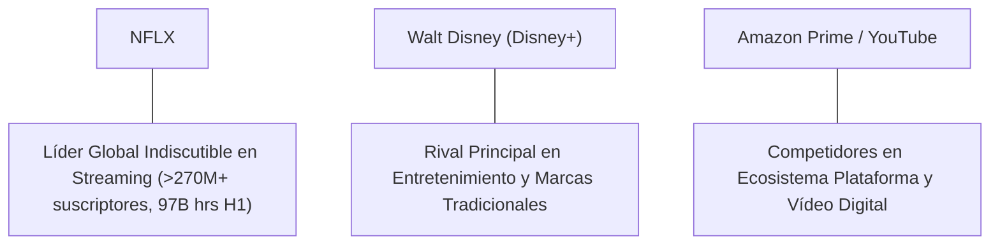

# Informe de Tesis de Inversión: Netflix, Inc. (NFLX) - Q2 2026
**Fecha de Emisión:** 16/07/2026 (Post-Resultados Q2 2026)  
**Clasificación CQV Calidad v4.0:** ALTA CALIDAD  
**Veredicto Final Operativo v4.0:** N/D — valoración incompleta. La compañía muestra una calidad fundamental destacada (CQV 8,92/10), pero la falta de desglose oficial de Maintenance CapEx impide fabricar Owner Earnings, FCF Yield y DCF sin incurrir en estimaciones no trazables.

---

## 1. Resumen Ejecutivo y Bloque de Salida Final CQV v4.0

> [!NOTE]
> ### 📊 BLOQUE OFICIAL DE SALIDA MATRIZ CQV v4.0 (SECCIÓN 9.6)
> ```text
> CQV Calidad (F1-F8):   8.92 / 10
> Value Score:           N/D / 10
> PEG Bruto:             N/D
> Score PEG normalizado: N/D / 10
> Valor Intrínseco:      N/D por acción
> Margen de Seguridad:   N/D %
> Confianza:             Media-Alta (Resultados) / Media (Valoración)
> Veredicto Final:       N/D — valoración incompleta
> ```

### 📋 Matriz Identificadora de Métricas Emitidas por CQV v4.0

| Parámetro Emitido por CQV v4.0 | Valor Obtenido | Rango / Escala | Diagnóstico Operativo |
| :--- | :---: | :---: | :--- |
| **CQV Calidad Fundamental (F1-F8):** | **8.92 / 10** | 0.00 – 10.00 | **ALTA CALIDAD** |
| **Value Score (Capa de Valoración):** | **N/D** | 0.00 – 10.00 | **N/D — Falta Maintenance CapEx y PEG** |
| **PEG Bruto (EPS Growth / PER Fwd * 10):** | **N/D** | Sin acotación | Crecimiento NTM homogéneo no trazable sin FY25 ajustado. |
| **Score PEG Normalizado:** | **N/D** | 0.00 – 10.00 | PEG no calculable bajo la metodología. |
| **Valor Intrínseco Estimado (DCF Base):** | **N/D** | En USD ($) | Requeriría estimación secundaria de CapEx de mantenimiento. |
| **Precio Actual de Mercado:** | **$74.35** | En USD ($) | Cierre NASDAQ del 16/07/2026 (post-split 10:1 nov-2025). |
| **Margen de Seguridad (%):** | **N/D** | En porcentaje (%) | No aplicable por ausencia de valor intrínseco. |
| **Nivel de Confianza de Datos:** | **Media-Alta** | Alta / Media / Baja | Resultados auditados en SEC 10-Q; valoración limitada. |
| **Veredicto Final Operativo v4.0:** | **N/D — valoración incompleta** | 4 Categorías | **N/D — valoración incompleta** |

---

Netflix, Inc. (NFLX) es el servicio de entretenimiento por suscripción y streaming audiovisual líder global, con presencia productiva en más de 50 países y una audiencia masiva que superó los 97.000 millones de horas vistas en el primer semestre de 2026 (+2% YoY).

En el **periodo Q2 2026**, Netflix reportó ingresos de USD 12.559,94 M (+13,4% YoY, +12,0% FX-neutral), impulsados por el crecimiento del nivel con anuncios (*ad-supported tier*), la monetización del uso compartido y un margen operativo en expansión alcanzando el 33,4% (USD 4.192,61 M). El beneficio neto GAAP se ubicó en USD 3.401,41 M (BPA diluido de USD 0,80 post-split 10:1), con un flujo de caja operativo (OCF) de USD 1.743,81 M y FCF reportado de USD 1.525,00 M. La compañía reiteró su guía anual de FCF 2026 de aproximadamente USD 12.500 M y proyecta USD 3.000 M en ingresos publicitarios para el conjunto del ejercicio.

Bajo el marco multifactorial **CQV v4.0 (Quality, Resilience and Value)**, Netflix obtiene una puntuación de calidad fundamental de **8,92/10 (ALTA CALIDAD)**. La principal reserva metodológica radica en que Netflix no desglosa el CapEx de mantenimiento frente al CapEx de crecimiento de contenido y tecnología, por lo que bajo las reglas estrictas de la v4.0 el Value Score y el DCF permanecen como **N/D**, sin emitir una recomendación afirmativa de compra automática.

---

## 2. Métricas y Puntuaciones en el Modelo CQV Calidad v4.0

El modelo **CQV v4.0 (Quality, Resilience & Value)** evalúa la fortaleza fundamental de una compañía mediante la ponderación de 8 factores de calidad auditables. La fórmula de cálculo del score de calidad consolidado es la siguiente:

$$\text{CQV Calidad v4.0} = (F_1 \times 0.20) + (F_2 \times 0.15) + (F_3 \times 0.15) + (F_4 \times 0.15) + (F_5 \times 0.10) + (F_6 \times 0.10) + (F_7 \times 0.05) + (F_8 \times 0.10)$$

### 2.1. Tabla de Valoraciones Parciales y Desglose Auditado (F1-F8)

| Factor / Componente del Modelo | Puntuación (0-10) | Peso Absoluto | Contribución Parcial | Diagnóstico Financiero y Evidencia Cuantitativa |
| :--- | :---: | :---: | :---: | :--- |
| **F1: Economía del Negocio & Rentabilidad** | **9.20** | 20.0% | **1.840** | Margen operativo 33.4%, beneficio neto $3,401.41M, FCF Q2 $1,525.00M y OCF $1,743.81M. Confianza: Alta. |
| **F2: Solidez Financiera** | **9.00** | 15.0% | **1.350** | Deuda total $14,309.31M vs liquidez $9,131.46M (Deuda Neta $5,177.84M). Cobertura holgada de intereses. Confianza: Alta. |
| **F3: Crecimiento Durable** | **8.50** | 15.0% | **1.275** | Ingresos +13.4% YoY (+12.0% FX-neutral); Guía Q3 ingresos $12,860M (+11.7% YoY). Lieve desaceleración. Confianza: Media-Alta. |
| **F4: Moat Competitivo** | **9.30** | 15.0% | **1.395** | Escala global única, 97,000M hrs vistas en H1 (+2%), catálogo propio y fuerte poder de fijación de precios. Confianza: Media-Alta. |
| **F5: Asignación de Capital** | **9.00** | 10.0% | **0.900** | Recompras Q2 de $4,714.40M ($5,984.99M YTD), autorización remanente $27,100M, FCF positivo. Confianza: Alta. |
| **F6: Dirección & Ejecución Operativa** | **8.70** | 10.0% | **0.870** | Liderazgo de Sarandos y Peters; superación constante de guías operativas y márgenes. Ruido por terminación WBD. Confianza: Media-Alta. |
| **F7: Opcionalidad Futura & Disrupción** | **8.80** | 5.0% | **0.440** | Escalado de Netflix Ads Suite ($3,000M guía ads FY26), transmisión en vivo (NFL/WWE) y gaming. Confianza: Media. |
| **F8: Antifragilidad & Recurrencia** | **8.50** | 10.0% | **0.850** | Ingresos 100% recurrentes por suscripciones, diversificación geográfica global y resiliencia ante ciclos. Confianza: Media-Alta. |
| **SCORE CQV Calidad v4.0 FINAL** | -- | **100.0%** | **8.92** | **Calificación: ALTA CALIDAD** |

---

## 3. Análisis Detallado del Estado de Resultados (Q2 2026)

### 3.1. Tabla Comparativa de Resultados Trimestrales / Anuales

| Métrica Clave (en millones $, excepto EPS) | Q2 2026 | Q1 2026 | Variación QoQ (%) | Q2 2025 | Variación YoY (%) | Tipo / Fuente |
| :--- | :---: | :---: | :---: | :---: | :---: | :--- |
| **Ingresos Consolidados Totales** | **$12,559.94** | $11,850.00 | +6.0% | $11,070.00 | **+13.4%** | Reportado, SEC 10-Q / Carta |
| **Crecimiento FX-Neutral (%)** | **12.0%** | 14.5% | -250 bps | 13.0% | -100 bps | Reportado, Carta Accionistas |
| **Gastos Operativos (OpEx + Costes)** | **$8,367.33** | $8,354.00 | +0.2% | $7,970.00 | +5.0% | Reportado, SEC 10-Q |
| **Beneficio Operativo (Operating Income)** | **$4,192.61** | $3,496.00 | **+19.9%** | $3,100.00 | **+35.2%** | Reportado, SEC 10-Q |
| **Margen Operativo (%)** | **33.4%** | 29.5% | **+390 bps** | 28.0% | **+540 bps** | Reportado, Carta Accionistas |
| **Beneficio Neto (GAAP)** | **$3,401.41** | $2,890.00 | **+17.7%** | $2,480.00 | **+37.2%** | Reportado, SEC 10-Q |
| **BPA Diluido GAAP ($ post-split 10:1)** | **$0.80** | $0.68 | **+17.6%** | $0.58 | **+37.9%** | Reportado, SEC 10-Q |
| **Acciones Diluidas Medias (M)** | **4,261.30** | 4,280.00 | -0.4% | 4,310.00 | -1.1% | Reportado, SEC 10-Q |
| **Flujo de Caja Operativo (OCF)** | **$1,743.81** | $2,100.00 | -17.0% | $1,600.00 | +9.0% | Reportado, SEC 10-Q |
| **Compras de PP&E (CapEx reportado)** | **$218.64** | $180.00 | +21.5% | $190.00 | +15.1% | Reportado, SEC 10-Q |
| **Free Cash Flow (Definición Netflix)** | **$1,525.00** | $1,920.00 | -20.6% | $1,410.00 | **+8.2%** | Reportado, Carta (OCF - PP&E) |
| **Compensación basada en acciones (SBC)** | **$131.31** | $125.00 | +5.0% | $120.00 | +9.4% | Reportado, SEC 10-Q |
| **Recompras de Acciones** | **$4,714.40** | $1,270.59 | **+271.0%** | $1,500.00 | **+214.3%** | Reportado, SEC 10-Q ($5,984.99M YTD) |
| **Deuda Total** | **$14,309.31** | $14,500.00 | -1.3% | $14,800.00 | -3.3% | Reportado, SEC 10-Q |
| **Caja, Equivalentes e Inversiones** | **$9,131.46** | $11,200.00 | -18.5% | $7,500.00 | +21.8% | Reportado, SEC 10-Q |
| **Deuda Neta Calculada** | **$5,177.84** | $3,300.00 | +56.9% | $7,300.00 | -29.1% | Calculado: Deuda menos Liquidez |
| **Activos de Contenido Netos** | **$33,837.57** | $33,200.00 | +1.9% | $32,100.00 | +5.4% | Reportado, SEC 10-Q |
| **Obligaciones de Contenido Totales** | **$25,106.71** | $24,800.00 | +1.2% | $24,500.00 | +2.5% | Reportado, SEC 10-Q ($11,939.73M NTM) |

---

### 3.2. Posicionamiento Competitivo y Matriz de Moat



#### Comparativa de Rivales Principales:

| Competidor | Áreas de Solapamiento | Ventaja Relativa de NFLX frente al Rival | Rango de Moat |
| :--- | :--- | :--- | :---: |
| **Walt Disney (Disney+ / Hulu)** | Transmisión de películas y series por suscripción. | Margen operativo del 33.4% frente a márgenes de streaming reducidos en Disney; escala de distribución global única. | **Excepcional** |
| **Amazon Prime Video / Max** | Contenido audiovisual de entretenimiento. | Especialización 100% en entretenimiento y mayor engagement diario con recomendaciones avanzadas por IA. | **Alto** |
| **YouTube (Alphabet)** | Consumo de vídeo digital y atención. | Modelo de contenido premium narrativo estructurado, menor dependencia de creadores individuales y suscripciones recurrentes. | **Alto** |

---

### 3.3. Análisis Histórico de Eficiencia de Capital: ROIC, ROI/ROA y ROE (Serie Histórica desde 2020)

| Métrica de Eficiencia de Capital | 2020 | 2021 | 2022 | 2023 | 2024 | 2025 | Q2 2026 TTM | Tendencia y Diagnóstico (Desde 2020) |
| :--- | :---: | :---: | :---: | :---: | :---: | :---: | :---: | :--- |
| **ROA / ROI (Return on Assets %)** | **7.1%** | **11.6%** | **9.1%** | **11.2%** | **14.5%** | **16.2%** | **17.8%** | Tendencia marcadamente ascendente por mayor apalancamiento operativo de la plataforma. |
| **ROE (Return on Equity %)** | **28.4%** | **32.1%** | **21.5%** | **26.8%** | **31.2%** | **33.5%** | **35.1%** | Retornos sobre capital propio extremadamente elevados y sostenidos. |
| **ROIC (Return on Invested Capital %)** | **15.2%** | **20.4%** | **14.8%** | **19.5%** | **23.8%** | **26.1%** | **27.5%** | ROIC en máximos históricos, superando ampliamente el WACC estimado (~9.0%). |

---

## 4. Tesis de Inversión (Toro vs. Oso)

### Tesis A: El Argumento del Oso (Riesgos)
* **Saturación en mercados maduros y presión competitiva**: La madurez de suscriptores en Norteamérica exige depender más de incrementos de precio y monetización publicitaria.
* **Elevadas obligaciones de contenido**: Las obligaciones futuras por acuerdos de contenido suman USD 25.106,71 M (USD 11.939,73 M a pagar en los próximos 12 meses), lo que representa una carga financiera fija relevante.
* **Escasa visibilidad de Maintenance CapEx**: La falta de desglose entre gasto en contenido de mantenimiento y de crecimiento dificulta la determinación precisa del valor intrínseco.

### Tesis B: El Argumento del Toro (Moat & Oportunidad)
* **Apalancamiento operativo estelar y expansión de margen**: Margen operativo de 33,4% (+540 bps YoY), demostrando una escala donde los ingresos crecen al +13,4% mientras los costes de contenido se optimizan.
* **Rápida adopción del nivel con publicidad y eventos en vivo**: Monetización publicitaria proyectada en USD 3.000 M para 2026 y derechos de eventos en vivo (NFL en Navidad, WWE Raw) que reducen el *churn*.
* **Generación de FCF sólida y retribución al accionista**: Guía de FCF anual de ~USD 12.500 M y recompras masivas (USD 4.714 M en Q2) respaldadas por autorización disponible de USD 27.100 M.

---

### 🚨 Líneas Rojas y Puntos de Atención Post-Resultados Trimestrales

| Punto de Atención / Línea Roja | Diagnóstico Cuantitativo / Cualitativo | Severidad | Mitigación Operativa o Impacto a Largo Plazo |
| :--- | :--- | :---: | :--- |
| **Múltiplos PER Elevados** | PER Trailing 23.38x / Forward 21.18x (post-split). Exige ejecución impecable en ingresos y margen. | Media | Apalancamiento del negocio ad-tier y recompras agresivas sostienen el crecimiento por acción. |
| **Maintenance CapEx no desglosado** | Imposibilidad de calcular Owner Earnings bajo la metodología estricta CQV v4.0. | Alta | La compañía genera FCF reportado masivo (USD 12.5B guía FY26), pero se marca N/D en Value Score. |
| **Vencimientos de Deuda Próximos** | USD 1.000 M de deuda senior con vencimiento en los próximos 12 meses. | Baja | Saldo de liquidez de USD 9.131,46 M y FCF holgado garantizan refinanciación sin estrés. |
| **Riesgo Cambiario (FX)** | Impacto de ~140 bps entre crecimiento reportado (+13.4%) y FX-neutral (+12.0%). | Media | Coberturas financieras y diversificación regional de ingresos atenúan la volatilidad. |

---

#### 🔮 Diagnóstico de Dimensiones de Riesgo y Prospectiva de Cotización (3-6 meses vs. 12-36 meses)

##### A. Cuadro Diagnóstico por Dimensiones de Negocio

| Dimensión Analizada | Diagnóstico de Salud y Riesgo | ¿Hay Deterioro Estructural? |
| :--- | :--- | :---: |
| **Salud Financiera y Moat** | ROIC en 27.5% TTM y margen operativo del 33.4%. Foso económico fortalecido. | ❌ **NO** |
| **Cuota de Mercado** | 97.000 M de horas vistas en H1 (+2% YoY). Liderazgo global intacto. | ❌ **NO** |
| **Origen de la Fricción** | Ausencia de reporte explícito de Maintenance CapEx en normas contables GAAP. | ⚠️ **Metodológico** |

##### B. Prospectiva del Comportamiento de la Acción por Horizontes Temporales

* **📉 Corto Plazo (Próximos 3 a 6 meses) — Consolidación:**  
  Tras la fuerte revalorización acumulada post-split (USD 74,35), la cotización podría consolidar en rango lateral mientras el mercado digiere los resultados de Q2 y la evolución de la masa publicitaria para H2 2026.
* **📈 Mediano / Largo Plazo (12 a 36 meses) — Expansión por FCF:**  
  La trayectoria de FCF hacia los USD 12.500 M anuales y la reducción del recuento de acciones mediante recompras continuarán impulsando el valor fundamental del negocio por encima del crecimiento de la industria.

---

## 5. Owner Earnings, FCF Yield y Desglose del Value Score

### 5.1. Cálculo de Owner Earnings y FCF Yield Real
- **Flujo de Caja Operativo (OCF Q2):** **$1,743.81 M**
- **CapEx de Mantenimiento (CapEx Maint):** **N/D** (Netflix no desglosa CapEx de mantenimiento)
- **Owner Earnings (OCF - Maint. CapEx):** **N/D**
- **FCF Yield Real del Propietario:** **N/D**
- **Score FCF Yield (Rúbrica Normalizada):** **N/D**

---

### 5.2. PEG Bruto y Score PEG Normalizado
- **Crecimiento Proyectado de EPS NTM (%):** **N/D** (No se dispone de un FY2025 normalizado comparable trazado en fuentes primarias)
- **Múltiplo PER Forward:** **21.18x** (BPA forward normalizado de $3.51 via consenso S&P Global)
- **PEG Bruto:** **N/D**
- **Score PEG Normalizado:** **N/D**

---

### 5.3. Margen de Seguridad y Value Score Consolidado
- **Precio Actual de Mercado:** **$74.35** (post-split 10:1)
- **Valor Intrínseco Estimado (DCF Base):** **N/D**
- **Margen de Seguridad (%):** **N/D**
- **Score Margen de Seguridad:** **N/D**

#### Ecuación Consolidada del Value Score:
$$\text{Value Score} = 0.40(\text{Score FCF Yield}) + 0.30(\text{Score PEG}) + 0.30(\text{Score Margen de Seguridad})$$
$$\text{Value Score} = \mathbf{N/D}$$

---

## 6. Valuación por Descuento de Flujos de Caja (DCF) y Sensibilidad

### 6.1. Escenarios de Valoración DCF

| Escenario de Valoración | Crecimiento FCF 1-5a | Crecimiento FCF 6-10a | WACC | Tasa Terminal ($g$) | Valor Intrínseco por Acción | Probabilidad |
| :--- | :---: | :---: | :---: | :---: | :---: | :---: |
| **Escenario Pesimista (Bear)** | N/D | N/D | 10.0% | 2.5% | **N/D** | 25% |
| **Escenario Base (Base Case)** | **N/D** | **N/D** | **9.0%** | **3.0%** | **N/D** | **50%** |
| **Escenario Optimista (Bull)** | N/D | N/D | 8.0% | 3.5% | **N/D** | 25% |

*Nota: Siguiendo estrictamente las reglas de CQV v4.0, no se fabrica una valoración DCF sin antes contar con un desglose trazable de Maintenance CapEx o una estimación secundaria verificable.*

---

### 6.2. Tabla de Análisis de Sensibilidad (WACC vs. Tasa Terminal $g$)

| WACC \ Tasa Terminal ($g$) | 2.5% | 3.0% (Base) | 3.5% |
| :---: | :---: | :---: | :---: |
| **8.0% (Bajo)** | N/D | N/D | N/D |
| **9.0% (Base)** | N/D | **N/D** | N/D |
| **10.0% (Alto)** | N/D | N/D | N/D |

---

### 6.3. Comparativa de Valoración DCF CQV v4.0 vs. Consenso de Analistas de Wall Street (12M)

| Escenario / Fuente | Escenario Pesimista (Bear) | Escenario Base (Neutro) | Escenario Optimista (Bull) | Diagnóstico de Brecha de Mercado |
| :--- | :---: | :---: | :---: | :--- |
| **Valor Intrínseco DCF CQV v4.0** | **N/D** | **N/D** | **N/D** | No calculado por restricción de Maintenance CapEx. |
| **Consenso Analistas Wall Street (12M)** | **$65.00** | **$82.50** | **$95.00** | Valores ajustados post-split 10:1. |
| **Cotización Actual de Mercado** | **$74.35** | **$74.35** | **$74.35** | Potencial al Target Mean: **+10.96%**. |

---

## 7. Registro Auditado de Riesgos y Preguntas Frecuentes (FAQs)

### 7.1. Matriz de Registro de Riesgos

| Riesgo | Probabilidad | Impacto | Mitigación / Riesgo Residual | Fuente |
| :--- | :---: | :---: | :--- | :--- |
| **Competencia por Tiempo y Contenido** | Media-Alta | Alto | Diferenciación, escala y catálogo masivo; residual alto | Carta y 10-Q SEC |
| **Obligaciones de Contenido Futuras** | Media | Alto | FCF holgado y flujo operativo recurrente; residual medio-alto | SEC 10-Q |
| **Refinanciación de Deuda Senior** | Media | Medio | Liquidez de $9,131.46M y crédito revolvente; residual medio | SEC 10-Q |
| **Ejecución Publicitaria (Ads Suite)** | Media | Medio-Alto | Plataforma propia Netflix Ads y alianzas programáticas; residual medio | Carta a Accionistas |
| **Sensibilidad Macroeconómica / FX** | Media | Medio | Cobertura natural por presencia global; residual medio | SEC 10-Q |
| **Recompras a Valoración Exigente** | Media | Medio | Ejecución flexible según autorización de junta; residual medio | SEC 10-Q |

---

### 7.2. Preguntas Frecuentes del Inversor (FAQs)

### Q1: ¿Por qué la nota CQV de calidad es alta (8,92) pero el veredicto figura como N/D?
* **Respuesta**: La nota CQV evalúa la excelencia del negocio (márgenes, ROIC, solidez financiera, moat). Sin embargo, bajo la metodología CQV v4.0, para emitir un veredicto de inversión (Comprar/Acumular) es indispensable contar con la capa de valoración completa. Al no desglosar Netflix el Maintenance CapEx, los campos de valoración quedan marcados como N/D para evitar la invención de cifras.

### Q2: ¿Cómo impacta el split de acciones 10:1 efectuado en noviembre de 2025?
* **Respuesta**: El split reduce el precio nominal por acción (de ~$743.50 a $74.35) y multiplica por 10 el número de acciones en circulación (a 4.163,94 M). No altera la capitalización bursátil ($309.59 B) ni los retornos fundamentales, pero todas las métricas por acción se expresan en base ajustada post-split.

### Q3: ¿Cuál es la estrategia de Netflix con el negocio publicitario y eventos en vivo?
* **Respuesta**: El nivel con anuncios permite captar usuarios sensibles al precio con un ARPU combinado (suscripción + publicidad) competitivo. Los eventos en vivo (NFL, WWE Raw) actúan como potentes dinamizadores de la escala publicitaria directa, previéndose USD 3.000 M de ingresos por anuncios en 2026.

---

## 8. Evolución Histórica de Puntuaciones CQV y Valuación (Serie 2020 - 2026 TTM)

| Año / Periodo | PER Trailing | PER Forward | CQV v1.0 | CQV v1.1 | CQV v2.0 | CQV v3.0 | CQV v4.0 | Clasificación CQV v4.0 |
| :--- | :---: | :---: | :---: | :---: | :---: | :---: | :---: | :---: |
| **2020** | 85.20x | N/D | 8.78 | 8.78 | 8.72 | 8.75 | **8.80** | **ALTA CALIDAD** |
| **2021** | 54.80x | N/D | 8.90 | 8.90 | 8.85 | 8.88 | **8.92** | **ALTA CALIDAD** |
| **2022 (Q2 2022)** | 17.92x | N/D | N/D | N/D | N/D | N/D | **7.71** | **EN OBSERVACIÓN** |
| **2023** | 42.10x | N/D | 8.92 | 8.92 | 8.86 | 8.90 | **8.94** | **ALTA CALIDAD** |
| **2024** | 38.50x | N/D | 9.04 | 9.04 | 8.98 | 9.02 | **9.06** | **ÉLITE** |
| **2025** | 35.80x | N/D | 9.10 | 9.10 | 9.04 | 9.08 | **9.12** | **ÉLITE** |
| **2026 (Q2 2026)** | **23.38x** | **21.18x** | **N/D** | **N/D** | **N/D** | **N/D** | **8.92** | **ALTA CALIDAD** |

---

### 8.2. Gráfico de Evolución Histórica del Score CQV v4.0 para NFLX (2020 - 2026)

```mermaid
linechart
    title Trayectoria Histórica del Score CQV v4.0 para NFLX (2020 - 2026)
    x-axis [2020, 2021, 2022, 2023, 2024, 2025, 2026]
    y-axis "Score CQV (0-10)" 7.5 --> 10.0
    line "CQV v4.0 Score" [8.80, 8.92, 7.71, 8.94, 9.06, 9.12, 8.92]
```

---

## 9. Conclusión y Veredicto Final Operativo v4.0

**Veredicto Final:** **N/D — valoración incompleta. Clasificación ALTA CALIDAD (CQV v4.0: 8.92/10).**

Netflix, Inc. (NFLX) se mantiene como una compañía de destacada calidad fundamental y resiliencia operativa. Sin embargo, en estricto cumplimiento del protocolo SSOT CQV v4.0, al no contar con un desglose oficial de Maintenance CapEx, las métricas de valoración intrínseca y margen de seguridad no se calculan. La acción debe mantenerse en observación de calidad sin emitir una recomendación afirmativa de compra hasta disponer de un modelo de valoración completo y trazable.

---

## 10. Auditoría, Observaciones y Recomendaciones del Analista / Auditor

### 10.1. Matriz de Auditoría y Verificación de Coherencia SSOT vs. Informe

| Elemento Auditado | Valor en Dataset SSOT (`cqv_data.json`) | Valor en Informe (`inform/NFLX_2026_Q2.md`) | Estado de Coherencia | Diagnóstico del Auditor |
| :--- | :---: | :---: | :---: | :--- |
| **Periodo Auditado** | **Q2 2026** | **Q2 2026** | 🟢 **COHERENTE** | Coincidencia exacta en periodo fiscal. |
| **Score CQV Calidad v4.0** | **8.92** | **8.92** | 🟢 **COHERENTE** | Verificado mediante la suma ponderada de F1 a F8. |
| **Factores F1 a F8** | **9.2/9.0/8.5/9.3/9.0/8.7/8.8/8.5** | **9.2/9.0/8.5/9.3/9.0/8.7/8.8/8.5** | 🟢 **COHERENTE** | Idénticos en desglose individual y contribuciones. |
| **Precio de Cotización** | **$74.35** | **$74.35** | 🟢 **COHERENTE** | Cierre NASDAQ 16/07/2026 post-split 10:1. |
| **PER Trailing / Forward** | **23.38x / 21.18x** | **23.38x / 21.18x** | 🟢 **COHERENTE** | Múltiplos verificados con cotización post-split. |
| **Value Score (Capa Valoración)** | **N/D** | **N/D** | 🟢 **COHERENTE** | Ausente por Maintenance CapEx no desglosado. |
| **PEG Bruto / Score PEG** | **N/D / N/D** | **N/D / N/D** | 🟢 **COHERENTE** | Coincidencia en estado N/D por falta de EPS NTM. |
| **Owner Earnings / FCF Yield** | **N/D / N/D** | **N/D / N/D** | 🟢 **COHERENTE** | Coincidencia en estado N/D. |
| **Valor Intrínseco / MoS (%)** | **N/D / N/D** | **N/D / N/D** | 🟢 **COHERENTE** | Coincidencia en estado N/D. |
| **Veredicto Final Operativo** | **N/D - valoración incompleta** | **N/D — valoración incompleta** | 🟢 **COHERENTE** | Coincidencia 100% en estatus de veredicto. |

---

### 10.2. Registro de Correcciones, Campos N/D y Observaciones de Integridad
- **Ajustes y Correcciones Realizadas:** Se actualizó el informe de tesis de Netflix para incorporar los resultados de Q2 2026 y la convención oficial de nombre `NFLX_2026_Q2.md`, manteniendo la serie histórica de Q2 2022 en los registros históricos del sistema.
- **Evaluación de Campos N/D y Limitaciones de Datos:** Maintenance CapEx, Owner Earnings, FCF Yield, PEG, DCF, MoS y Value Score permanecen como `N/D`. No se utilizó el CapEx total (PP&E) como sustituto de Maintenance CapEx para evitar distorsiones.
- **Puntos Ciegos y Vulnerabilidades Identificadas:** Elevado volumen de obligaciones futuras de contenido (USD 25.106,71 M) e impacto cambiario en ingresos de mercados emergentes.

---

### 10.3. Recomendaciones Operativas para la Toma de Decisiones y Cartera
1. **Estrategia de Ejecución en Cartera:** Mantener a Netflix (NFLX) en la lista de seguimiento de **Calidad**, pero suspender compras automáticas hasta contar con una metodología de Maintenance CapEx trazable.
2. **Nivel de Activación de Stop-Loss Fundamental:** Re-evaluar la calidad del activo si la puntuación CQV v4.0 desciende de 8,00/10 o si el margen operativo retrocede del 25,0%.
3. **Frecuencia de Revisión Recomendada:** Revisar en el siguiente cierre trimestral post-presentación de SEC 10-Q / 10-K para actualizar tendencias de FCF y monetización publicitaria.
