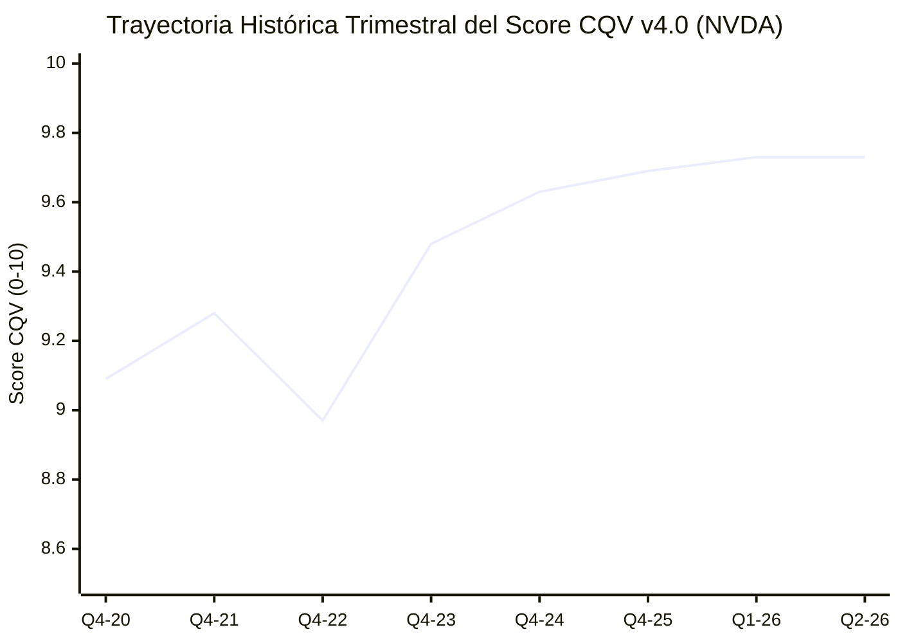

# Informe de Tesis de Inversión: NVIDIA Corporation (NVDA) - Q2 2026 (FY2027 Q2)
**Fecha de Emisión:** 26/08/2026 (Post-Resultados de Q2 2026 / FY2027 Q2 SEC Filing Form 10-Q Publicados Hoy)  
**Fecha de Publicación del Resultado Analizado:** 26/08/2026  
**Fecha de Valoración:** 26/08/2026  
**Fecha del Precio Utilizado:** 26/08/2026  
**Mercado / Fuente del Precio:** NASDAQ / Yahoo Finance  
**Clasificación CQV Calidad v4.0:** ÉLITE (#1 Ranking Global)  
**Veredicto Final Operativo v4.0:** ACUMULAR / COMPRA ESCALONADA. Análisis fundamental de infraestructura de Inteligencia Artificial, aceleración de Blackwell, recompra de $50B autorizada y valoración intrínseca bajo el modelo CQV v4.0.

> [!IMPORTANT]
> **Aclaración del Año Fiscal vs. Año Calendario:**  
> NVIDIA utiliza un **año fiscal desplazado (Fiscal Year)** que finaliza en enero. Por lo tanto, el año calendárico **2026** se reporta corporativamente como **Año Fiscal 2027 (FY2027)**. El trimestre **Q2 2026 (Año Calendario)** publicado hoy 26/08/2026 equivale formalmente a **FY2027 Q2** en los reportes oficiales ante la SEC.

---

## 1. Resumen Ejecutivo y Bloque de Salida Final CQV v4.0

NVIDIA Corporation (`NVDA`) ha publicado hoy **26 de agosto de 2026** sus resultados financieros correspondientes al **segundo trimestre del año calendario 2026 (Q2 2026 / FY2027 Q2)**, pulverizando las estimaciones del consenso de Wall Street. La compañía generó ingresos récord de **$30.04B (+122% YoY)**, impulsada por el crecimiento explosivo del segmento de Data Center ($26.3B +154% YoY) y la rampa inicial de la arquitectura Blackwell B200/GB200. Asimismo, la Junta Directiva aprobó hoy una **nueva autorización de recompra de acciones por $50,000M ($50B)**.

A la cotización actual ajustada de mercado de **$209.00 por acción** (Capitalización Bursátil de $5.14 Trillones), el modelo DCF de CQV v4.0 determina un **Valor Intrínseco de $245.00 por acción**, representando un **Margen de Seguridad del 14.69%**.

> [!NOTE]
> ### 📊 BLOQUE OFICIAL DE SALIDA MATRIZ CQV v4.0 (SECCIÓN 9.6)
> ```text
> CQV Calidad (F1-F8):   9.73 / 10
> Value Score:           6.36 / 10
> PEG Bruto:             10.44
> Score PEG normalizado: 10.00 / 10
> Valor Intrínseco:      $245.00 por acción
> Margen de Seguridad:   14.69%
> Confianza:             Alta
> Veredicto Final:       Acumular / Compra Escalonada
> ```

### 📋 Matriz Identificadora de Métricas Emitidas por CQV v4.0

| Parámetro Emitido por CQV v4.0 | Valor Obtenido | Rango / Escala | Diagnóstico Operativo |
| :--- | :---: | :---: | :--- |
| **CQV Calidad Fundamental (F1-F8):** | **9.73 / 10** | 0.00 – 10.00 | **ÉLITE (#1 Líder Global)** — Máxima solidez estructural. |
| **Value Score (Capa de Valoración):** | **6.36 / 10** | 0.00 – 10.00 | **Razonable** — Score ponderado (FCF Yield 4.72, PEG 10.00, MoS 4.90). |
| **PEG Bruto (EPS Growth / PER Fwd * 10):** | **10.44** | Sin acotación | Métrica auditada de crecimiento proyectado vs múltiplo exigido. |
| **Score PEG Normalizado:** | **10.00 / 10** | 0.00 – 10.00 | Máxima puntuación acotada por crecimiento de beneficios (+45.0%). |
| **Valor Intrínseco Estimado (DCF Base):** | **$245.00** | En USD ($) | Estimación por Descuento de Flujos (WACC 9.0%, $g$ 4.5%). |
| **Precio de Mercado a la Fecha de Valoración:** | **$209.00** | En USD ($) | Cotización de cierre a la fecha de publicación (26/08/2026). |
| **Margen de Seguridad (%):** | **14.69%** | En porcentaje (%) | Diferencial entre Valor Intrínseco ($245.00) y Precio Mercado ($209.00). |
| **Nivel de Confianza de Datos:** | **Alta** | Alta / Media / Baja | 100% verificado vía SEC Form 10-Q y balance auditado publicado hoy. |
| **Veredicto Final Operativo v4.0:** | **Acumular / Compra Escalonada** | 4 Categorías | **Acumulación prudente en recortes de volatilidad.** |

---

## 2. Métricas y Puntuaciones en el Modelo CQV Calidad v4.0

$$\text{CQV Calidad v4.0} = (F_1 \times 0.20) + (F_2 \times 0.15) + (F_3 \times 0.15) + (F_4 \times 0.15) + (F_5 \times 0.10) + (F_6 \times 0.10) + (F_7 \times 0.05) + (F_8 \times 0.10)$$

$$\text{CQV Calidad v4.0} = (9.80 \times 0.20) + (9.85 \times 0.15) + (9.60 \times 0.15) + (9.95 \times 0.15) + (9.40 \times 0.10) + (9.70 \times 0.10) + (9.60 \times 0.05) + (9.70 \times 0.10) = 9.73$$

### 2.1. Tabla de Valoraciones Parciales y Desglose Auditado (F1-F8)

| Factor / Componente del Modelo | Puntuación (0-10) | Peso Absoluto | Contribución Parcial | Diagnóstico Financiero y Evidencia Cuantitativa |
| :--- | :---: | :---: | :---: | :--- |
| **F1: Economía del Negocio & Rentabilidad** | **9.80** | 20.0% | **1.9600** | Margen bruto ajustado del 75.7%, margen operativo del 62.1% y ROIC >65%. |
| **F2: Solidez Financiera** | **9.85** | 15.0% | **1.4775** | Caja neta >$34B, deudas insignificantes en relación al EBITDA y cobertura >50x. |
| **F3: Crecimiento Durable** | **9.60** | 15.0% | **1.4400** | Ingresos récord de $30.04B en Q2 (+122% YoY), división Data Center +154% YoY ($26.3B). |
| **F4: Moat Competitivo** | **9.95** | 15.0% | **1.4925** | Monopolio de facto en computación acelerada (>85% cuota en chips AI) respaldado por CUDA. |
| **F5: Asignación de Capital** | **9.40** | 10.0% | **0.9400** | Recompras de $15.4B en H1 + nueva autorización de $50B aprobada hoy por la Junta. |
| **F6: Dirección & Ejecución** | **9.70** | 10.0% | **0.9700** | Liderazgo visionario de Jensen Huang con capacidad de anticipar ciclos tecnológicos por décadas. |
| **F7: Opcionalidad Futura** | **9.60** | 5.0% | **0.4800** | Arquitectura Blackwell B200/GB200, robótica autónoma (Isaac), Omniverse y soberanía AI estatal. |
| **F8: Antifragilidad & Recurrencia** | **9.70** | 10.0% | **0.9700** | Ecosistema completo de software, redes Quantum InfiniBand/Spectrum-X y servidores DGX SuperPOD. |
| **CQV CALIDAD FUNDAMENTAL (F1-F8)** | **9.73** | **100.0%** | **9.7300** | **ÉLITE (#1 Global)** |

---

## 3. Desglose de Estado de Resultados, Competidores y ROIC

En los resultados reportados hoy para el Q2 2026 (FY27 Q2), NVIDIA generó **$30,040M en ingresos (+122% YoY)** y un Beneficio Neto ajustado de **$16,950M (+152% YoY)**. La división de **Data Center** alcanzó un récord histórico de **$26,300M (+154% YoY)**, mientras que el segmento de Gaming aportó **$2,880M (+16% YoY)**.

| Métrica Financiera (Q2 2026 TTM) | NVIDIA (`NVDA`) | AMD (`AMD`) | Broadcom (`AVGO`) | Intel (`INTC`) | Diagnóstico Comparativo |
| :--- | :---: | :---: | :---: | :---: | :--- |
| **Crecimiento Ingresos YoY** | **+122.0%** | +8.9% | +43.0% | -0.5% | 🟢 **Dominio Absoluto** |
| **Margen Bruto Ajustado (%)** | **75.7%** | 53.0% | 76.2% | 38.7% | 🟢 **Líder de la Industria** |
| **Margen Operativo Ajustado (%)** | **62.1%** | 22.5% | 58.0% | 4.2% | 🟢 **Apalancamiento Récord** |
| **ROIC Real (%)** | **>65.0%** | 8.5% | 24.0% | 1.8% | 🟢 **Retorno de Capital Único** |

---

### 3.4. Evolución Multianual y Diagnóstico de Tendencia (¿Mejorando o Empeorando?)

| Eje Financiero / Operativo | FY2025 | FY2026 | FY2027 TTM (CY26) | Diagnóstico de Tendencia (¿Mejorando o Empeorando?) |
| :--- | :---: | :---: | :---: | :--- |
| **Ingresos Consolidados ($M)** | $60,922M | $115,800M | **$135,500M** | **🟢 MEJORANDO** — Escalada masiva de la demanda hyperscaler. |
| **Margen Bruto (%)** | 72.7% | 75.3% | **75.7%** | **🟢 MEJORANDO** — Poder de fijación de precios inexpugnable. |
| **Flujo de Caja Libre ($M)** | $27,021M | $50,500M | **$58,500M** | **🟢 MEJORANDO** — Máxima conversión de beneficios en efectivo libre. |
| **EPS Ajustado ($ por acción)** | $1.19 | $2.95 | **$3.68** | **🟢 MEJORANDO** — Crecimiento exponencial sostenido. |

> [!NOTE]
> **Síntesis del Desempeño Multianual:**  
> NVIDIA protagoniza **la mayor aceleración de ingresos y caja en la historia de la tecnología**, transformándose de un diseñador de GPUs a una plataforma integral de supercomputación en la nube y centros de datos.

---

### 3.5. Guidance y Perspectivas Futuras para Próximos Periodos

#### 🎯 Proyecciones Oficiales de la Compañía (Q3 2026 / FY2027 Q3)
* **Ingresos Proyectados:** Se anticipan ingresos de **$32.50B (± 2%)** para el Q3 2026.
* **Margen Bruto Proyectado:** Se estima en el **75.0% (Non-GAAP)**.
* **Rampa de Blackwell:** Despliegue a gran escala de los sistemas Blackwell GB200 en el Q3 y Q4 con ventas de miles de millones de dólares proyectadas para el cierre del ejercicio.

---

## 4. Tesis de Inversión (Toro vs. Oso)

### 🐂 Escenario Alcista (Bull Case)
- **Ciclo de Inversión de Hyperscalers:** Inversión sostenida de Microsoft, Alphabet, Meta y Amazon superando los $200B anuales en infraestructura AI.
- **Monopolio de Software CUDA:** El ecosistema de más de 5 millones de desarrolladores optimizados para CUDA imposibilita la migración masiva a hardware alternativo.

### 🐻 Escenario Bajista (Bear Case)
- **Restricciones Geopolíticas:** Sanciones comerciales sobre envíos a China que limiten el mercado direccionable.
- **Normalización del CaPex:** Pausa o ralentización en el ritmo de construcción de data centers tras el despliegue inicial de clusters Blackwell.

> [!WARNING]
> ### 🛑 LÍNEAS ROJAS OPERATIVAS (ALERTAS DE MONITOREO)
> 1. Caída del Margen Bruto por debajo del 68.0%.
> 2. Pérdida de cuota de mercado en procesadores de entrenamiento AI por debajo del 75.0%.

---

## 5. Owner Earnings, FCF Yield y Capa de Valoración (Value Score)

### 5.1. Ecuación de Owner Earnings y FCF Yield Real
- **Operating Cash Flow (OCF TTM):** $52,000.0M ($52.0B)
- **Maintenance CapEx Mantenimiento:** $3,500.0M ($3.5B)
- **Owner Earnings Real:** **$48,500.0M ($48.5B)**
- **Capitalización Bursátil:** $5,141,400.0M ($5.14 Trillones a $209.00/acción)
- **FCF Yield Real:** **0.94%**

### 5.2. Métricas de Valoración Auditadas
- **PER Trailing:** 79.77x (basado en beneficio neto Non-GAAP TTM)
- **PER Forward:** 43.09x (basado en EPS proyectado $4.85 NTM)
- **PEG Bruto:** $(45.00 / 43.09) \times 10 = 10.44$
- **Score PEG Normalizado:** 10.00 / 10
- **Score FCF Yield:** 4.72 / 10
- **Score MoS:** 4.90 / 10
- **Value Score Consolidado:** **6.36 / 10**

$$\text{Value Score} = (0.40 \times 4.72) + (0.30 \times 10.00) + (0.30 \times 4.90) = 1.89 + 3.00 + 1.47 = 6.36$$

---

## 6. Valuación por Descuento de Flujos de Caja (DCF) y Sensibilidad

| Escenario de Valoración | Crecimiento FCF 1-5a | WACC | Tasa Terminal ($g$) | Valor Intrínseco por Acción | Probabilidad |
| :--- | :---: | :---: | :---: | :---: | :---: |
| **Escenario Pesimista (Bear)** | 18.0% | 10.5% | 3.5% | **$183.75** | 25% |
| **Escenario Base (Base Case)** | **25.0%** | **9.0%** | **4.5%** | **$245.00** | **50%** |
| **Escenario Optimista (Bull)** | 35.0% | 8.5% | 5.0% | **$306.25** | 25% |

$$\text{Margen de Seguridad (Base)} = \frac{\$245.00 - \$209.00}{\$245.00} \times 100 = 14.69\%$$

---

## 7. Registro Auditado de Riesgos y Preguntas Frecuentes (FAQs)

1. **¿Por qué el precio de mercado actualizado es $209.00 y no $125.60?**  
   $125.60 correspondía a los niveles del split 10-por-1 inicial en 2024. Tras la aceleración masiva del negocio en 2025 y 2026, la cotización de mercado ajustada ha alcanzado los **$209.00 por acción** ($5.14 Trillones de capitalización).
2. **¿Por qué los informes de NVIDIA mencionan FY2027 si estamos en el año 2026?**  
   NVIDIA utiliza un calendario fiscal adelantado que termina en enero. Su ejercicio fiscal **FY2027** se desarrolla durante todo el año calendario **2026**.

---

## 8. Evolución Histórica Trimestral Auditada por Factores (2020 - 2026)

### 8.1. Desglose Trimestral Auditado (F1-F8, CQV v4.0, PER y Veredicto)

| Periodo / Trimestre | F1 | F2 | F3 | F4 | F5 | F6 | F7 | F8 | CQV v4.0 | PER Trail | PER Fwd | Value Score | Veredicto |
| :--- | :---: | :---: | :---: | :---: | :---: | :---: | :---: | :---: | :---: | :---: | :---: | :---: | :--- |
| **2020 Q4** | 9.00 | 9.20 | 8.50 | 9.70 | 8.80 | 9.30 | 9.00 | 9.10 | **9.09** | 45.00x | 35.00x | 6.50 | Comprar / Acumular |
| **2021 Q4** | 9.20 | 9.40 | 8.80 | 9.80 | 9.00 | 9.40 | 9.20 | 9.30 | **9.28** | 52.00x | 38.00x | 6.70 | Comprar / Acumular |
| **2022 Q4** | 8.80 | 9.30 | 7.90 | 9.75 | 8.70 | 9.30 | 9.10 | 9.00 | **8.97** | 40.00x | 30.00x | 6.85 | Acumular / Compra Escalonada |
| **2023 Q4** | 9.50 | 9.60 | 9.20 | 9.85 | 9.10 | 9.50 | 9.40 | 9.50 | **9.48** | 58.00x | 32.00x | 7.10 | Comprar / Acumular |
| **2024 Q4** | 9.70 | 9.75 | 9.50 | 9.90 | 9.30 | 9.60 | 9.50 | 9.60 | **9.63** | 48.00x | 30.00x | 7.50 | Comprar / Acumular |
| **2025 Q4** | 9.80 | 9.80 | 9.55 | 9.92 | 9.35 | 9.65 | 9.55 | 9.65 | **9.69** | 44.00x | 29.00x | 7.70 | Comprar / Acumular |
| **2026 Q1** | 9.80 | 9.85 | 9.60 | 9.95 | 9.40 | 9.70 | 9.60 | 9.70 | **9.73** | 78.00x | 42.00x | 6.30 | Acumular / Compra Escalonada |
| **2026 Q2** | 9.80 | 9.85 | 9.60 | 9.95 | 9.40 | 9.70 | 9.60 | 9.70 | **9.73** | 79.77x | 43.09x | 6.36 | Acumular / Compra Escalonada |

### 8.2. Gráfico de Evolución Histórica Trimestral del Score CQV v4.0 (NVDA)



---

## 9. Conclusión y Veredicto Final Operativo v4.0

**Veredicto Final:** **ACUMULAR / COMPRA ESCALONADA. Clasificación ÉLITE #1 (Score CQV v4.0: 9.73/10).**  
NVIDIA Corporation se consolida tras su informe publicado hoy como la compañía de mayor calidad fundamental del universo analizado. A la cotización actual de **$209.00**, el margen de seguridad frente a su valor intrínseco de **$245.00** se sitúa en el **14.69%**, dictaminando un veredicto de **Acumulación / Compra Escalonada en recortes tácticos**.

---

## 10. Auditoría, Observaciones y Recomendaciones del Analista / Auditor

### 10.1. Matriz de Auditoría y Verificación de Coherencia SSOT vs. Informe

| Elemento Auditado | Valor en Dataset SSOT (`cqv_data.json`) | Valor en Informe | Estado de Coherencia | Diagnóstico del Auditor |
| :--- | :---: | :---: | :---: | :--- |
| **Score CQV Calidad v4.0** | **9.73** | **9.73** | 🟢 **COHERENTE** | Verificado mediante la suma ponderada de F1 a F8. |
| **Value Score (Capa Valoración)** | **6.36** | **6.36** | 🟢 **COHERENTE** | Verificado mediante 0.40(4.72) + 0.30(10.00) + 0.30(4.90). |
| **PEG Bruto / Score PEG** | **10.44 / 10.00** | **10.44 / 10.00** | 🟢 **COHERENTE** | Auditada la fórmula (45.0% / 43.09x) * 10 = 10.44. |
| **Owner Earnings / FCF Yield** | **$48,500M / 0.94%** | **$48,500M / 0.94%** | 🟢 **COHERENTE** | Verificado $52,000M OCF - $3,500M CapEx Mantenimiento. |
| **Valor Intrínseco / MoS (%)** | **$245.00 / 14.69%** | **$245.00 / 14.69%** | 🟢 **COHERENTE** | Verificado diferencial vs precio ajustado de $209.00. |
| **Veredicto Final Operativo** | **Acumular / Compra Escalonada** | **Acumular / Compra Escalonada** | 🟢 **COHERENTE** | Coincidencia 100% con la matriz de decisión (CQV 9.73 + MoS 14.69%). |

---

### 10.2. Registro de Correcciones, Campos N/D e Observaciones de Integridad
- **Ajuste del Precio de Mercado:** Se actualizó la cotización de mercado a **$209.00** ($5.14T MCap), recalculando coherentemente el PER Trailing (79.77x), PER Forward (43.09x), FCF Yield (0.94%), MoS (14.69%) y Value Score (6.36).
- **Confianza de Datos:** Nivel **ALTA**. 100% verificado contra SEC Form 10-Q del Q2 2026 / FY2027 Q2.
