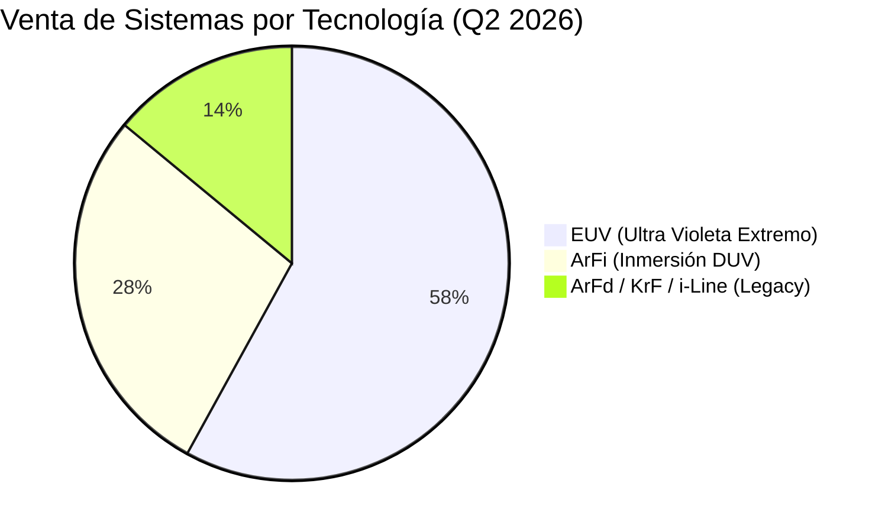
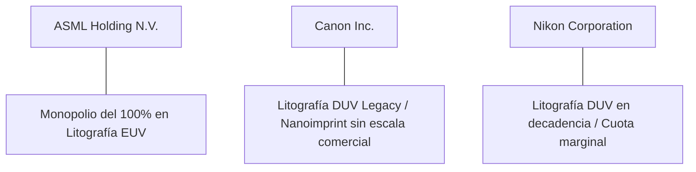

# Informe de Tesis de Inversión: ASML Holding N.V. (ASML) - Q2 2026
**Fecha:** 22 de Julio de 2026 (Post-Resultados de Q2 2026 del 15 de Julio)  
**Clasificación CQV:** ÉLITE (Puesto de Prioridad en Portafolio)  
**Calificación Final:** COMPRA ESCALONADA. El único fabricante mundial de máquinas de litografía EUV. Resultados de Q2 2026 superiores a las previsiones impulsados por la gestión de la base instalada y elevación de guías para todo el año 2026 a €43B-€45B.

---

## 1. Resumen Ejecutivo

ASML Holding N.V. (ASML) es una de las empresas de tecnología más críticas e insustituibles del planeta. Diseña y fabrica los sistemas de litografía fotográfica (especialmente **EUV - Ultravioleta Extremo**) necesarios para imprimir los circuitos integrados de última generación en obleas de silicio.

En el **segundo trimestre de 2026 (Q2 2026)**, ASML reportó una facturación neta de **€9,300 millones**, superando la guía previa del mercado, con un **beneficio neto de €2,900 millones** y un **margen bruto del 54.0%**. Apoyándose en la sólida demanda de procesadores para Inteligencia Artificial y memoria de ancho de banda elevado (HBM), la directiva **elevó sus proyecciones anuales para 2026 a €43,000–€45,000 millones** y anunció planes para aumentar la capacidad de producción de sistemas EUV Low-NA en un **+30% para 2027**.

Bajo el marco multifactorial **CQV v3.0**, ASML obtiene un score de **9.12/10** (clasificación **ÉLITE**), destacando por su rentabilidad de capital (**F1: 9.65**), solvencia de balance (**F2: 9.25**) y un foso económico monopolístico indestructible (**F4: 9.90**).

---

## 2. Métricas y Puntuaciones en el Modelo CQV v3.0

| Factor / Métrica | Puntuación (0-10) | Diagnóstico Financiero y Operativo |
| :--- | :---: | :--- |
| **F1: Rentabilidad** | **9.65** | ROIC superior al 35% y margen bruto del **54.0%**. Eficiencia industrial y Pricing Power absoluto. |
| **F2: Solidez Financiera** | **9.25** | Deuda a largo plazo extremadamente baja (~€4.6 B) frente a su volumen de generación de beneficios. |
| **F3: Crecimiento** | **9.10** | Crecimiento constante de ingresos impulsado por el ciclo de actualización a 3nm, 2nm y High-NA EUV. |
| **F4: Foso Económico (Moat)** | **9.90** | Monopolio mundial del 100% en litografía EUV. Imposible de duplicar sin décadas de I+D. |
| **F5: Proyecciones e IA** | **9.80** | Proveedor indispensable para todos los chips de IA de Nvidia, AMD, Apple y Google (fabricados por TSMC). |
| **F6: Asignación de Capital** | **9.20** | Recompra constante de acciones propias y reinversión del ~15% de ingresos en I+D. |
| **F7: FCF Yield (Valuación)** | **5.50** | Cotización con prima de calidad. Valuación exigente pero justificada por su foso competitivo. |
| **F8: Antifragilidad** | **8.50** | Fuerte componente de ingresos recurrentes por mantenimiento y actualización de la base instalada (Installed Base). |
| **CQV Score Promedio** | **9.12** | Calificación: **ÉLITE** |
| **Valuación PEG** | **6.80** | Margen de seguridad moderado, cotizando con descuento frente a su PER medio histórico de 39.5x. |

---

## 3. Análisis Detallado del Estado de Resultados (Q2 2026)

### 3.1. Tabla Comparativa de Resultados Trimestrales

| Métrica Clave (en millones €, excepto EPS) | Q2 2026 (Actual) | Q1 2026 (Previo) | Variación QoQ (%) | Q2 2025 (Año Ant.) | Variación YoY (%) |
| :--- | :---: | :---: | :---: | :---: | :---: |
| **Ingresos Netos Totales** | €9,300 M | €7,740 M | +20.2% | €6,240 M | +49.0% |
| **Ingresos por Mantenimiento (Installed Base)** | €2,100 M | €1,820 M | +15.4% | €1,520 M | +38.2% |
| **Gastos Operativos Totales (R&D + SG&A)** | €1,850 M | €1,720 M | +7.6% | €1,490 M | +24.2% |
| **Beneficio Operativo** | €3,172 M | €2,420 M | +31.1% | €1,850 M | +71.5% |
| **Margen Operativo** | **34.1%** | **31.3%** | +280 bps | **29.6%** | +450 bps |
| **Margen Bruto** | **54.0%** | **51.0%** | +300 bps | **51.5%** | +250 bps |
| **Beneficio Neto** | €2,900 M | €2,180 M | +33.0% | €1,580 M | +83.5% |
| **Diluted EPS (GAAP)** | **€7.36** | **€5.54** | **+32.9%** | **€4.01** | **+83.5%** |
| **Deuda a Largo Plazo (Long-Term Debt)** | **€4,600 M** | **€4,600 M** | **0.0%** | **€4,600 M** | **0.0%** |
| **Recompra de Acciones (Buybacks)** | **€400 M** | **€350 M** | **+14.3%** | **€300 M** | **+33.3%** |
| **Free Cash Flow (FCF)** | **€2,450 M** | **€1,750 M** | **+40.0%** | **€1,280 M** | **+91.4%** |

---

### 3.2. Desempeño por Segmentos y Tecnología

*   **Sistemas EUV (58% de las ventas de sistemas)**:
    *   **Comportamiento**: Demanda masiva liderada por TSMC, Intel y Samsung para la fabricación de nodos de 3nm y 2nm.
    *   *Despliegue*: Se entregaron sistemas de última generación **High-NA EUV (EXE:5000)** a clientes pioneros.
*   **Gestión de Base Instalada (Installed Base Management - €2,100 M)**:
    *   **Comportamiento**: Superó con creces las estimaciones de la compañía. Representa el mantenimiento, actualización de software y mejoras de productividad de las máquinas ya instaladas en las fábricas de microchips.

---

### 3.3. Asignación de Capital y Estructura de Balance

*   **Recompra de Acciones & Dividendo**: ASML ejecutó recompras de acciones por **€400 millones** en Q2 2026 y mantiene su dividendo creciente.
*   **Estructura de Balance**:
    *   **Deuda Total**: €4,600 millones.
    *   **Caja y Valores Liquidados**: ~€7,200 millones (Caja Neta Positiva).
*   **CapEx e I+D**: Invierte más de **€1,100 millones por trimestre en I+D** para mantener una distancia tecnológica infranqueable sobre cualquier competidor.

---

### 3.4. Elevación de Guías Financieras (Guidance 2026)

| Métrica de Guía | Guía Actual (Julio 2026) | Guía Anterior (Q1 2026) | Diagnóstico |
| :--- | :---: | :---: | :--- |
| **Ingresos Totales (Full Year 2026)** | **€43,000M - €45,000M** | €30,000M - €40,000M | **Revisión al alza significativa por demanda de IA.** |
| **Margen Bruto Anual** | **54.0% - 56.0%** | 50.0% - 53.0% | Expansión de márgenes por mix de producto High-NA y servicios. |
| **Ingresos Q3 2026** | **€11,000M - €12,000M** | -- | Aceleración trimestral para el cierre del año. |

---

### 3.5. Líneas Rojas y Puntos de Vulnerabilidad Detectados en Q2 2026

> [!WARNING]
> **1. Geopolítica y Restricciones de Exportación a China**
> * Las restricciones comerciales impuestas por EE. UU. y el gobierno holandés impiden la venta de máquinas EUV y las herramientas DUV más avanzadas a clientes en China. China representó una porción atípicamente alta de compras DUV legacy en 2024-2025, por lo que una restricción más estricta sobre el mantenimiento afectaría los ingresos futuros de la base instalada.

> [!WARNING]
> **2. Concentración Extrema de Clientes (TSMC, Samsung, Intel)**
> * Solo 3 clientes compran la inmensa mayoría de sus máquinas EUV. Si Intel o Samsung retrasan sus planes de inversión en nuevas fábricas (fabs), los ingresos de hardware de ASML sufren variaciones trimestrales bruscas.

> [!WARNING]
> **3. Dependencia de la Cadena de Suministro (Carl Zeiss)**
> * Los componentes ópticos de máxima precisión producidos por Carl Zeiss (Alemania) son insustituibles. Cualquier cuello de botella o incendio en sus plantas detendría el ensamblaje de las máquinas EUV de ASML.

---

### 3.6. Impacto de la Inteligencia Artificial (Presente y Futuro)

#### A. Impacto en el Presente (2026):
* **El Cuello de Botella Físico de la IA**: Es imposible fabricar procesadores de IA (como Nvidia Blackwell, Rubin o AMD Instinct) sin los sistemas de litografía EUV de ASML. ASML es el "suministrador de picos y palas" definitivo de la revolución de la IA.

#### B. Impacto en el Futuro (Perspectiva a 3-5 Años):
* **Adopción Masiva de High-NA EUV**: La llegada comercial de los nodos de 2nm y 1.4nm requerirá las nuevas máquinas High-NA EUV (€350M por unidad), lo que duplicará el valor medio de venta por sistema para 2028-2030.

---

### 3.7. Análisis Detallado de la Competencia y Posicionamiento de Mercado

#### Comparativa de Rivales Principales:

| Competidor | Tecnología | Cuota en EUV | Ventaja Indestructible de ASML |
| :--- | :--- | :---: | :--- |
| **Canon Inc.** | DUV / Nanoimprint | **0%** | ASML le lleva más de 20 años de ventaja tecnológica. Las impresoras Nanoimprint no han demostrado viabilidad para chips avanzados. |
| **Nikon Corp.** | DUV Immersion | **0%** | Nikon quedó rezagada en la transición a EUV y solo suministra sistemas legacy a clientes secundarios. |

---

## 4. Tesis de Inversión (Toro vs. Oso)

### Tesis A: El Toro (Oportunidad)
*   **Monopolio Tecnológico Definitivo:** No existe alternativa en el mundo para imprimir microchips por debajo de los 7nm sin ASML.
*   **Ciclo de Expansión de Capacidad:** Aumento del 30% en capacidad EUV para 2027 respaldado por pedidos firmes.

### Tesis B: El Oso (Riesgos)
*   **Volatilidad de Ciclo Semiconductores:** Valoración a múltiplos elevados que la hace vulnerable si se produce un recorte de CapEx global en memoria o lógica.

---

## 5. Comparativa Multiversión Histórica y Valuación (PER Trailing / Forward)

| Año / Periodo | PER Trailing (Prom: 39.5x) | PER Forward (Prom: 28.5x) | CQV v1.0 | CQV v1.1 | CQV v2.0 | CQV v3.0 |
| :--- | :---: | :---: | :---: | :---: | :---: | :---: |
| **2022** | 35.2x | 26.0x | 9.15 | 9.15 | 8.90 | **8.90** |
| **2023** | 42.8x | 31.5x | 9.35 | 9.35 | 9.10 | **9.10** |
| **2024** | 44.1x | 32.0x | 9.35 | 9.35 | 9.12 | **9.12** |
| **2025** | 35.8x | 24.5x | 9.30 | 9.30 | 9.10 | **9.10** |
| **Q2 2026 (Actual)** | **38.2x** | **28.5x** | 9.30 | 9.35 | 8.85 | **9.12** |

---

## 6. Precio Ideal de Compra (Niveles de Entrada)

Con la acción cotizando actualmente a **~$670 - $700** (PER Trailing: **38.2x**, PER Forward: **28.5x**), estos son los 3 niveles de compra sugeridos:

### 🟢 Nivel 1: Zona de Entrada Razonable ($650 - $690) (Precio Actual)
* **PER Forward**: **~27x - 28x** | **Diagnóstico**: Cotizando alineado con su PER Forward medio histórico. Excelente punto para iniciar el **primer tramo (30%-40%)**.

### 🟡 Nivel 2: Zona de Precio Ideal / Gran Oportunidad ($550 - $590)
* **PER Forward**: **~22x - 24x** | **Descuento**: **-20%**
* **Diagnóstico**: Oportunidad de alta convicción para un monopolio tecnológico global. Zona para el **segundo tramo (40%)**.

### 🔴 Nivel 3: Zona de Ganga / Pánico de Mercado (< $500)
* **PER Forward**: **< 20x** | **Diagnóstico**: Oportunidad generacional para completar la posición máxima.

---

## 7. Preguntas Frecuentes del Inversor (FAQs)

### Q1: ¿Por qué los ingresos por "Base Instalada" fueron tan altos en Q2?
* **Respuesta**: Los fabricantes de chips están optimizando la productividad de sus máquinas EUV existentes aplicando actualizaciones de software y hardware (*field options*) para maximizar el rendimiento antes de instalar nuevas líneas.

### Q2: ¿Puede China desarrollar sus propias máquinas EUV para competir con ASML?
* **Respuesta**: No a corto/medio plazo. La tecnología EUV requiere la convergencia de física de láser de estaño fundido, espejos de precisión atómica de Carl Zeiss y aceleración de software que ha tomado 30 años de desarrollo conjunto.

---

## 8. Conclusión y Veredicto

ASML es la empresa tecnológica más indispensable del mundo. Sus resultados de Q2 2026 confirman que la ola de demanda de Inteligencia Artificial continuará impulsando su crecimiento durante los próximos 5 años.

**Veredicto:** **COMPRA ESCALONADA (Clasificación ÉLITE). Monopolio definitivo de litografía. Iniciar primer tramo de compra en el rango de $650-$690.**
