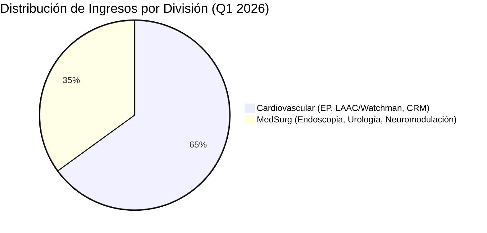
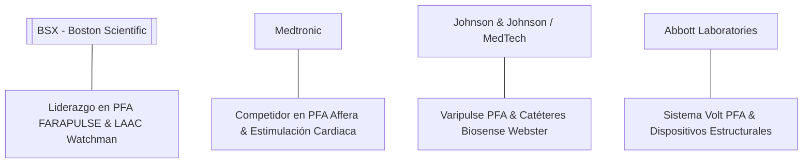

# Informe de Tesis de Inversión: Boston Scientific Corporation (BSX) - Q1 2026
**Fecha:** 25 de Julio de 2026 (Análisis de Resultados de Q1 2026)  
**Clasificación CQV:** ALTA CALIDAD (Oportunidad por Reajuste Excesivo de Múltiplo)  
**Calificación Final:** COMPRA ESCALONADA. Empresa líder global en tecnología médica y dispositivos cardiovasculares con sólidos fundamentos operativos. Su reciente corrección cercana al 59% desde máximos históricos de 2025 ofrece una valoración atractiva (PER Forward de ~12.1x).

---

## 1. Resumen Ejecutivo

Boston Scientific Corporation (BSX) es un coloso global en el diseño, desarrollo y comercialización de dispositivos médicos utilizados en especialidades intervencionistas de alto valor agregado. Opera principalmente a través de dos grandes divisiones: **Cardiovascular** (Electrofisiología con la avanzada plataforma PFA **FARAPULSE**, Cierre de Orejuela Auricular **WATCHMAN**, y Terapias Vasculares/CRM) y **MedSurg** (Endoscopia con **SpyGlass**, Urología y Neuromodulación).

Durante los últimos trimestres de 2025, la acción alcanzó un máximo histórico de **$109.50** tras un periodo de crecimiento de ventas cercano al 20% impulsado por la adopción explosiva de la tecnología de ablación por campo pulsado (PFA). Sin embargo, desde finales de 2025 y a lo largo de 2026, la acción sufrió una severa contracción hasta cotizar en torno a los **$45.14** (una caída de ~58.8%), motivada por una moderación en la guía de ventas para 2026 (10.5%–11.5% YoY), temores de competencia en PFA (Medtronic, J&J, Abbott), la digestión financiera de la adquisición de Penumbra por $14,500 M y retiros de lotes puntuales por temas de empaque estéril.

Bajo el marco multifactorial **CQV v3.0 (Quality and Structural Value)**, Boston Scientific obtiene una puntuación global de **8.19/10**, destacando por su sólido foso económico (**F4: 8.70**), resiliencia quirúrgica y antifragilidad (**F8: 8.60**), e innovación en electrofisiología e IA médica (**F5: 8.50**).

---

## 2. Métricas y Puntuaciones en el Modelo CQV v3.0

| Factor / Métrica | Puntuación (0-10) | Diagnóstico Financiero y Operativo |
| :--- | :---: | :--- |
| **F1: Rentabilidad** | **8.45** | Excelente margen bruto (~69.4%), margen operativo del 20.6% y sólida conversión de FCF (+$3,400M TTM). |
| **F2: Solidez Financiera** | **7.80** | Ratio Deuda Neta/EBITDA controlado en ~1.81x y sólida cobertura de intereses (>10x EBIT/Intereses). |
| **F3: Crecimiento** | **8.10** | Crecimiento de ingresos del 11.6% YoY en Q1 2026 y expansión sostenida del beneficio por acción Non-GAAP. |
| **F4: Foso Económico (Moat)** | **8.70** | Costes de cambio masivos en médicos/electrofisiólogos, patentes activas y posición dominante en LAAC (Watchman). |
| **F5: Proyecciones e IA** | **8.50** | Liderazgo en ablación por campo pulsado (FARAPULSE) y algoritmos de IA para mapeo cardiaco y diagnóstico. |
| **F6: Asignación de Capital** | **7.20** | Enfoque intensivo en I+D (~10% de ventas) y M&A estratégico (compra de Penumbra por $14.5B), sin pago de dividendo. |
| **F7: FCF Yield (Valuación)** | **6.20** | FCF Yield TTM de ~5.07%, que tras la corrección ofrece un margen de seguridad infinitamente superior a 2025. |
| **F8: Antifragilidad** | **8.60** | Alta recurrencia por procedimientos quirúrgicos y cardiovasculares esenciales no diferibles. |
| **CQV Score Promedio** | **8.19** | Calificación: **ALTA CALIDAD** |
| **Valuación PEG** | **8.50** | Múltiplo PEG de **0.55**, indicando un precio altamente atractivo respecto a su crecimiento proyectado de EPS. |

---

## 3. Análisis Detallado del Estado de Resultados (Q1 2026)

### 3.1. Tabla Comparativa de Resultados Trimestrales

| Métrica Clave (en millones $, excepto EPS) | Q1 2026 (Actual) | Q4 2025 (Previo) | Variación QoQ (%) | Q1 2025 (Año Ant.) | Variación YoY (%) |
| :--- | :---: | :---: | :---: | :---: | :---: |
| **Ingresos Totales** | $5,203 M | $5,286 M | -1.6% | $4,663 M | +11.6% |
| **Coste de Ventas (Cost of Revenue)** | $1,590 M | $1,608 M | -1.1% | $1,453 M | +9.4% |
| **Beneficio Bruto** | $3,613 M | $3,678 M | -1.8% | $3,210 M | +12.6% |
| **Margen Bruto** | **69.4%** | **69.6%** | -20 bps | **68.8%** | +60 bps |
| **Investigación y Desarrollo (I+D)** | $516 M | $569 M | -9.3% | $443 M | +16.5% |
| **Ventas, Generales y Admin. (SG&A)** | $1,781 M | $1,834 M | -2.9% | $1,597 M | +11.5% |
| **Beneficio Operativo** | $1,072 M | $1,041 M | +3.0% | $937 M | +14.4% |
| **Margen Operativo** | **20.6%** | **19.7%** | +90 bps | **20.1%** | +50 bps |
| **EBITDA** | $1,603 M | $1,155 M | +38.8% | $1,212 M | +32.3% |
| **Margen EBITDA** | **30.8%** | **21.9%** | +890 bps | **26.0%** | +480 bps |
| **Beneficio Neto (GAAP)** | $1,341 M | $672 M | +99.6% | $674 M | +99.0% |
| **Diluted EPS (GAAP)** | **$0.90** | **$0.45** | +100.0% | **$0.45** | +100.0% |
| **Non-GAAP / Adj EPS** | **$0.72** | **$0.70** | +2.9% | **$0.63** | +14.3% |
| **Deuda Total** | **$11,029 M** | **$11,436 M** | -3.6% | **$11,708 M** | -5.8% |
| **Caja y Equivalentes** | **$1,453 M** | **$1,965 M** | -26.1% | **$725 M** | +100.4% |
| **Free Cash Flow (FCF)** | **$171 M** | **$939 M** | -81.8% | **$277 M** | -38.3% |

---

### 3.2. Desempeño por Segmentos de Negocio

*   **Segmento Cardiovascular (~65% de los ingresos)**:
    *   **Ingresos Q1 2026**: ~$3,382 millones (+13.2% YoY).
    *   *Electrofisiología (EP)*: Impulsada por la plataforma de ablación por campo pulsado **FARAPULSE** y el avance en los ensayos clínicos **AVANT GUARD** y **BEAT PERS-AF**, aunque registrando mayor competencia de rivales.
    *   *Estructura Cardíaca & LAAC*: La franquicia **WATCHMAN FLX Pro** mantiene su liderazgo en el cierre de la orejuela auricular izquierda para prevención de Ictus en fibrilación auricular.
*   **Segmento MedSurg (~35% de los ingresos)**:
    *   **Ingresos Q1 2026**: ~$1,821 millones (+8.7% YoY).
    *   *Endoscopia*: Destaca la adopción del sistema de visualización de vías biliares **SpyGlass DS** y los stents **AXIOS**.
    *   *Urología & Neuromodulación*: Crecimiento sostenido en el sistema **LithoVue** y terapia de estimulación de la médula espinal **WaveWriter Alpha**.

---

### 3.3. Asignación de Capital y Estructura de Balance

*   **Deuda y Solvencia**:
    *   **Deuda Total**: $11,029 millones.
    *   **Caja y Equivalentes**: $1,453 millones.
    *   **Deuda Neta**: $9,576 millones.
    *   **Ratio Deuda Neta / EBITDA (TTM)**: **~1.81x**, un nivel cómodo y manejable para su generación de flujo de caja.
*   **M&A / Adquisiciones Clave**:
    *   Boston Scientific anunció la adquisición de **Penumbra** por **$14,500 millones**, reforzando su portafolio en intervenciones neurovasculares y trombectomía mecánica. La transacción genera un impacto dilutivo temporal en el EPS Non-GAAP (~$0.06 - $0.08 en el año 1), pero amplía significativamente su mercado direccionable.
*   **Recompra de Acciones & Dividendos**: BSX no distribuye dividendos; la totalidad del flujo libre de caja se redirige hacia reinversión interna en I+D (~$2,000M anuales) y adquisiciones estratégicas.

---

### 3.4. Causa Detallada de la Caída de la Acción desde 2025

La acción de Boston Scientific pasó de cotizar a un máximo histórico de **$109.50** en septiembre de 2025 a situarse en la zona de **$45.14** en 2026 (una corrección del ~58.8%). La brusca caída se debe a la confluencia de cinco factores principales:

> [!WARNING]
> **1. Compresión de Múltiplos por Exceso de Optimismo en 2025**
> En 2025 la acción cotizó a un PER Trailing superior a **42x-45x**, impulsada por la euforia sobre el lanzamiento de FARAPULSE. Al estar valorada para la "perfección", cualquier ligera desaceleración desencadenó una fuerte revaluación a la baja (de-rating).

> [!WARNING]
> **2. Desaceleración en la Guía de Ventas para 2026**
> Tras un año 2025 extraordinario con crecimiento cercano al 20%, la directiva ofreció una guía para 2026 con un crecimiento de ventas del **10.5% – 11.5% YoY**. Aunque es una cifra saludable, decepcionó a las elevadas expectativas de Wall Street.

> [!WARNING]
> **3. Intensificación de la Competencia en Electrofisiología (PFA)**
> La entrada al mercado de sistemas competidores de PFA por parte de Medtronic (**Affera / Sphere-9**), Johnson & Johnson (**Varipulse**) y Abbott (**Volt**) generó temores sobre la pérdida de cuota de mercado en el negocio de mayor crecimiento de BSX.

> [!WARNING]
> **4. Impacto Financiero del M&A de Penumbra ($14.5B)**
> El anuncio de la compra de Penumbra exigirá la emisión de deuda y capital, generando una dilución estimada de $0.06-$0.08 en el EPS del primer año y un aumento temporal del apalancamiento financiero.

> [!WARNING]
> **5. Retiros Voluntarios de Productos (Recalls Clase II)**
> Retiros puntuales de lotes en la división gastrointestinal (por problemas de sellado en bolsas estériles) agregaron presión regulatoria temporal e inquietud en inversores institucionales.

---

### 3.5. Impacto de la Inteligencia Artificial (Presente y Futuro)

#### A. Impacto en el Presente (2026):
* **Sistema RHYTHMIA HDx con Mapeo Asistido por IA**: Utilización de algoritmos de aprendizaje profundo para filtrar el ruido eléctrico del miocardio y construir mapas anatómicos 3D ultrarrápidos del corazón durante procedimientos de ablación.
* **Optimización de Parámetros de Ablación PFA**: Algoritmos que determinan la dosis exacta de energía de campo eléctrico requerida según la impedancia del tejido diana en tiempo real.

#### B. Impacto en el Futuro (Perspectiva a 3-5 Años):
* **Integración de Diagnóstico Pre-Quirúrgico y Planificación con IA**: Creación de gemelos digitales cardiacos a partir de resonancias y tomografías para simular la propagación de arritmias antes de introducir los catéteres.

---

### 3.6. Análisis Detallado de la Competencia

#### Comparativa de Rivales Principales:

| Competidor | Segmento Enfrentado | Estado Actual | Ventaja Defensiva de BSX frente al Rival |
| :--- | :--- | :--- | :--- |
| **Medtronic (MDT)** | Electrofisiología y CRM | Aprobación de Affera | BSX cuenta con la mayor experiencia clínica acumulada en PFA con FARAPULSE. |
| **Johnson & Johnson (JNJ)** | Carto / Varipulse PFA | Fuerte base instalada | WATCHMAN otorga a BSX un monopolio virtual en cierre de orejuela en muchos mercados. |
| **Abbott (ABT)** | Electrofisiología (Volt) | En fase de expansión | Ecosistema integrado MedSurg + Cardiovascular diversificado. |

---

## 4. Tesis de Inversión (Toro vs. Oso)

### Tesis A: El Argumento del Oso (Riesgos)
*   **Intensificación de la Competencia en PFA**: Pérdida de cuota de mercado si los sistemas de Medtronic o J&J demuestran ventajas operativas o menores tiempos de procedimiento.
*   **Incertidumbre en la Integración de Penumbra**: Riesgo de ejecución en la asimilación del equipo comercial y costes de reestructuración superiores a los previstos.

### Tesis B: El Argumento del Toro (Oportunidad)
*   **Valoración Históricamente Atractiva**: A **18.9x PER Trailing** y **12.1x PER Forward**, la acción ha descontado ampliamente los riesgos, cotizando con un PEG de 0.55.
*   **Expansión de Indicaciones de FARAPULSE & WATCHMAN**: Ensayos como AVANT GUARD y BEAT PERS-AF abren el mercado a pacientes con fibrilación auricular persistente y fases tempranas de la enfermedad.

---

## 5. Evolución Histórica de Puntuaciones CQV y Valuación

| Año / Periodo | PER Trailing | PER Forward | CQV v1.0 | CQV v2.0 | CQV v3.0 |
| :--- | :---: | :---: | :---: | :---: | :---: |
| **2022** | 26.5x | 21.2x | 7.90 | 8.00 | **8.05** |
| **2023** | 30.2x | 23.8x | 8.05 | 8.12 | **8.15** |
| **2024** | 35.8x | 27.5x | 8.15 | 8.20 | **8.22** |
| **2025 (Peak)** | 44.2x | 32.1x | 8.25 | 8.28 | **8.30** |
| **Q1 2026 (Actual)** | **18.89x** | **12.13x** | **8.12** | **8.15** | **8.19** |

---

## 6. Precio Ideal de Compra (Niveles de Entrada)

Con la acción cotizando actualmente a **$45.14** (PER Trailing: **18.89x**, PER Forward: **12.13x**), se definen los siguientes tramos estratégicos:

### 🟢 Nivel 1: Zona de Entrada Razonable ($45.00 - $48.00)
* **PER Forward**: **~12.1x - 12.9x** | **Descuento sobre Máximo 2025**: **-58.8%**
* **Diagnóstico**: Excelente punto de entrada para iniciar el **primer tramo de compra (35% - 40%)** aprovechando la compresión drástica de múltiplos.

### 🟡 Nivel 2: Zona de Precio Ideal / Gran Oportunidad ($40.00 - $44.99)
* **PER Forward**: **~10.7x - 12.0x** | **Descuento sobre Máximo 2025**: **-61.5%**
* **Diagnóstico**: Zona de alta convicción para ejecutar el **segundo tramo (40%)**. Múltiplo extremadamente exigente a favor del inversor.

### 🔴 Nivel 3: Zona de Ganga / Pánico (< $40.00)
* **PER Forward**: **< 10.7x**
* **Diagnóstico**: Oportunidad generacional para completar el 100% de la posición máxima planificada en cartera.

---

## 7. Preguntas Frecuentes del Inversor (FAQs)

### Q1: ¿Está en riesgo el liderazgo de FARAPULSE en ablación por campo pulsado?
* **Respuesta**: No de forma inmediata. Aunque Medtronic y J&J han ingresado con tecnologías competitivas, Boston Scientific cuenta con la mayor evidencia clínica acumulada, miles de pacientes tratados y una curva de aprendizaje ya superada por los electrofisiólogos.

### Q2: ¿Por qué la adquisición de Penumbra causó una caida inicial en la cotización?
* **Respuesta**: El mercado reaccionó de manera negativa ante el volumen de la transacción ($14.5B), la dilución a corto plazo del EPS ($0.06-$0.08) y la emisión necesaria de deuda, a pesar del evidente valor estratégico a largo plazo en trombectomía.

### Q3: ¿Es sostenible el perfil de crecimiento sin reparto de dividendos?
* **Respuesta**: Sí. Al reinvertir el 100% de sus flujos libres en R&D y adquisiciones de alto retorno, BSX ha generado una tasa de retorno sobre capital invertido (ROIC) superior al coste de capital, maximizando la creación de valor para el accionista a largo plazo.

---

## 8. Conclusión y Veredicto de Inversión

Boston Scientific Corporation (BSX) sigue siendo una de las empresas de tecnología médica más solventes e innovadoras del mundo. El castigo sufrido en el precio de su acción desde los máximos de 2025 ($109.50) responde a una sobre-reacción del mercado ante la moderación del crecimiento de ventas y la digestión de M&A, situando el múltiplo PER Forward en apenas **12.1x**.

**Veredicto:** **COMPRA ESCALONADA. Clasificación ALTA CALIDAD (CQV Score: 8.19/10). Se recomienda iniciar o reforzar posiciones en la zona actual de $45.14 con perspectiva de medio y largo plazo.**
