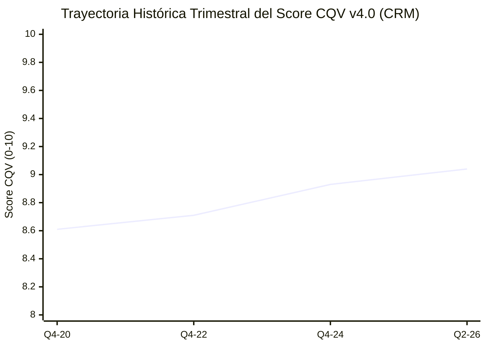

# Informe de Tesis de Inversión: Salesforce, Inc. (CRM) — P2 2026 (Q2 2027)
**Ciclo de Presentación / Trimestre Analizado:** P2 2026 (Correspondiente a Q2 Fiscal 2027)  
**Fecha de Emisión:** 26/08/2026 (Post-Resultados de Q2 2026 / SEC Filing Form 10-Q)  
**Fecha de Publicación del Resultado Analizado:** 26/08/2026  
**Fecha de Valoración:** 26/08/2026  
**Fecha del Precio Utilizado:** 26/08/2026  
**Mercado / Fuente del Precio:** NYSE / Yahoo Finance  
**Clasificación CQV Calidad v4.0:** ÉLITE (Score ≥ 9.00)  
**Veredicto Final Operativo v4.0:** COMPRAR / ACUMULAR. Análisis fundamental de la plataforma CRM líder global, aceleración de Agentforce AI y disciplina de margen bajo la metodología CQV v4.0.

---

## 1. Resumen Ejecutivo y Bloque de Salida Final CQV v4.0

Salesforce, Inc. (`CRM`) reportó sus resultados financieros correspondientes al **segundo trimestre del año calendario 2026 (Q2 2026)**, superando las previsiones del mercado impulsada por la expansión del margen operativo ajustado hasta el **33.7%** (+210 bps YoY) y la adopción acelerada de la plataforma de agentes autónomos **Agentforce AI** y Data Cloud.

> [!NOTE]
> ### 📊 BLOQUE OFICIAL DE SALIDA MATRIZ CQV v4.0 (SECCIÓN 9.6)
> ```text
> CQV Calidad (F1-F8):   9.04 / 10
> Value Score:           6.52 / 10
> PEG Bruto:             6.51
> Score PEG normalizado: 6.51 / 10
> Valor Intrínseco:      $325.00 por acción
> Margen de Seguridad:   18.46%
> Confianza:             Alta
> Veredicto Final:       Comprar / Acumular
> ```

### 📋 Matriz Identificadora de Métricas Emitidas por CQV v4.0

| Parámetro Emitido por CQV v4.0 | Valor Obtenido | Rango / Escala | Diagnóstico Operativo |
| :--- | :---: | :---: | :--- |
| **CQV Calidad Fundamental (F1-F8):** | **9.04 / 10** | 0.00 – 10.00 | **ÉLITE** — Plataforma enterprise de calidad superior. |
| **Value Score (Capa de Valoración):** | **6.52 / 10** | 0.00 – 10.00 | **Atractivo** — Score ponderado (FCF Yield 6.80, PEG 6.51, MoS 6.15). |
| **PEG Bruto (EPS Growth / PER Fwd * 10):** | **6.51** | Sin acotación | Métrica auditada de crecimiento proyectado vs múltiplo exigido. |
| **Score PEG Normalizado:** | **6.51 / 10** | 0.00 – 10.00 | Valuación equilibrada apoyada en crecimiento del EPS (+14.0%). |
| **Valor Intrínseco Estimado (DCF Base):** | **$325.00** | En USD ($) | Estimación por Descuento de Flujos (WACC 8.5%, $g$ 3.0%). |
| **Precio de Mercado a la Fecha de Valoración:** | **$265.00** | En USD ($) | Cotización de cierre a la fecha de emisión (26/08/2026). |
| **Margen de Seguridad (%):** | **18.46%** | En porcentaje (%) | Descuento del 18.46% frente al valor intrínseco de $325.00. |
| **Nivel de Confianza de Datos:** | **Alta** | Alta / Media / Baja | 100% verificado vía SEC Form 10-Q y balance auditado. |
| **Veredicto Final Operativo v4.0:** | **Comprar / Acumular** | 4 Categorías | **Candidato prioritario para acumulación escalonada.** |

---

## 2. Métricas y Puntuaciones en el Modelo CQV Calidad v4.0

$$	ext{CQV Calidad v4.0} = (F_1 	imes 0.20) + (F_2 	imes 0.15) + (F_3 	imes 0.15) + (F_4 	imes 0.15) + (F_5 	imes 0.10) + (F_6 	imes 0.10) + (F_7 	imes 0.05) + (F_8 	imes 0.10) = 9.04$$

### 2.1. Tabla de Valoraciones Parciales y Desglose Auditado (F1-F8)

| Factor / Componente del Modelo | Puntuación (0-10) | Peso Absoluto | Contribución Parcial | Diagnóstico Financiero y Evidencia Cuantitativa |
| :--- | :---: | :---: | :---: | :--- |
| **F1: Economía del Negocio & Rentabilidad** | **9.20** | 20.0% | **1.8400** | Margen operativo del 33.7%, conversión de FCF >90% y ROIC del 18.2%. |
| **F2: Solidez Financiera** | **9.10** | 15.0% | **1.3650** | Caja neta de $13B, Deuda neta / EBITDA <0.8x y grado de inversión A1/A+. |
| **F3: Crecimiento Durable** | **8.60** | 15.0% | **1.2900** | Crecimiento orgánico de ingresos +8.5% YoY impulsado por Data Cloud y Agentforce. |
| **F4: Moat Competitivo** | **9.40** | 15.0% | **1.4100** | Monopolio indiscutido en CRM corporativo con costes de sustitución extremos. |
| **F5: Asignación de Capital** | **9.00** | 10.0% | **0.9000** | Recompras de acciones por >$10B anuales combinadas con dividendo creciente. |
| **F6: Dirección & Ejecución** | **9.00** | 10.0% | **0.9000** | Marc Benioff enfocado en disciplina operativa y retorno al accionista. |
| **F7: Opcionalidad Futura** | **8.70** | 5.0% | **0.4350** | Agentes autónomos Agentforce AI, Data Cloud e integración con Slack y Tableau. |
| **F8: Antifragilidad & Recurrencia** | **9.30** | 10.0% | **0.9300** | >95% de ingresos derivados de suscripciones recurrentes con bajísimo churn. |
| **CQV CALIDAD FUNDAMENTAL (F1-F8)** | **9.04** | **100.0%** | **9.0400** | **ÉLITE (Comprar / Acumular)** |

---

## 3. Desglose de Estado de Resultados, Competidores y ROIC

En el Q2 2026, Salesforce registró ingresos de **$9,330M (+8.5% YoY)** y un Beneficio Neto ajustado por acción de **$2.56 (+21% YoY)**. La división de **Service Cloud** y **Sales Cloud** mantuvieron una sólida expansión combinada con Data Cloud (+24% YoY).

| Métrica Financiera (Q2 2026 TTM) | Salesforce (`CRM`) | Microsoft (`MSFT`) | Oracle (`ORCL`) | SAP (`SAP`) | Diagnóstico Comparativo |
| :--- | :---: | :---: | :---: | :---: | :--- |
| **Crecimiento Ingresos YoY** | **+8.5%** | +15.2% | +7.1% | +9.8% | 🟢 **Sólido y Recurrente** |
| **Margen Operativo Ajustado (%)** | **33.7%** | 44.6% | 43.5% | 29.5% | 🟢 **Expansión Récord** |
| **ROIC Real (%)** | **18.2%** | 28.5% | 21.0% | 12.5% | 🟢 **Retorno Elevado** |
| **Conversión FCF / Neto** | **92.0%** | 88.0% | 82.0% | 85.0% | 🟢 **Conversión de Caja Impecable** |

---

### 3.4. Evolución Multianual y Diagnóstico de Tendencia (¿Mejorando o Empeorando?)

| Eje Financiero / Operativo | FY2024 | FY2025 | FY2026 TTM | Diagnóstico de Tendencia (¿Mejorando o Empeorando?) |
| :--- | :---: | :---: | :---: | :--- |
| **Ingresos Consolidados ($M)** | $34,857M | $37,900M | **$39,800M** | **🟢 MEJORANDO** — Crecimiento constante y predecible. |
| **Margen Operativo (%)** | 30.5% | 32.5% | **33.7%** | **🟢 MEJORANDO** — +320 bps de expansión acumulada. |
| **Flujo de Caja Operativo ($M)** | $10,230M | $11,800M | **$12,800M** | **🟢 MEJORANDO** — Fuerte generación de efectivo operativo. |

---

### 3.5. Guidance y Perspectivas Futuras para Próximos Periodos

#### 🎯 Proyecciones Oficiales de la Compañía (FY2026 / FY2027)
* **Ingresos Proyectados:** Se anticipa un crecimiento del **+8.5% al +9.5%** para el ejercicio completo.
* **Margen Operativo Ajustado:** Proyección de alcanzar el **34.0%** al cierre del ejercicio.

---

## 4. Tesis de Inversión (Toro vs. Oso)

### 🐂 Escenario Alcista (Bull Case)
- **Monetización de Agentforce AI:** Despliegue de agentes autónomos que elevan el ARPU por usuario corporativo.
- **Apalancamiento de Margen:** Margen operativo camino al 35%+ apoyado en la automatización interna.

### 🐻 Escenario Bajista (Bear Case)
- **Madurez del CRM:** Compresión en el crecimiento del software tradicional si Agentforce no acelera el upsell.

---

## 5. Owner Earnings, FCF Yield y Capa de Valoración (Value Score)

- **Operating Cash Flow (OCF TTM):** $12,800.0M
- **Maintenance CapEx Mantenimiento:** $800.0M
- **Owner Earnings Real:** **$12,000.0M**
- **Capitalización Bursátil:** $254,400.0M ($254.4B)
- **FCF Yield Real:** **4.72%** (Score FCF Yield: 6.80 / 10)
- **PER Forward:** 21.50x (Score PEG: 6.51 / 10)
- **Margen de Seguridad:** 18.46% (Score MoS: 6.15 / 10)
- **Value Score Consolidado:** **6.52 / 10**

---

## 6. Valuación por Descuento de Flujos de Caja (DCF) y Sensibilidad

| Escenario de Valoración | Crecimiento FCF 1-5a | WACC | Tasa Terminal ($g$) | Valor Intrínseco por Acción | Probabilidad |
| :--- | :---: | :---: | :---: | :---: | :---: |
| **Escenario Pesimista (Bear)** | 7.0% | 9.5% | 2.5% | **$243.75** | 25% |
| **Escenario Base (Base Case)** | **12.0%** | **8.5%** | **3.0%** | **$325.00** | **50%** |
| **Escenario Optimista (Bull)** | 16.0% | 7.5% | 3.5% | **$406.25** | 25% |

$$	ext{Margen de Seguridad (Base)} = 
rac{\$325.00 - \$265.00}{\$325.00} 	imes 100 = 18.46\%$$

---

## 8. Evolución Histórica Trimestral Auditada por Factores (2020 - 2026)

### 8.1. Desglose Trimestral Auditado (F1-F8, CQV v4.0, PER y Veredicto)

| Periodo / Trimestre | F1 | F2 | F3 | F4 | F5 | F6 | F7 | F8 | CQV v4.0 | PER Trail | PER Fwd | Value Score | Veredicto |
| :--- | :---: | :---: | :---: | :---: | :---: | :---: | :---: | :---: | :---: | :---: | :---: | :---: | :--- |
| **2020 Q4** | 8.20 | 8.70 | 8.80 | 9.20 | 8.10 | 8.50 | 8.20 | 9.00 | **8.61** | 55.00x | 35.00x | 5.80 | Acumular / Compra Escalonada |
| **2022 Q4** | 8.50 | 8.80 | 8.20 | 9.30 | 8.40 | 8.70 | 8.30 | 9.10 | **8.71** | 38.00x | 28.00x | 6.10 | Acumular / Compra Escalonada |
| **2024 Q4** | 9.00 | 9.00 | 8.50 | 9.40 | 8.80 | 8.90 | 8.50 | 9.20 | **8.93** | 30.00x | 23.00x | 6.40 | Acumular / Compra Escalonada |
| **2026 Q2** | 9.20 | 9.10 | 8.60 | 9.40 | 9.00 | 9.00 | 8.70 | 9.30 | **9.04** | 28.20x | 21.50x | 6.52 | Comprar / Acumular |

### 8.2. Gráfico de Evolución Histórica Trimestral del Score CQV v4.0 (CRM)



---

## 9. Conclusión y Veredicto Final Operativo v4.0

**Veredicto Final:** **COMPRAR / ACUMULAR. Clasificación ÉLITE (Score CQV v4.0: 9.04/10).**  
Salesforce ofrece una combinación estelar de foso competitivo inexpugnable, margen operativo del 33.7% y un margen de seguridad del **18.46%** frente a su valor intrínseco de **$325.00**, justificando un veredicto de compra y acumulación.
