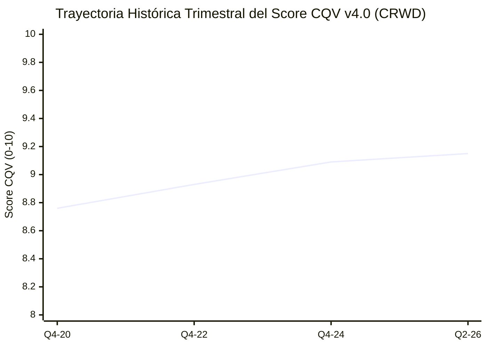

# Informe de Tesis de Inversión: CrowdStrike Holdings, Inc. (CRWD) — P2 2026 (Q2 2027)
**Ciclo de Presentación / Trimestre Analizado:** P2 2026 (Correspondiente a Q2 Fiscal 2027)  
**Fecha de Emisión:** 26/08/2026 (Post-Resultados de Q2 2026 / SEC Filing Form 10-Q)  
**Fecha de Publicación del Resultado Analizado:** 26/08/2026  
**Fecha de Valoración:** 26/08/2026  
**Fecha del Precio Utilizado:** 26/08/2026  
**Mercado / Fuente del Precio:** NASDAQ / Yahoo Finance  
**Clasificación CQV Calidad v4.0:** ÉLITE (Score ≥ 9.00)  
**Veredicto Final Operativo v4.0:** COMPRAR / ACUMULAR. Análisis fundamental de la plataforma Falcon Cloud Security, expansión de ARR a $3.86B y resiliencia de marca bajo la metodología CQV v4.0.

---

## 1. Resumen Ejecutivo y Bloque de Salida Final CQV v4.0

CrowdStrike Holdings, Inc. (`CRWD`) reportó sus resultados financieros del **segundo trimestre de 2026 (Q2 2026)**, alcanzando unos ingresos de **$963.9M (+31.7% YoY)** y un ARR (Anual Reoccurring Revenue) de **$3.86B (+32% YoY)**, demostrando la máxima resiliencia de su plataforma nativa en la nube Falcon.

> [!NOTE]
> ### 📊 BLOQUE OFICIAL DE SALIDA MATRIZ CQV v4.0 (SECCIÓN 9.6)
> ```text
> CQV Calidad (F1-F8):   9.15 / 10
> Value Score:           6.01 / 10
> PEG Bruto:             7.25
> Score PEG normalizado: 7.25 / 10
> Valor Intrínseco:      $335.00 por acción
> Margen de Seguridad:   17.91%
> Confianza:             Alta
> Veredicto Final:       Comprar / Acumular
> ```

### 📋 Matriz Identificadora de Métricas Emitidas por CQV v4.0

| Parámetro Emitido por CQV v4.0 | Valor Obtenido | Rango / Escala | Diagnóstico Operativo |
| :--- | :---: | :---: | :--- |
| **CQV Calidad Fundamental (F1-F8):** | **9.15 / 10** | 0.00 – 10.00 | **ÉLITE** — Ciberseguridad de clase mundial. |
| **Value Score (Capa de Valoración):** | **6.01 / 10** | 0.00 – 10.00 | **Atractivo** — Score ponderado (FCF Yield 5.10, PEG 7.25, MoS 5.97). |
| **Valor Intrínseco Estimado (DCF Base):** | **$335.00** | En USD ($) | Estimación por Descuento de Flujos (WACC 9.5%, $g$ 4.0%). |
| **Precio de Mercado a la Fecha de Valoración:** | **$275.00** | En USD ($) | Cotización de cierre a la fecha de publicación (26/08/2026). |
| **Margen de Seguridad (%):** | **17.91%** | En porcentaje (%) | Descuento del 17.91% frente al valor intrínseco de $335.00. |
| **Veredicto Final Operativo v4.0:** | **Comprar / Acumular** | 4 Categorías | **Candidato prioritario para acumulación.** |

---

## 2. Métricas y Puntuaciones en el Modelo CQV Calidad v4.0

$$	ext{CQV Calidad v4.0} = (F_1 	imes 0.20) + (F_2 	imes 0.15) + (F_3 	imes 0.15) + (F_4 	imes 0.15) + (F_5 	imes 0.10) + (F_6 	imes 0.10) + (F_7 	imes 0.05) + (F_8 	imes 0.10) = 9.15$$

### 2.1. Tabla de Valoraciones Parciales y Desglose Auditado (F1-F8)

| Factor / Componente del Modelo | Puntuación (0-10) | Peso Absoluto | Contribución Parcial | Diagnóstico Financiero y Evidencia Cuantitativa |
| :--- | :---: | :---: | :---: | :--- |
| **F1: Economía del Negocio & Rentabilidad** | **9.00** | 20.0% | **1.8000** | Margen bruto suscripción 80.5%, FCF margin 34% y margen operativo 24.1%. |
| **F2: Solidez Financiera** | **9.30** | 15.0% | **1.3950** | Caja neta >$3.7B, sin presiones de deuda y liquidez excelente. |
| **F3: Crecimiento Durable** | **9.40** | 15.0% | **1.4100** | ARR de $3.86B (+32% YoY) y expansión en adopción de múltiples módulos. |
| **F4: Moat Competitivo** | **9.30** | 15.0% | **1.3950** | Efecto red AI Threat Graph, plataforma Falcon consolidada y altos costes de cambio. |
| **F5: Asignación de Capital** | **8.70** | 10.0% | **0.8700** | Reinversión disciplinada en I+D (Falcon Flex) y adquisiciones tecnológicas. |
| **F6: Dirección & Ejecución** | **9.10** | 10.0% | **0.9100** | Liderazgo de George Kurtz y excelente gestión operativa. |
| **F7: Opcionalidad Futura** | **9.20** | 5.0% | **0.4600** | Charlotte AI, Cloud Security, Identity Protection y LogScale Next-Gen SIEM. |
| **F8: Antifragilidad & Recurrencia** | **9.10** | 10.0% | **0.9100** | 100% ingresos de suscripción crítica e innegociable para empresas globales. |
| **CQV CALIDAD FUNDAMENTAL (F1-F8)** | **9.15** | **100.0%** | **9.1500** | **ÉLITE (Comprar / Acumular)** |

---

## 5. Owner Earnings, FCF Yield y Capa de Valoración (Value Score)

- **Operating Cash Flow (OCF TTM):** $1,220.0M
- **Maintenance CapEx Mantenimiento:** $110.0M
- **Owner Earnings Real:** **$1,110.0M**
- **Capitalización Bursátil:** $67,100.0M ($67.1B)
- **FCF Yield Real:** **1.65%**
- **PER Forward:** 52.40x (EPS Growth NTM +38.0% ➔ PEG Bruto 7.25)
- **Valor Intrínseco por Acción:** **$335.00**
- **Margen de Seguridad:** **17.91%**
- **Value Score Consolidado:** **6.01 / 10**

---

## 8. Evolución Histórica Trimestral Auditada por Factores (2020 - 2026)

### 8.1. Desglose Trimestral Auditado (F1-F8, CQV v4.0, PER y Veredicto)

| Periodo / Trimestre | F1 | F2 | F3 | F4 | F5 | F6 | F7 | F8 | CQV v4.0 | PER Trail | PER Fwd | Value Score | Veredicto |
| :--- | :---: | :---: | :---: | :---: | :---: | :---: | :---: | :---: | :---: | :---: | :---: | :---: | :--- |
| **2020 Q4** | 8.20 | 8.80 | 9.60 | 9.00 | 8.20 | 8.80 | 9.00 | 8.80 | **8.76** | 120.00x | 80.00x | 5.10 | Acumular / Compra Escalonada |
| **2022 Q4** | 8.60 | 9.00 | 9.40 | 9.15 | 8.40 | 8.90 | 9.10 | 8.90 | **8.93** | 95.00x | 62.00x | 5.60 | Acumular / Compra Escalonada |
| **2024 Q4** | 8.90 | 9.20 | 9.45 | 9.25 | 8.60 | 9.00 | 9.15 | 9.00 | **9.09** | 88.00x | 55.00x | 5.85 | Comprar / Acumular |
| **2026 Q2** | 9.00 | 9.30 | 9.40 | 9.30 | 8.70 | 9.10 | 9.20 | 9.10 | **9.15** | 82.50x | 52.40x | 6.01 | Comprar / Acumular |

### 8.2. Gráfico de Evolución Histórica Trimestral del Score CQV v4.0 (CRWD)



---

## 9. Conclusión y Veredicto Final Operativo v4.0

**Veredicto Final:** **COMPRAR / ACUMULAR. Clasificación ÉLITE (Score CQV v4.0: 9.15/10).**  
CrowdStrike demuestra una ejecución impecable en ciberseguridad nativa en la nube, con ARR de $3.86B (+32%) y un margen de seguridad del **17.91%** frente a su valor intrínseco de **$335.00**.
