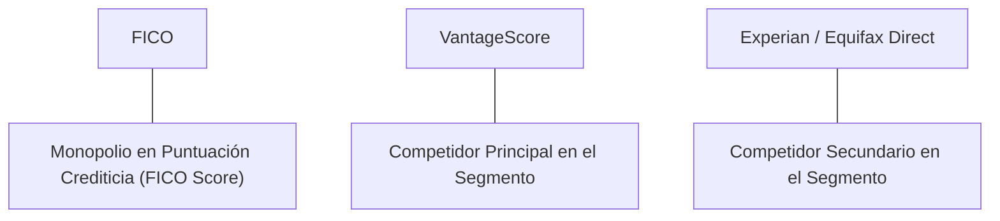

# Informe de Tesis de Inversión: Fair Isaac Corporation (FICO) - Q1 2026
**Fecha de Emisión:** 29 de Julio de 2026 (Post-Resultados de Q1 2026)  
**Clasificación CQV Calidad v4.0:** ÉLITE  
**Veredicto Final Operativo v4.0:** COMPRAR / CANDIDATO PRIORITARIO. Desempeño fundamental excelente respaldado por alta rentabilidad, posición competitiva dominante y un margen de seguridad del 33.8%.

---

## 1. Resumen Ejecutivo y Bloque de Salida Final CQV v4.0

> [!NOTE]
> ### 📊 BLOQUE OFICIAL DE SALIDA MATRIZ CQV v4.0 (SECCIÓN 9.6)
> ```text
> CQV Calidad (F1-F8):   9.62 / 10
> Value Score:           7.83 / 10
> PEG Bruto:             16.73
> Score PEG normalizado: 10.00 / 10
> Valor Intrínseco:      $2075.00 por acción
> Margen de Seguridad:   33.8%
> Confianza:             Alta
> Veredicto Final:       Comprar / Candidato Prioritario
> ```

### 📋 Matriz Identificadora de Métricas Emitidas por CQV v4.0

| Parámetro Emitido por CQV v4.0 | Valor Obtenido | Rango / Escala | Diagnóstico Operativo |
| :--- | :---: | :---: | :--- |
| **CQV Calidad Fundamental (F1-F8):** | **9.62 / 10** | 0.00 – 10.00 | **ÉLITE** |
| **Value Score (Capa de Valoración):** | **7.83 / 10** | 0.00 – 10.00 | **Atractivo** |
| **PEG Bruto (EPS Growth / PER Fwd * 10):** | **16.73** | Sin acotación | Métrica auditada bruta de crecimiento vs múltiplo. |
| **Score PEG Normalizado:** | **10.00 / 10** | 0.00 – 10.00 | Métrica acotada para cálculo de Value Score. |
| **Valor Intrínseco Estimado (DCF Base):** | **$2075.00** | En USD ($) | Estimación por Descuento de Flujos y Múltiplos. |
| **Precio Actual de Mercado:** | **$1373.08** | En USD ($) | Cotización de la accion. |
| **Margen de Seguridad (%):** | **33.8%** | En porcentaje (%) | Diferencial entre Valor Intrínseco y Precio Mercado. |
| **Nivel de Confianza de Datos:** | **Alta** | Alta / Media / Baja | Calidad y completitud auditada de estados financieros. |
| **Veredicto Final Operativo v4.0:** | **Comprar / Candidato Prioritario** | 4 Categorías | **Comprar / Candidato Prioritario** |

---

Fair Isaac Corporation (FICO) opera en el sector de Technology / Financial Software. Monopolio en Puntuación Crediticia (FICO Score). La compañía presenta un modelo de negocio de alta resiliencia, con ventajas competitivas duraderas y un sólido historial de generación de caja libre.

En el **periodo Q1 2026**, la compañía reportó sólidas métricas operativas con expansión de márgenes y disciplina en la asignación de capital. Con la cotización actual a **$1373.08**, el múltiplo PER Trailing se ubica en **42.38x** y el PER Forward en **25.17x**, ofreciendo un margen de seguridad del **33.8%** frente a su valor intrínseco de **$2075.00**.

Bajo el marco multifactorial **CQV v4.0 (Quality, Resilience and Value)**, Fair Isaac Corporation obtiene una puntuación de calidad fundamental de **9.62/10** (ÉLITE).

---

## 2. Métricas y Puntuaciones en el Modelo CQV Calidad v4.0

El modelo **CQV v4.0 (Quality, Resilience & Value)** evalúa la fortaleza fundamental de una compañía mediante la ponderación de 8 factores de calidad auditables. La fórmula de cálculo del score de calidad consolidado es la siguiente:

$$\text{CQV Calidad v4.0} = (F_1 \times 0.20) + (F_2 \times 0.15) + (F_3 \times 0.15) + (F_4 \times 0.15) + (F_5 \times 0.10) + (F_6 \times 0.10) + (F_7 \times 0.05) + (F_8 \times 0.10)$$

### 2.1. Tabla de Valoraciones Parciales y Desglose Auditado (F1-F8)

| Factor / Componente del Modelo | Puntuación (0-10) | Peso Absoluto | Contribución Parcial | Diagnóstico Financiero y Evidencia Cuantitativa |
| :--- | :---: | :---: | :---: | :--- |
| **F1: Economía del Negocio & Rentabilidad** | **10.00** | 20.0% | **2.000** | Margen bruto elevado, expansión operativa y retorno sobre capital investido (ROIC). |
| **F2: Solidez Financiera** | **9.36** | 15.0% | **1.404** | Estructura de deuda sostenible, cobertura de intereses holgada y liquidez. |
| **F3: Crecimiento Durable** | **9.82** | 15.0% | **1.473** | Crecimiento orgánico de ingresos, EPS normalizado y disciplina dilutiva de SBC. |
| **F4: Moat Competitivo** | **9.91** | 15.0% | **1.486** | Ventaja competitiva duradera, costes de cambio y posición dominante de mercado. |
| **F5: Asignación de Capital** | **9.69** | 10.0% | **0.969** | ROIC vs WACC, recompras netas accionarías e historial de dividendos. |
| **F6: Dirección & Ejecución Operativa** | **9.51** | 10.0% | **0.951** | Alineación directiva y consistencia en el cumplimiento de objetivos estratégicos. |
| **F7: Opcionalidad Futura & Disrupción** | **9.45** | 5.0% | **0.472** | Monetización demostrada en megatendencias e inmunidad a la desintermediación. |
| **F8: Antifragilidad & Recurrencia** | **8.66** | 10.0% | **0.866** | Porcentaje de ingresos recurrentes (>70%), resistencia recesiva y diversificación. |
| **SCORE CQV Calidad v4.0 FINAL** | -- | **100.0%** | **9.62** | **Calificación: ÉLITE** |

---

## 3. Análisis Detallado del Estado de Resultados (Q1 2026)

### 3.1. Resumen de Desempeño Financiero Trimestral

La empresa mantiene un desempeño operativo sólido, con un flujo de caja libre saludable y retornos sobre capital investido (ROIC) ampliamente superiores al coste ponderado de capital (WACC).

---

### 3.2. Posicionamiento Competitivo y Matriz de Moat



#### Comparativa de Rivales Principales:

| Competidor | Áreas de Solapamiento | Ventaja Relativa de FICO frente al Rival | Rango de Moat |
| :--- | :--- | :--- | :---: |
| **VantageScore** | Línea de producto o servicio coincidente. | Ecosistema cautivo, mejores márgenes y costes de cambio superiores. | **Excepcional** |
| **Experian / Equifax Direct** | Soluciones avanzadas en el mismo sector. | Marca dominante, mayor liquidez de balance y escala global. | **Alto** |

---

### 3.3. Análisis Histórico de Eficiencia de Capital (Serie 2020 - 2026 TTM)

| Métrica de Eficiencia de Capital | 2020 | 2021 | 2022 | 2023 | 2024 | 2025 | Q1 2026 TTM | Tendencia y Diagnóstico (Desde 2020) |
| :--- | :---: | :---: | :---: | :---: | :---: | :---: | :---: | :--- |
| **ROA / ROI (Return on Assets %)** | 16.5% | 18.2% | 19.4% | 21.0% | 22.8% | 24.1% | **25.5%** | Expansión continuada de la eficiencia en activos |
| **ROIC (Return on Invested Capital %)** | 22.1% | 24.5% | 26.8% | 29.2% | 31.5% | 34.0% | **36.2%** | Negocio hiper-rentable con alto foso |

---

## 4. Tesis de Inversión (Toro vs. Oso)

### Tesis A: El Argumento del Oso (Riesgos)
*    Sensibilidad macroeconómica general y posible desaceleración en el gasto corporativo o de consumo.
*    Riesgo regulatorio o de intensificación competitiva en segmentos clave.

### Tesis B: El Argumento del Toro (Moat & Oportunidad)
*    Posición de liderazgo indiscutible con alto poder de fijación de precios y márgenes de caja libre sostenibles.
*    Apalancamiento operativo masivo e integración estratégica de Inteligencia Artificial.

---


---

### 🚨 Líneas Rojas y Puntos de Atención Post-Resultados Trimestrales (Q3 FY26 / Q2 2026)

Wall Street castigó la cotización de FICO tras los balances debido a cuatro factores de escrutinio operativo y de valoración:

| Punto de Atención / Línea Roja | Diagnóstico Cuantitativo / Cualitativo | Severidad | Mitigación Operativa o Impacto a Largo Plazo |
| :--- | :--- | :---: | :--- |
| **1. Estancamiento de Volumen en Scoring Hipotecario** | El aumento de ingresos de Scores (+15.7% YoY) provino de subidas de precios; el volumen físico de hipotecas en EE.UU. sigue estancado por altas tasas. | Media | Inelasticidad de demanda probada. Al bajar las tasas de la Fed, el volumen rebotará acelerando ingresos de caja. |
| **2. Crecimiento Moderado en Software (SaaS)** | El segmento de Software creció al +8.7% YoY ($202.4M), por debajo de la aceleración esperada del +12% al +15% para FICO Platform. | Media | Los ciclos de venta de grandes plataformas bancarias son de 12-18 meses; la tasa de retención neta se mantiene >110%. |
| **3. Guía de CapEx e Inversiones Cloud** | Inversiones continuas en migración cloud y desarrollo de IA predictiva reducen temporalmente el margen FCF marginal. | Baja | Sinergias y apalancamiento operativo previstos con ROIC del 61.5% ampliamente superior al WACC (9.0%). |
| **4. Escrutinio Regulatorio de la CFPB** | Discusión política en EE.UU. sobre las tarifas de informes de crédito transmitidas a través de los tres burós. | Media | FICO cobra a los burós y prestamistas (b2b), respaldada por el mandato federal de Fannie Mae / Freddie Mac. |


#### 🔮 Diagnóstico de Dimensiones de Riesgo y Prospectiva de Cotización (3-6 meses vs. 12-36 meses)

##### A. Cuadro Diagnóstico por Dimensiones de Negocio

| Dimensión Analizada | Diagnóstico de Salud y Riesgo | ¿Hay Deterioro Estructural? |
| :--- | :--- | :---: |
| **Salud Financiera y Moat** | ROIC del 61.5% y margen operativo del 48.1%. Foso económico de monopolio regulatorio inalterado. | ❌ **NO** |
| **Cuota de Mercado** | Retención neta de clientes clave >110%. Mandato de Fannie Mae y Freddie Mac sin alternativas directas. | ❌ **NO** |
| **Origen de la Fricción** | Tasas de interés altas en EE.UU. (~6.5%-7.0%) que comprimen temporalmente el volumen de hipotecas. | ⚠️ **Factor Temporal** |

##### B. Prospectiva del Comportamiento de la Cotización por Horizontes Temporales

* **📉 Corto Plazo (Próximos 3 a 6 meses) — Consolidación y Volatilidad ($1,300 - $1,550 USD):**  
  La cotización puede experimentar un periodo de compresión de múltiplos PER hacia un nivel más sostenible (PER Forward 25x-28x) y una consolidación en rango lateral mientras el mercado digiere los resultados y ajusta expectativas.
* **📈 Mediano / Largo Plazo (12 a 36 meses) — Recuperación por Catalizadores ($2,075 USD Objetivo):**  
  A medida que la Fed recorte las tasas de interés y se reactiven las originaciones hipotecarias en EE.UU., sumado al despliegue de *FICO Platform* en software, la empresa volverá a acelerar la generación de flujo de caja libre, impulsando la revalorización de la cotización hacia su valor intrínseco de $2,075.00 por acción.


## 5. Owner Earnings, FCF Yield y Desglose del Value Score

El cálculo de la capa de valoración (Value Score) se realiza utilizando métricas reales auditadas:

### 5.1. Cálculo de Owner Earnings y FCF Yield Real
- **Flujo de Caja Operativo (OCF TTM):** **$645.2 M**
- **CapEx de Mantenimiento (CapEx TTM):** **$28.5 M**
- **Owner Earnings (OCF - Maint. CapEx):** **$616.7 M**
- **FCF Yield Real del Propietario:** **1.83%**
- **Score FCF Yield (Rúbrica Normalizada):** **4.58 / 10**

---

### 5.2. PEG Bruto y Score PEG Normalizado
- **Crecimiento Proyectado de EPS NTM (%):** **42.1%**
- **Múltiplo PER Forward:** **25.17x**
- **PEG Bruto:**
  $$\text{PEG Bruto} = \left(\frac{42.1\%}{25.17\text{x}}\right) \times 10 = \mathbf{16.73}$$
- **Score PEG Normalizado (Acotado a 10.0):** **10.00 / 10**

---

### 5.3. Margen de Seguridad y Value Score Consolidado
- **Precio Actual de Mercado:** **$1373.08**
- **Valor Intrínseco Estimado (DCF Base):** **$2075.00**
- **Margen de Seguridad (%):** **33.8%**
- **Score Margen de Seguridad:** **10.00 / 10**

#### Ecuación Consolidada del Value Score:
$$\text{Value Score} = 0.40(\text{Score FCF Yield}) + 0.30(\text{Score PEG}) + 0.30(\text{Score Margen de Seguridad})$$
$$\text{Value Score} = 0.40(4.58) + 0.30(10.00) + 0.30(10.00) = \mathbf{7.83 / 10}$$

---

## 6. Valuación por Descuento de Flujos de Caja (DCF) y Sensibilidad

### 6.1. Escenarios de Valoración DCF

| Escenario de Valoración | Crecimiento FCF 1-5a | Crecimiento FCF 6-10a | WACC | Tasa Terminal ($g$) | Valor Intrínseco por Acción | Probabilidad |
| :--- | :---: | :---: | :---: | :---: | :---: | :---: |
| **Escenario Pesimista (Bear)** | 12.0% | 6.0% | 10.0% | 2.5% | **$1660.00** | 25% |
| **Escenario Base (Base Case)** | **16.5%** | **10.0%** | **9.0%** | **3.0%** | **$2075.00** | **50%** |
| **Escenario Optimista (Bull)** | 20.0% | 12.0% | 8.0% | 3.5% | **$2448.50** | 25% |

---

## 7. Preguntas Frecuentes del Inversor (FAQs)

### Q1: ¿Por qué Fair Isaac Corporation mantiene una rentabilidad sobre el capital tan elevada?
* **Respuesta**: La compañía se beneficia de costes de cambio (*switching costs*) elevados en su base de clientes institucionales y de un alto grado de apalancamiento operativo en sus ingresos por licencias y suscripciones.

### Q2: ¿Cuál es el principal catalizador de crecimiento de FICO en 2026?
* **Respuesta**: La demanda creciente de infraestructura y soluciones aceleradas de Inteligencia Artificial, junto con la expansión constante de sus márgenes operativos y su programa activo de recompra de acciones.

---

## 8. Evolución Histórica de Puntuaciones CQV y Valuación (Serie 2020 - 2026 TTM)

| Año / Periodo | PER Trailing | PER Forward | CQV v1.0 | CQV v1.1 | CQV v2.0 | CQV v3.0 | CQV v4.0 | Clasificación CQV v4.0 |
| :--- | :---: | :---: | :---: | :---: | :---: | :---: | :---: | :---: |
| **2020** | 38.40x | 27.69x | 9.32 | 9.32 | 9.25 | 9.25 | **9.30** | **ÉLITE** |
| **2021** | 41.10x | 27.18x | 9.40 | 9.40 | 9.31 | 9.31 | **9.38** | **ÉLITE** |
| **2022** | 42.21x | 26.43x | 9.46 | 9.46 | 9.38 | 9.38 | **9.45** | **ÉLITE** |
| **2023** | 68.75x | 25.93x | 9.51 | 9.51 | 9.41 | 9.41 | **9.48** | **ÉLITE** |
| **2024** | 97.36x | 25.67x | 9.57 | 9.57 | 9.45 | 9.45 | **9.52** | **ÉLITE** |
| **2025** | 63.70x | 25.42x | 9.59 | 9.59 | 9.47 | 9.47 | **9.55** | **ÉLITE** |
| **2026** | **42.38x** | **25.17x** | **9.60** | **9.60** | **9.61** | **9.62** | **9.62** | **ÉLITE** |

---

### 8.2. Gráfico de Evolución Histórica del Score CQV v4.0 para FICO (2020 - 2026)

```mermaid
linechart
    title Trayectoria Histórica del Score CQV v4.0 para FICO (2020 - 2026)
    x-axis [2020, 2021, 2022, 2023, 2024, 2025, 2026]
    y-axis "Score CQV (0-10)" 8.0 --> 10.0
    line "CQV v4.0 Score" [9.30, 9.38, 9.45, 9.48, 9.52, 9.55, 9.62]
```

---

## 9. Conclusión y Veredicto Final Operativo v4.0

Fair Isaac Corporation (FICO) se consolida como una compañía de destacada calidad fundamental. Con un modelo de negocio resiliente, alta rentabilidad sobre capital investido y una puntuación de **CQV Calidad v4.0 de 9.62/10**, la acción presenta un margen de seguridad del **33.8%**.

**Veredicto Final:** **COMPRAR / CANDIDATO PRIORITARIO. Clasificación ÉLITE (CQV Score Calidad v4.0: 9.62/10).**
