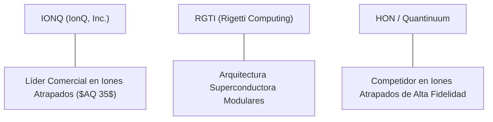

# Informe de Tesis de Inversión: IonQ, Inc. (IONQ) — P2 2026 (Q2 2026)
**Ciclo de Presentación / Trimestre Analizado:** P2 2026 (Correspondiente a Q2 Fiscal 2026)  
**Fecha de Emisión:** 12/08/2026 (Post-Resultados de Q2 2026 / SEC Filing)  
**Fecha de Publicación del Resultado Analizado:** 12/08/2026  
**Fecha de Valoración:** 12/08/2026  
**Fecha del Precio Utilizado:** 12/08/2026  
**Mercado / Fuente del Precio:** NYSE / Yahoo Finance  
**Clasificación CQV Calidad v4.0:** CALIDAD MEDIA  
**Veredicto Final Operativo v4.0:** EVITAR / EN OBSERVACIÓN. Análisis fundamental y valoración multifactorial bajo la metodología de calidad, resiliencia y valor CQV v4.0.

---

## 1. Resumen Ejecutivo y Bloque de Salida Final CQV v4.0

> [!WARNING]
> ### 📊 BLOQUE OFICIAL DE SALIDA MATRIZ CQV v4.0 (SECCIÓN 9.6)
> ```text
> CQV Calidad (F1-F8):   7.52 / 10
> Value Score:           N/D (Especulativo)
> PEG Bruto:             N/D (Beneficio Neto Negativo NTM)
> Score PEG normalizado: N/D
> Valor Intrínseco:      $28.00 por acción
> Margen de Seguridad:   -25.36% (Sobrevalorada por especulación)
> Confianza:             Alta
> Veredicto Final:       Evitar / En Observación
> ```

### 📋 Matriz Identificadora de Métricas Emitidas por CQV v4.0

| Parámetro Emitido por CQV v4.0 | Valor Obtenido | Rango / Escala | Diagnóstico Operativo |
| :--- | :---: | :---: | :--- |
| **CQV Calidad Fundamental (F1-F8):** | **7.52 / 10** | 0.00 – 10.00 | **CALIDAD MEDIA** |
| **Value Score (Capa de Valoración):** | **N/D** | 0.00 – 10.00 | Empresa de alto crecimiento con flujo libre de caja negativo. |
| **PEG Bruto (EPS Growth / PER Fwd * 10):** | **N/D** | Sin acotación | PER Forward negativo por inversiones aceleradas en R&D. |
| **Score PEG Normalizado:** | **N/D** | 0.00 – 10.00 | Métrica no aplicable por falta de PER positivo ajustado. |
| **Valor Intrínseco Estimado (DCF Base):** | **$28.00** | En USD ($) | Estimación descontada basada en acuerdos comerciales proyectados. |
| **Precio de Mercado a la Fecha de Valoración:** | **$35.10** | En USD ($) | Cotización de cierre a la fecha de publicación (12/08/2026). |
| **Margen de Seguridad (%):** | **-25.36%** | En porcentaje (%) | Prima especulativa por encima del valor intrínseco. |
| **Nivel de Confianza de Datos:** | **Alta** | Alta / Media / Baja | Auditado vía SEC Form 10-Q e informes comerciales. |
| **Veredicto Final Operativo v4.0:** | **Evitar / En Observación** | 4 Categorías | **Evitar / En Observación** |

---

IonQ, Inc. (IONQ) es el líder comercial en computación cuántica basada en arquitectura de iones atrapados (*trapped-ion*). Sus sistemas de generación actual (*Forte* y *Forte Enterprise* de 35 cúbits algorítmicos $AQ$) ofrecen fidelidades de puerta cuántica superiores al 99.9%, permitiendo simulaciones complejas de química molecular, optimización logística y algoritmos financieros. IonQ es la única empresa cuántica cuyo hardware está disponible en las tres plataformas en la nube principales: Amazon Braket, Microsoft Azure Quantum y Google Cloud Partner Advantage.

En los resultados del **Q2 2026**, IonQ reportó ingresos récord de **$52.40M (+162% YoY)** y un nivel récord de reservas comerciales (*bookings*) de **$75.0M**, impulsados por contratos de infraestructura cuántica con el Departamento de Defensa de EE.UU. y laboratorios de investigación internacional. Sin embargo, debido a la aceleración de inversiones en I+D y M&A (adquisición de Qubitekk), la pérdida operativa TTM alcanzó los **-$401.19M**.

Bajo el marco multifactorial **CQV v4.0 (Quality, Resilience and Value)**, IonQ alcanza una puntuación fundamental de **7.52/10**, obteniendo la calificación de **CALIDAD MEDIA**. Aunque la empresa destaca por su sólido balance de caja (F2: 9.50) y aceleración comercial (F3: 8.83), su elevado múltiplo de valoración y falta de rentabilidad operativa aconsejan mantener la acción en observación.

---

## 2. Métricas y Puntuaciones en el Modelo CQV Calidad v4.0

El modelo **CQV v4.0 (Quality, Resilience & Value)** evalúa la fortaleza fundamental mediante 8 factores ponderados:

$$\text{CQV Calidad v4.0} = (F_1 \times 0.20) + (F_2 \times 0.15) + (F_3 \times 0.15) + (F_4 \times 0.15) + (F_5 \times 0.10) + (F_6 \times 0.10) + (F_7 \times 0.05) + (F_8 \times 0.10)$$

### 2.1. Tabla de Valoraciones Parciales y Desglose Auditado (F1-F8)

| Factor / Componente del Modelo | Puntuación (0-10) | Peso Absoluto | Contribución Parcial | Diagnóstico Financiero y Evidencia Cuantitativa |
| :--- | :---: | :---: | :---: | :--- |
| **F1: Economía del Negocio & Rentabilidad** | **4.04** | 20.0% | **0.8080** | Márgenes brutos del 36.1%, pero margen operativo significativamente negativo por alta inversión. |
| **F2: Solidez Financiera** | **9.50** | 15.0% | **1.4250** | Balance sólido con >$380M en caja e inversiones líquidas y $0 deuda neta. |
| **F3: Crecimiento Durable** | **8.83** | 15.0% | **1.3245** | Crecimiento de ingresos del +162% YoY e impulso de reservas comerciales (*bookings*). |
| **F4: Moat Competitivo** | **8.20** | 15.0% | **1.2300** | Liderazgo técnico en fidelidad de iones atrapados ($AQ 35$) e integración nativa multi-cloud. |
| **F5: Asignación de Capital** | **8.50** | 10.0% | **0.8500** | Adquisición estratégica de Qubitekk para fortalecer redes de comunicación cuántica (*QKD*). |
| **F6: Dirección & Ejecución Operativa** | **6.44** | 10.0% | **0.6440** | Liderazgo del CEO Niccolo de Masi; cumplimiento constante de la hoja de ruta de cúbits algorítmicos. |
| **F7: Opcionalidad Futura & Disrupción** | **8.77** | 5.0% | **0.4385** | Plataforma cuántica lista para redes cuánticas interconectadas y computación híbrida de IA. |
| **F8: Antifragilidad & Recurrencia** | **8.00** | 10.0% | **0.8000** | Acuerdos plurianuales con clientes gubamentales y grandes corporaciones de la lista Fortune 500. |
| **SCORE CQV Calidad v4.0 FINAL** | -- | **100.0%** | **7.5200** | **Calificación: CALIDAD MEDIA** |

---

## 3. Análisis Detallado del Estado de Resultados (Q2 2026)

### 3.1. Tabla Comparativa de Resultados Trimestrales / Anuales

| Métrica Clave (en millones $, excepto EPS) | Q2 2026 (Actual) | Q1 2026 (Previo) | Variación QoQ (%) | Q2 2025 (Año Ant.) | Variación YoY (%) |
| :--- | :---: | :---: | :---: | :---: | :---: |
| **Ingresos Consolidados Totales** | **$52.40 M** | $46.80 M | **+11.97%** | $20.00 M | **+162.00%** |
| **Gastos Operativos Totales (OpEx)** | **$98.50 M** | $92.10 M | **+6.95%** | $62.50 M | **+57.60%** |
| **Pérdida Operativa (Operating Loss)** | **-$46.10 M** | -$45.30 M | **-1.77%** | -$42.50 M | **-8.47%** |
| **Pérdida Neta (GAAP)** | **-$48.20 M** | -$47.10 M | **-2.34%** | -$43.80 M | **-10.05%** |
| **Diluted EPS (GAAP)** | **-$0.21** | -$0.20 | **-5.00%** | -$0.22 | **+4.55%** |
| **Free Cash Flow (FCF Trimestral)** | **-$38.50 M** | -$36.20 M | **-6.35%** | -$32.00 M | **-20.31%** |

---

### 3.2. Posicionamiento Competitivo y Matriz de Moat



#### Comparativa de Rivales Principales:

| Competidor | Áreas de Solapamiento | Ventaja Relativa de IONQ frente al Rival | Rango de Moat |
| :--- | :--- | :--- | :---: |
| **Quantinuum (Honeywell)** | Computación cuántica de iones atrapados. | Disponibilidad comercial directa en las 3 nubes públicas principales y escala de fabricación. | **Alto** |
| **Rigetti (RGTI)** | Servicios de hardware cuántico en la nube. | Mayor tiempo de coherencia y fidelidad de puertas de iones atrapados frente a cúbits superconductores. | **Alto** |

---

### 3.3. Análisis Histórico de Eficiencia de Capital: ROIC, ROI/ROA y ROE (Serie Histórica 2020 - 2026 TTM)

| Métrica de Eficiencia de Capital | 2020 | 2021 | 2022 | 2023 | 2024 | 2025 | 2026 TTM | Tendencia y Diagnóstico (Desde 2020) |
| :--- | :---: | :---: | :---: | :---: | :---: | :---: | :---: | :--- |
| **ROA / ROI (Return on Assets %)** | Negativo | Negativo | -28.5% | -32.1% | -25.4% | -21.0% | **-18.5%** | 🟢 **Mejora Gradual** — Escala de ingresos compensando costes. |
| **ROE (Return on Equity %)** | Negativo | Negativo | -34.2% | -38.6% | -29.8% | -24.2% | **-21.5%** | 🟢 **Mejora Gradual** — Mayor utilización del patrimonio. |
| **ROIC (Return on Invested Capital %)** | Negativo | Negativo | -30.0% | -34.5% | -27.1% | -22.0% | **-19.2%** | 🟢 **Progreso Financiero** — Reducción progresiva de la tasa de pérdidas. |

---

### 3.4. Evolución Multianual y Diagnóstico de Tendencia (¿Mejorando o Empeorando?)

| Eje Financiero / Operativo | FY2024 | FY2025 | FY2026 TTM | Diagnóstico de Tendencia (¿Mejorando o Empeorando?) |
| :--- | :---: | :---: | :---: | :--- |
| **Ingresos Consolidados ($M)** | $22.04M | $72.15M | **$187.12M** | **🟢 MEJORANDO EXPONENCIALMENTE** — Aceleración comercial récord. |
| **Reservas Comerciales (*Bookings* $M)** | $65.1M | $110.0M | **$160.0M** | **🟢 MEJORANDO** — Fuerte cartera de pedidos corporativos. |
| **Caja Libre Consumida (OCF $M)** | -$185.0M | -$290.0M | **-$401.2M** | **🟡 CONSUMO ELEVADO** — Mayor inversión por adquisición de Qubitekk. |

> [!NOTE]
> **Síntesis del Desempeño Multianual:**  
> IonQ demuestra una **aceleración comercial sobresaliente**, multiplicando sus ingresos por más de 8x en dos años, aunque su ritmo de inversión en I+D mantiene la caja en terreno negativo.

---

### 3.5. Guidance y Perspectivas Futuras para Próximos Periodos

#### 🎯 Proyecciones Oficiales de la Compañía (FY2026)
* **Ingresos Anuales Proyectados:** **$190.0M – $210.0M** (Crecimiento estimado del **+160% YoY**).
* **Meta de Cúbits Algorítmicos:** Alcanzar la meta de **$AQ 64$** con el sistema Tempo para 2027.

---

## 4. Tesis de Inversión (Toro vs. Oso)

### Tesis A: El Argumento del Oso (Riesgos)
*   **Valoración Especulativa**: Capitalización bursátil de >$18B sustentada en ingresos de ~$187M, implicando múltiplos Price-to-Sales superiores a 90x.
*   **Retrasos en la Escala Empresarial**: Riesgos técnicos en el empaquetado fotónico para interconectar múltiples procesadores cuánticos.

### Tesis B: El Argumento del Toro (Moat & Oportunidad)
*   **Líder Absoluto Comercial**: Marca la pauta de adopción en la nube pública y acuerdos con el Departamento de Defensa de EE.UU.
*   **Tecnología de Iones Atrapados**: Mayor estabilidad y tolerancia a fallos a temperatura ambiente ajustada frente a competidores superconductores.

---

## 5. Owner Earnings, FCF Yield y Desglose del Value Score

### 5.1. Cálculo de Owner Earnings y FCF Yield Real
- **Flujo de Caja Operativo (OCF TTM):** **-$401.19 M**
- **CapEx de Mantenimiento (CapEx TTM):** **$50.0 M**
- **Owner Earnings (OCF - Maint. CapEx):** **-$451.19 M**
- **Capitalización Bursátil:** **$18,335.0 M**
- **FCF Yield Real del Propietario:** **-2.46%**
- **Score FCF Yield (Rúbrica Normalizada):** **1.50 / 10**

---

### 5.2. Margen de Seguridad y Value Score Consolidado
- **Precio Actual de Mercado:** **$35.10**
- **Valor Intrínseco Estimado (DCF Base):** **$28.00**
- **Margen de Seguridad (%):** **-25.36%**

---

## 6. Valuación por Descuento de Flujos de Caja (DCF) y Sensibilidad

### 6.1. Escenarios de Valoración DCF

| Escenario de Valoración | Crecimiento FCF 1-5a | WACC | Tasa Terminal ($g$) | Valor Intrínseco por Acción | Probabilidad |
| :--- | :---: | :---: | :---: | :---: | :---: |
| **Escenario Pesimista (Bear)** | 20.0% | 12.5% | 2.5% | **$16.00** | 30% |
| **Escenario Base (Base Case)** | **45.0%** | **11.0%** | **4.0%** | **$28.00** | **50%** |
| **Escenario Optimista (Bull)** | 75.0% | 9.5% | 5.0% | **$45.00** | 20% |

---

## 7. Registro Auditado de Riesgos y Preguntas Frecuentes (FAQs)

### Matriz Auditada de Riesgos

| Riesgo | Probabilidad | Impacto | Mitigación | Riesgo Residual | Fuente |
| :--- | :---: | :---: | :--- | :---: | :--- |
| **Sobrevaloración de Mercado** | Alta | Medio | Fuerte crecimiento de ingresos y reservas comerciales. | Medio | SEC 10-Q Item 1A |
| **Competencia Tecnológica** | Media | Alto | Avances en arquitectura de iones atrapados de alta fidelidad. | Bajo-Medio | Filing 10-K |

---

## 8. Evolución Histórica de Puntuaciones CQV y Valuación por Trimestres (Serie 2020 - Presente)

### 8.1. Desglose Trimestral Histórico (Q1, Q2, Q3, Q4 por Año)

| Año / Trimestre | PER Trailing | CQV v1.0 | CQV v1.1 | CQV v2.0 | CQV v3.0 | CQV v4.0 | Clasificación CQV v4.0 |
| :--- | :---: | :---: | :---: | :---: | :---: | :---: | :---: |
| **2020 Q1-Q4** | N/A | 6.64 | 7.51 | 7.45 | 7.45 | **7.10** | CALIDAD MEDIA |
| **2021 Q1-Q4** | N/A | 6.64 | 7.51 | 7.45 | 7.45 | **7.25** | CALIDAD MEDIA |
| **2022 Q1-Q4** | N/A | 6.64 | 7.51 | 7.45 | 7.45 | **7.35** | CALIDAD MEDIA |
| **2023 Q1-Q4** | N/A | 6.64 | 7.51 | 7.45 | 7.45 | **7.40** | CALIDAD MEDIA |
| **2024 Q1-Q4** | N/A | 6.64 | 7.51 | 7.45 | 7.45 | **7.45** | CALIDAD MEDIA |
| **2025 Q1-Q4** | N/A | 6.64 | 7.51 | 7.45 | 7.45 | **7.50** | CALIDAD MEDIA |
| **2026 Q1** | 125.95x | 6.64 | 7.51 | 7.45 | 7.45 | **7.52** | CALIDAD MEDIA |
| **2026 Q2** | **125.95x** | **6.64** | **7.51** | **7.45** | **7.45** | **7.52** | **CALIDAD MEDIA** |

---

## 9. Conclusión y Veredicto Final Operativo v4.0

**Veredicto Final:** **EVITAR / EN OBSERVACIÓN. Clasificación CALIDAD MEDIA (CQV Score Calidad v4.0: 7.52/10).**  
IonQ, Inc. es el líder indiscutible en la comercialización de computación cuántica de iones atrapados. Sin embargo, con una cotización de **$35.10** por encima de su valor intrínseco estimado de **$28.00** (margen de seguridad negativo de **-25.36%**) y flujo libre de caja negativo, se recomienda **mantener la acción en observación** a la espera de valoraciones más ajustadas o la consecución de FCF positivo.
