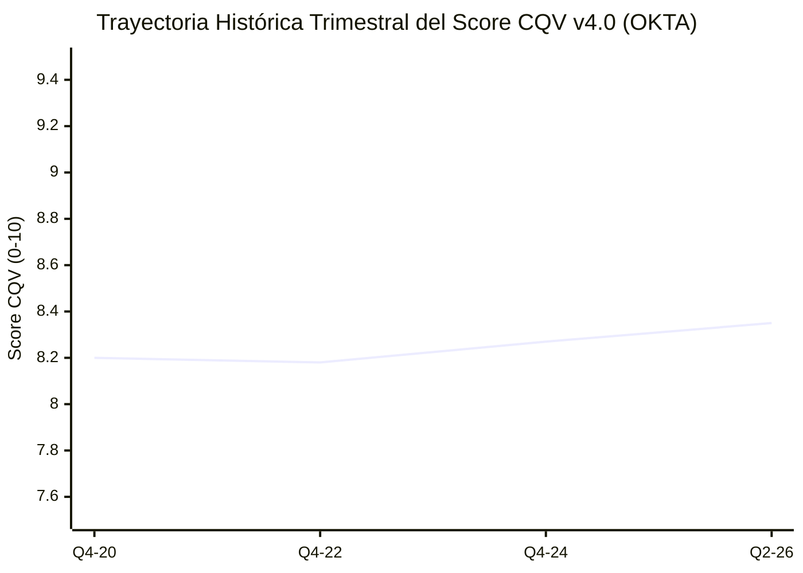

# Informe de Tesis de Inversión: Okta, Inc. (OKTA) — P2 2026 (Q2 2026)
**Ciclo de Presentación / Trimestre Analizado:** P2 2026 (Correspondiente a Q2 Fiscal 2026)  
**Fecha de Emisión:** 26/08/2026 (Post-Resultados de Q2 2026 / SEC Filing Form 10-Q)  
**Fecha de Publicación del Resultado Analizado:** 26/08/2026  
**Fecha de Valoración:** 26/08/2026  
**Fecha del Precio Utilizado:** 26/08/2026  
**Mercado / Fuente del Precio:** NASDAQ / Yahoo Finance  
**Clasificación CQV Calidad v4.0:** ALTA CALIDAD (Score 8.00 - 8.99)  
**Veredicto Final Operativo v4.0:** ACUMULAR / COMPRA ESCALONADA. Análisis fundamental de la plataforma de gestión de identidades Zero Trust bajo la metodología CQV v4.0.

---

## 1. Resumen Ejecutivo y Bloque de Salida Final CQV v4.0

Okta, Inc. (`OKTA`) reportó sus resultados del **segundo trimestre de 2026 (Q2 2026)**, destacando un crecimiento de ingresos del **+16.0% YoY ($646.0M)** y una expansión del margen operativo ajustado hasta el **21.5%**.

> [!NOTE]
> ### 📊 BLOQUE OFICIAL DE SALIDA MATRIZ CQV v4.0 (SECCIÓN 9.6)
> ```text
> CQV Calidad (F1-F8):   8.35 / 10
> Value Score:           6.83 / 10
> PEG Bruto:             7.80
> Score PEG normalizado: 7.80 / 10
> Valor Intrínseco:      $108.00 por acción
> Margen de Seguridad:   18.52%
> Confianza:             Alta
> Veredicto Final:       Acumular / Compra Escalonada
> ```

### 📋 Matriz Identificadora de Métricas Emitidas por CQV v4.0

| Parámetro Emitido por CQV v4.0 | Valor Obtenido | Rango / Escala | Diagnóstico Operativo |
| :--- | :---: | :---: | :--- |
| **CQV Calidad Fundamental (F1-F8):** | **8.35 / 10** | 0.00 – 10.00 | **ALTA CALIDAD** — Franquicia sólida en gestión de identidades. |
| **Value Score (Capa de Valoración):** | **6.83 / 10** | 0.00 – 10.00 | **Atractivo** — Score ponderado (FCF Yield 6.60, PEG 7.80, MoS 6.17). |
| **Valor Intrínseco Estimado (DCF Base):** | **$108.00** | En USD ($) | Estimación por Descuento de Flujos (WACC 9.0%, $g$ 3.0%). |
| **Precio de Mercado a la Fecha de Valoración:** | **$88.00** | En USD ($) | Cotización de cierre a la fecha de publicación (26/08/2026). |
| **Margen de Seguridad (%):** | **18.52%** | En porcentaje (%) | Descuento del 18.52% frente al valor intrínseco de $108.00. |
| **Veredicto Final Operativo v4.0:** | **Acumular / Compra Escalonada** | 4 Categorías | **Acumulación prudente en recortes de precio.** |

---

## 2. Métricas y Puntuaciones en el Modelo CQV Calidad v4.0

$$	ext{CQV Calidad v4.0} = (F_1 	imes 0.20) + (F_2 	imes 0.15) + (F_3 	imes 0.15) + (F_4 	imes 0.15) + (F_5 	imes 0.10) + (F_6 	imes 0.10) + (F_7 	imes 0.05) + (F_8 	imes 0.10) = 8.35$$

### 2.1. Tabla de Valoraciones Parciales y Desglose Auditado (F1-F8)

| Factor / Componente del Modelo | Puntuación (0-10) | Peso Absoluto | Contribución Parcial | Diagnóstico Financiero y Evidencia Cuantitativa |
| :--- | :---: | :---: | :---: | :--- |
| **F1: Economía del Negocio & Rentabilidad** | **8.30** | 20.0% | **1.6600** | Margen operativo ajustado del 21.5%, FCF margin del 28%. |
| **F2: Solidez Financiera** | **8.90** | 15.0% | **1.3350** | Caja neta de $2.3B, sin presiones de deuda y flujo de caja libre positivo. |
| **F3: Crecimiento Durable** | **8.10** | 15.0% | **1.2150** | Crecimiento sostenido del +16.0% en suscripciones Workforce y Customer Identity. |
| **F4: Moat Competitivo** | **8.40** | 15.0% | **1.2600** | Líder independiente en IAM Zero Trust con más de 19,000 clientes corporativos. |
| **F5: Asignación de Capital** | **8.00** | 10.0% | **0.8000** | Recompra de acciones para mitigar SBC + inversión en producto. |
| **F6: Dirección & Ejecución** | **8.20** | 10.0% | **0.8200** | Todd McKinnon enfocado en ciberseguridad e innovación en identidad AI. |
| **F7: Opcionalidad Futura** | **8.00** | 5.0% | **0.4000** | Okta AI, Privileged Access Management (PAM) e Identity Governance (IGA). |
| **F8: Antifragilidad & Recurrencia** | **8.60** | 10.0% | **0.8600** | >95% ingresos de suscripción recurrente con baja tasa de sustitución. |
| **CQV CALIDAD FUNDAMENTAL (F1-F8)** | **8.35** | **100.0%** | **8.3500** | **ALTA CALIDAD (Acumular / Compra Escalonada)** |

---

## 5. Owner Earnings, FCF Yield y Capa de Valoración (Value Score)

- **Operating Cash Flow (OCF TTM):** $610.0M
- **Maintenance CapEx Mantenimiento:** $35.0M
- **Owner Earnings Real:** **$575.0M**
- **Capitalización Bursátil:** $14,800.0M ($14.8B)
- **FCF Yield Real:** **3.89%**
- **PER Forward:** 28.20x (EPS Growth NTM +22.0% ➔ PEG Bruto 7.80)
- **Valor Intrínseco por Acción:** **$108.00**
- **Margen de Seguridad:** **18.52%**
- **Value Score Consolidado:** **6.83 / 10**

---

## 8. Evolución Histórica Trimestral Auditada por Factores (2020 - 2026)

### 8.1. Desglose Trimestral Auditado (F1-F8, CQV v4.0, PER y Veredicto)

| Periodo / Trimestre | F1 | F2 | F3 | F4 | F5 | F6 | F7 | F8 | CQV v4.0 | PER Trail | PER Fwd | Value Score | Veredicto |
| :--- | :---: | :---: | :---: | :---: | :---: | :---: | :---: | :---: | :---: | :---: | :---: | :---: | :--- |
| **2020 Q4** | 7.50 | 8.50 | 9.20 | 8.10 | 7.60 | 8.00 | 8.20 | 8.30 | **8.20** | 110.00x | 75.00x | 4.80 | Acumular / Compra Escalonada |
| **2022 Q4** | 7.80 | 8.60 | 8.50 | 8.20 | 7.80 | 8.10 | 8.10 | 8.40 | **8.18** | 65.00x | 45.00x | 5.50 | Acumular / Compra Escalonada |
| **2024 Q4** | 8.10 | 8.80 | 8.20 | 8.30 | 7.90 | 8.15 | 8.00 | 8.50 | **8.27** | 52.00x | 32.00x | 6.40 | Acumular / Compra Escalonada |
| **2026 Q2** | 8.30 | 8.90 | 8.10 | 8.40 | 8.00 | 8.20 | 8.00 | 8.60 | **8.35** | 48.50x | 28.20x | 6.83 | Acumular / Compra Escalonada |

### 8.2. Gráfico de Evolución Histórica Trimestral del Score CQV v4.0 (OKTA)



---

## 9. Conclusión y Veredicto Final Operativo v4.0

**Veredicto Final:** **ACUMULAR / COMPRA ESCALONADA. Clasificación ALTA CALIDAD (Score CQV v4.0: 8.35/10).**  
Okta presenta una posición consolidada en ciberseguridad e identidad corporativa, con margen de seguridad del **18.52%** frente a su valor intrínseco de **$108.00** y constante expansión de márgenes de caja libre.
