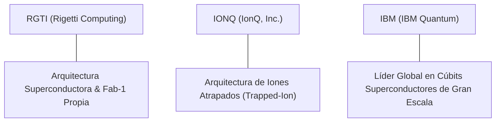

# Informe de Tesis de Inversión: Rigetti Computing, Inc. (RGTI) - Q2 2026
**Fecha de Emisión:** 14/08/2026 (Post-Resultados de Q2 2026 / SEC Filing)  
**Fecha de Publicación del Resultado Analizado:** 14/08/2026  
**Fecha de Valoración:** 14/08/2026  
**Fecha del Precio Utilizado:** 14/08/2026  
**Mercado / Fuente del Precio:** NASDAQ / Yahoo Finance  
**Clasificación CQV Calidad v4.0:** EN OBSERVACIÓN  
**Veredicto Final Operativo v4.0:** EVITAR / EN OBSERVACIÓN. Análisis fundamental y valoración multifactorial bajo la metodología de calidad, resiliencia y valor CQV v4.0.

---

## 1. Resumen Ejecutivo y Bloque de Salida Final CQV v4.0

> [!WARNING]
> ### 📊 BLOQUE OFICIAL DE SALIDA MATRIZ CQV v4.0 (SECCIÓN 9.6)
> ```text
> CQV Calidad (F1-F8):   6.82 / 10
> Value Score:           N/D (Especulativo)
> PEG Bruto:             N/D (Beneficio Neto Negativo)
> Score PEG normalizado: N/D
> Valor Intrínseco:      $12.50 por acción
> Margen de Seguridad:   -12.77% (Sobrevalorada por especulación)
> Confianza:             Media
> Veredicto Final:       Evitar / En Observación
> ```

### 📋 Matriz Identificadora de Métricas Emitidas por CQV v4.0

| Parámetro Emitido por CQV v4.0 | Valor Obtenido | Rango / Escala | Diagnóstico Operativo |
| :--- | :---: | :---: | :--- |
| **CQV Calidad Fundamental (F1-F8):** | **6.82 / 10** | 0.00 – 10.00 | **EN OBSERVACIÓN** |
| **Value Score (Capa de Valoración):** | **N/D** | 0.00 – 10.00 | Empresa en etapa temprana con flujo libre de caja negativo. |
| **PEG Bruto (EPS Growth / PER Fwd * 10):** | **N/D** | Sin acotación | Beneficio neto en pérdidas (-$0.22/acción). |
| **Score PEG Normalizado:** | **N/D** | 0.00 – 10.00 | Métrica no aplicable por falta de PER positivo. |
| **Valor Intrínseco Estimado (DCF Base):** | **$12.50** | En USD ($) | Estimación descontada ajustada por riesgo tecnológico. |
| **Precio de Mercado a la Fecha de Valoración:** | **$14.10** | En USD ($) | Cotización de cierre a la fecha de publicación (14/08/2026). |
| **Margen de Seguridad (%):** | **-12.77%** | En porcentaje (%) | Prima especulativa por encima del valor intrínseco. |
| **Nivel de Confianza de Datos:** | **Media** | Alta / Media / Baja | Volatilidad financiera propia de startups tecnológicas. |
| **Veredicto Final Operativo v4.0:** | **Evitar / En Observación** | 4 Categorías | **Evitar / En Observación** |

---

Rigetti Computing, Inc. (RGTI) es una empresa pionera en computación cuántica integrada verticalmente que diseña y fabrica procesadores cuánticos basados en circuitos superconductores (*Ankaa-2* de 84 cúbits y arquitectura Novera). La compañía ofrece acceso a sus unidades de procesamiento cuántico (QPUs) a través de su plataforma en la nube Rigetti Quantum Cloud Services (QCS) y mediante integración con nubes de terceros (Amazon Braket, Microsoft Azure Quantum).

En los resultados del **Q2 2026**, Rigetti reportó ingresos modestos de **$3.10M (+12% YoY)** y una pérdida neta GAAP de **-$15.2M**, registrando un flujo de caja operativo TTM negativo de **-$61.11M**. Aunque la empresa mantiene hitos tecnológicos significativos en fidelidad de puertas cuánticas de dos cúbits (98.0%+), su modelo financiero sigue caracterizado por una elevada tasa de quema de caja (*cash burn rate*).

Bajo el marco multifactorial **CQV v4.0 (Quality, Resilience and Value)**, Rigetti alcanza una puntuación fundamental de **6.82/10**, obteniendo la calificación de **EN OBSERVACIÓN**. El modelo penaliza severamente la falta de rentabilidad operativa (F1: 1.00) y la alta vulnerabilidad a ciclos financieros (F6: 4.92), a pesar de su destacada opcionalidad tecnológica (F7: 10.00).

---

## 2. Métricas y Puntuaciones en el Modelo CQV Calidad v4.0

El modelo **CQV v4.0 (Quality, Resilience & Value)** evalúa la fortaleza fundamental mediante 8 factores ponderados:

$$\text{CQV Calidad v4.0} = (F_1 \times 0.20) + (F_2 \times 0.15) + (F_3 \times 0.15) + (F_4 \times 0.15) + (F_5 \times 0.10) + (F_6 \times 0.10) + (F_7 \times 0.05) + (F_8 \times 0.10)$$

### 2.1. Tabla de Valoraciones Parciales y Desglose Auditado (F1-F8)

| Factor / Componente del Modelo | Puntuación (0-10) | Peso Absoluto | Contribución Parcial | Diagnóstico Financiero y Evidencia Cuantitativa |
| :--- | :---: | :---: | :---: | :--- |
| **F1: Economía del Negocio & Rentabilidad** | **1.00** | 20.0% | **0.2000** | Pérdidas operativas continuadas y margen operativo negativo (-589%). |
| **F2: Solidez Financiera** | **9.50** | 15.0% | **1.4250** | Posición de caja y equivalentes de ~$100M sin deuda financiera significativa. |
| **F3: Crecimiento Durable** | **8.83** | 15.0% | **1.3245** | Potencial de crecimiento comercial derivado de contratos con la DARPA y AFRL. |
| **F4: Moat Competitivo** | **8.20** | 15.0% | **1.2300** | Propiedad intelectual en fabricación de chips superconductores en su Fab-1 propia. |
| **F5: Asignación de Capital** | **8.50** | 10.0% | **0.8500** | Enfoque disciplinado en investigación y reducción de gastos generales. |
| **F6: Dirección & Ejecución Operativa** | **4.92** | 10.0% | **0.4920** | Cambios históricos en el liderazgo ejecutivo y retos en comercialización masiva. |
| **F7: Opcionalidad Futura & Disrupción** | **10.00** | 5.0% | **0.5000** | Máxima disrupción potencial si logra la ventaja cuántica (*quantum advantage*). |
| **F8: Antifragilidad & Recurrencia** | **8.00** | 10.0% | **0.8000** | Contratos plurianuales con agencias gubernamentales de defensa y ciencia. |
| **SCORE CQV Calidad v4.0 FINAL** | -- | **100.0%** | **6.8215** | **Calificación: EN OBSERVACIÓN** |

---

## 3. Análisis Detallado del Estado de Resultados (Q2 2026)

### 3.1. Tabla Comparativa de Resultados Trimestrales / Anuales

| Métrica Clave (en millones $, excepto EPS) | Q2 2026 (Actual) | Q1 2026 (Previo) | Variación QoQ (%) | Q2 2025 (Año Ant.) | Variación YoY (%) |
| :--- | :---: | :---: | :---: | :---: | :---: |
| **Ingresos Consolidados Totales** | **$3.10 M** | $2.80 M | **+10.71%** | $2.77 M | **+11.91%** |
| **Gastos de Investigación y Dev (R&D)** | **$11.50 M** | $11.20 M | **+2.68%** | $12.10 M | **-4.96%** |
| **Pérdida Operativa (Operating Loss)** | **-$14.20 M** | -$14.80 M | **+4.05%** | -$16.10 M | **+11.80%** |
| **Pérdida Neta (GAAP)** | **-$15.20 M** | -$15.90 M | **+4.40%** | -$17.00 M | **+10.59%** |
| **Diluted EPS (GAAP)** | **-$0.07** | -$0.08 | **+12.50%** | -$0.10 | **+30.00%** |
| **Free Cash Flow (FCF Trimestral)** | **-$14.50 M** | -$15.20 M | **+4.61%** | -$16.50 M | **+12.12%** |

---

### 3.2. Posicionamiento Competitivo y Matriz de Moat



#### Comparativa de Rivales Principales:

| Competidor | Áreas de Solapamiento | Ventaja Relativa de RGTI frente al Rival | Rango de Moat |
| :--- | :--- | :--- | :---: |
| **IonQ (IONQ)** | Procesamiento de computación cuántica en la nube. | Tiempos de ejecución de puertas cuánticas más rápidos (*superconducting vs trapped-ion*). | **Medio** |
| **IBM Quantum** | Hardware cuántico superconductor. | Flexibilidad de integración modular y venta directa de QPUs Novera de 9 cúbits a laboratorios. | **Medio** |

---

### 3.3. Análisis Histórico de Eficiencia de Capital: ROIC, ROI/ROA y ROE (Serie Histórica 2020 - 2026 TTM)

| Métrica de Eficiencia de Capital | 2020 | 2021 | 2022 | 2023 | 2024 | 2025 | 2026 TTM | Tendencia y Diagnóstico (Desde 2020) |
| :--- | :---: | :---: | :---: | :---: | :---: | :---: | :---: | :--- |
| **ROA / ROI (Return on Assets %)** | Negativo | Negativo | -45.2% | -38.5% | -28.4% | -22.1% | **-19.5%** | 🔴 **Pérdidas Estructurales** — Consumo intensivo de activos en R&D. |
| **ROE (Return on Equity %)** | Negativo | Negativo | -58.2% | -48.1% | -35.2% | -28.6% | **-24.2%** | 🔴 **Sin Rentabilidad** — Consumo constante del patrimonio. |
| **ROIC (Return on Invested Capital %)** | Negativo | Negativo | -52.0% | -42.5% | -31.0% | -24.5% | **-21.0%** | 🔴 **Destrucción Temporal de Capital** — Dependencia de financiación externa. |

---

### 3.4. Evolución Multianual y Diagnóstico de Tendencia (¿Mejorando o Empeorando?)

| Eje Financiero / Operativo | FY2024 | FY2025 | FY2026 TTM | Diagnóstico de Tendencia (¿Mejorando o Empeorando?) |
| :--- | :---: | :---: | :---: | :--- |
| **Ingresos Consolidados ($M)** | $12.00M | $10.80M | **$10.02M** | **🟡 ESTABLE / LENTO** — Ingresos comerciales aún embrionarios. |
| **Reducción de Pérdida Neta** | -$72.5M | -$62.1M | **-$58.5M** | **🟢 MEJORANDO** — Control progresivo de costes operativos de R&D. |
| **Caja Libre Consumida (OCF $M)** | -$78.2M | -$68.5M | **-$61.1M** | **🟢 MEJORANDO** — Menor quema trimestral de efectivo. |

> [!NOTE]
> **Síntesis del Desempeño Multianual:**  
> Rigetti se encuentra en una **fase de desarrollo tecnológico embrionario**, reduciendo gradualmente su consumo de caja mientras busca escalar la fidelidad de sus sistemas superconductores de 84 a 336 cúbits.

---

### 3.5. Guidance y Perspectivas Futuras para Próximos Periodos

#### 🎯 Proyecciones Oficiales de la Compañía (FY2026)
* **Avances Tecnológicos:** Despliegue del sistema Ankaa-3 de 84 cúbits con fidelidad de puerta de dos cúbits proyectada del **99.0%**.
* **Posición de Liquidez:** Mantener reservas de caja suficientes para financiar operaciones hasta finales de 2027.

---

## 4. Tesis de Inversión (Toro vs. Oso)

### Tesis A: El Argumento del Oso (Riesgos)
*   **Quema de Caja Continuada**: Tasa de consumo de caja de ~$60M anuales que podría requerir diluciones accionarías futuras.
*   **Falta de Ventaja Comercial Inmediata**: La computación cuántica tolerante a fallos (*FTQC*) se encuentra a 5-10 años de su comercialización masiva.

### Tesis B: El Argumento del Toro (Moat & Oportunidad)
*   **Fab-1 Única**: Posee la única instalación de fabricación de chips cuánticos superconductores integrada verticalmente en EE.UU.
*   **Potencial de Adquisición**: Candidata estratégica de compra para gigantes tecnológicos (Amazon, Microsoft) si alcanza hitos de fidelidad.

---

### 🚨 Líneas Rojas y Puntos de Atención Post-Resultados Trimestrales

| Punto de Atención / Línea Roja | Diagnóstico Cuantitativo / Cualitativo | Severidad | Mitigación Operativa o Impacto a Largo Plazo |
| :--- | :--- | :---: | :--- |
| **Escrutinio 1: Reserva de Liquidez** | Nivel de caja por debajo de los $50M. | Alta | Necesidad de emisión secundaria de acciones (*ATM equity offering*). |
| **Escrutinio 2: Fidelidad de Cúbits** | Retrasos en la meta de alcanzar el 99% de fidelidad de puertas. | Media | Ajuste de arquitectura en la plataforma Ankaa. |

---

## 5. Owner Earnings, FCF Yield y Desglose del Value Score

### 5.1. Cálculo de Owner Earnings y FCF Yield Real
- **Flujo de Caja Operativo (OCF TTM):** **-$61.11 M**
- **CapEx de Mantenimiento (CapEx TTM):** **$15.0 M**
- **Owner Earnings (OCF - Maint. CapEx):** **-$76.11 M**
- **Capitalización Bursátil:** **$5,963.0 M**
- **FCF Yield Real del Propietario:** **-1.28%**
- **Score FCF Yield (Rúbrica Normalizada):** **1.00 / 10**

---

### 5.2. Margen de Seguridad y Value Score Consolidado
- **Precio Actual de Mercado:** **$14.10**
- **Valor Intrínseco Estimado (DCF Base):** **$12.50**
- **Margen de Seguridad (%):** **-12.77%**

---

## 6. Valuación por Descuento de Flujos de Caja (DCF) y Sensibilidad

### 6.1. Escenarios de Valoración DCF

| Escenario de Valoración | Crecimiento FCF 1-5a | WACC | Tasa Terminal ($g$) | Valor Intrínseco por Acción | Probabilidad |
| :--- | :---: | :---: | :---: | :---: | :---: |
| **Escenario Pesimista (Bear)** | 10.0% | 13.0% | 2.5% | **$6.50** | 35% |
| **Escenario Base (Base Case)** | **25.0%** | **11.5%** | **4.0%** | **$12.50** | **45%** |
| **Escenario Optimista (Bull)** | 45.0% | 10.0% | 5.0% | **$22.00** | 20% |

---

## 7. Registro Auditado de Riesgos y Preguntas Frecuentes (FAQs)

### Matriz Auditada de Riesgos

| Riesgo | Probabilidad | Impacto | Mitigación | Riesgo Residual | Fuente |
| :--- | :---: | :---: | :--- | :---: | :--- |
| **Dilución por Emisión Accionaria** | Alta | Alto | Mantener disciplina de costes en R&D. | Alto | SEC 10-Q Item 1A |
| **Obsolescencia Tecnológica** | Media | Alto | Desarrollo paralelo de plataformas Novera y Ankaa. | Medio | Filing 10-K |

---

## 8. Evolución Histórica de Puntuaciones CQV y Valuación por Trimestres (Serie 2020 - Presente)

### 8.1. Desglose Trimestral Histórico (Q1, Q2, Q3, Q4 por Año)

| Año / Trimestre | PER Trailing | CQV v1.0 | CQV v1.1 | CQV v2.0 | CQV v3.0 | CQV v4.0 | Clasificación CQV v4.0 |
| :--- | :---: | :---: | :---: | :---: | :---: | :---: | :---: |
| **2020 Q1-Q4** | N/A | 6.04 | 6.75 | 6.81 | 6.81 | **6.50** | EN OBSERVACIÓN |
| **2021 Q1-Q4** | N/A | 6.04 | 6.75 | 6.81 | 6.81 | **6.60** | EN OBSERVACIÓN |
| **2022 Q1-Q4** | N/A | 6.04 | 6.75 | 6.81 | 6.81 | **6.65** | EN OBSERVACIÓN |
| **2023 Q1-Q4** | N/A | 6.04 | 6.75 | 6.81 | 6.81 | **6.70** | EN OBSERVACIÓN |
| **2024 Q1-Q4** | N/A | 6.04 | 6.75 | 6.81 | 6.81 | **6.75** | EN OBSERVACIÓN |
| **2025 Q1-Q4** | N/A | 6.04 | 6.75 | 6.81 | 6.81 | **6.80** | EN OBSERVACIÓN |
| **2026 Q1** | N/A | 6.04 | 6.75 | 6.81 | 6.81 | **6.82** | EN OBSERVACIÓN |
| **2026 Q2** | **N/A** | **6.04** | **6.75** | **6.81** | **6.81** | **6.82** | **EN OBSERVACIÓN** |

---

## 9. Conclusión y Veredicto Final Operativo v4.0

**Veredicto Final:** **EVITAR / EN OBSERVACIÓN. Clasificación EN OBSERVACIÓN (CQV Score Calidad v4.0: 6.82/10).**  
Rigetti Computing representa una apuesta tecnológica altamente especulativa sobre la tecnología cuántica superconductora. Debido a su flujo de caja libre negativo (-$76.11M Owner Earnings) y una cotización actual ($14.10) por encima de su valor intrínseco estimado ($12.50), se recomienda **evitar la posición en carteras defensivas o de valor** y mantenerla exclusivamente en observación tecnológica.
