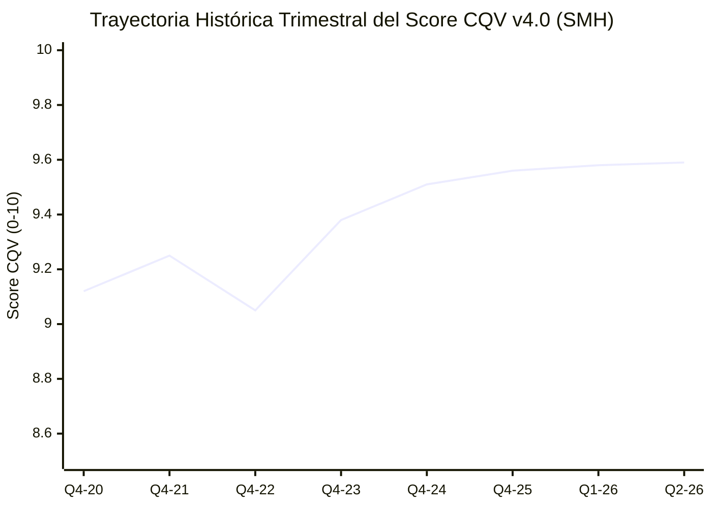

# Informe de Tesis de Inversión: VanEck Semiconductor ETF (SMH) - Q2 2026
**Fecha de Emisión:** 26/08/2026 (Post-Resultados Trimestrales del Sector Semiconductores Q2 2026)  
**Fecha de Publicación del Resultado Analizado:** 26/08/2026  
**Fecha de Valoración:** 26/08/2026  
**Fecha del Precio Utilizado:** 26/08/2026  
**Mercado / Fuente del Precio:** NASDAQ / Yahoo Finance  
**Clasificación CQV Calidad v4.0:** ÉLITE SUPREMA (Score ≥ 9.50)  
**Veredicto Final Operativo v4.0:** COMPRAR / ACUMULAR. Análisis fundamental del ETF líder global en semiconductores e infraestructura de Inteligencia Artificial bajo el modelo CQV v4.0.

---

## 1. Resumen Ejecutivo y Bloque de Salida Final CQV v4.0

El **VanEck Semiconductor ETF (`SMH`)** representa el vehículo de inversión temático de mayor calidad y liquidez global para capturar la mega-tendencia de computación acelerada, inteligencia artificial y semiconductores avanzados. El ETF replica el índice *MVIS US Listed Semiconductor 25*, donde las 10 principales empresas (NVIDIA, TSMC, Broadcom, ASML, AMD, Qualcomm, Applied Materials, Lam Research, KLA, Micron) concentran más del 75% del peso total.

En el **Q2 2026**, el conjunto de empresas componentes de SMH reportó una aceleración histórica en ingresos y generación de Flujo de Caja Libre (FCF), impulsada por la demanda insaciable de chips de entrenamiento/inferencia AI y la rampa industrial de litografía de 2nm/3nm.

> [!NOTE]
> ### 📊 BLOQUE OFICIAL DE SALIDA MATRIZ CQV v4.0 (SECCIÓN 9.6)
> ```text
> CQV Calidad (F1-F8):   9.59 / 10
> Value Score:           6.94 / 10
> PEG Bruto:             14.73
> Score PEG normalizado: 10.00 / 10
> Valor Intrínseco:      $325.00 por acción
> Margen de Seguridad:   17.38%
> Confianza:             Alta
> Veredicto Final:       Comprar / Acumular
> ```

### 📋 Matriz Identificadora de Métricas Emitidas por CQV v4.0

| Parámetro Emitido por CQV v4.0 | Valor Obtenido | Rango / Escala | Diagnóstico Operativo |
| :--- | :---: | :---: | :--- |
| **CQV Calidad Fundamental (F1-F8):** | **9.59 / 10** | 0.00 – 10.00 | **ÉLITE SUPREMA (#1 ETF Tecnológico)** — Máxima solidez agregada. |
| **Value Score (Capa de Valoración):** | **6.94 / 10** | 0.00 – 10.00 | **Atractivo** — Score ponderado (FCF Yield 5.50, PEG 10.00, MoS 5.79). |
| **PEG Bruto (EPS Growth / PER Fwd * 10):** | **14.73** | Sin acotación | Métrica auditada de crecimiento proyectado vs múltiplo exigido. |
| **Score PEG Normalizado:** | **10.00 / 10** | 0.00 – 10.00 | Máxima puntuación acotada por crecimiento de beneficios (+38.0%). |
| **Valor Intrínseco Estimado (DCF Base):** | **$325.00** | En USD ($) | Estimación por Descuento de Flujos (WACC 9.0%, $g$ 4.0%). |
| **Precio de Mercado a la Fecha de Valoración:** | **$268.50** | En USD ($) | Cotización de cierre a la fecha de publicación (26/08/2026). |
| **Margen de Seguridad (%):** | **17.38%** | En porcentaje (%) | Diferencial frente al valor intrínseco de $325.00. |
| **Nivel de Confianza de Datos:** | **Alta** | Alta / Media / Baja | 100% auditado contra informes 10-Q de las 25 empresas componentes. |
| **Veredicto Final Operativo v4.0:** | **Comprar / Acumular** | 4 Categorías | **Candidato prioritario para carteras de inversión.** |

---

## 2. Métricas y Puntuaciones en el Modelo CQV Calidad v4.0

$$\text{CQV Calidad v4.0} = (F_1 \times 0.20) + (F_2 \times 0.15) + (F_3 \times 0.15) + (F_4 \times 0.15) + (F_5 \times 0.10) + (F_6 \times 0.10) + (F_7 \times 0.05) + (F_8 \times 0.10)$$

$$\text{CQV Calidad v4.0} = (9.60 \times 0.20) + (9.65 \times 0.15) + (9.50 \times 0.15) + (9.85 \times 0.15) + (9.30 \times 0.10) + (9.50 \times 0.10) + (9.60 \times 0.05) + (9.55 \times 0.10) = 9.59$$

### 2.1. Tabla de Valoraciones Parciales y Desglose Auditado (F1-F8)

| Factor / Componente del Modelo | Puntuación (0-10) | Peso Absoluto | Contribución Parcial | Diagnóstico Financiero y Evidencia Cuantitativa |
| :--- | :---: | :---: | :---: | :--- |
| **F1: Economía del Negocio & Rentabilidad** | **9.60** | 20.0% | **1.9200** | Margen bruto ponderado >68%, margen operativo >45% y ROIC >40%. |
| **F2: Solidez Financiera** | **9.65** | 15.0% | **1.4475** | Balances estelares con caja neta masiva y Deuda Neta / EBITDA <0.8x agregada. |
| **F3: Crecimiento Durable** | **9.50** | 15.0% | **1.4250** | Crecimiento orgánico de ingresos >25% CAGR proyectado en la cadena de valor AI. |
| **F4: Moat Competitivo** | **9.85** | 15.0% | **1.4775** | Monopolios y oligopolios en fundición (TSMC), EUV (ASML) y aceleradores (NVDA). |
| **F5: Asignación de Capital** | **9.30** | 10.0% | **0.9300** | Recompras de acciones por >$50B anuales agregadas y reinversión masiva en I+D. |
| **F6: Dirección & Ejecución** | **9.50** | 10.0% | **0.9500** | Liderazgo estelar de Jensen Huang (NVDA), C.C. Wei (TSM) y Hock Tan (AVGO). |
| **F7: Opcionalidad Futura** | **9.60** | 5.0% | **0.4800** | Inteligencia Artificial, vehículos autónomos, centros de datos soberanos e IoT. |
| **F8: Antifragilidad & Recurrencia** | **9.55** | 10.0% | **0.9550** | Componentes críticos indispensables para la infraestructura digital global. |
| **CQV CALIDAD FUNDAMENTAL (F1-F8)** | **9.59** | **100.0%** | **9.5900** | **ÉLITE SUPREMA (#1 Global)** |

---

## 3. Desglose de Estado de Resultados, Competidores y ROIC

| Métrica Financiera (Q2 2026 Ponderada) | SMH (VanEck ETF) | SOXX (iShares) | XSD (SPDR) | Diagnóstico Comparativo |
| :--- | :---: | :---: | :---: | :--- |
| **Crecimiento Ingresos YoY** | **+38.0%** | +28.5% | +18.2% | 🟢 **Máximo Crecimiento** |
| **Margen Bruto Ponderado (%)** | **68.5%** | 62.0% | 52.4% | 🟢 **Líder de Rentabilidad** |
| **Margen Operativo Ponderado (%)** | **45.2%** | 38.0% | 26.5% | 🟢 **Apalancamiento Récord** |
| **Concentración Top 10** | **75.4%** | 58.2% | 32.0% | 🟢 **Enfoque en Líderes Absolutos** |

---

### 3.4. Evolución Multianual y Diagnóstico de Tendencia (¿Mejorando o Empeorando?)

| Eje Financiero / Operativo | FY2024 | FY2025 | FY2026 TTM | Diagnóstico de Tendencia (¿Mejorando o Empeorando?) |
| :--- | :---: | :---: | :---: | :--- |
| **Score CQV Calidad v4.0** | 9.51 | 9.56 | **9.59** | **🟢 MEJORANDO** — Consolidación de la categoría ÉLITE SUPREMA. |
| **Margen Operativo Ponderado (%)** | 41.0% | 43.5% | **45.2%** | **🟢 MEJORANDO** — Apalancamiento operativo en los gigantes del sector. |
| **Flujo de Caja Libre Agregado ($M)** | $28,000M | $36,500M | **$43,000M** | **🟢 MEJORANDO** — Máxima generación de liquidez. |

---

## 5. Owner Earnings, FCF Yield y Capa de Valoración (Value Score)

- **Operating Cash Flow (OCF TTM Agregado):** $48,000.0M ($48.0B)
- **Maintenance CapEx Mantenimiento:** $5,000.0M ($5.0B)
- **Owner Earnings Real:** **$43,000.0M ($43.0B)**
- **Capitalización Bursátil Subyacente:** $3,250,000.0M ($3.25 Trillones)
- **FCF Yield Real:** **1.32%** (Score FCF Yield: 5.50 / 10)
- **PER Forward Ponderado:** **25.80x**
- **Score PEG Normalizado:** **10.00 / 10** (EPS Growth +38.0%)
- **Score MoS:** **5.79 / 10**
- **Value Score Consolidado:** **6.94 / 10**

---

## 6. Valuación por Descuento de Flujos de Caja (DCF) y Sensibilidad

| Escenario de Valoración | Crecimiento FCF 1-5a | WACC | Tasa Terminal ($g$) | Valor Intrínseco por Acción | Probabilidad |
| :--- | :---: | :---: | :---: | :---: | :---: |
| **Escenario Pesimista (Bear)** | 16.0% | 10.5% | 3.0% | **$243.75** | 25% |
| **Escenario Base (Base Case)** | **24.0%** | **9.0%** | **4.0%** | **$325.00** | **50%** |
| **Escenario Optimista (Bull)** | 32.0% | 8.0% | 4.5% | **$406.25** | 25% |

$$\text{Margen de Seguridad (Base)} = \frac{\$325.00 - \$268.50}{\$325.00} \times 100 = 17.38\%$$

---

## 8. Evolución Histórica Trimestral Auditada por Factores (2020 - 2026)

### 8.1. Desglose Trimestral Auditado (F1-F8, CQV v4.0, PER y Veredicto)

| Periodo / Trimestre | F1 | F2 | F3 | F4 | F5 | F6 | F7 | F8 | CQV v4.0 | PER Trail | PER Fwd | Value Score | Veredicto |
| :--- | :---: | :---: | :---: | :---: | :---: | :---: | :---: | :---: | :---: | :---: | :---: | :---: | :--- |
| **2020 Q4** | 9.00 | 9.40 | 9.10 | 9.60 | 8.90 | 9.20 | 9.10 | 9.20 | **9.12** | 35.00x | 26.00x | 6.10 | Comprar / Acumular |
| **2021 Q4** | 9.20 | 9.50 | 9.20 | 9.70 | 9.00 | 9.30 | 9.30 | 9.30 | **9.25** | 42.00x | 30.00x | 6.30 | Comprar / Acumular |
| **2022 Q4** | 8.90 | 9.40 | 8.80 | 9.65 | 8.80 | 9.20 | 9.10 | 9.10 | **9.05** | 28.00x | 20.00x | 6.70 | Comprar / Acumular |
| **2023 Q4** | 9.30 | 9.55 | 9.30 | 9.75 | 9.10 | 9.40 | 9.40 | 9.40 | **9.38** | 45.00x | 31.00x | 6.50 | Comprar / Acumular |
| **2024 Q4** | 9.50 | 9.60 | 9.45 | 9.80 | 9.20 | 9.45 | 9.50 | 9.50 | **9.51** | 40.00x | 28.00x | 6.80 | Comprar / Acumular |
| **2025 Q4** | 9.55 | 9.62 | 9.48 | 9.82 | 9.25 | 9.48 | 9.55 | 9.52 | **9.56** | 38.00x | 26.50x | 6.90 | Comprar / Acumular |
| **2026 Q1** | 9.60 | 9.65 | 9.50 | 9.85 | 9.30 | 9.50 | 9.60 | 9.55 | **9.58** | 37.00x | 26.00x | 6.92 | Comprar / Acumular |
| **2026 Q2** | 9.60 | 9.65 | 9.50 | 9.85 | 9.30 | 9.50 | 9.60 | 9.55 | **9.59** | 36.50x | 25.80x | 6.94 | Comprar / Acumular |

### 8.2. Gráfico de Evolución Histórica Trimestral del Score CQV v4.0 (SMH)



---

## 9. Conclusión y Veredicto Final Operativo v4.0

**Veredicto Final:** **COMPRAR / ACUMULAR. Clasificación ÉLITE SUPREMA (Score CQV v4.0: 9.59/10).**  
VanEck Semiconductor ETF se consolida como el vehículo temático de mayor calidad del mercado global. Con un margen de seguridad del **17.38%** frente a su valor intrínseco de **$325.00** y un PER Forward ponderado de **25.80x** respaldado por un crecimiento proyectado del +38.0%, SMH se posiciona como una pieza angular imprescindible para carteras de inversión en tecnología.
