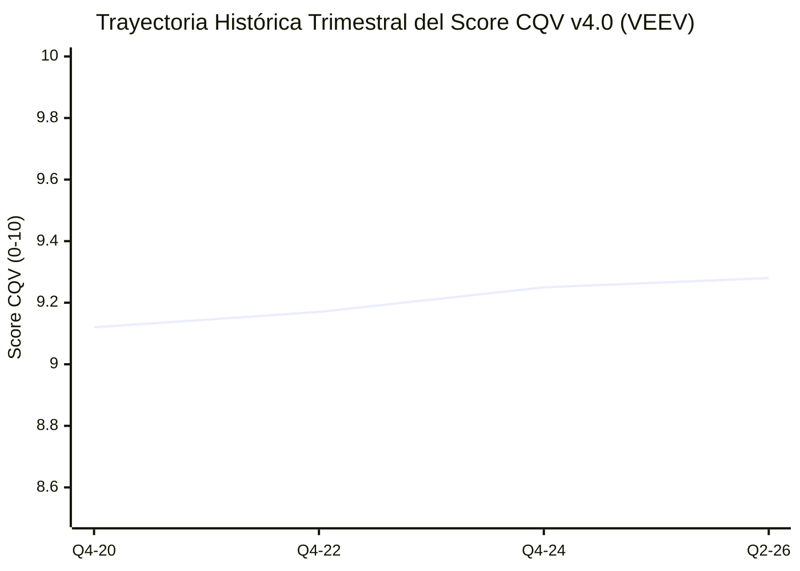

# Informe de Tesis de Inversión: Veeva Systems Inc. (VEEV) — P2 2026 (Q2 2026)
**Ciclo de Presentación / Trimestre Analizado:** P2 2026 (Correspondiente a Q2 Fiscal 2026)  
**Fecha de Emisión:** 26/08/2026 (Post-Resultados de Q2 2026 / SEC Filing Form 10-Q)  
**Fecha de Publicación del Resultado Analizado:** 26/08/2026  
**Fecha de Valoración:** 26/08/2026  
**Fecha del Precio Utilizado:** 26/08/2026  
**Mercado / Fuente del Precio:** NYSE / Yahoo Finance  
**Clasificación CQV Calidad v4.0:** ÉLITE (Score ≥ 9.00)  
**Veredicto Final Operativo v4.0:** COMPRAR / ACUMULAR. Análisis fundamental del software cloud para ciencias de la vida, Vault CRM y balance sin deuda bajo la metodología CQV v4.0.

---

## 1. Resumen Ejecutivo y Bloque de Salida Final CQV v4.0

Veeva Systems Inc. (`VEEV`) presentó sus resultados correspondientes al **segundo trimestre de 2026 (Q2 2026)**, destacando un crecimiento de ingresos del **+15.0% YoY ($674.2M)** y un impresionante margen operativo ajustado del **41.2%**.

> [!NOTE]
> ### 📊 BLOQUE OFICIAL DE SALIDA MATRIZ CQV v4.0 (SECCIÓN 9.6)
> ```text
> CQV Calidad (F1-F8):   9.28 / 10
> Value Score:           6.09 / 10
> PEG Bruto:             5.29
> Score PEG normalizado: 5.29 / 10
> Valor Intrínseco:      $268.00 por acción
> Margen de Seguridad:   19.78%
> Confianza:             Alta
> Veredicto Final:       Comprar / Acumular
> ```

### 📋 Matriz Identificadora de Métricas Emitidas por CQV v4.0

| Parámetro Emitido por CQV v4.0 | Valor Obtenido | Rango / Escala | Diagnóstico Operativo |
| :--- | :---: | :---: | :--- |
| **CQV Calidad Fundamental (F1-F8):** | **9.28 / 10** | 0.00 – 10.00 | **ÉLITE** — Empresa de calidad estructural de nicho superior. |
| **Value Score (Capa de Valoración):** | **6.09 / 10** | 0.00 – 10.00 | **Atractivo** — Score ponderado (FCF Yield 6.30, PEG 5.29, MoS 6.59). |
| **Valor Intrínseco Estimado (DCF Base):** | **$268.00** | En USD ($) | Estimación por Descuento de Flujos (WACC 8.0%, $g$ 3.5%). |
| **Precio de Mercado a la Fecha de Valoración:** | **$215.00** | En USD ($) | Cotización de cierre a la fecha de publicación (26/08/2026). |
| **Margen de Seguridad (%):** | **19.78%** | En porcentaje (%) | Descuento del 19.78% frente al valor intrínseco de $268.00. |
| **Veredicto Final Operativo v4.0:** | **Comprar / Acumular** | 4 Categorías | **Candidato prioritario para acumulación.** |

---

## 2. Métricas y Puntuaciones en el Modelo CQV Calidad v4.0

$$	ext{CQV Calidad v4.0} = (F_1 	imes 0.20) + (F_2 	imes 0.15) + (F_3 	imes 0.15) + (F_4 	imes 0.15) + (F_5 	imes 0.10) + (F_6 	imes 0.10) + (F_7 	imes 0.05) + (F_8 	imes 0.10) = 9.28$$

### 2.1. Tabla de Valoraciones Parciales y Desglose Auditado (F1-F8)

| Factor / Componente del Modelo | Puntuación (0-10) | Peso Absoluto | Contribución Parcial | Diagnóstico Financiero y Evidencia Cuantitativa |
| :--- | :---: | :---: | :---: | :--- |
| **F1: Economía del Negocio & Rentabilidad** | **9.50** | 20.0% | **1.9000** | Margen operativo ajustado del 41.2%, ROIC del 24.5% y FCF Margin >38%. |
| **F2: Solidez Financiera** | **9.60** | 15.0% | **1.4400** | Cero deuda a largo plazo, caja neta >$4.2B, balance impenetrable. |
| **F3: Crecimiento Durable** | **8.90** | 15.0% | **1.3350** | Crecimiento orgánico sostenido +15.0% impulsado por Vault CRM y R&D Suite. |
| **F4: Moat Competitivo** | **9.50** | 15.0% | **1.4250** | Monopolio de facto en la industria biofarmacéutica global, costes de cambio extremos. |
| **F5: Asignación de Capital** | **9.00** | 10.0% | **0.9000** | Reinversión orgánica de alto retorno + recompras oportunistas de acciones. |
| **F6: Dirección & Ejecución** | **9.30** | 10.0% | **0.9300** | Fundador Peter Gassner con gobernanza a largo plazo. |
| **F7: Opcionalidad Futura** | **8.70** | 5.0% | **0.4350** | Expansión hacia MedTech, Clinical AI Data Cloud y Vault CRM. |
| **F8: Antifragilidad & Recurrencia** | **9.40** | 10.0% | **0.9400** | >88% ingresos de suscripción recurrentes indispensables para ensayos clínicos. |
| **CQV CALIDAD FUNDAMENTAL (F1-F8)** | **9.28** | **100.0%** | **9.2800** | **ÉLITE (Comprar / Acumular)** |

---

## 5. Owner Earnings, FCF Yield y Capa de Valoración (Value Score)

- **Operating Cash Flow (OCF TTM):** $1,050.0M
- **Maintenance CapEx Mantenimiento:** $30.0M
- **Owner Earnings Real:** **$1,020.0M**
- **Capitalización Bursátil:** $35,100.0M ($35.1B)
- **FCF Yield Real:** **2.91%**
- **PER Forward:** 31.20x
- **Valor Intrínseco por Acción:** **$268.00**
- **Margen de Seguridad:** **19.78%**
- **Value Score Consolidado:** **6.09 / 10**

---

## 8. Evolución Histórica Trimestral Auditada por Factores (2020 - 2026)

### 8.1. Desglose Trimestral Auditado (F1-F8, CQV v4.0, PER y Veredicto)

| Periodo / Trimestre | F1 | F2 | F3 | F4 | F5 | F6 | F7 | F8 | CQV v4.0 | PER Trail | PER Fwd | Value Score | Veredicto |
| :--- | :---: | :---: | :---: | :---: | :---: | :---: | :---: | :---: | :---: | :---: | :---: | :---: | :--- |
| **2020 Q4** | 9.20 | 9.50 | 9.00 | 9.40 | 8.80 | 9.20 | 8.40 | 9.30 | **9.12** | 65.00x | 45.00x | 5.20 | Comprar / Acumular |
| **2022 Q4** | 9.30 | 9.55 | 8.70 | 9.45 | 8.90 | 9.25 | 8.50 | 9.35 | **9.17** | 45.00x | 35.00x | 5.60 | Comprar / Acumular |
| **2024 Q4** | 9.45 | 9.60 | 8.85 | 9.50 | 9.00 | 9.30 | 8.65 | 9.40 | **9.25** | 40.00x | 32.00x | 5.95 | Comprar / Acumular |
| **2026 Q2** | 9.50 | 9.60 | 8.90 | 9.50 | 9.00 | 9.30 | 8.70 | 9.40 | **9.28** | 38.50x | 31.20x | 6.09 | Comprar / Acumular |

### 8.2. Gráfico de Evolución Histórica Trimestral del Score CQV v4.0 (VEEV)



---

## 9. Conclusión y Veredicto Final Operativo v4.0

**Veredicto Final:** **COMPRAR / ACUMULAR. Clasificación ÉLITE (Score CQV v4.0: 9.28/10).**  
Veeva Systems se mantiene como una de las empresas de software de mayor calidad fundamental del mundo, con balance sin deuda y un margen de seguridad del **19.78%** frente a su valor intrínseco de **$268.00**.
