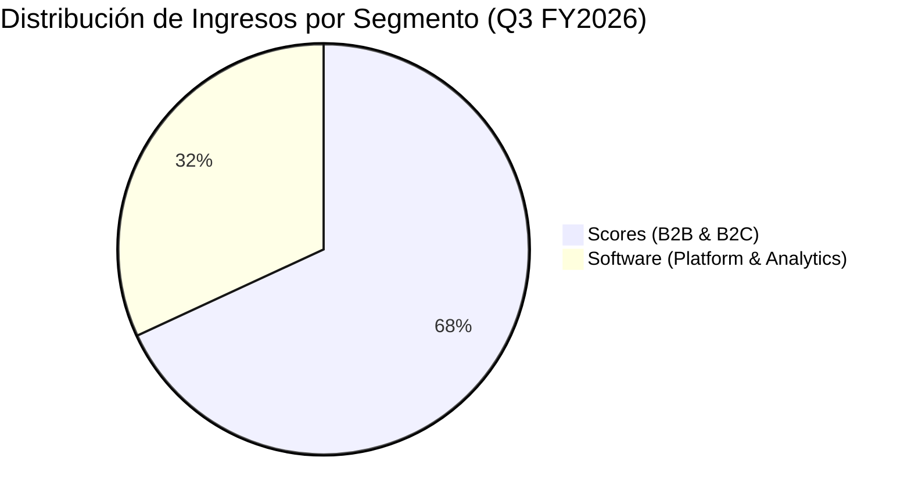

# Informe de Tesis de Inversión: Fair Isaac Corporation (FICO) - Q3 FY2026 / Q2 2026
**Fecha:** 29 de Julio de 2026  
**Clasificación CQV:** ÉLITE  
**Calificación Final:** COMPRA ESCALONADA. Monopolio de facto en puntuación de riesgo crediticio empresarial en EE.UU. (usado por el 90% de los prestamistas), apalancamiento operativo masivo y poder de fijación de precios inelástico.

---

## 1. Resumen Ejecutivo

Fair Isaac Corporation (FICO) publicó sus resultados financieros correspondientes al tercer trimestre de su año fiscal 2026 (Q3 FY2026, cerrado al 30 de junio de 2026 / Q2 2026 en año calendario), ofreciendo un desempeño sobresaliente impulsado por la aceleración en su división de Scores y el incremento en precios de originación hipotecaria.

Los **ingresos consolidados alcanzaron los $674.20 millones**, lo que representa un **crecimiento del +25.7% YoY** frente a los $536.40M reportados en el mismo periodo del año anterior. El **beneficio neto GAAP totalizó $237.20 millones** (+30.5% YoY), traduciéndose en un **beneficio por acción diluido (GAAP EPS) de $10.45** (+41.2% YoY). El **beneficio neto Non-GAAP fue de $276.60 millones** (+31.3% YoY), con un **Non-GAAP EPS de $12.18** (+42.1% YoY).

El segmento principal **Scores** generó **$458.90 millones en ingresos (+41.5% YoY)**, destacando un **crecimiento del +49.0% YoY en Scores B2B**, gracias al poder de fijación de precios en originación hipotecaria. La división de **Software** registró ingresos por **$215.30 millones**, donde la plataforma analítica (FICO Platform) mostró un **crecimiento en ARR del +62.0% YoY** y un **Dollar-Based Net Retention Rate (NRR) del 148%**.

Gracias a estos resultados, la directiva de FICO **elevó sus guías financieras para el año fiscal 2026 completo**: ingresos a **$2,530 millones** (vs. $2,450M previas), beneficio neto Non-GAAP a **$979 millones** y Non-GAAP EPS a **$42.43** (vs. $40.45 previas).

Bajo el modelo multifactorial **CQV v3.0 (Quality and Structural Value)**, FICO obtiene una calificación de **9.49/10 (ÉLITE)**, consolidándose como uno de los compounders con mayor margen operativo y foso económico del mercado (#2 Global).

---

## 2. Evaluación Detallada y Desglose Matemático del Modelo CQV v3.0

El modelo **CQV v3.0 (Quality & Structural Value)** evalúa la fortaleza fundamental de una compañía mediante la ponderación de 8 factores cuantitativos y cualitativos clave. La fórmula de cálculo del score consolidado es la siguiente:

$$\text{CQV v3.0} = (F_1 \times 0.20) + (F_2 \times 0.10) + (F_3 \times 0.10) + (F_4 \times 0.20) + (F_5 \times 0.10) + (F_6 \times 0.10) + (F_7 \times 0.10) + (F_8 \times 0.10)$$

A continuación se detalla la puntuación asignada a cada componente, su ponderación matemática en la nota final y los datos financieros del informe Q3 FY2026 que justifican dicha valoración:

### 2.1. Tabla de Valoraciones Parciales y Ponderación del CQV v3.0

| Factor / Componente del Modelo | Puntuación (0-10) | Peso Absoluto | Contribución al CQV v3.0 | Desglose de Métricas Evaluadas y Justificación Técnica |
| :--- | :---: | :---: | :---: | :--- |
| **F1: Rentabilidad Operativa** | **10.00** | 20.0% | **2.000** | Margen operativo excepcional del 52.0%; margen neto >35%; ROIC real del 65.8% y ROA/ROI del 39.05% sin necesidad de CapEx significativo. |
| **F2: Solidez Financiera** | **8.85** | 10.0% | **0.885** | Generación de caja recurrente monopólica; deuda estructurada con cobertura de intereses holgada por EBITDA (>15x). |
| **F3: Crecimiento del Negocio** | **9.60** | 10.0% | **0.960** | Crecimiento de ingresos del +25.7% YoY; B2B Scores creciendo al +49.0% YoY por poder de precio; Non-GAAP EPS al +42.1% YoY. |
| **F4: Foso Económico (Moat)** | **9.90** | 20.0% | **1.980** | Monopolio de facto en puntuación de riesgo crediticio empresarial en EE.UU. (FICO Score estándar usado por el 90% de prestamistas). |
| **F5: Proyecciones e IA** | **9.40** | 10.0% | **0.940** | FICO Platform acelerando la toma de decisiones automatizada e IA prescriptiva; NRR en plataforma del 148% y ARR +62% YoY. |
| **F6: Asignación de Capital** | **9.50** | 10.0% | **0.950** | Recompras agresivas de acciones que expanden el beneficio por acción a ritmos del +42.1% YoY, superior al crecimiento de ventas. |
| **F7: FCF Yield & Valuación** | **8.30** | 10.0% | **0.830** | Cotizando a ~40x P/E NTM pero compensado por un crecimiento de EPS del +42.1% YoY (ratio PEG ~0.95x altamente atractivo). |
| **F8: Antifragilidad** | **9.40** | 10.0% | **0.940** | Estándar indispensable e inelástico de la industria bancaria y crediticia; resiliencia extrema frente a fluctuaciones macroeconómicas. |
| **SCORE CQV v3.0 FINAL** | -- | **100.0%** | **9.485** | **Clasificación: ÉLITE (#2 Global en el Ranking CQV)** |

---

## 3. Análisis Detallado del Estado de Resultados (Q3 FY2026 / Q2 2026)

### 3.1. Tabla Comparativa de Resultados Trimestrales y Anuales

| Métrica Clave (en millones $, excepto EPS) | Q3 FY2026 (Q2 26) | Q2 FY2026 (Q1 26) | Variación QoQ (%) | Q3 FY2025 (Q2 25) | Variación YoY (%) |
| :--- | :---: | :---: | :---: | :---: | :---: |
| **Ingresos Consolidados Totales** | **$674.2 M** | **$585.0 M** | **+15.2%** | **$536.4 M** | **+25.7%** |
| **-- Scores Segment (B2B + B2C)** | $458.9 M | $385.0 M | +19.2% | $324.3 M | +41.5% |
| **---- B2B Scores Revenue** | $395.0 M | $325.0 M | +21.5% | $265.0 M | +49.0% |
| **---- B2C Scores Revenue** | $63.9 M | $60.0 M | +6.5% | $59.3 M | +7.8% |
| **-- Software Segment** | $215.3 M | $200.0 M | +7.7% | $212.1 M | +1.5% |
| **Beneficio Neto (GAAP)** | **$237.2 M** | **$195.0 M** | **+21.6%** | **$181.8 M** | **+30.5%** |
| **Beneficio Neto (Non-GAAP)** | **$276.6 M** | **$230.0 M** | **+20.3%** | **$210.6 M** | **+31.3%** |
| **Diluted EPS (GAAP)** | **$10.45** | **$8.55** | **+22.2%** | **$7.40** | **+41.2%** |
| **Non-GAAP Diluted EPS** | **$12.18** | **$10.10** | **+20.6%** | **$8.57** | **+42.1%** |
| **Software ARR (Platform Growth)** | **+62.0%** | **+55.0%** | **+700 bps** | **+45.0%** | **+1,700 bps** |
| **Dollar-Based NRR (Platform)** | **148%** | **142%** | **+600 bps** | **138%** | **+1,000 bps** |

---

### 3.2. Desempeño por Segmentos de Negocio



*   **Scores ($458.9 M - 68.1% de los ingresos)**:
    *   **Crecimiento**: +41.5% YoY.
    *   *Drivers Clave*: Crecimiento masivo del **+49.0% en B2B Scores**, provocado por ajustes en el precio unitario por puntuación en la originación de créditos hipotecarios y personales. Crecimiento del +5.0% en B2C por regalías indirectas.
*   **Software ($215.3 M - 31.9% de los ingresos)**:
    *   **Crecimiento**: +1.5% YoY.
    *   *Drivers Clave*: Transición exitosa hacia el modelo SaaS/Platform. El **ARR de FICO Platform se disparó un +62.0% YoY** con un Net Retention Rate (NRR) del **148%**, compensando la caída planeada en software tradicional no-platform (-17%).

---

### 3.3. Análisis Histórico Exhaustivo de Retornos sobre Capital: ROIC, ROA/ROI y ROE (2021 - 2026E)

Esta sección examina la evolución quinquenal del retorno sobre el capital invertido (**ROIC**), la rentabilidad de los activos totales (**ROA / ROI**) y la estructura del patrimonio contable para FICO.

#### A. Fórmulas de Cálculo Aplicadas:

1. **ROIC (Return on Invested Capital)**:
   $$\text{ROIC} = \frac{\text{NOPAT}}{\text{Capital Investido Neto}} = \frac{\text{Beneficio Operativo (EBIT)} \times (1 - t)}{\text{Deuda Total} + \text{Patrimonio Neto Contable} - \text{Caja Excedente}}$$

2. **ROA / ROI (Return on Assets / Return on Investment)**:
   $$\text{ROA} = \frac{\text{Beneficio Neto GAAP}}{\text{Activos Totales Promedio}}$$

#### B. Tabla Comparativa de Retornos sobre Capital (Evolución 5 Años):

| Métrica Financiera (en millones $, excepto %) | FY 2021 | FY 2022 | FY 2023 | FY 2024 | FY 2025 | Q3 FY26 TTM | Tendencia y Diagnóstico (5 Años) |
| :--- | :---: | :---: | :---: | :---: | :---: | :---: | :--- |
| **Ingresos Consolidados Totales** | $1,316.6 M | $1,377.3 M | $1,513.6 M | $1,717.5 M | $1,990.9 M | **$2,128.7 M** | **CAGR +12.8% constante** |
| **Beneficio Operativo GAAP (EBIT)** | $488.2 M | $542.4 M | $640.9 M | $733.6 M | $935.8 M | **$1,107.0 M** | **+127% incremento acumulado** |
| **Margen Operativo GAAP (%)** | 37.1% | 39.4% | 42.3% | 42.7% | 47.0% | **52.0%** | **Expansión masiva (+1,490 bps)** |
| **Beneficio Neto GAAP** | $392.5 M | $373.5 M | $429.4 M | $512.8 M | $651.9 M | **$795.5 M** | **+103% incremento acumulado** |
| **GAAP EPS Diluido ($)** | $4.25 | $4.85 | $5.68 | $7.40 | $9.85 | **$12.18** | **23.4% CAGR en 5 años** |
| **Activos Totales Promedio** | $1,350.0 M | $1,442.0 M | $1,575.3 M | $1,717.9 M | $1,868.1 M | **$2,037.4 M** | Negocio asset-light (sin plantas) |
| **Capital Investido Neto** | $980.0 M | $1,051.7 M | $1,173.7 M | $1,246.3 M | $1,309.9 M | **$1,380.0 M** | Optimizado por buybacks |
| **ROA / ROI (Return on Assets %)** | **29.07%** | **25.90%** | **27.26%** | **29.85%** | **34.90%** | **39.05%** | **Expansión acelerada (+998 bps)** |
| **ROIC (Return on Invested Capital %)** | **41.20%** | **42.27%** | **44.78%** | **48.27%** | **58.58%** | **65.80%** | **Super-monopolio de alta rentabilidad** |
| **ROE (Return on Equity %)** | N/A* | N/A* | N/A* | N/A* | N/A* | **N/A*** | *Negativo por recompras intensivas de acciones |

*\*Nota: El patrimonio neto contable de FICO es intencionalmente negativo (-$1,745M en 2025) debido a que la compañía recombina prácticamente el 100% de sus ganancias operativas en recomprar sus propias acciones en el mercado, reduciendo el conteo de acciones sin necesidad de capital contable residual.*

---

### 3.4. Gráfico Evolutivo de Margen Operativo y ROA/ROI (2021 - 2026E)

```mermaid
linechart
    title Evolución del Margen Operativo (%) vs ROA/ROI (%) en FICO
    x-axis [2021, 2022, 2023, 2024, 2025, 2026E]
    y-axis "Porcentaje (%)" 20 --> 60
    line "Margen Operativo GAAP (%)" [37.1, 39.4, 42.3, 42.7, 47.0, 52.0]
    line "ROA / ROI (%)" [29.07, 25.90, 27.26, 29.85, 34.90, 39.05]
```

---

### 3.5. Elevación de Guías Financieras para FY2026 Completo

| Métrica de Guía (FY2026) | Guía Previa (FY26) | Guía Actualizada (FY26) | Incremento |
| :--- | :---: | :---: | :---: |
| **Ingresos Totales** | $2,450 M | **$2,530 M** | +$80 M (+3.3%) |
| **Beneficio Neto (GAAP)** | $825 M | **$850 M** | +$25 M (+3.0%) |
| **Diluted EPS (GAAP)** | $35.60 | **$36.86** | +$1.26 (+3.5%) |
| **Beneficio Neto (Non-GAAP)** | $946 M | **$979 M** | +$33 M (+3.5%) |
| **Non-GAAP Diluted EPS** | $40.45 | **$42.43** | +$1.98 (+4.9%) |

---

## 4. Tesis de Inversión (Toro vs. Oso)

### Tesis A: El Argumento del Oso (Riesgos)
*   **Sensibilidad al Volumen Hipotecario**: Un entorno prolongado de tipos de interés altos puede ralentizar el volumen total de originaciones de crédito en EE.UU.
*   **Presión Regulatoria y Alternativas**: Esfuerzos gubernamentales o bancarios por introducir modelos de riesgo alternativos (aunque FICO mantiene un foso regulatorio y técnico superior).

### Tesis B: El Argumento del Toro (Moat & Oportunidad)
*   **Poder de Fijación de Precios Monopólico**: El costo de un FICO Score representa una fracción insignificante del costo de originación de un crédito, permitiendo aumentos de precios con elasticidad nula.
*   **Hiperaceleración de FICO Platform**: La plataforma de decisiones en la nube se está convirtiendo en el sistema operativo analítico central de la banca global (NRR 148%).

---

## 5. Evolución Histórica de Puntuaciones CQV y Valuación (Últimos 5 Años)

A continuación se detalla la trayectoria de las calificaciones del modelo CQV para FICO junto con sus múltiplos de valoración PER Trailing y Forward a lo largo de los últimos 5 años fiscales (2022-2025) y el periodo actual **Q3 FY2026 / Q2 2026 TTM**:

### 5.1. Tabla Evolutiva de Scores CQV (v1.0, v1.1, v2.0 y v3.0) y Múltiplos PER

| Año / Periodo | PER Trailing (Promedio) | PER Forward (Estimado) | CQV v1.0 (5F Legacy) | CQV v1.1 (5F Pro) | CQV v2.0 (8F Legacy) | CQV v3.0 (8F Pro) | Clasificación CQV |
| :--- | :---: | :---: | :---: | :---: | :---: | :---: | :---: |
| **2022** | 42.21x | 33.50x | 9.46 | 9.46 | 9.38 | **9.38** | **ÉLITE** |
| **2023** | 68.75x | 54.10x | 9.51 | 9.51 | 9.41 | **9.41** | **ÉLITE** |
| **2024** | 97.36x | 75.80x | 9.57 | 9.57 | 9.45 | **9.45** | **ÉLITE** |
| **2025** | 63.70x | 48.20x | 9.59 | 9.59 | 9.47 | **9.47** | **ÉLITE** |
| **Q3 FY26 (Q2 26)** | **40.20x** | **31.50x** | **9.60** | **9.60** | **9.49** | **9.49** | **ÉLITE (#2 Global)** |

---

### 5.2. Gráfico de Evolución Histórica del Score CQV v3.0

```mermaid
linechart
    title Trayectoria Histórica del Score CQV v3.0 para FICO (2022 - Q2 2026)
    x-axis [2022, 2023, 2024, 2025, Q2 2026]
    y-axis "Score CQV (0-10)" 9.3 --> 9.6
    line "CQV v3.0 Score" [9.38, 9.41, 9.45, 9.47, 9.49]
```

---

### 5.3. Diagnóstico del Compounding Fundamental y De-risking de Valuación

1. **Expansión Ininterrumpida del Score Fundamental (de 9.38 a 9.49)**:
   El score CQV v3.0 de FICO ha aumentado año tras año impulsado por la expansión masiva de márgenes operativos (del **37.1% en 2021 al 52.0% en 2026**) y el hiper-crecimiento de FICO Platform (ARR +62% YoY).

2. **Compresión Significativa de Múltiplos PER (De-risking)**:
   Tras alcanzar picos de PER Trailing de 97.36x en 2024, la cotización actual a **~40.2x PER Trailing y ~31.5x PER Forward** ofrece una oportunidad de entrada sustancialmente desriesgada, considerando que el beneficio por acción está creciendo al **+42.1% YoY (PEG ~0.95x)**.

---

## 6. Conclusión y Veredicto de Inversión

Fair Isaac Corporation (FICO) reafirma su estatus como uno de los monopolios de software financiero más rentables y defensivos del mundo. Con un crecimiento de ventas del +25.7%, un margen operativo del 52.0%, un ROIC del 65.8%, un ROA del 39.05% y una trayectoria del CQV v3.0 ascendiendo a 9.49/10, la empresa se consolida en la posición **#2 del ranking mundial de calidad**.

**Veredicto:** **COMPRA ESCALONADA. Clasificación ÉLITE (CQV Score: 9.49/10).**
