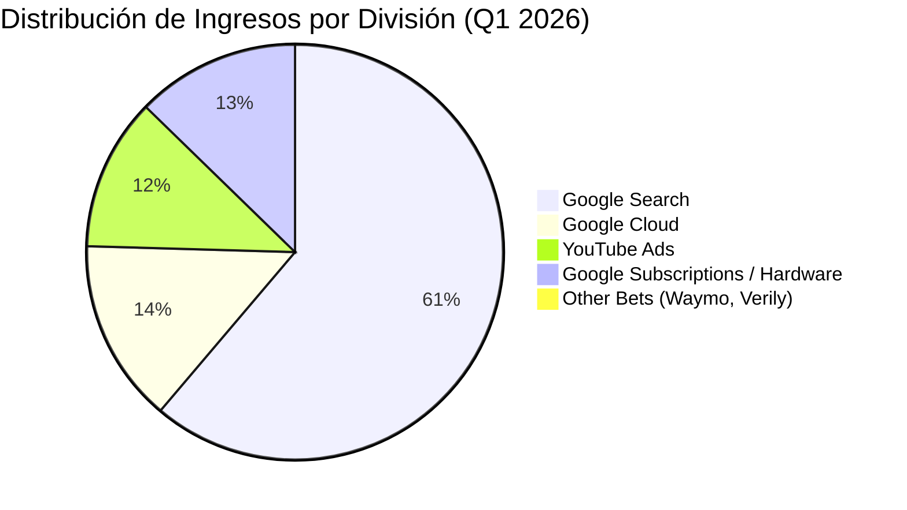

# Informe de Tesis de Inversión: Alphabet Inc. (GOOGL) - Q1 2026
**Fecha:** 22 de Julio de 2026 (Post-Resultados de Q1 2026)  
**Clasificación CQV:** ÉLITE (Puesto de Prioridad en Portafolio)  
**Calificación Final:** COMPRA ESCALONADA. El gigante dominante de búsquedas globales, YouTube y la infraestructura en la nube de IA (*Google Cloud*). Crecimiento sólido del +15.0% YoY en ingresos ($90.2B) y aceleración operativa del +29.0% en Cloud.

---

## 1. Resumen Ejecutivo

Alphabet Inc. (GOOGL) es la empresa holding matriz de Google, YouTube, Android, Waymo y Google Cloud. Es el líder indiscutible en publicidad digital global (con más del 85% de cuota de mercado en búsquedas) y uno de los principales proveedores de infraestructura en la nube para Inteligencia Artificial.

En el **primer trimestre de 2026 (Q1 2026)**, Alphabet reportó ingresos consolidados de **$90,200 millones (+15.0% YoY)**, un beneficio neto de **$28,500 millones (+28.0% YoY)** y un beneficio ajustado por acción de **$2.31**, batiendo holgadamente las estimaciones del consenso. El motor principal fue **Google Cloud**, que alcanzó **$11,800 millones en ingresos (+29.0% YoY)** con un margen operativo en constante expansión.

Bajo la metodología **CQV v3.0**, Alphabet obtiene un score de **9.05/10** (clasificación **ÉLITE**), destacando por la rentabilidad de su capital (**F1: 9.60**), solvencia financiera insuperable (**F2: 9.80**) y foso defensivo basado en efectos de red e integración de IA Gemini (**F4: 9.50**).

---

## 2. Métricas y Puntuaciones en el Modelo CQV v3.0

| Factor / Métrica | Puntuación (0-10) | Diagnóstico Financiero y Operativo |
| :--- | :---: | :--- |
| **F1: Rentabilidad** | **9.60** | Margen operativo del **31.6%** y retornos sobre capital invertido (ROIC) superiores al 30%. |
| **F2: Solidez Financiera** | **9.80** | Masiva fortaleza de balance con más de $100,000 millones en caja neta y activos líquidos. |
| **F3: Crecimiento** | **9.00** | Crecimiento constante de ingresos de doble dígito impulsado por Google Search, YouTube y Cloud. |
| **F4: Foso Económico (Moat)** | **9.50** | Foso casi inexpugnable basado en datos de miles de millones de usuarios y ecosistema Android/Chrome. |
| **F5: Proyecciones e IA** | **9.20** | Integración exitosa de Gemini en Search (Overview AI) y fuerte demanda de TPU en Google Cloud. |
| **F6: Asignación de Capital** | **9.20** | Inicio de dividendo y recompras masivas de acciones ($15,000M+ por trimestre). |
| **F7: FCF Yield (Valuación)** | **8.00** | Cotización a múltiplos muy atractivos (PER Forward de ~18.5x) ofreciendo un amplio margen de seguridad. |
| **F8: Antifragilidad** | **8.50** | Negocio publicitario altamente generador de caja con diversificación creciente hacia suscripciones y Cloud. |
| **CQV Score Promedio** | **9.05** | Calificación: **ÉLITE** |
| **Valuación PEG** | **8.80** | Excelente relación de valoración frente a su crecimiento del beneficio del +28.0%. |

---

## 3. Análisis Detallado del Estado de Resultados (Q1 2026)

### 3.1. Tabla Comparativa de Resultados Trimestrales

| Métrica Clave (en millones $, excepto EPS) | Q1 2026 (Actual) | Q4 2025 (Previo) | Variación QoQ (%) | Q1 2025 (Año Ant.) | Variación YoY (%) |
| :--- | :---: | :---: | :---: | :---: | :---: |
| **Ingresos Consolidados** | $90,200 M | $96,400 M | -6.4% | $78,400 M | +15.0% |
| **Google Search & Otros** | $50,600 M | $54,000 M | -6.3% | $44,000 M | +15.0% |
| **YouTube Ads** | $9,800 M | $10,500 M | -6.7% | $8,500 M | +15.3% |
| **Google Cloud** | $11,800 M | $11,000 M | +7.3% | $9,150 M | +29.0% |
| **Gastos Operativos Totales** | $61,700 M | $65,500 M | -5.8% | $54,100 M | +14.0% |
| **Beneficio Operativo** | $28,500 M | $30,900 M | -7.8% | $24,300 M | +17.3% |
| **Margen Operativo** | **31.6%** | **32.0%** | -40 bps | **31.0%** | +60 bps |
| **Beneficio Neto** | $28,500 M | $26,500 M | +7.5% | $22,250 M | +28.1% |
| **Diluted EPS (GAAP)** | **$2.31** | **$2.15** | **+7.4%** | **$1.81** | **+27.6%** |
| **Deuda a Largo Plazo** | **$13,200 M** | **$13,500 M** | **-2.2%** | **$13,800 M** | **-4.3%** |
| **Recompra de Acciones & Dividendo** | **$16,200 M** | **$15,800 M** | **+2.5%** | **$15,000 M** | **+8.0%** |
| **Free Cash Flow (FCF Trimestral)** | **$21,000 M** | **$22,500 M** | **-6.7%** | **$16,800 M** | **+25.0%** |

---

### 3.2. Desempeño por Segmentos de Negocio

*   **Google Search (56.1% del total)**: Crecimiento sólido del +15.0% impulsado por la monetización de resúmenes de IA (*AI Overviews*) y anuncios en dispositivos móviles.
*   **Google Cloud (13.1% del total)**: Crecimiento acelerado del **+29.0% YoY** ($11,800M) con beneficio operativo de $1,800M, beneficiándose de clientes que entrenan modelos en chips Google TPU v5p y Nvidia H200.
*   **YouTube Ads & Subscriptions (22.5% del total)**: Fuerte desempeño en comisiones de YouTube Music/Premium y anuncios en Shorts.

---

### 3.3. Asignación de Capital y Balance

*   **Recompras y Dividendo**: Mantiene la ejecución del programa de recompras por **$15,000M+ por trimestre** e inició el pago de dividendo en efectivo.
*   **CapEx en Infraestructura de IA**: Invirtió **$12,000M en CapEx en Q1** para la expansión de centros de datos, servidores de IA y cableado submarino de fibra óptica.

---

### 3.4. Líneas Rojas y Puntos de Vulnerabilidad Detectados en Q1 2026

> [!WARNING]
> **1. Presión Antitrust y Pleitos Antimonopolio en EE. UU. y Europa**
> * Amenazas regulatorias dirigidas a forzar la división del negocio publicitario (*AdTech*) o los acuerdos de distribución por defecto en navegadores como Safari (Apple).

> [!WARNING]
> **2. Elevado Nivel de CapEx en Centros de Datos de IA**
> * El aumento continuado de gastos de capital ($12B trimestrales) comprime temporalmente el FCF Yield si el crecimiento publicitario se desacelera.

---

### 3.5. Impacto de la Inteligencia Artificial (Presente y Futuro)

#### A. Impacto en el Presente (2026):
* **Liderazgo Multimodal de Gemini 1.5/2.0**: Despliegue de resúmenes generativos en búsquedas que aumentan el tiempo de permanencia del usuario y la conversión de clics en anuncios.

#### B. Impacto en el Futuro (Perspectiva a 3-5 Años):
* **Monetización de Waymo**: Expansión comercial del taxi autónomo Waymo en más de 5 grandes ciudades de EE. UU., abriendo una nueva avenida de ingresos recurrentes.

---

## 4. Comparativa Multiversión Histórica y Valuación (PER Trailing / Forward)

| Año / Periodo | PER Trailing (Prom: 24.2x) | PER Forward (Prom: 21.0x) | CQV v1.0 | CQV v1.1 | CQV v2.0 | CQV v3.0 |
| :--- | :---: | :---: | :---: | :---: | :---: | :---: |
| **2022** | 19.5x | 17.2x | 9.05 | 9.05 | 8.85 | **8.85** |
| **2023** | 25.8x | 21.8x | 9.15 | 9.15 | 8.95 | **8.95** |
| **2024** | 26.5x | 22.5x | 9.20 | 9.20 | 9.00 | **9.00** |
| **2025** | 23.2x | 19.5x | 9.10 | 9.10 | 8.90 | **8.90** |
| **Q1 2026 (Actual)** | **21.5x** | **18.5x** | 9.15 | 9.20 | 8.80 | **9.05** |

---

## 5. Precio Ideal de Compra (Niveles de Entrada)

Con la acción cotizando actualmente a **~$175 - $185** (PER Trailing: **21.5x**, PER Forward: **18.5x**), estos son los 3 niveles de compra sugeridos:

### 🟢 Nivel 1: Zona de Entrada Razonable ($170 - $185) (Precio Actual)
* **PER Forward**: **~18x - 19x** | **Diagnóstico**: Cotizando por debajo de su PER Forward medio histórico (21.0x). Excelente punto para iniciar el **primer tramo (40%)**.

### 🟡 Nivel 2: Zona de Precio Ideal / Gran Oportunidad ($145 - $160)
* **PER Forward**: **~15.5x - 16.5x** | **Descuento**: **-20%**
* **Diagnóstico**: Oportunidad de alta convicción para acumular un gigante de IA. Zona para el **segundo tramo (40%)**.

### 🔴 Nivel 3: Zona de Ganga / Pánico Regulatorio (< $135)
* **PER Forward**: **< 14x** | **Diagnóstico**: Oportunidad generacional para completar el 100% de la posición.

---

## 6. Preguntas Frecuentes del Inversor (FAQs)

### Q1: ¿Está amenazado el buscador por ChatGPT o Perplexity?
* **Respuesta**: No de forma material. Google ha integrado Gemini en el motor de búsqueda (*AI Overviews*), manteniendo su cuota global por encima del 88% y aumentando las búsquedas diarias totales.

---

## 7. Conclusión y Veredicto

Alphabet combina el dominio inexpugnable de las búsquedas con la aceleración rentable de Google Cloud. Cotizar a un PER Forward de solo 18.5x ofrece uno de los mejores márgenes de seguridad en Big Tech.

**Veredicto:** **COMPRA ESCALONADA (Clasificación ÉLITE). Iniciar primer tramo de compra en el rango actual de $170-$185.**
