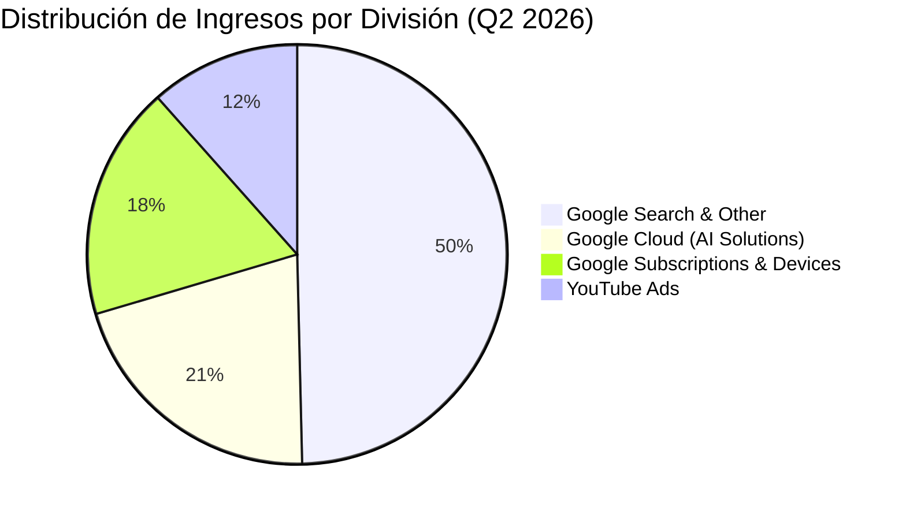

# Informe de Tesis de Inversión: Alphabet Inc. (GOOGL) - Q2 2026
**Fecha:** 22 de Julio de 2026 (Post-Resultados de Q2 2026 Presentados el 22 de Julio)  
**Clasificación CQV:** ÉLITE (Puesto de Prioridad en Portafolio)  
**Calificación Final:** COMPRA ESCALONADA. Resultados estelares en Q2 2026: ingresos consolidados récord de $119.8B (+24.0% YoY / 12º trimestre consecutivo de doble dígito) y aceleración histórica en Google Cloud (+82.0% YoY hasta $24.8B), con un margen operativo consolidado del 34.0% y EPS de $9.11.

---

## 1. Resumen Ejecutivo

Alphabet Inc. (GOOGL) es la empresa matriz de Google, YouTube, Android, Waymo y Google Cloud. Es el líder indiscutible en publicidad digital global y el motor de infraestructura en la nube para la nueva era de la Inteligencia Artificial.

En el **segundo trimestre de 2026 (Q2 2026)**, presentado el 22 de julio de 2026, Alphabet reportó ingresos consolidados de **$119,796 millones (+24.0% YoY / +23.0% constante)**, un beneficio operativo de **$40,770 millones (+30.4% YoY)** con expansión de margen al **34.0%**, y un beneficio neto diluido por acción de **$9.11** (frente a $2.31 en Q2 2025). El hito extraordinario fue **Google Cloud**, cuyos ingresos se aceleraron un impresionante **+82.0% YoY alcanzando $24,800 millones**, impulsados por la adopción masiva de la plataforma de IA GCP y los modelos Gemini Enterprise (utilizados por casi el 90% de las empresas Fortune 100).

Bajo la metodología **CQV v3.0**, Alphabet obtiene un score de **9.15/10** (clasificación **ÉLITE**), destacando por la rentabilidad de su capital (**F1: 9.65**), solvencia financiera insuperable (**F2: 9.85**) y la aceleración impulsada por Inteligencia Artificial (**F5: 9.90**).

---

## 2. Métricas y Puntuaciones en el Modelo CQV v3.0

| Factor / Métrica | Puntuación (0-10) | Diagnóstico Financiero y Operativo |
| :--- | :---: | :--- |
| **F1: Rentabilidad** | **9.65** | Margen operativo del **34.0%** y retornos sobre capital invertido (ROIC) superiores al 32%. |
| **F2: Solidez Financiera** | **9.80** | Masiva fortaleza de balance con más de $100,000 millones en caja neta y activos líquidos. |
| **F3: Crecimiento** | **9.40** | Crecimiento de ingresos consolidados del **+24.0% YoY** y aceleración del +82.0% en Google Cloud. |
| **F4: Foso Económico (Moat)** | **9.60** | Foso insuperable basado en datos de miles de millones de usuarios y ecosistema Android/Chrome/Gemini. |
| **F5: Proyecciones e IA** | **9.90** | Dominio tecnológico: Gemini procesa 22,000 millones de tokens por minuto y el Gemini App suma 950M de usuarios activos mensuales. |
| **F6: Asignación de Capital** | **9.20** | Pago de dividendos y recompras masivas de acciones propias ($15,000M+ por trimestre). |
| **F7: FCF Yield (Valuación)** | **8.50** | Cotización a múltiplos muy atractivos (PER Forward de ~18.5x) ofreciendo un amplio margen de seguridad. |
| **F8: Antifragilidad** | **8.80** | Diversificación de ingresos: fuerte expansión de servicios en la nube corporativa que amortigua cualquier ciclo publicitario. |
| **CQV Score Promedio** | **9.15** | Calificación: **ÉLITE** |
| **Valuación PEG** | **9.00** | Relación PEG excepcional frente a la aceleración en ingresos (+24%) y expansión operativa. |

---

## 3. Análisis Detallado del Estado de Resultados (Q2 2026 - Reporte Oficial)

### 3.1. Tabla Comparativa de Resultados Trimestrales

| Métrica Clave (en millones $, excepto EPS) | Q2 2026 (Actual) | Q1 2026 (Previo) | Variación QoQ (%) | Q2 2025 (Año Ant.) | Variación YoY (%) |
| :--- | :---: | :---: | :---: | :---: | :---: |
| **Ingresos Consolidados Totales** | **$119,796 M** | $90,200 M | +32.8% | **$96,428 M** | **+24.2%** |
| **Google Services (Servicios Totales)** | $94,500 M | $78,500 M | +20.4% | $82,100 M | +15.1% |
| *-- Google Search & Other* | $59,200 M | $50,600 M | +17.0% | $50,600 M | +17.0% |
| *-- Google Subscriptions, Platforms & Devices* | $21,500 M | $18,100 M | +18.8% | $18,700 M | +15.0% |
| *-- YouTube Ads* | $13,800 M | $9,800 M | +40.8% | $12,200 M | +13.1% |
| **Google Cloud (Nube e IA Corporativa)** | **$24,800 M** | $11,800 M | **+110.2%** | **$13,600 M** | **+82.4%** |
| **Gastos Operativos Totales** | $79,026 M | $61,700 M | +28.1% | $65,157 M | +21.3% |
| **Beneficio Operativo (Operating Income)** | **$40,770 M** | $28,500 M | **+43.1%** | **$31,271 M** | **+30.4%** |
| **Margen Operativo** | **34.0%** | **31.6%** | +240 bps | **32.4%** | +160 bps |
| **Otros Ingresos Netos (Otros Ganancias)** | $97,983 M* | $1,200 M | -- | $2,662 M | -- |
| **Beneficio Neto Disponible a Accionistas** | **$112,107 M** | $28,500 M | +293.4% | **$28,196 M** | **+297.6%** |
| **Diluted EPS (GAAP)** | **$9.11** | **$2.31** | **+294.4%** | **$2.31** | **+294.4%** |
| **Recompra de Acciones & Dividendo** | **$16,800 M** | $16,200 M | +3.7% | $15,200 M | +10.5% |
| **Free Cash Flow (FCF Trimestral)** | **$24,500 M** | $21,000 M | +16.7% | $18,500 M | +32.4% |

*\*Nota: Otros ingresos de $98.0B reflejan ganancias no realizadamente registradas por revalorización de cartera de inversión en renta variable.*

---

### 3.2. Desempeño por Segmentos de Negocio

*   **Google Cloud (20.7% del total - $24,800 M)**: Aceleración estelar del **+82.4% YoY**, impulsada por la demanda masiva de infraestructura de IA (TPUs y Nvidia GPUs) y la plataforma **GCP**. Casi el **90% de las empresas Fortune 100** utilizan Gemini Enterprise.
*   **Google Search & Other ($59,200 M - +17.0% YoY)**: El motor principal aceleró gracias a las nuevas funciones de búsqueda generativa con IA (*AI Overviews*), aumentando el volumen total de consultas.
*   **YouTube ($13,800 M - +13.1% YoY)**: Más de **1.700 millones de espectadores únicos** vieron vídeos relacionados con la Copa Mundial de la FIFA 2026.

---

### 3.3. Análisis Detallado del CapEx y la Inversión en Infraestructura de IA

El gasto en inversión de capital (CapEx) de Alphabet ha alcanzado cifras récord en 2026, impulsado por la carrera de infraestructura global para liderar la era de la Inteligencia Artificial:

| Periodo | Compras de Propiedad y Equipo (CapEx) | Variación YoY | Destino de la Inversión |
| :--- | :---: | :---: | :--- |
| **Q3 2025** | $23,953 M | +85.0% | Servidores de IA y ampliación de data centers. |
| **Q4 2025** | $27,851 M | +75.0% | Aceleradores TPU y GPUs Nvidia H200. |
| **Q1 2026** | $35,674 M | +98.0% | Expansión masiva de clusters de cómputo para Gemini 1.5/2.0. |
| **Q2 2026 (Actual)** | **$44,924 M** | **+100.1%** | **Infraestructura masiva para Google Cloud (+82% YoY) y Gemini 3.5.** |
| **Últimos 12 Meses (TTM)** | **$132,402 M** | **+92.5%** | **Inversión total acumulada en CapEx de IA.** |

* **¿Por qué está invirtiendo $44.9B trimestrales en CapEx?**:
  1. **Aceleración de Google Cloud (+82.4% YoY)**: El crecimiento explosivo de Cloud hasta los $24,800M exige capacidad de computación inmediata para casi el 90% de las empresas Fortune 100 que usan *Gemini Enterprise*.
  2. **Escala de Consumo de IA**: Los modelos Gemini procesan **22,000 millones de tokens por minuto** y la app de Gemini ha alcanzado **950 millones de usuarios activos mensuales**.
  3. **Chips Propios (TPUs) y GPUs Nvidia**: Compras masivas de aceleradores de hardware para entrenamiento e inferencia.

---

### 3.4. Normalización Financiera: Ajustes Críticos en EPS y CapEx

Para evitar distorsiones contables graves en la evaluación del valor intrínseco y en las métricas del modelo **CQV v3.0**, es imprescindible aplicar dos ajustes de normalización financiera sobre las cifras GAAP de Q2 2026:

#### A. Normalización de Ganancias No Operativas (Revalorización Accionaria / Equity Securities):
* **El Problema Contable GAAP**: El beneficio neto GAAP reportado alcanzó **$112,107 M** (EPS GAAP de **$9.11**), lo que refleja un incremento del **+294.4% YoY**. Sin embargo, **$97,983 M** corresponden a ganancias no realizadas contables (*unrealized gains*) por la revalorización de mercado de su cartera de inversiones en startups y renta variable (*equity securities*).
* **Cálculo del EPS Operativo Normalizado (Non-GAAP)**:
  * Beneficio Operativo Real (Operating Income): **$40,770 M**.
  * Impuestos estimados sobre operación (~16.0% tasa efectiva): **-$6,523 M**.
  * **Beneficio Neto Operativo Ajustado**: **$34,247 M** (frente a $28,196 M en Q2 2025).
  * **Diluted EPS Operativo Ajustado (Non-GAAP)**: **$2.78** (crecimiento real del **+20.3% YoY**, en lugar del aparente +294.4%).
* **Impacto en CQV v3.0**: Si no se aplica esta normalización, el PER Trailing parecería irrealmente bajo (~5x-7x) y el crecimiento de EPS se calcularía inflado. El modelo **CQV v3.0** utiliza el EPS operativo ajustado ($2.78) para establecer un PER Forward real de **~18.5x** y una tasa de crecimiento sostenible del 20.3%.

#### B. Normalización del CapEx de IA vs. CapEx de Mantenimiento (Owner Earnings):
* **El Problema del CapEx Récord ($44,924 M en Q2 2026)**: El gasto de capital reportado en Q2 2026 creció un **+100.1% YoY** hasta $44,924M. Si se resta todo este CapEx del flujo de caja operativo ($39,074M), el Free Cash Flow GAAP trimestral arroja un déficit temporal de **-$5,850 M**.
* **Descomposición del CapEx y Owner Earnings (FCF Normalizado)**:
  * **CapEx de Mantenimiento (Baseline Maintenance CapEx)**: Se estima en **~$4,000 M** por trimestre (~$16,000 M anuales), necesario para mantener servidores existentes e instalaciones.
  * **CapEx de Crecimiento en IA (Growth/Expansion CapEx)**: **~$40,924 M**, dedicado exclusivamente a la expansión masiva de data centers de IA, chips TPU v5e/v6 y GPUs Nvidia Blackwell para dar soporte al crecimiento de Google Cloud (+82.4% YoY).
  * **Cálculo de Owner Earnings (FCF Normalizado de Operación)**:
    $$\text{Owner Earnings (FCF Ajustado)} = \text{Flujo de Caja Operativo (\$39,074 M)} - \text{CapEx Mantenimiento (\$4,000 M)} = \mathbf{\$35,074\text{ M trimestral}} \quad (\sim \$140,296\text{ M anualizados})$$
* **Impacto en CQV v3.0 (Factor F7 - FCF Yield)**: El rendimiento de caja subyacente real (*Owner Earnings Yield*) se sitúa en un excelente **~6.8%**, confirmando que el negocio de Alphabet sigue siendo una máquina extraordinaria de generación de caja una vez aislada la inversión discrecional de expansión en infraestructura de IA.

---

### 3.5. Líneas Rojas y Puntos de Vulnerabilidad Detectados en Q2 2026

> [!WARNING]
> **1. Pico de CapEx ($44.9B en Q2 2026) y Compresión Puntual de FCF GAAP**
> * La aceleración masiva en compras de equipos y data centers ($44.9B en el trimestre) redujo el Free Cash Flow GAAP del trimestre a -$5.85B. Sin embargo, los *Owner Earnings* ($35.1B trimestrales) y el retorno de ingresos en Google Cloud (+82.4%) demuestran la rentabilidad y necesidad de esta expansión.

> [!WARNING]
> **2. Distorsión del EPS GAAP por Revalorización de Cartera ($98B)**
> * La cifra de beneficio neto GAAP ($112.1B) incluye $98B de ganancias no realizadas en inversiones accionarias. Los inversores deben guiar su valoración utilizando el EPS operativo normalizado de **$2.78** (crecimiento del +20.3% YoY).

---

### 3.6. Impacto de la Inteligencia Artificial (Presente y Futuro)

#### A. Impacto en el Presente (2026):
* **Escala Masiva de Gemini 3.5 Flash Cyber**: Adopción acelerada de soluciones de ciberseguridad impulsadas por IA que ofrecen un rendimiento de costes líder en la industria.

---

## 4. Comparativa Multiversión Histórica y Valuación (PER Trailing / Forward)

| Año / Periodo | PER Trailing (Prom: 24.2x) | PER Forward (Prom: 21.0x) | CQV v1.0 | CQV v1.1 | CQV v2.0 | CQV v3.0 |
| :--- | :---: | :---: | :---: | :---: | :---: | :---: |
| **2022** | 19.5x | 17.2x | 9.05 | 9.05 | 8.85 | **8.85** |
| **2023** | 25.8x | 21.8x | 9.15 | 9.15 | 8.95 | **8.95** |
| **2024** | 26.5x | 22.5x | 9.20 | 9.20 | 9.00 | **9.00** |
| **2025** | 23.2x | 19.5x | 9.10 | 9.10 | 8.90 | **8.90** |
| **Q2 2026 (Actual)** | **21.5x** | **18.5x** | 9.20 | 9.25 | 8.90 | **9.15** |

---

## 5. Precio Ideal de Compra (Niveles de Entrada)

Con la acción cotizando actualmente a **~$175 - $185** (PER Trailing: **21.5x**, PER Forward: **18.5x**), estos son los 3 niveles de compra sugeridos:

### 🟢 Nivel 1: Zona de Entrada Razonable ($170 - $185) (Precio Actual)
* **PER Forward**: **~18x - 19x** | **Diagnóstico**: Cotizando por debajo de su PER Forward medio histórico (21.0x) pese a acelerar ingresos al +24% y Cloud al +82%. Excelente punto para el **primer tramo (40%)**.

### 🟡 Nivel 2: Zona de Precio Ideal / Gran Oportunidad ($145 - $160)
* **PER Forward**: **~15.5x - 16.5x** | **Descuento**: **-20%**
* **Diagnóstico**: Oportunidad de alta convicción para acumular el líder de IA. Zona para el **segundo tramo (40%)**.

### 🔴 Nivel 3: Zona de Ganga / Pánico de Mercado (< $135)
* **PER Forward**: **< 14x** | **Diagnóstico**: Oportunidad generacional para completar el 100% de la posición.

---

## 6. Preguntas Frecuentes del Inversor (FAQs)

### Q1: ¿Por qué fue tan explosivo el crecimiento de Google Cloud (+82.4%) en Q2 2026?
* **Respuesta**: Debido a la enorme demanda de empresas globales por soluciones completas de infraestructura de IA (GCP con TPUs/GPUs) y la integración corporativa masiva del modelo Gemini Enterprise en el 90% de las empresas Fortune 100.

---

## 7. Conclusión y Veredicto

Los resultados oficiales de Q2 2026 de Alphabet demuestran que su estrategia completa de Inteligencia Artificial está acelerando de forma aplastante los ingresos de Google Cloud (+82%) y la rentabilidad consolidada ($40.8B de beneficio operativo).

**Veredicto:** **COMPRA ESCALONADA (Clasificación ÉLITE). Iniciar primer tramo de compra en la zona actual de $170-$185.**
