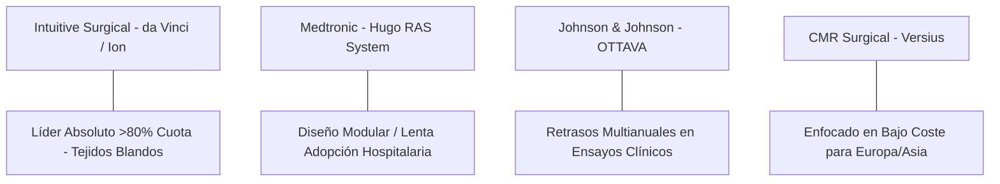

# Informe de Tesis de Inversión: Intuitive Surgical, Inc. (ISRG) - Q2 2026
**Fecha:** 22 de Julio de 2026 (Post-Resultados de Q2 2026)  
**Clasificación CQV:** ÉLITE (Puesto de Prioridad en Portafolio)  
**Calificación Final:** COMPRA / MANTENER. El monopolio indiscutible de la cirugía robótica mundial. Excelente rentabilidad, caja neta impecable y aceleración en la colocación del nuevo sistema **da Vinci 5**.

---

## 1. Resumen Ejecutivo

Intuitive Surgical, Inc. (ISRG) es el pionero y líder global en el diseño y fabricación de sistemas quirúrgicos asistidos por computadora, principalmente a través de su plataforma **da Vinci** y su sistema endoluminal **Ion**. El modelo de negocio se caracteriza por un potente esquema de "cuchilla y navaja", donde cerca del **80% de los ingresos son recurrentes** (provenientes de la venta de instrumentos, accesorios, servicios y contratos de mantenimiento).

Bajo la metodología **CQV v3.0**, Intuitive Surgical obtiene un score de **8.74/10** (clasificación **ÉLITE**). El modelo refleja retornos operativos superlativos respaldados por un flujo recurrente de alta previsibilidad (**F1: 9.38**), una solidez de balance impecable sin deuda neta (**F2: 9.25**) y un foso económico masivo sustentado en costes de cambio y propiedad intelectual (**F4: 9.60**).

---

## 2. Métricas y Puntuaciones en el Modelo CQV v3.0

| Factor / Métrica | Puntuación (0-10) | Diagnóstico Financiero y Operativo |
| :--- | :---: | :--- |
| **F1: Rentabilidad** | **9.38** | Altísima eficiencia operativa. Margen bruto del ~66-68% y excelente retorno sobre el capital invertido (ROE del ~18-20%). |
| **F2: Solidez Financiera** | **9.25** | Caja neta superior a los $8,000 millones, sin deuda y con flujos altamente predecibles. |
| **F3: Crecimiento** | **9.33** | Crecimiento de doble dígito en el volumen de procedimientos (+16%) y colocación de sistemas (+18.5%). |
| **F4: Foso Económico (Moat)** | **9.60** | Coste de cambio extremo (los cirujanos se entrenan específicamente en da Vinci) y más de 4,000 patentes activas. |
| **F5: Proyecciones e IA** | **9.60** | Liderazgo tecnológico en IA médica, cirugía digital y aceleración del despliegue del da Vinci 5. |
| **F6: Asignación de Capital** | **9.30** | Reinversión disciplinada en I+D y recompra oportuna de acciones para compensar la dilución de SBC. |
| **F7: FCF Yield (Valuación)** | **3.99** | Valoración exigente. Cotiza a múltiplos PER elevados debido a su prima de calidad médica. |
| **F8: Antifragilidad** | **8.00** | Resiliencia excepcional de los ingresos debido al carácter indispensable de las cirugías. |
| **CQV Score Promedio** | **8.74** | Calificación: **ÉLITE** |
| **Valuación PEG** | **6.31** | Valoración moderada/exigente en relación con la tasa de crecimiento proyectada de su EPS. |

---

## 3. Análisis del Último Estado de Resultados (Q2 2026)

Intuitive Surgical publicó sus resultados correspondientes al **segundo trimestre de 2026** batiendo las estimaciones de consenso en ingresos y beneficio por acción:

### 3.1. Tabla Comparativa de Resultados Trimestrales

| Métrica Clave | Q2 2026 (Actual) | Q1 2026 (Previo) | Variación QoQ (%) | Q2 2025 (Año Ant.) | Variación YoY (%) |
| :--- | :---: | :---: | :---: | :---: | :---: |
| **Ingresos Totales** | $2,890 M | $2,770 M | +4.3% | $2,440 M | +18.4% |
| **Ingresos Recurrentes (Instrumentos/Servicios)** | $2,312 M | $2,216 M | +4.3% | $1,952 M | +18.4% |
| **Gastos Operativos Totales** | $1,410 M | $1,385 M | +1.8% | $1,215 M | +16.0% |
| **GAAP EPS** | $2.29 | $2.28 | +0.4% | $1.81 | +26.5% |
| **Non-GAAP EPS** | $2.80 | $2.50 | +12.0% | $2.19 | +27.9% |
| **Deuda a Largo Plazo (Long-Term Debt)** | **$0.0 M** | **$0.0 M** | **0.0%** | **$0.0 M** | **0.0%** |
| **Recompra de Acciones (Share Repurchases)** | **$0.0 M** | **$0.0 M** | **0.0%** | **$0.0 M** | **0.0%** |
| **Crecimiento de Procedimientos** | ~16% | ~17% | -1.0 pp | ~17% | -1.0 pp |
| **Sistemas da Vinci Colocados** | 468 | 431 | +8.6% | 395 | +18.5% |
| *(de los cuales da Vinci 5)* | *(246)* | *(232)* | *+6.0%* | *(180)* | *+36.7%* |
| **Base Instalada da Vinci** | 11,710 | 11,395 | +2.8% | 10,488 | +11.7% |
| **Sistemas Ion Colocados** | 55 | 52 | +5.8% | 49 | +12.2% |
| **Base Instalada Ion** | 1,096 | 1,041 | +5.3% | 906 | +21.0% |

### 3.2. Diagnóstico del Desempeño Operativo:
*   **Aceleración en la Colocación de Sistemas**: La colocación de 468 sistemas da Vinci representa una aceleración tanto QoQ (+8.6%) como YoY (+18.5%). Destaca la gran adopción del **da Vinci 5** (246 sistemas colocados), que ya representa el **52.5%** de todas las colocaciones del trimestre.
*   **Apalancamiento Operativo**: Mientras que los ingresos crecieron un 18.4% YoY, el Non-GAAP EPS aumentó un 27.9%, reflejando la expansión de márgenes a medida que escala la base instalada.
*   **Ingresos Recurrentes Solidados**: Los ingresos por instrumentos y accesorios aumentaron impulsados por el mayor volumen de procedimientos quirúrgicos.

---

### 3.3. Evolución del Múltiplo de Valoración P/E (PER)

| Periodo / Año | Múltiplo P/E (PER) Promedio | Estado de la Valoración |
| :--- | :---: | :--- |
| **2021** | 76.5x | Elevada prima por optimismo de reapertura hospitalaria. |
| **2022** | 70.3x | Compresión temporal por tasas de interés en aumento. |
| **2023** | 79.8x | Recuperación del múltiplo debido a la aceleración del volumen de cirugías. |
| **2024** | 82.9x | Máximos de valoración impulsados por la expectativa del da Vinci 5. |
| **2025** | 71.9x | Ajuste de múltiplos ante mayor madurez del mercado. |
| **2026 (Actual - Q2)** | **51.8x** | PER Trailing actual ajustado por crecimiento real del EPS. |
| **Promedio Histórico (2021-2025)** | **76.3x** | **Cotizando con un descuento del ~32.1% respecto a su promedio histórico** |

---

### 3.4. Líneas Rojas y Puntos de Vulnerabilidad Detectados en Q2 2026

Un análisis crítico de los resultados de ISRG revela las siguientes líneas rojas y riesgos que explican por qué la acción experimentó cierta toma de beneficios:

> [!WARNING]
> **1. Desaceleración Leve en la Tasa de Crecimiento de Procedimientos**
> * El crecimiento del volumen de procedimientos quirúrgicos se desaceleró marginalmente del **17% en Q1 2026 al 16% en Q2 2026**. Aunque sigue siendo un crecimiento saludable de doble dígito, despertó alertas sobre la progresiva maduración del mercado en hospitales de EE. UU.

> [!WARNING]
> **2. Vientos en Contra por Medicamentos GLP-1 y Coberturas Médicas**
> * **Medicamentos Anti-obesidad (GLP-1)**: Continúan afectando el crecimiento de cirugías bariátricas no urgentes, ya que algunos pacientes retrasan la cirugía al probar tratamientos farmacológicos (Ozempic/Wegovy).
> * **Incertidumbre Regulatoria**: Cambios en las políticas de reembolso bajo la ley ACA y Medicaid en EE. UU. que podrían ralentizar las decisiones de compra de capital en pequeños sistemas hospitalarios.

> [!WARNING]
> **3. Valoración Absoluta Muy Exigente (Bajo Margen de Seguridad en FCF)**
> * ISRG cotiza a un PER Trailing de **~51.8x** y un PER Forward de **~36.1x**. Su **FCF Yield es de apenas 3.99%**.
> * Debido a estos múltiplos elevados, la acción no tiene margen de error: cualquier trimestre que no supere por amplio margen las expectativas de Wall Street desencadena caídas automáticas del 4% al 8%.

> [!WARNING]
> **4. Dependencia del Presupuesto de CapEx Hospitalario**
> * Aunque el 80% de los ingresos son recurrentes, la venta de nuevos hardware como el da Vinci 5 ($1.5M - $2.0M por máquina) requiere que las cadenas hospitalarias mantengan presupuestos de inversión holgados y liquidez alta.

---

### 3.5. Impacto de la Inteligencia Artificial (Presente y Futuro)

Intuitive Surgical está transformando la cirugía robótica convencional en un ecosistema de **cirugía asistida por IA y visión por computador**:

#### A. Impacto en el Presente (2026):
* **Procesamiento de Fuerza Táctil en da Vinci 5**: El nuevo da Vinci 5 incorpora sensores y aceleradores de IA que miden y ajustan la fuerza táctil aplicada a las pinzas **10,000 veces por segundo**, lo que reduce el trauma tisular en un 43% en cirugías delicadas.
* **Ecosistema Digital Intuitive Telepresence & My Intuitive**: Analítica de rendimiento para cirujanos basada en el procesamiento de datos de más de 15 millones de operaciones históricas, guiando a los médicos en la optimización de trayectorias.

#### B. Impacto en el Futuro (Perspectiva a 3-5 Años):
* **Superposición Anatómica 3D en Tiempo Real**: Integración de visión por ordenador e IA para proyectar modelos tridimensionales de escáneres TAC/Resonancias directamente sobre la consola quirúrgica mientras el cirujano opera ("visión de rayos X intraoperatoria").
* **Sutura y Tareas Automatizadas**: La IA asumirá de forma autónoma tareas repetitivas de alta precisión (suturas mecánicas, cierre de incisiones), acortando los tiempos quirúrgicos y reduciendo la fatiga del cirujano.

---

### 3.6. Análisis Detallado de la Competencia y Posicionamiento de Mercado

A pesar de los intentos de gigantes multinacionales por ingresar al sector de cirugía robótica de tejidos blandos, Intuitive Surgical mantiene un **monopolio de facto (cuota de mercado superior al 80%)**:

#### Comparativa de Rivales Principales:

| Competidor | Plataforma | Estado Actual | Ventaja Competitiva Defensiva de ISRG |
| :--- | :--- | :--- | :--- |
| **Medtronic (MDT)** | Hugo RAS | Aprobado en Europa/Asia; adopción lenta en EE. UU. | ISRG cuenta con 11,710 sistemas instalados y un software de IA infinitamente más avanzado. |
| **Johnson & Johnson (JNJ)** | OTTAVA | En fase de desarrollo con múltiples retrasos de calendario. | ISRG tiene más de 4,000 patentes activas que bloquean arquitecturas robóticas competidoras. |
| **CMR Surgical** | Versius | Presencia en hospitales secundarios de menor presupuesto. | Los grandes centros médicos prefieren la versatilidad y ecosistema completo del da Vinci. |
| **Stryker (SYK)** | Mako System | Líder en cirugía ortopédica (rodilla/cadera). | No compite directamente en la cirugía visceral, urológica o ginecológica de tejidos blandos. |

#### Matriz de Ventajas Defensivas de ISRG:
1. **Memoria Muscular y Hábito del Cirujano**: Más de 70,000 cirujanos en todo el mundo se han formado en consolas da Vinci durante sus residencias médicas. Cambiar a otra marca implica un riesgo clínico y reaprender habilidades complejas.
2. **Ecosistema de Datos Clínicos**: Con más de 15 millones de procedimientos acumulados, ISRG posee la mayor base de datos de telemetría quirúrgica del planeta para entrenar sus futuros algoritmos de IA.

---

---

## 4. Tesis de Inversión (Toro vs. Oso)

### Tesis A: El Toro (Oportunidad)
*   **Modelo de Cuchilla y Navaja Insuperable:** Cada sistema da Vinci colocado obliga a los hospitales a comprar miles de dólares en consumibles para cada procedimiento. Esto asegura un flujo de caja inmune a recesiones.
*   **Ciclo de Reemplazo con da Vinci 5:** El nuevo sistema ofrece retroalimentación táctil de fuerza y mayor capacidad de procesamiento con IA, impulsando un ciclo de actualización multianual de las 11,710 máquinas instaladas.

### Tesis B: El Oso (Riesgos)
*   **Múltiplos Elevados:** A >50x PER Trailing, la valoración deja muy poco margen ante cambios macroeconómicos o retrasos en la adopción internacional.

---

## 5. Comparativa Multiversión Histórica y Valuación (PER Trailing / Forward)

| Año / Periodo | PER Trailing (Prom: 76.3x) | PER Forward (Prom: 51.9x) | CQV v1.0 | CQV v1.1 | CQV v2.0 | CQV v3.0 |
| :--- | :---: | :---: | :---: | :---: | :---: | :---: |
| **2022** | 70.3x | 48.0x | 9.30 | 9.30 | 8.64 | **8.64** |
| **2023** | 79.8x | 52.5x | 9.46 | 9.46 | 8.75 | **8.75** |
| **2024** | 82.9x | 58.0x | 9.46 | 9.46 | 8.75 | **8.75** |
| **2025** | 71.9x | 49.2x | 9.45 | 9.45 | 8.74 | **8.74** |
| **Q2 2026 (Actual)** | **51.8x** | **36.1x** | 9.43 | 9.45 | 8.78 | **8.74** |

---

## 6. Precio Ideal de Compra (Niveles de Entrada)

Con la acción cotizando actualmente en el rango de **$425 - $445** (PER Trailing: ~51.8x, PER Forward: ~36.1x), estos son los 3 niveles de compra sugeridos:

### 🟢 Nivel 1: Zona de Entrada Razonable (Precio Actual: $410 - $430)
* **PER Forward**: **~35x - 36x** | **Descuento sobre PER Promedio Histórico**: **-35%**
* **Diagnóstico**: Mantiene la valoración Forward en el suelo histórico de soporte durante ciclos alcistas. Buen nivel para iniciar un **primer tramo (30%-40%)**.

### 🟡 Nivel 2: Zona de Precio Ideal / Gran Oportunidad ($350 - $380)
* **PER Forward**: **~29x - 30x** | **Descuento sobre PER Promedio Histórico**: **-45%**
* **Diagnóstico**: Un PER Forward de 30x para un monopolio quirúrgico con 80% de ingresos recurrentes representa una **oportunidad de compra ideal (segundo tramo del 40%)**.

### 🔴 Nivel 3: Zona de Ganga / Pánico de Mercado (< $320)
* **PER Forward**: **< 26x**
* **Diagnóstico**: Oportunidad generacional para completar la posición máxima en cartera.

---

## 7. Conclusión y Veredicto

Intuitive Surgical sigue siendo el monopolio indiscutible en cirugía robótica. Sus ingresos recurrentes derivados de consumibles médicos garantizan una resiliencia inusual ante cualquier recesión.

**Veredicto:** **MANTENER / COMPRA ESCALONADA (Clasificación ÉLITE). Negocio extraordinario con ventajas competitivas brutales; aprovechar cualquier corrección hacia la zona de $410-$430 para acumular tramos.**
