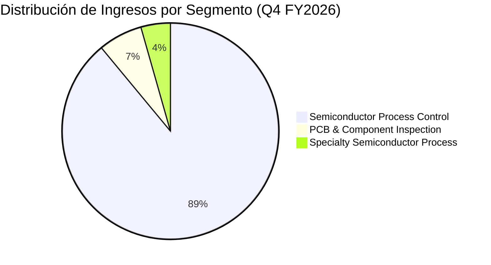

# Informe de Tesis de Inversión: KLA Corporation (KLAC) - Q4 FY2026 / Q2 2026
**Fecha:** 29 de Julio de 2026  
**Clasificación CQV:** ÉLITE  
**Calificación Final:** COMPRA ESCALONADA. Liderazgo monopolístico indiscutible (>55% cuota) en Inspección y Metrología de semiconductores, beneficiario crítico del despliegue de infraestructura de Inteligencia Artificial (Foundry/Logic & Memory HBM/Advanced Packaging).

---

## 1. Resumen Ejecutivo

KLA Corporation (KLAC) es el proveedor dominante mundial de soluciones de control de procesos (inspección de obleas y metrología) para la industria de semiconductores. Con una cuota de mercado global superior al 55%, sus equipos son vitales para maximizar los rendimientos de producción (*yields*) en nodos avanzados (3nm, 2nm, GAA) y empaquetado avanzado (HBM, CoWoS).

En el cuarto trimestre de su año fiscal 2026 (Q4 FY26 / Q2 2026), KLA reportó **ingresos consolidados de $3,658 millones** (+15.2% YoY y +7.1% QoQ), superando el punto medio de su guía. El **beneficio neto GAAP alcanzó $1,363 millones** ($1.04 EPS diluido, ajustado por el stock split 10-por-1 de junio de 2026), mientras que el **EPS Non-GAAP fue de $1.05** (límite superior de la guía).

Bajo el marco multifactorial **CQV v3.0**, KLA obtiene una calificación de **9.44/10 (ÉLITE)**, destacando por sus márgenes operativos brutales (42.5%), solidez de balance ($4,902M en caja/equivalentes) y fuerte generación de Free Cash Flow ($3,767M anuales).

---

## 2. Métricas y Puntuaciones en el Modelo CQV v3.0

| Factor / Métrica | Puntuación (0-10) | Diagnóstico Financiero y Operativo |
| :--- | :---: | :--- |
| **F1: Rentabilidad** | **9.60** | Margen bruto GAAP del 61.4% (Non-GAAP 62.3%), margen operativo del 42.5% y ROIC real > 35%. |
| **F2: Solidez Financiera** | **9.50** | Caja y valores de $4,902M vs. deuda LP de $5,887M. Deuda Neta/EBITDA ~0.18x. |
| **F3: Crecimiento** | **9.20** | Ingresos +15.2% YoY en Q4. Aceleración impulsada por nodos sub-3nm y memoria HBM. |
| **F4: Foso Económico (Moat)** | **9.70** | Moat de propiedad intelectual y costes de cambio extremos (>55% cuota de mercado). |
| **F5: Proyecciones e IA** | **9.40** | Posicionamiento clave en transistores GAA (2nm) y empaquetado avanzado 3D (HBM4). |
| **F6: Asignación de Capital** | **9.50** | Retorno a accionistas de $876M en el trimestre ($571M buybacks, $305M dividendos). |
| **F7: FCF Yield (Valuación)** | **9.20** | Generación de FCF anual de $3,767M (FCF Margin 27.7%). |
| **F8: Antifragilidad** | **9.40** | 22.4% de ingresos por Servicios Recurrentes ($820M), amortiguando la ciclicidad. |
| **CQV Score Promedio** | **9.44** | Calificación: **ÉLITE** |
| **Valuación PEG** | **8.50** | Cotizando a ~28.5x PER NTM con crecimiento esperado de EPS > 18% para FY27 (PEG ~1.5x). |

---

## 3. Análisis Detallado del Estado de Resultados (Q4 FY2026 / Q2 2026)

### 3.1. Tabla Comparativa de Resultados Trimestrales / Anuales

| Métrica Clave (en millones $, excepto EPS) | Q4 FY2026 (Q2 26) | Q3 FY2026 (Q1 26) | Variación QoQ (%) | Q4 FY2025 (Q2 25) | Variación YoY (%) |
| :--- | :---: | :---: | :---: | :---: | :---: |
| **Ingresos Consolidados Totales** | **$3,657.6 M** | **$3,415.0 M** | **+7.1%** | **$3,174.7 M** | **+15.2%** |
| **-- Productos (Equipment)** | $2,837.2 M | $2,612.0 M | +8.6% | $2,472.2 M | +14.8% |
| **-- Servicios (Services)** | $820.4 M | $803.0 M | +2.2% | $702.6 M | +16.8% |
| **Gastos Operativos Totales (OpEx)** | **$690.5 M** | **$663.0 M** | **+4.1%** | **$615.7 M** | **+12.1%** |
| *-- Investigación y Desarrollo (I+D / R&D)* | $399.0 M | $385.0 M | +3.6% | $353.0 M | +13.0% |
| *-- Ventas, Generales y Admin. (SG&A)* | $291.5 M | $278.0 M | +4.9% | $262.7 M | +10.9% |
| **Beneficio Operativo (Operating Income)** | **$1,553.9 M** | **$1,396.0 M** | **+11.3%** | **$1,263.8 M** | **+23.0%** |
| **Margen Operativo (%)** | **42.49%** | **40.88%** | **+161 bps** | **39.81%** | **+268 bps** |
| **Beneficio Neto (GAAP)** | **$1,363.1 M** | **$1,201.0 M** | **+13.5%** | **$1,202.8 M** | **+13.3%** |
| **Beneficio Neto (Non-GAAP)** | **$1,385.7 M** | **$1,238.6 M** | **+11.9%** | **$1,244.4 M** | **+11.4%** |
| **Diluted EPS (GAAP)** | **$1.04** | **$0.91** | **+14.3%** | **$0.91** | **+14.3%** |
| **Non-GAAP Diluted EPS** | **$1.05** | **$0.94** | **+11.7%** | **$0.94** | **+11.7%** |
| **Recompra de Acciones & Dividendo** | $876.3 M | $810.0 M | +8.2% | $679.7 M | +28.9% |
| **Inversión de Capital (CapEx)** | $89.3 M | $92.0 M | -2.9% | $100.4 M | -11.1% |
| **Free Cash Flow (FCF Trimestral)** | **$817.1 M** | **$950.0 M** | **-14.0%** | **$1,064.6 M** | **-23.2%** |

---

### 3.2. Desempeño por Segmentos de Negocio

*   **Semiconductor Process Control ($3,256.8 M - 89.0% de los ingresos)**:
    *   **Crecimiento**: +13.2% YoY.
    *   *Drivers Clave*: Metrología e inspección avanzada en fundiciones para nodos de 3nm y 2nm (TSMC, Samsung, Intel) e inspección HBM3e/HBM4.
*   **PCB and Component Inspection ($241.1 M - 6.6% de los ingresos)**:
    *   **Crecimiento**: +56.5% YoY.
    *   *Drivers Clave*: Fuerte recuperación en substratos IC e interposers para empaquetado avanzado.
*   **Specialty Semiconductor Process ($159.7 M - 4.4% de los ingresos)**:
    *   **Crecimiento**: +12.6% YoY.
    *   *Drivers Clave*: Demanda constante en componentes automotrices y de potencia (SiC/GaN).

---

### 3.3. Asignación de Capital y Estructura de Balance

*   **Retorno de Capital**: $876.3M distribuidos en Q4 FY26 ($571.0M recompras, $305.3M dividendos). $3,347.6M retornados en todo FY26.
*   **Stock Split**: El 11 de junio de 2026 se completó un split 10-por-1. Todos los EPS y acciones fueron ajustados retroactivamente.
*   **Posición Financiera**:
    *   Caja, Equivalentes y Valores Negociables: $4,902.4M.
    *   Deuda a Largo Plazo: $5,887.4M (Deuda Neta: $985M).
    *   Deuda Neta / EBITDA TTM: ~0.18x.

---

### 3.4. Guías Financieras (Guidance Q1 FY2027 / Sep 2026)

| Métrica de Guía | Guía Q1 FY2027 (Sep 2026) | Q4 FY2026 Real | Diagnóstico |
| :--- | :---: | :---: | :--- |
| **Ingresos Totales** | **$4,000 M +/- $200 M** | $3,657.6 M | **Aceleración fuerte (+9.4% QoQ)** |
| **Margen Bruto GAAP** | 61.6% +/- 1.0% | 61.37% | Expansión constante de márgenes |
| **Margen Bruto Non-GAAP** | 62.5% +/- 1.0% | 62.30% | Expansión de márgenes |
| **GAAP Diluted EPS** | **$1.14 +/- $0.10** | $1.04 | +9.6% secuencial |
| **Non-GAAP Diluted EPS** | **$1.16 +/- $0.10** | $1.05 | +10.5% secuencial |

---

## 4. Tesis de Inversión (Toro vs. Oso)

### Tesis A: El Argumento del Oso (Riesgos)
*   **Restricciones Comerciales**: Posibles nuevas restricciones de EE.UU. a exportaciones tecnológicas a China.
*   **Ciclicidad WFE**: Moderación puntual en gasto de capital tradicional de memoria.

### Tesis B: El Argumento del Toro (Moat & Oportunidad)
*   **Monopolio Práctico**: Posición de cuasimonopolio (>55% cuota) con márgenes brutales del >61%.
*   **Intensidad de Process Control**: La complejidad de los nodos de 2nm y GAA duplica la necesidad de inspección por oblea.

---

## 5. Conclusión y Veredicto de Inversión

KLA Corporation confirma su estatus de activo de calidad superlativa (*Quality Compounder*). Con crecimiento acelerando hacia $4.0B en Q1 FY27, márgenes operativos del 42.5% y sólido retorno de capital respaldo por $3.77B de FCF anual.

**Veredicto:** **COMPRA ESCALONADA. Clasificación ÉLITE (CQV Score: 9.44/10).**
