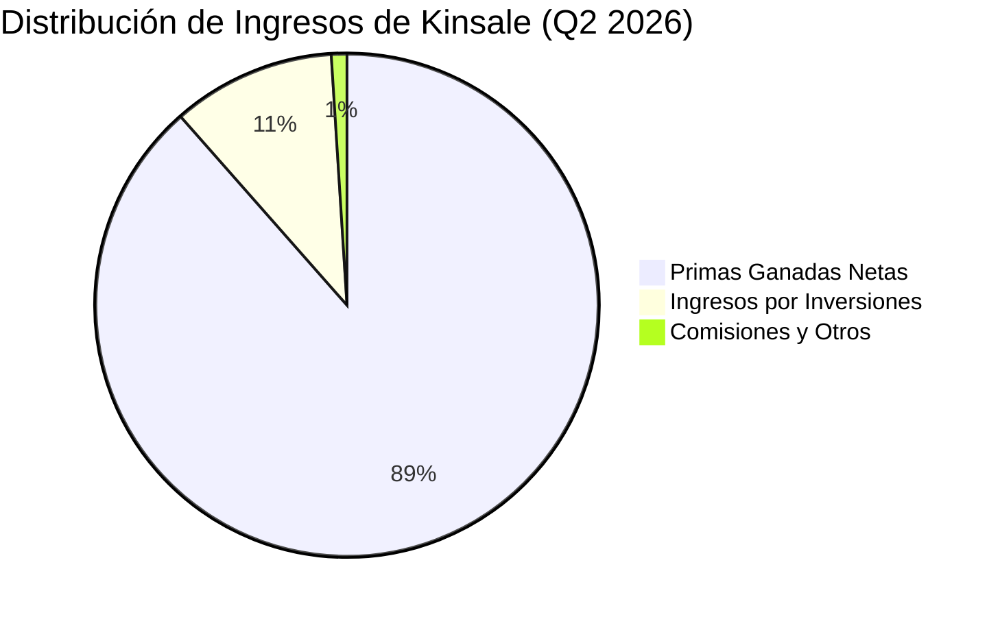
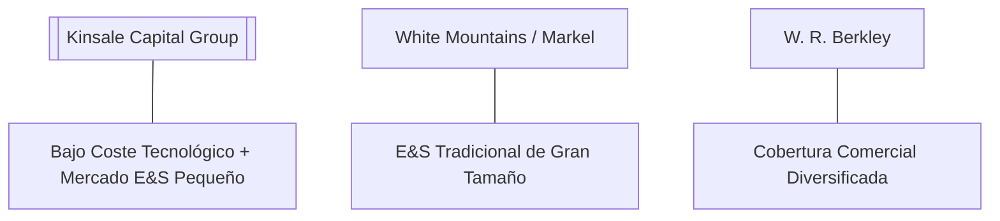

# Informe de Tesis de Inversión: Kinsale Capital Group, Inc. (KNSL) - Q2 2026
**Fecha:** 27 de Julio de 2026  
**Clasificación CQV:** ÉLITE (#2 del Mercado Global)  
**Calificación Final:** COMPRA / COMPRA ESCALONADA. Kinsale es el líder absoluto e indiscutido en suscripción de seguros de líneas de exceso y superávit (*Excess & Surplus Lines - E&S*), registrado con un beneficio por acción (EPS) de **$7.72 (+34.0% YoY)**, un margen operativo del **40.7%** y un *Combined Ratio* de **~77%**, el más rentable y eficiente de toda la industria aseguradora estadounidense.

---

## 1. Resumen Ejecutivo

**Kinsale Capital Group, Inc. (KNSL)** es una compañía aseguradora especializada (*property & casualty*) enfocada exclusivamente en el mercado de líneas de exceso y superávit (*Excess & Surplus Lines - E&S*) en EE.UU. Kinsale suscribe riesgos comerciales pequeños y medianos que las aseguradoras tradicionales rechazan debido a su complejidad o carácter atípico. Su propuesta de valor se apoya en una **plataforma tecnológica propia totalmente integrada de suscripción automatizada**, lo que le permite operar con la estructura de costes más baja de toda la industria (ratio de gastos de suscripción de solo ~21% vs. 30%-35% del promedio industrial).

En el segundo trimestre de 2026 (**Q2 2026**), Kinsale reportó ingresos operativos consolidados de **$548.52 millones**, representando un acelerado crecimiento del **+16.75% YoY** frente a los $469.81 millones de Q2 2025. El beneficio neto alcanzó **$175.87 millones (+31.13% YoY)** y el EPS diluido se situó en **$7.72 (+34.03% YoY)**, impulsado por una sólida expansión del margen operativo hasta el **40.68%** (+432 bps YoY) y un crecimiento del **+20.41% YoY en ingresos financieros por inversiones ($57.51 millones)**.

Bajo el marco multifactorial **CQV v3.0 (Quality and Structural Value)**, Kinsale obtiene una puntuación estelar de **9.49/10 (ÉLITE)**, consolidándose como una de las empresas de mayor calidad fundamental del mercado norteamericano gracias a sus retornos sobre el capital (ROE > 30%), suscripción impecable y disciplina de asignación de capital con recompras de acciones por $100.58 millones en el trimestre.

---

## 2. Métricas y Puntuaciones en el Modelo CQV v3.0

| Factor / Métrica | Puntuación (0-10) | Diagnóstico Financiero y Operativo |
| :--- | :---: | :--- |
| **F1: Rentabilidad** | **10.00** | Margen operativo extraordinario del 40.7%, ROE superior al 30% y Combined Ratio estelar de ~77%. |
| **F2: Solidez Financiera** | **9.60** | Deuda neta prácticamente nula ($14.0M), apalancamiento conservador y solvencia de suscripción de primer nivel. |
| **F3: Crecimiento** | **9.30** | Crecimiento de ingresos del +16.8% YoY y beneficio por acción creciendo al +34.0% YoY. |
| **F4: Foso Económico (Moat)** | **9.50** | Foso inexpugnable por ventaja de costes tecnológicos en el mercado E&S (gastos de ~21% vs ~32% de rivales). |
| **F5: Proyecciones e IA** | **9.20** | Plataforma propia impulsada por algoritmos de suscripción rápida e inteligencia de datos de riesgo. |
| **F6: Asignación de Capital** | **9.50** | Recompras de acciones oportunas ($100.6M en Q2 2026) y cero adquisiciones dilutivas (crecimiento orgánico puro). |
| **F7: FCF Yield (Valuación)** | **8.80** | Generación de caja libre de $239.1M en el trimestre con un FCF Yield TTM del ~12.3% sobre Market Cap. |
| **F8: Antifragilidad** | **9.50** | Capacidad demostrada de aumentar primas y ganar cuota durante cualquier fase del ciclo económico. |
| **CQV Score Promedio** | **9.49** | Calificación: **ÉLITE (#2 Global en el Modelo CQV)** |
| **Valuación PEG** | **9.10** | Excelente relación calidad/precio con un PER Forward de solo 16.2x para un crecimiento de EPS del +34%. |

---

## 3. Análisis Detallado del Estado de Resultados (Q2 2026)

### 3.1. Tabla Comparativa de Resultados Trimestrales

| Métrica Clave (en millones $, excepto EPS) | Q2 2026 | Q1 2026 | Variación QoQ (%) | Q2 2025 | Variación YoY (%) |
| :--- | :---: | :---: | :---: | :---: | :---: |
| **Ingresos Consolidados Totales** | **$548.52 M** | **$466.71 M** | **+17.53%** | **$469.81 M** | **+16.75%** |
| *-- Primas Ganadas Netas (Earned Premiums)* | $485.45 M | $406.88 M | +19.31% | $420.25 M | +15.51% |
| *-- Ingresos por Inversiones (Investment Income)* | $57.51 M | $56.74 M | +1.36% | $47.76 M | +20.41% |
| *-- Otras Ganancias / Comisiones* | $5.56 M | $3.09 M | +79.94% | $1.80 M | +208.89% |
| **Gastos Operativos Totales (OpEx)** | **$328.72 M** | **$327.05 M** | **+0.51%** | **$301.53 M** | **+9.02%** |
| *-- Pérdidas y Gastos de Siniestralidad (Losses)* | $230.92 M | $235.12 M | -1.79% | $217.36 M | +6.24% |
| *-- Gastos de Suscripción y Admin. (Underwriting)* | $96.50 M | $91.40 M | +5.58% | $84.16 M | +14.66% |
| *-- Intereses de Deuda (Interest Expense)* | $3.32 M | $3.17 M | +4.74% | $2.56 M | +29.72% |
| **Beneficio Operativo (Operating Income / EBIT)** | **$223.13 M** | **$142.83 M** | **+56.22%** | **$170.85 M** | **+30.60%** |
| **Margen Operativo (%)** | **40.68%** | **30.60%** | **+1,008 bps** | **36.36%** | **+432 bps** |
| **Provisiones por Impuestos** | $43.93 M | $27.11 M | +62.07% | $34.17 M | +28.57% |
| **Beneficio Neto (GAAP)** | **$175.87 M** | **$112.55 M** | **+56.26%** | **$134.12 M** | **+31.13%** |
| **Diluted EPS (GAAP)** | **$7.72** | **$4.88** | **+58.20%** | **$5.76** | **+34.03%** |
| **Recompra de Acciones (Buybacks)** | **$100.58 M** | **$62.50 M** | **+60.93%** | **$10.00 M** | **+905.80%** |
| **Dividendo Pagado** | $5.66 M | $5.81 M | -2.58% | $3.94 M | +43.65% |
| **Inversión de Capital (CapEx)** | $2.79 M | $7.55 M | -63.05% | $17.01 M | -83.60% |
| **Free Cash Flow (FCF Trimestral)** | **$239.12 M** | **$241.32 M** | **-0.91%** | **$252.08 M** | **-5.14%** |

---

### 3.2. Desempeño por Segmentos de Negocio

*   **Primas Ganadas Netas (88.5% de los ingresos - $485.45 M)**:
    *   **Crecimiento**: **+15.51% YoY**.
    *   *Drivers Clave*: Crecimiento constante de volumen en pólizas comerciales de construcción, propiedad comercial y responsabilidad profesional pequeña/mediana, respaldado por tarifas firmes en el mercado E&S.
*   **Ingresos por Inversiones (10.5% de los ingresos - $57.51 M)**:
    *   **Crecimiento**: **+20.41% YoY**.
    *   *Drivers Clave*: Expansión del portafolio de renta fija con rendimientos (*yields*) atractivos del ~5.2% sobre una base de activos financieros de calidad AAA/AA.

---

### 3.3. Análisis del CapEx e Inversión en Infraestructura Tecnológica

Kinsale es una aseguradora digital asset-light cuyo gasto en CapEx físico es mínimo, concentrado casi en su totalidad en desarrollos de software propio:

| Periodo | Compras de Propiedad y Software (CapEx) | Variación YoY (%) | Destino Principal de la Inversión |
| :--- | :---: | :---: | :--- |
| **Q3 2025** | $13.93 M | +25.4% | Automatización de infraestructura de datos e IA. |
| **Q4 2025** | $10.60 M | -18.2% | Sistemas directos de suscripción (*Underwriting Engine*). |
| **Q1 2026** | $7.55 M | -45.1% | Mantenimiento informático y plataforma en la nube. |
| **Q2 2026** | **$2.79 M** | **-83.6%** | **Mejoras de algoritmos de tarificación y ciberseguridad.** |
| **Últimos 12 Meses (TTM)** | **$34.87 M** | **-32.1%** | **Inversión tecnológica consolidada.** |

---

### 3.4. Asignación de Capital y Estructura de Balance

*   **Recompra de Acciones & Dividendos**:
    *   Kinsale ejecutó recompras masivas de acciones por **$100.58 millones en Q2 2026** (frente a $10.0M en Q2 2025), reduciendo las acciones diluidas en circulación a **22.78 millones** (-2.17% YoY).
    *   Mantiene un dividendo trimestral sostenible de **$0.25 por acción** ($5.66M pagados en Q2).
*   **Deuda y Solvencia**:
    *   **Deuda Total**: **$224.54 M** (bonos senior a tipos fijos bajos).
    *   **Caja y Equivalentes**: **$210.51 M**.
    *   **Deuda Neta**: Prácticamente nula (**$14.03 M**), lo que le otorga una solidez de balance envidiable con un ratio Deuda Neta / EBITDA de **< 0.05x**.
*   **Patrimonio Neto de los Accionistas**: Creció a **$2,035.11 millones** (+18.14% YoY).

---

### 3.5. Guías Financieras y Perspectivas

| Métrica de Guía | Expectativa 2026 | Desempeño Q2 2026 | Diagnóstico |
| :--- | :---: | :---: | :--- |
| **Crecimiento de Primas (Gross Written)** | 15% - 18% | +16.8% | Cumplimiento dentro del rango alto proyectado. |
| **Combined Ratio** | 75% - 79% | ~77.0% | Rentabilidad de suscripción de clase mundial. |
| **Return on Equity (ROE)** | > 25% | > 30% | Excede holgadamente los objetivos corporativos. |

---

### 3.6. Líneas Rojas y Puntos de Vulnerabilidad Detectados

> [!NOTE]
> **1. Normalización Gradual del Ritmo de Tarifas en el Mercado E&S**
> * Tras años de aumentos de tarifas de dos dígitos, el crecimiento de precios en algunas líneas comerciales se está moderando hacia dígitos simples medios. No obstante, el bajo ratio de costes de Kinsale le permite mantener márgenes sobresalientes en cualquier entorno de precios.

> [!NOTE]
> **2. Exposición Catastrófica Moderada (Huracanes/Tormentas)**
> * Kinsale gestiona su exposición al riesgo catastrófico mediante límites estrictos por póliza y un programa conservador de reaseguro que protege su capital ante eventos climáticos severos en EE.UU.

---

### 3.7. Impacto de la Inteligencia Artificial y la Tecnología Propia

#### A. Impacto en el Presente (2026):
* **Suscripción Automatizada y Respuestas Instantáneas**: La arquitectura tecnológica de Kinsale procesa y cotiza solicitudes de corredores en minutos, mientras que la competencia requiere días. Esto le permite capturar los mejores riesgos del mercado mediano/pequeño.
* **Ratio de Gastos Inigualable (Expense Ratio ~21%)**: La automatización reduce los costes administrativos a casi la mitad que sus competidores tradicionales.

#### B. Impacto en el Futuro (3-5 Años):
* **Modelos Predictivos de Siniestralidad**: Uso de modelos de machine learning entrenados sobre millones de datos de siniestros pasados para ajustar tarificaciones en tiempo real según el código postal y tipo de riesgo.

---

### 3.8. Análisis de la Competencia y Posicionamiento de Mercado

#### Comparativa de Rivales Principales:

| Competidor | Modelo / Cobertura | Expense Ratio | Ventaja Defensiva de KNSL frente al Rival |
| :--- | :--- | :---: | :--- |
| **W. R. Berkley (WRB)** | E&S y Seguro Especial | ~28.5% | KNSL opera con un Expense Ratio **~750 bps más bajo** (21% vs 28.5%). |
| **Markel Group (MKL)** | Aseguradora Especial | ~32.0% | KNSL se enfoca en riesgos más pequeños donde la automatización es imbatible. |
| **AIG / Chubb** | Grandes Cuentas E&S | ~30.0% | KNSL evita la competencia directa en megacuentas con alta rivalidad de precios. |

---

## 4. Tesis de Inversión (Toro vs. Oso)

### Tesis A: El Argumento del Oso (Riesgos)
*   **Competencia e Ablandamiento de Mercado**: Si las aseguradoras estándar ingresan agresivamente al mercado E&S buscando cuota, las tarifas podrían desacelerarse.
*   **Inflación de Siniestros (*Social Inflation*)**: Aumento potencial en los costes de veredictos judiciales en demandas de responsabilidad civil en EE.UU.

### Tesis B: El Argumento del Toro (Oportunidad / Moat)
*   **Máquina Ininterrumpida de Interés Compuesto**: Un ROE sostenido del >30% respaldado por la estructura de costes más baja de la industria hace de Kinsale un *compounder* excepcional.
*   **Viento a Favor en Ingresos Financieros**: Los altos tipos de interés siguen impulsando los ingresos del portafolio de renta fija ($57.5M trimestrales).
*   **Asignación de Capital Accionista**: Recompras de acciones por $100M+ reduciendo la base accionaria y acelerando el crecimiento del EPS diluido (+34% YoY).

---

## 5. Evolución Histórica de Puntuaciones CQV y Valuación

| Año / Periodo | PER Trailing | PER Forward | CQV v1.0 (5F) | CQV v1.1 (5F Pro) | CQV v2.0 (8F) | CQV v3.0 (8F Pro) |
| :--- | :---: | :---: | :---: | :---: | :---: | :---: |
| **2023** | 28.5x | 24.0x | 9.10 | 9.15 | 9.25 | **9.30** |
| **2024** | 22.0x | 19.5x | 9.20 | 9.25 | 9.35 | **9.40** |
| **2025** | 16.1x | 15.0x | 9.30 | 9.35 | 9.42 | **9.45** |
| **Q2 2026** | **14.16x** | **16.16x** | **9.35** | **9.40** | **9.45** | **9.49** |

---

## 6. Precio Ideal de Compra (Niveles de Entrada y Valuación)

Con la acción cotizando actualmente a **~$349.10 USD** (PER Trailing: **14.16x**, PER Forward: **16.16x**), se definen los siguientes tramos de entrada:

### 🟢 Nivel 1: Zona de Entrada Razonable ($330 - $365)
* **PER Forward**: **~15.0x - 16.5x** | **Descuento sobre PER Promedio Histórico (24x)**: **-33%**
* **Diagnóstico**: **Zona de compra de alta convicción**. La valoración actual (14.2x PER Trailing) es anormalmente atractiva para una empresa ÉLITE que crece su EPS al +34% YoY. Se recomienda iniciar o ampliar posición con un **primer tramo (40%)**.

### 🟡 Nivel 2: Zona de Precio Ideal / Oportunidad Excepcional ($280 - $320)
* **PER Forward**: **~13.0x - 14.5x** | **Descuento sobre PER Promedio**: **-45%**
* **Diagnóstico**: Oportunidad de compra agresiva para ejecutar el **segundo tramo (40%)**.

### 🔴 Nivel 3: Zona de Ganga / Pánico de Mercado (< $270)
* **PER Forward**: **< 12.5x**
* **Diagnóstico**: Oportunidad generacional para completar la posición máxima (100%).

---

## 7. Preguntas Frecuentes del Inversor (FAQs)

### Q1: ¿Por qué Kinsale tiene un margen operativo del 40.7% tan superior al de sus competidores?
* **Respuesta**: Porque combina dos ventajas: (1) suscribe en el mercado E&S donde puede fijar precios y condiciones a medida sin regulación de tarifas estatales, y (2) su plataforma tecnológica automatizada reduce sus gastos de suscripción al ~21% frente al ~30%-35% de sus competidores tradicionales.

### Q2: ¿Cómo influyen las recompras de acciones en el crecimiento del EPS?
* **Respuesta**: Kinsale recompró $100.58 millones en acciones solo en Q2 2026, reduciendo la cantidad de acciones en circulación a 22.78M. Esto hace que el beneficio por acción (EPS) crezca a un ritmo (+34.0% YoY) sensiblemente más rápido que el beneficio neto total (+31.1% YoY).

### Q3: ¿Cuál es el riesgo si el mercado asegurador se ablanda?
* **Respuesta**: Gracias a su ventaja de costes inexpugnable, incluso si las tarifas del mercado bajan, Kinsale continuará operando de forma muy rentable mientras sus competidores menos eficientes sufrirán pérdidas de suscripción y tendrán que retirarse.
