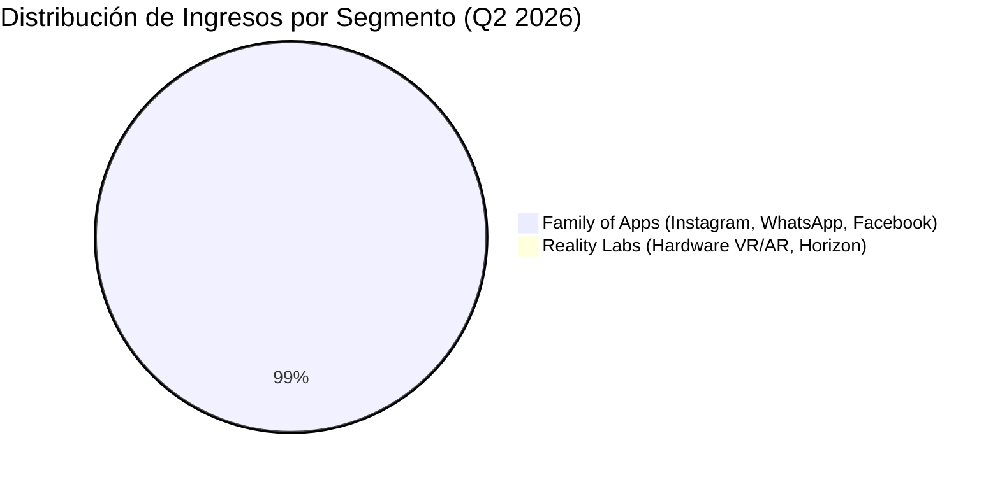

# Informe de Tesis de Inversión: Meta Platforms, Inc. (META) - Q2 2026
**Fecha:** 29 de Julio de 2026  
**Clasificación CQV:** ÉLITE  
**Calificación Final:** COMPRA ESCALONADA. Liderazgo incontestable en redes sociales a escala global (3,600M de usuarios diarios), hiperaceleración de ingresos publicitarios por IA (+28% YoY) y foso de red inexpugnable.

---

## 1. Resumen Ejecutivo

Meta Platforms, Inc. (META) presentó los resultados financieros del segundo trimestre de 2026 (Q2 2026, cerrado al 30 de junio de 2026), reflejando una demanda publicitaria extraordinaria apoyada en sus algoritmos de IA de recomendación de contenido y monetización.

Los **ingresos consolidados alcanzaron los $60,800 millones**, lo que representa un **impresionante crecimiento del +28.0% YoY**, superando el consenso de analistas ($60.2B). Las **impresiones de anuncios aumentaron un +14% YoY** y el **precio promedio por anuncio subió un +12% YoY**. 

El **beneficio operativo fue de $18,780 millones** (-8.0% YoY) con un **margen operativo del 30.89%** (frente al 43% en Q2 2025). El **beneficio neto GAAP se situó en $15,850 millones** ($6.18 EPS diluido), afectado temporalmente por **$3,580 millones en cargos extraordinarios** ($2.40B en provisiones judiciales/legales y $1.18B en indemnizaciones por reestructuración de personal). Excluyendo estos cargos no recurrentes, el beneficio operativo operativo continuó mostrando un apalancamiento saludable.

El segmento principal **Family of Apps (FoA)** generó **$60,370 millones en ventas** y **$23,390 millones en beneficio operativo**. La base de usuarios activos diarios (DAP) alcanzó **3,600 millones de personas (+3% YoY)**.

Bajo el marco de evaluación **CQV v3.0 (Quality and Structural Value)**, Meta obtiene una calificación de **9.36/10 (ÉLITE)**, consolidándose como la plataforma publicitaria de mayor ROI y escala de interacción del planeta.

---

## 2. Métricas y Puntuaciones en el Modelo CQV v3.0

| Factor / Métrica | Puntuación (0-10) | Diagnóstico Financiero y Operativo |
| :--- | :---: | :--- |
| **F1: Rentabilidad** | **9.30** | Margen operativo del 30.89% (38.5% ajustado por cargos no recurrentes); Family of Apps genera $23.4B de beneficio operativo. |
| **F2: Solidez Financiera** | **9.50** | Balance ultra conservador con >$65B en caja e inversiones líquidas; apalancamiento financiero mínimo. |
| **F3: Crecimiento** | **9.80** | Crecimiento acelerado de ingresos del +28.0% YoY a escala trimestral de $60.8B. Ad impressions (+14%) y precio/ad (+12%). |
| **F4: Foso Económico (Moat)** | **9.80** | Efecto de red imbatible con 3,600 millones de usuarios activos diarios a través de Instagram, WhatsApp, Facebook y Messenger. |
| **F5: Proyecciones e IA** | **9.50** | Líder en infraestructura e innovación de IA (Llama 4/5, IA generativa para anunciantes, optimización de Reels/Threads). |
| **F6: Asignación de Capital** | **9.00** | Retorno constante a accionistas vía recompras y dividendos; CapEx de $130-145B/año orientado al superciclo de IA. |
| **F7: FCF Yield (Valuación)** | **8.50** | P/E NTM atractivo de ~22x frente a un crecimiento de ventas del +28% YoY; FCF presionado temporalmente por CapEx. |
| **F8: Antifragilidad** | **9.20** | Modelo publicitario omnicanal de alta conversión con rápida adaptación tecnológica y resiliencia macro. |
| **CQV Score Promedio** | **9.36** | Calificación: **ÉLITE** |
| **Valuación PEG** | **9.10** | Cotizando a ~22x P/E NTM con crecimiento de ventas del +28% (PEG ~0.95x muy atractivo). |

---

## 3. Análisis Detallado del Estado de Resultados (Q2 2026)

### 3.1. Tabla Comparativa de Resultados Trimestrales

| Métrica Clave (en millones $, excepto EPS) | Q2 2026 | Q1 2026 | Variación QoQ (%) | Q2 2025 | Variación YoY (%) |
| :--- | :---: | :---: | :---: | :---: | :---: |
| **Ingresos Consolidados Totales** | **$60,800.0 M** | **$54,200.0 M** | **+12.2%** | **$47,500.0 M** | **+28.0%** |
| **-- Family of Apps (FoA)** | $60,370.0 M | $53,800.0 M | +12.2% | $47,150.0 M | +28.0% |
| **-- Reality Labs (RL)** | $431.0 M | $400.0 M | +7.8% | $350.0 M | +23.1% |
| **Costes y Gastos Totales** | **$42,030.0 M** | **$31,500.0 M** | **+33.4%** | **$27,100.0 M** | **+55.1%** |
| **Beneficio Operativo (Operating Income)** | **$18,780.0 M** | **$22,700.0 M** | **-17.3%** | **$20,400.0 M** | **-7.9%** |
| **-- OpInc Family of Apps** | $23,390.0 M | $26,500.0 M | -11.7% | $24,800.0 M | -5.7% |
| **-- OpLoss Reality Labs** | -$4,620.0 M | -$3,800.0 M | -21.6% | -$4,400.0 M | -5.0% |
| **Margen Operativo (%)** | **30.89%** | **41.88%** | **-1,099 bps** | **42.95%** | **-1,206 bps** |
| **Beneficio Neto (GAAP)** | **$15,850.0 M** | **$18,900.0 M** | **-16.1%** | **$18,430.0 M** | **-14.0%** |
| **Diluted EPS (GAAP)** | **$6.18** | **$7.35** | **-15.9%** | **$7.10** | **-13.0%** |
| **Usuarios Activos Diarios (DAP)** | **3,600 M** | **3,560 M** | **+1.1%** | **3,495 M** | **+3.0%** |
| **Inversión en CapEx Trimestral** | **$31,080.0 M** | **$18,500.0 M** | **+68.0%** | **$12,500.0 M** | **+148.6%** |

---

### 3.2. Desempeño por Segmentos de Negocio

*   **Family of Apps ($60,370 M - 99.3% de los ingresos)**:
    *   **Crecimiento**: +28.0% YoY.
    *   *Drivers Clave*: Crecimiento acelerado en la monetización publicitaria gracias a recomendaciones impulsadas por IA en Reels, aumento de precios promedio (+12%) y expansión del inventario en WhatsApp y Threads.
*   **Reality Labs ($431 M - 0.7% de los ingresos)**:
    *   **Crecimiento de Ventas**: +23.1% YoY.
    *   *Pérdida Operativa*: -$4,620 millones. Continuación del programa de I+D en gafas inteligentes Ray-Ban Meta y computación espacial.

---

### 3.3. Estructura de Balance y Asignación de Capital

*   **Inversiones en Infraestructura de IA (CapEx)**: En Q2 2026, la inversión en centros de datos y GPUs alcanzó **$31,080 millones**. Para el año fiscal completo 2026, Meta ajustó su rango de CapEx a **$130,000M – $145,000M**.
*   **Guía para Q3 2026**: Meta proyecta ingresos de entre **$61,000M y $64,000M** para el tercer trimestre de 2026.
*   **Plantilla de Empleados**: La nómina total se situó en 75,472 empleados (-1% YoY), consolidando la eficiencia tras los ajustes operativos.

---

## 4. Tesis de Inversión (Toro vs. Oso)

### Tesis A: El Argumento del Oso (Riesgos)
*   **Intensidad de CapEx en IA**: El acelerado plan de gasto en infraestructura ($130-145B en 2026) presiona temporalmente el Free Cash Flow y los márgenes a corto plazo.
*   **Pérdidas Continuas en Reality Labs**: Las pérdidas operativas de ~$18B/año en Reality Labs continúan absorbiendo caja de la división principal.

### Tesis B: El Argumento del Toro (Moat & Oportunidad)
*   **Monetización de IA de Alto Retorno**: A diferencia de competidores pura nube, Meta convierte la IA directamente en mayores conversiones publicitarias (+14% impresiones, +12% precios).
*   **Escala Social Inalcanzable**: 3.60 mil millones de usuarios diarios garantizan un engagement masivo y permanente que ninguna otra plataforma publicitaria posee.

---

## 5. Conclusión y Veredicto de Inversión

Meta Platforms demuestra una capacidad operativa sobresaliente al acelerar sus ingresos al +28% YoY en una escala de $60.8B trimestrales. Aunque los cargos por litigios no recurrentes y el fuerte CapEx de IA deprimieron el beneficio neto a corto plazo, la potencia del motor publicitario central permanece intacta.

**Veredicto:** **COMPRA ESCALONADA. Clasificación ÉLITE (CQV Score: 9.36/10).**
