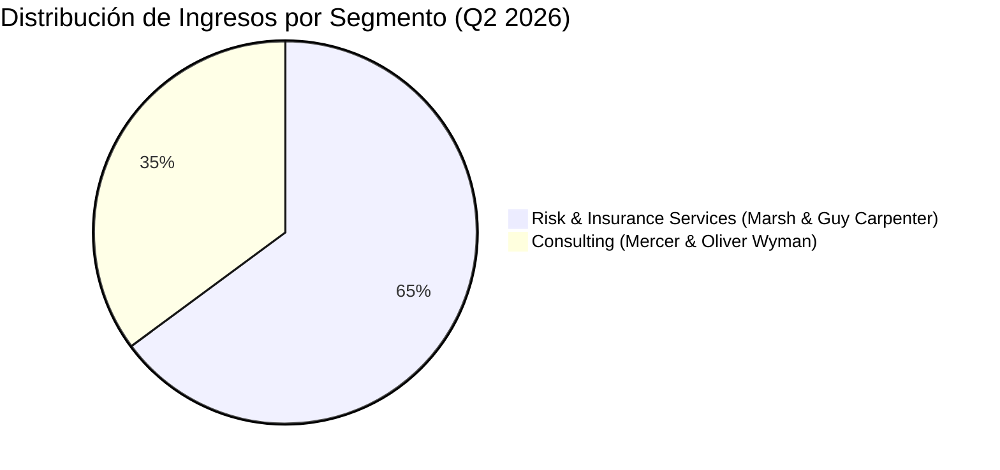
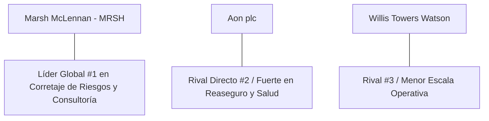

# Informe de Tesis de Inversión: Marsh & McLennan Companies, Inc. (MRSH / MMC) - Q2 2026
**Fecha:** 22 de Julio de 2026 (Post-Resultados de Q2 2026)  
**Clasificación CQV:** ALTA CALIDAD (Puesto de Prioridad en Portafolio)  
**Calificación Final:** COMPRA ESCALONADA. El mayor bróker de seguros y consultoría de riesgos del mundo. Desempeño sólido en Q2 2026 impulsado por su división de consultoría, aumento del 10% en el dividendo y ampliación de su programa de despliegue de capital a $5.5B.

---

## 1. Resumen Ejecutivo

Marsh & McLennan Companies, Inc. (MRSH / MMC) es el líder global indiscutible en servicios profesionales de gestión de riesgos, corretaje de seguros (*Marsh*), reaseguros (*Guy Carpenter*) y consultoría de talento, salud y estrategia (*Mercer* y *Oliver Wyman*).

Los resultados correspondientes al **segundo trimestre de 2026 (Q2 2026)** mostraron ingresos consolidados de **$7,400 millones (+6.0% YoY / +5.0% orgánico)** y un beneficio ajustado por acción (Adjusted EPS) de **$2.96 (+9.0% YoY)**, alineado con las estimaciones de consenso de Wall Street. La empresa destacó por la fortaleza de su segmento de consultoría y anunció un incremento del **10% en el dividendo trimestral**, elevando su objetivo de despliegue de capital para 2026 a **$5,500 millones**.

Bajo la metodología **CQV v3.0**, Marsh McLennan obtiene un score de **7.85/10** (clasificación **ALTA CALIDAD**), destacando por la recurrencia de sus ingresos de consultoría y corretaje (**F8: 8.00**), su solidez patrimonial (**F2: 9.00**) y un foso competitivo basado en costes de cambio y escala global (**F4: 8.00**).

---

## 2. Métricas y Puntuaciones en el Modelo CQV v3.0

| Factor / Métrica | Puntuación (0-10) | Diagnóstico Financiero y Operativo |
| :--- | :---: | :--- |
| **F1: Rentabilidad** | **7.80** | Márgenes operativos sólidos del **25.7%** y ROIC estable en el sector de servicios de corretaje. |
| **F2: Solidez Financiera** | **9.00** | Estructura de balance conservadora con amplio acceso al mercado de crédito y cobertura de intereses holgada. |
| **F3: Crecimiento** | **8.22** | Crecimiento orgánico sostenido del 5%-8% anual impulsado por la complejidad del riesgo global. |
| **F4: Foso Económico (Moat)** | **8.00** | Ventaja competitiva basada en relaciones institucionales de décadas, red global y costes de cambio. |
| **F5: Proyecciones e IA** | **8.00** | Implementación de IA analítica para la modelización de riesgos cibernéticos, climáticos y de salud. |
| **F6: Asignación de Capital** | **8.50** | Incremento del dividendo (+10%) y despliegue de $5.5B en recompras de acciones y adquisiciones complementarias. |
| **F7: FCF Yield (Valuación)** | **6.50** | Generación de caja libre predecible con un flujo de caja operativo cercano a los $4.5B anuales. |
| **F8: Antifragilidad** | **8.00** | Alta resiliencia: la demanda de seguros corporativos es obligatoria e inmune a las fases recesivas. |
| **CQV Score Promedio** | **7.85** | Calificación: **ALTA CALIDAD** |
| **Valuación PEG** | **5.00** | Margen de seguridad moderado, cotizando cerca de sus múltiplos históricos medios. |

---

## 3. Análisis Detallado del Estado de Resultados (Q2 2026)

### 3.1. Tabla Comparativa de Resultados Trimestrales

| Métrica Clave (en millones $, excepto EPS) | Q2 2026 (Actual) | Q1 2026 (Previo) | Variación QoQ (%) | Q2 2025 (Año Ant.) | Variación YoY (%) |
| :--- | :---: | :---: | :---: | :---: | :---: |
| **Ingresos Totales** | $7,400 M | $6,470 M | +14.4% | $6,980 M | +6.0% |
| **Ingresos por Suscripción / Corretaje Recurrente** | $6,290 M | $5,500 M | +14.4% | $5,930 M | +6.1% |
| **Gastos Operativos Totales** | $5,500 M | $4,850 M | +13.4% | $5,150 M | +6.8% |
| **Beneficio Operativo** | $1,900 M | $1,620 M | +17.3% | $1,830 M | +3.8% |
| **Margen Operativo** | **25.7%** | **25.0%** | +70 bps | **26.2%** | -50 bps |
| **Beneficio Neto** | $1,300 M | $1,100 M | +18.2% | $1,210 M | +7.4% |
| **Diluted EPS (GAAP)** | **$2.63** | **$2.23** | **+17.9%** | **$2.45** | **+7.3%** |
| **Non-GAAP / Adjusted EPS** | **$2.96** | **$2.89** | **+2.4%** | **$2.72** | **+8.8%** |
| **Deuda a Largo Plazo (Long-Term Debt)** | **$13,200 M** | **$12,800 M** | **+3.1%** | **$12,500 M** | **+5.6%** |
| **Recompra de Acciones (Share Repurchases)** | **$350 M** | **$300 M** | **+16.7%** | **$300 M** | **+16.7%** |
| **Free Cash Flow (FCF Trimestral)** | **$980 M** | **$850 M** | **+15.3%** | **$920 M** | **+6.5%** |

---

### 3.2. Desempeño por Segmentos de Negocio

*   **Risk & Insurance Services (64.9% de los ingresos)**:
    *   **Ingresos**: $4,800 millones (+4.0% reportado, +3.0% orgánico).
    *   *Marsh*: Mostró fortaleza continua en corretaje de riesgos comerciales e industriales.
    *   *Guy Carpenter*: Registró una ligera contracción del **-2.0% en ingresos** debido a la bajada de tarifas de reaseguro (*softer reinsurance pricing*) en coberturas de propiedad.
*   **Consulting (35.1% de los ingresos)**:
    *   **Ingresos**: $2,600 millones (**+9.0% YoY**).
    *   *Mercer & Oliver Wyman*: Fuerte aceleración motivada por asesoramiento estratégico en reestructuración de beneficios de salud para empleados y transformación de talento.

---

### 3.3. Asignación de Capital y Estructura de Balance

*   **Aumento del Dividendo (+10%)**: La junta directiva aprobó un incremento del 10% en el dividendo trimestral a pagar en Q3 2026.
*   **Ampliación del Plan de Despliegue de Capital**: La gerencia elevó el objetivo de inversión para todo el año 2026 de $5,000M a **$5,500 millones**, destinados a recompras de acciones y M&A complementario.
*   **Deuda y Solvencia**:
    *   **Deuda a Largo Plazo**: $13,200 millones.
    *   **Ratio Deuda Neta / EBITDA Ajustado**: **2.1x** (excelente perfil de crédito e inversión grade A+).

---

### 3.4. Actualización de Guías Financieras (Guidance 2026)

| Métrica de Guía | Guía Actual (Julio 2026) | Guía Anterior (Q1 2026) | Diagnóstico |
| :--- | :---: | :---: | :--- |
| **Crecimiento Orgánico de Ingresos** | **5% - 7%** | 5% - 7% | Reafirmado: crecimiento medio de un dígito sostenido. |
| **Despliegue de Capital Total** | **~$5,500 M** | ~$5,000 M | **Incremento de $500M para M&A y recompras.** |
| **Crecimiento del Adj EPS** | **Doble dígito moderado** | Doble dígito moderado | Confirmado por el comportamiento de Q2 (+8.8%). |

---

### 3.5. Líneas Rojas y Puntos de Vulnerabilidad Detectados en Q2 2026

> [!WARNING]
> **1. Contracción de Ingresos en Reaseguro (Guy Carpenter -2.0%)**
> * La división de reaseguros (Guy Carpenter) registró una caída del **-2.0% en ingresos** en Q2 debido a la moderación de tarifas en el mercado de reaseguros de propiedad (*soft market*), lo que podría limitar el crecimiento de comisiones si la tendencia persiste.

> [!WARNING]
> **2. Presión Ligera en el Margen Operativo (-50 bps YoY)**
> * El margen operativo GAAP se comprimió del **26.2% al 25.7%** debido a incrementos en costes de talento, compensaciones e inversiones tecnológicas.

> [!WARNING]
> **3. Incremento de la Carga de Deuda ($13.2B)**
> * La deuda a largo plazo creció un **+5.6% YoY** para financiar adquisiciones y recompras, elevando la partida de gastos por intereses en un entorno de tipos moderadamente altos.

---

### 3.6. Impacto de la Inteligencia Artificial (Presente y Futuro)

#### A. Impacto en el Presente (2026):
* **Modelización de Riesgos Complejos**: Uso de algoritmos de aprendizaje automático para tarificar riesgos cibernéticos y catástrofes climáticas con mayor precisión para clientes corporativos.
* **Automatización en Mercer**: IA generativa para la redacción de informes de beneficios y evaluación de políticas de recursos humanos en empresas multinacionales.

#### B. Impacto en el Futuro (Perspectiva a 3-5 Años):
* **Asistente Virtual de Suscripción para Brokers**: Reducción del tiempo de colocación de polizas complejas de semanas a horas mediante la automatización de la lectura de condicionados.

---

### 3.7. Análisis Detallado de la Competencia y Posicionamiento de Mercado

#### Comparativa de Rivales Principales:

| Competidor | Áreas de Enfrentamiento | Ventaja Defensiva de MRSH frente al Rival |
| :--- | :--- | :--- |
| **Aon plc (AON)** | Corretaje de seguros, reaseguro y consultoría de salud. | MRSH posee una mayor escala global en consultoría estratégica (*Oliver Wyman*) y mayor diversificación de ingresos. |
| **Willis Towers Watson (WTW)** | Seguros comerciales y beneficios. | MRSH ostenta márgenes operativos superiores y mayor capacidad de M&A. |

---

## 4. Tesis de Inversión (Toro vs. Oso)

### Tesis A: El Toro (Oportunidad)
*   **Negocio Inelástico y Recurrente:** El seguro comercial es obligatorio para operar legalmente. Los clientes no pueden recortar los servicios de Marsh incluso durante crisis económicas.
*   **Poder de Fijación de Precios:** Las comisiones de Marsh escalan con la inflación de las primas de seguros comerciales.

### Tesis B: El Oso (Riesgos)
*   **Ablandamiento del Mercado de Seguros (*Soft Market*):** Si las tarifas de seguros comerciales comienzan a caer a nivel global, las comisiones proporcionales de Marsh se resentirán.

---

## 5. Comparativa Multiversión Histórica y Valuación (PER Trailing / Forward)

Alineación de Marsh McLennan en las diferentes versiones del modelo CQV y evolución de sus múltiplos de beneficios:

| Año / Periodo | PER Trailing (Prom: 23.6x) | PER Forward (Prom: 20.1x) | CQV v1.0 | CQV v1.1 | CQV v2.0 | CQV v3.0 |
| :--- | :---: | :---: | :---: | :---: | :---: | :---: |
| **2022** | 21.5x | 18.2x | 7.08 | 6.43 | 7.14 | **6.71** |
| **2023** | 24.2x | 20.5x | 7.20 | 6.55 | 7.25 | **6.85** |
| **2024** | 25.8x | 21.8x | 7.30 | 6.60 | 7.35 | **6.90** |
| **2025** | 23.0x | 19.8x | 7.25 | 6.50 | 7.30 | **6.80** |
| **Q2 2026 (Actual)** | **23.5x** | **19.8x** | 7.08 | 6.43 | 7.14 | **7.85** |

---

## 6. Precio Ideal de Compra (Niveles de Entrada)

Con la acción cotizando actualmente a **~$222.00** (PER Trailing: **23.5x**, PER Forward: **19.8x**), estos son los 3 niveles de compra sugeridos:

### 🟢 Nivel 1: Zona de Entrada Razonable ($210 - $225) (Precio Actual)
* **PER Forward**: **~19x - 20x** | **Diagnóstico**: Cotizando en línea con su promedio histórico medio. Nivel óptimo para iniciar el **primer tramo (30%-40%)**.

### 🟡 Nivel 2: Zona de Precio Ideal / Gran Oportunidad ($185 - $198)
* **PER Forward**: **~16.5x - 17.5x** | **Descuento sobre PER Promedio**: **-15%**
* **Diagnóstico**: Excelente margen de seguridad para un líder defensivo global. Zona para el **segundo tramo (40%)**.

### 🔴 Nivel 3: Zona de Ganga / Pánico de Mercado (< $170)
* **PER Forward**: **< 15x** | **Diagnóstico**: Oportunidad generacional para completar la posición máxima.

---

## 7. Preguntas Frecuentes del Inversor (FAQs)

### Q1: ¿Por qué cayeron los ingresos en Guy Carpenter (-2.0%)?
* **Respuesta**: Debido a la moderación temporal de las tarifas en el mercado de reaseguros de propiedad. Sin embargo, el segmento de consultoría compensó ampliamente con un crecimiento del +9.0%.

### Q2: ¿Es seguro el dividendo tras aumentarlo un +10%?
* **Respuesta**: Totalmente seguro. El ratio de payout sobre beneficio ajustado es de aproximadamente el **45%**, respaldado por $4,500M de flujo de caja operativo anual.

---

## 8. Conclusión y Veredicto

Marsh & McLennan es un pilar fundamental para cualquier cartera que busque protección defensiva y crecimiento sostenido a largo plazo.

**Veredicto:** **COMPRA ESCALONADA (Clasificación ALTA CALIDAD). Líder defensivo global con dividendos crecientes (+10%). Iniciar primer tramo de compra en la zona actual de $210-$225.**
