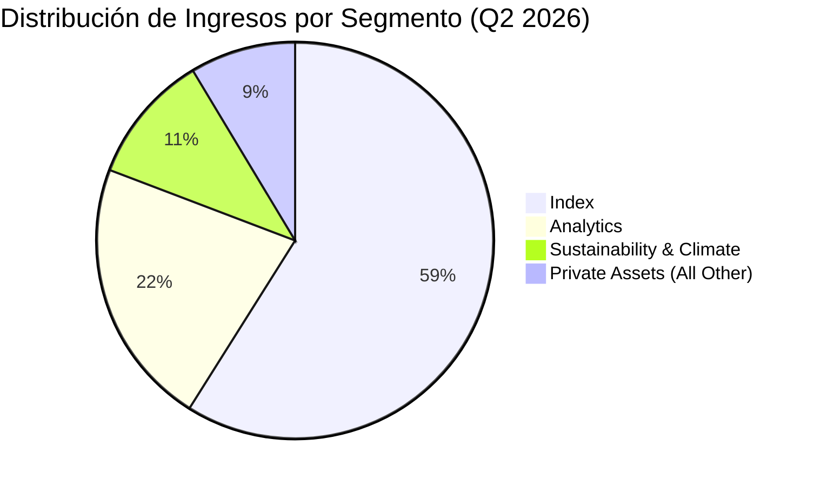
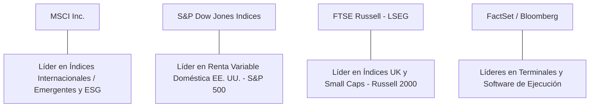

# Informe de Tesis de Inversión: MSCI Inc. (MSCI) - Q2 2026
**Fecha:** 21 de Julio de 2026 (Post-Resultados de Q2 2026)  
**Clasificación CQV:** ÉLITE (Puesto de Prioridad en Portafolio)  
**Calificación Final:** COMPRA. Excelente desempeño en el segundo trimestre de 2026 con un fuerte apalancamiento operativo, aumento de márgenes y sólida generación de caja.

---

## 1. Resumen Ejecutivo

MSCI Inc. es el principal proveedor de índices de renta variable y herramientas de análisis de carteras, sirviendo como la infraestructura subyacente crítica para los fondos mutuos, planes de pensiones y ETFs globales.

Los resultados correspondientes al **segundo trimestre de 2026 (Q2 2026)** demuestran la fortaleza del negocio tipo "peaje financiero" de MSCI. La facturación creció un **12.2%**, impulsada principalmente por un incremento del **26.6% en comisiones basadas en activos (Asset-based fees)** debido a flujos récords de capital y revalorización en los ETFs vinculados a sus índices. 

Bajo el marco multifactorial **CQV v3.0 (Quality and Structural Value)**, MSCI se consolida en la categoría **ÉLITE** con una puntuación de **9.05/10**, destacando su rentabilidad, Pricing Power y una conversión del beneficio en flujo de caja libre excelente.

---

## 2. Métricas y Puntuaciones en el Modelo CQV v3.0

| Factor / Métrica | Puntuación (0-10) | Diagnóstico Financiero y Operativo |
| :--- | :---: | :--- |
| **F1: Rentabilidad** | **10.00** | Retornos excepcionales: ROIC superior al 30% y Margen Operativo del 56.2%. |
| **F2: Solidez Financiera** | **8.50** | Estructura de deuda controlada. Ratio Deuda/EBITDA de 3.1x (dentro del rango objetivo). |
| **F3: Crecimiento** | **9.35** | Crecimiento de ingresos (+12.2%) y EPS Diluido (+19.6%) por encima del promedio del sector. |
| **F4: Foso Económico (Moat)** | **9.80** | Foso competitivo inigualable derivado de la marca y costos de cambio sistémicos. |
| **F5: Proyecciones e IA** | **9.65** | Lanzamiento acelerado de productos con IA para expandir el mercado de análisis de carteras. |
| **F6: Asignación de Capital** | **9.60** | Fuerte recompra de acciones ($147.2M en Q2) y dividendos crecientes ($2.05/acción en Q3). |
| **F7: FCF Yield (Valuación)** | **6.10** | Flujo de caja libre robusto ($326.4M) que ofrece un margen de seguridad razonable. |
| **F8: Antifragilidad** | **8.20** | Los ingresos recurrentes por suscripción (Run Rate de $3.48B) amortiguan caídas de mercado. |
| **CQV Score Promedio** | **9.05** | Calificación: **ÉLITE** |
| **Valuación PEG** | **7.25** | Margen de seguridad adecuado tras elevar guías de FCF para todo el año 2026. |

---

## 3. Análisis Detallado del Estado de Resultados (Q2 2026)

### 3.1. Comparativa Clave Q2 2026 vs Q2 2025

El trimestre muestra métricas operativas sobresalientes, con el crecimiento de beneficios superando significativamente al de ingresos gracias a la expansión de márgenes:

| Métrica (en millones $, excepto EPS) | Q2 2026 | Q2 2025 | Variación (%) |
| :--- | :---: | :---: | :---: |
| **Ingresos Operativos** | $867.0 | $772.7 | +12.2% |
| **Ingresos por Suscripción Recurrentes** | $613.4 | $562.8 | +9.0% |
| **Comisiones Basadas en Activos (Asset-based)** | $233.1 | $184.1 | +26.6% |
| **Gastos Operativos Totales** | $379.5 | $347.4 | +9.2% |
| **Beneficio Operativo** | $487.5 | $425.3 | +14.6% |
| **Margen Operativo** | **56.2%** | **55.0%** | +120 bps |
| **EBITDA Ajustado** | $538.5 | $474.4 | +13.5% |
| **Margen EBITDA Ajustado** | **62.1%** | **61.4%** | +70 bps |
| **Beneficio Neto** | $342.0 | $303.7 | +12.6% |
| **EPS Diluido (GAAP)** | **$4.69** | **$3.92** | **+19.6%** |
| **EPS Ajustado (Non-GAAP)** | **$4.94** | **$4.17** | **+18.5%** |
| **Deuda a Largo Plazo (Long-Term Debt)** | **$6,380.4** | **$6,202.3 (Dec 25)** | **+2.9%** |
| **Recompra de Acciones (Share Repurchases)** | **$145.0** | **$138.5** | **+4.7%** |
| **Free Cash Flow (FCF)** | **$326.4** | **$301.7** | **+8.2%** |

*   **Tasa de Retención de Suscripciones**: Aumentó al **95.3%** en el trimestre (frente al 94.4% del año anterior), confirmando la alta fidelidad y la naturaleza indispensable de sus servicios para los gestores de activos.
*   **Run Rate Total**: Alcanzó los **$3,479.7 millones** (+12.0% YoY), lo cual asegura visibilidad de ingresos recurrentes para los próximos 12 meses.

---

### 3.2. Desempeño por Segmentos de Negocio

*   **Segmento Index (58.9% de los ingresos)**:
    *   **Ingresos**: $511.0 millones (+17.5% reportado, +17.5% orgánico).
    *   **EBITDA Ajustado**: $397.8 millones (+20.5%).
    *   **Margen EBITDA**: **77.8%** (frente al 75.9% en Q2 2025).
    *   *Detalle*: Excelente apalancamiento impulsado por mayores AUM en ETFs indexados vinculados a MSCI y crecimiento de suscripciones en índices personalizados.
*   **Segmento Analytics (21.8% de los ingresos)**:
    *   **Ingresos**: $189.4 millones (+6.6%).
    *   **EBITDA Ajustado**: $88.0 millones (-5.0%).
    *   **Margen EBITDA**: **46.5%** (frente al 52.1% en Q2 2025).
    *   *Detalle*: Los márgenes se contrajeron debido a mayores costes de personal y gastos operativos para acelerar el desarrollo tecnológico y la integración de nuevos productos.
*   **Segmento Sustainability and Climate (10.6% de los ingresos)**:
    *   **Ingresos**: $91.9 millones (+3.4%).
    *   **EBITDA Ajustado**: $35.6 millones (+12.3%).
    *   **Margen EBITDA**: **38.7%** (frente al 35.6% en Q2 2025).
    *   *Detalle*: Aunque el crecimiento de ingresos se ha moderado (+3.0% orgánico), el segmento mejoró significativamente su rentabilidad operativa.
*   **Segmento Private Assets - All Other (8.6% de los ingresos)**:
    *   **Ingresos**: $74.7 millones (+4.9%).
    *   **EBITDA Ajustado**: $17.1 millones (-14.1%).
    *   **Margen EBITDA**: **22.9%** (frente al 28.0% en Q2 2025).
    *   *Detalle*: Muestra presión en márgenes por costes temporales derivados de la integración de las adquisiciones recientes (Compass, Vantager y PM Insights).

---

### 3.3. Asignación de Capital y Estructura de Balance

*   **Recompra de Acciones**: Durante el trimestre y hasta el 20 de julio de 2026, MSCI recompró un total de **$147.2 millones** (264,043 acciones) a un precio promedio de **$557.66**. Quedan **$1,600 millones** disponibles bajo la autorización de recompra vigente. Esto redujo el número promedio de acciones diluidas en un **5.9% YoY** (72.9 millones), impulsando el crecimiento del EPS.
*   **Deuda y Solvencia**:
    *   **Deuda Total**: $6,400 millones.
    *   **Caja y Equivalentes**: $356.4 millones.
    *   **Ratio Deuda Neta / EBITDA Ajustado (TTM)**: **3.1x** (dentro del rango objetivo corporativo de 3.0x a 3.5x).
*   **Adquisición Estratégica (First Street)**:
    *   El 24 de junio de 2026, MSCI firmó la adquisición de **First Street Technology, Inc.** por **$120.0 millones en efectivo** más pagos diferidos variables.
    *   *Objetivo*: Fortalecer la oferta de datos físicos de riesgo climático y análisis físico-técnico. Sus resultados financieros se integrarán dentro del segmento *Sustainability and Climate* en Q3 2026.

---

### 3.4. Incremento en las Guías Financieras para el Año Completo (Full-Year 2026)

Debido al fuerte impulso operativo y los activos bajo gestión récord, la directiva ha **revisado al alza** sus proyecciones de flujo de caja libre para el cierre del año 2026:

| Métrica de Guía | Guía Actual (Julio 2026) | Guía Anterior (Q1 2026) | Diagnóstico |
| :--- | :---: | :---: | :---: |
| **Gasto Operativo** | $1,535M - $1,575M | $1,490M - $1,530M | Incremento por consolidación de First Street y compensaciones variables. |
| **Gasto por Intereses** | $282M - $286M | $274M - $280M | Debido a mayores niveles de deuda contratada. |
| **Flujo de Caja Operativo** | $1,655M - $1,705M | $1,640M - $1,690M | Incremento debido a fuerte cobranza y facturación. |
| **Free Cash Flow (FCF)** | **$1,485M - $1,545M** | **$1,470M - $1,530M** | **Aumento de la guía de FCF, señalando excelente salud financiera.** |

---

### 3.5. Líneas Rojas y Puntos de Vulnerabilidad Detectados en Q2 2026

A pesar del sólido desempeño consolidado, un análisis forense de los estados financieros revela varios focos de atención y vulnerabilidades clave que deben ser monitoreados:

> [!WARNING]
> **1. Desaceleración Severa en el Segmento ESG (Sustainability and Climate)**
> * **Crecimiento Orgánico Estancado**: Los ingresos operativos del segmento crecieron solo un **+3.4%** (+3.0% orgánico), y las ventas no recurrentes se desplomaron un **-26.3%**.
> * **Run Rate Débil**: El Run Rate del segmento creció solo un **1.9% YoY** (3.2% en suscripciones orgánicas), señalando que la adopción institucional de métricas ESG enfrenta resistencia o una meseta temporal.
> * **Caída en Ventas Netas**: Las ventas netas del segmento cayeron un **-34.9%** ($4.1M frente a $6.3M en Q2 2025).

> [!WARNING]
> **2. Contracción Relevante de Márgenes en Analytics y Private Assets**
> * **Analytics (-560 bps)**: Aunque los ingresos subieron +6.6%, el EBITDA ajustado cayó un **-5.0%** ($88.0M vs $92.6M en Q2 2025), reduciendo el margen EBITDA del **52.1% al 46.5%**. Las ventas no recurrentes cayeron un **-55.7%**.
> * **Private Assets (-510 bps)**: El EBITDA ajustado se redujo un **-14.1%**, recortando el margen del **28.0% al 22.9%** por costes de integración de adquisiciones (Compass, Vantager, PM Insights).

> [!WARNING]
> **3. Fuerte Incremento en Gastos Financieros y Deuda Elevada**
> * **Aumento de Intereses (+53.7%)**: Los gastos por intereses saltaron de $46.2M a **$71.0M**, elevando los gastos netos por otros conceptos un **+47.8%** ($70.2M).
> * **Ratio de Deuda en el Techo Objetivo**: La deuda total asciende a **$6,400 millones** frente a solo $356.4M en caja. El ratio Deuda Neta / EBITDA Ajustado está en **3.1x**, rozando el techo de su rango objetivo corporativo (3.0x - 3.5x).

> [!WARNING]
> **4. Desaceleración en la Contratación de Nuevas Ventas Netas (Net Sales)**
> * **Ventas Brutas Totales (Gross Sales)**: Cayeron un **-3.3%** ($97.2M vs $100.5M en Q2 2025).
> * **Ventas Netas Totales (Net Sales)**: Cayeron un **-1.4%** ($68.1M vs $69.1M).
> * *Diagnóstico*: Demuestra que el impulso trimestral provino principalmente del mercado bursátil alcista (comisiones AUM) y no de un crecimiento en la firma de nuevos contratos.

> [!WARNING]
> **5. Revisión al Alza en la Guía de Gastos Operativos y Financieros**
> * La directiva elevó la guía de **Gastos Operativos** a $1,535M–$1,575M (frente a $1,490M–$1,530M previstos) y la de **Intereses de Deuda** a $282M–$286M (frente a $274M–$280M).

---

### 3.6. Impacto de la Inteligencia Artificial (Presente y Futuro)

La Inteligencia Artificial representa uno de los catalizadores más importantes para la transformación del modelo de negocio de MSCI:

#### A. Impacto en el Presente (2026):
* **Aceleración en el Desarrollo de Productos**: En lo que va de 2026, MSCI ha lanzado **el doble de productos** respaldados por tecnología de los que lanzó en todo el año 2024.
* **MSCI AI Assistant & Copilot**: Integración con Microsoft Azure OpenAI para permitir a los gestores de activos realizar consultas complejas en lenguaje natural sobre exposición a riesgos, métricas ESG y análisis de atribución de carteras.
* **Automatización de Recopilación de Datos**: Procesamiento de informes corporativos de más de 10,000 empresas globales mediante modelos de visión y NLP, reduciendo costes operativos de extracción de datos manual y mejorando la velocidad de actualización de sus índices.

#### B. Impacto en el Futuro (Perspectiva a 3-5 Años):
* **Direct & Custom Indexing Impulsado por IA**: Permite a gestores de patrimonio (*Wealth Management*) construir índices personalizados en segundos adaptados a restricciones fiscales o morales individuales de cada cliente.
* **Monetización de Datos Propietarios para Modelos LLM**: MSCI posee décadas de datos financieros y de atribución de riesgo altamente estructurados ("ground truth"). A medida que la industria financiera desarrolle modelos de IA generativa específicos, el valor de la propiedad intelectual de los conjuntos de datos de MSCI aumentará sustancialmente.

---

### 3.7. Análisis Detallado de la Competencia y Posicionamiento de Mercado

El mercado de proveedores de índices e infraestructura analítica está dominado por un oligopolio de alta calidad:

#### Comparativa de Rivales Principales:

| Competidor | Áreas de Solapamiento | Ventaja Relativa de MSCI frente al Rival | Rango de Moat |
| :--- | :--- | :--- | :---: |
| **S&P Global (SPGI)** | Índices globales y benchmarks de ETFs. | MSCI domina abrumadoramente la cuota de mercado en fondos de Renta Variable Internacional y Mercados Emergentes (ej. MSCI World, MSCI EM). | **Excepcional** |
| **FTSE Russell (LSEG)** | Índices y licencias de ETFs. | MSCI posee una marca institucional más fuerte en fondos mutuos globales y mayor pricing power con gestoras top. | **Alto** |
| **FactSet (FDS) / Bloomberg** | Herramientas de analítica de carteras (Analytics). | MSCI cuenta con el modelo *Barra*, el estándar de la industria en modelos de atribución de riesgo cuantitativo. | **Alto** |
| **Sustainalytics (Morningstar) / ISS** | Investigación de sostenibilidad y clima. | MSCI posee la base de datos de calificaciones ESG y riesgo climático más integrada con índices negociables. | **Moderado** |

#### Matriz de Ventajas Competitivas Defensivas de MSCI:
1. **Costes de Cambio Extremos**: Cambiar el benchmark de un fondo mutuo o ETF (de MSCI a FTSE) requiere aprobaciones reglamentarias, votos de accionistas del fondo y revisiones de prospectos legales, lo que genera una **tasa de retención del 95.3%**.
2. **Efecto Red de Liquidez**: Los contratos de opciones y futuros sobre índices MSCI (en bolsas como Cboe y Eurex) crean un ecosistema de liquidez tan profundo que los inversores institucionales no pueden migrar a competidores sin incurrir en mayores costes de transacción (*slippage*).

---

---

## 4. Tesis de Inversión (Toro vs. Oso)

### Tesis A: El Argumento del Oso (Trampa de Valor / Riesgos)
*   **Concentración en Clientes y Tarifas**: BlackRock y Vanguard concentran una porción relevante de los ETFs indexados bajo MSCI. Presiones de tarifas por su parte podrían dañar el margen.
*   **Desaceleración en ESG/Clima**: El segmento de Sustainability y Climate ha ralentizado su crecimiento orgánico al +3.0%, lo que sugiere que la adopción institucional de criterios climáticos podría estar alcanzando una meseta temporal.
*   **Incremento de Deuda**: La deuda neta se sitúa en $6.04B, y los gastos financieros anuales están subiendo ($282M-$286M previstos), reduciendo el margen neto directo.

### Tesis B: El Argumento del Toro (Oportunidad / Moat)
*   **Foso Económico por Monopolio de Marca**: Los índices de MSCI son el estándar de la industria. Si una gestora quiere lanzar un fondo global de mercados emergentes, está prácticamente obligada a pagar el peaje de la marca "MSCI Emerging Markets" para captar capital institucional.
*   **Apalancamiento de Activos Bajo Gestión**: MSCI cobra una comisión en puntos básicos sobre el AUM de los ETFs. A largo plazo, el crecimiento natural de los mercados financieros mundiales eleva los ingresos de MSCI de forma pasiva y sin necesidad de CapEx adicional.
*   ** Pricing Power y Retención del 95.3%**: Incrementos anuales de precios en suscripciones se trasladan directamente a los clientes sin apenas bajas en el servicio, lo que demuestra costos de cambio sistémicos.
*   **Innovación en IA aplicada a Finanzas**: MSCI está duplicando sus lanzamientos de productos en 2026 frente a 2024, integrando IA en sus modelos de carteras y gestión de riesgos para penetrar en nuevos segmentos como hedge funds y gestores de patrimonio privado.

---

## 5. Evolución Histórica de Puntuaciones CQV y Valuación (PER Trailing / Forward)

Alineación de MSCI en las diferentes versiones del modelo CQV y evolución de sus múltiplos de beneficios:

| Año / Periodo | PER Trailing (Prom: 39.5x) | PER Forward (Prom: 30.3x) | CQV v1.0 (5F Legacy) | CQV v1.1 (5F Pro) | CQV v2.0 (8F Legacy) | CQV v3.0 (8F Pro) |
| :--- | :---: | :---: | :---: | :---: | :---: | :---: |
| **2022** | 41.59x | 32.0x | 9.07 | 9.07 | 8.73 | **8.73** |
| **2023** | 38.08x | 29.5x | 9.48 | 9.48 | 9.00 | **9.00** |
| **2024** | 41.85x | 31.8x | 9.48 | 9.48 | 9.01 | **9.01** |
| **2025** | 36.29x | 28.0x | 9.43 | 9.43 | 8.97 | **8.97** |
| **Q2 2026 (Actual)** | **34.48x** | **26.7x** | 9.30 | 9.50 | 8.75 | **9.05** |

*Nota: La versión 3.0 Pro valora de forma positiva la eficiente asignación de capital (F6) y la resiliencia en la generación de flujo de caja libre demostrada en este último trimestre, compensando el incremento de apalancamiento financiero.*

---

## 6. Preguntas Frecuentes del Inversor (FAQs)

### Q1: ¿Por qué aumentan tanto los gastos de MSCI sin un impacto inmediato en las nuevas ventas netas?
* **1. El "Efecto Reina Roja" en IA y Nube**: MSCI debe invertir de forma continua en infraestructura cloud (Microsoft Azure OpenAI), modelos NLP y automatización para mantener su cuota de mercado y defender su retención del 95.3% frente a rivales como Bloomberg y FactSet.
* **2. Digestión de Adquisiciones (M&A)**: La compra de First Street ($120M), Compass, Vantager y PM Insights absorbe costes operativos e indemnizaciones inmediatas, mientras que las sinergias de ingresos tardan de 4 a 8 trimestres en manifestarse.
* **3. Inversión en Divisiones de Menor Margen**: La expansión hacia *Analytics* (margen 46.5%) y *Private Assets* (margen 22.9%) diluye temporalmente el margen consolidado frente al negocio superrentable de *Index* (margen 77.8%).
* **4. Desfase del Ciclo de Venta Institucional**: Los costes de desarrollo tecnológico se pagan hoy, pero las decisiones de contratación de grandes fondos mutuos y pensiones tardan de 12 a 18 meses en traducirse en ventas netas registradas.

### Q2: ¿Representa la carga de deuda ($6.4B) un peligro para el dividendo o las recompras de acciones?
* **Respuesta**: No representa un riesgo inminente de solvencia, pero exige mayor disciplina. El ratio Deuda Neta / EBITDA Ajustado está en **3.1x** (tocando el techo de su rango objetivo de 3.0x a 3.5x). El incremento del **+53.7% en gastos por intereses ($71.0M en el trimestre)** limitará la capacidad de hacer recompras de acciones aún más agresivas sin recurrir exclusivamente al flujo de caja libre operativo ($1.5B anuales).

### Q3: ¿Por qué la acción cayó un 10% tras el reporte si batió estimaciones de EPS?
* **Respuesta**: Wall Street castigó la desaceleración en la contratación de **nuevas ventas netas de suscripción (-1.4%)** y la contracción de márgenes en Analytics. El mercado percibió que el beneficio del trimestre creció por la subida pasiva de las bolsas (comisiones AUM +26.6%) y no por un acelerón en la firma de nuevos clientes.

---

## 7. Conclusión y Recomendación de Inversión

El informe de resultados de Q2 2026 reafirma que MSCI es una de las empresas de mayor calidad en el mundo. La compañía combina la predictibilidad de un negocio de suscripción de software SaaS con el potencial de revalorización pasiva del mercado bursátil mundial a través de sus comisiones por AUM. 

El incremento en la guía de FCF para todo el año 2026 y la constante recompra de acciones proporcionan un fuerte soporte para la cotización actual en bolsa.

**Veredicto:** **COMPRA (Clasificación ÉLITE). Negocio extraordinario de peaje financiero con ventajas competitivas estructurales intactas y crecimiento sólido.**
