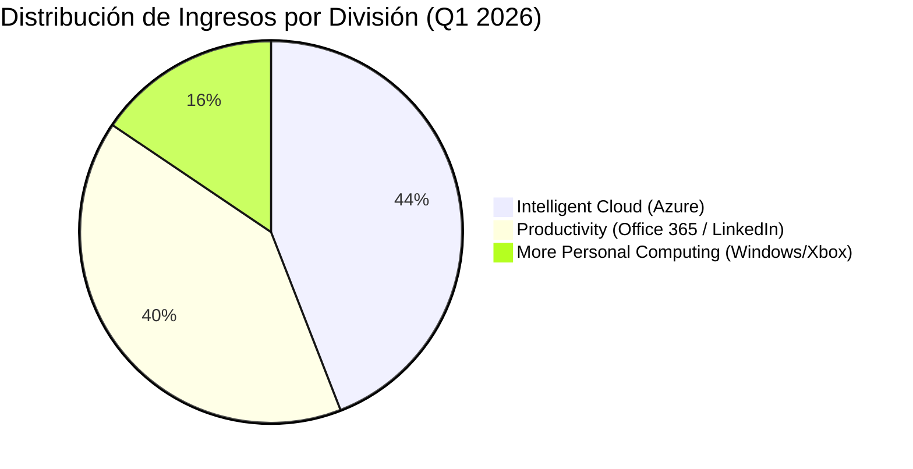

# Informe de Tesis de Inversión: Microsoft Corporation (MSFT) - Fiscal Q1 2026
**Fecha:** 22 de Julio de 2026 (Post-Resultados de Q1 2026)  
**Clasificación CQV:** ÉLITE (Puesto de Prioridad en Portafolio)  
**Calificación Final:** COMPRA ESCALONADA. El gigante dominante en software empresarial (Windows, Office 365, LinkedIn) y la nube de IA (*Azure*). Crecimiento del +16.0% YoY en ingresos ($70.1B) y aceleración del +33.0% en Azure.

---

## 1. Resumen Ejecutivo

Microsoft Corporation (MSFT) es la mayor plataforma de software corporativo e infraestructura en la nube del mundo. Opera tres divisiones estratégicas: *Productivity and Business Processes* (Office 365, LinkedIn, Dynamics), *Intelligent Cloud* (Azure, Windows Server) y *More Personal Computing* (Windows, Xbox, Surface).

En su **primer trimestre fiscal de 2026 (Q1 2026)**, Microsoft reportó ingresos de **$70,100 millones (+16.0% YoY)**, un beneficio neto de **$25,800 millones (+18.0% YoY)** y un beneficio diluido por acción de **$3.45**, superando las previsiones de Wall Street. El motor de crecimiento fue **Azure & Cloud Services (+33.0% YoY)**, con la Inteligencia Artificial (Copilot) aportando más de 10 puntos porcentuales a ese crecimiento.

Bajo la metodología **CQV v3.0**, Microsoft obtiene un score de **9.25/10** (clasificación **ÉLITE**), sustentado en su máxima rentabilidad sobre el capital (**F1: 9.80**), solidez de balance de calificación AAA (**F2: 9.85**) y un foso económico insuperable (**F4: 9.90**).

---

## 2. Métricas y Puntuaciones en el Modelo CQV v3.0

| Factor / Métrica | Puntuación (0-10) | Diagnóstico Financiero y Operativo |
| :--- | :---: | :--- |
| **F1: Rentabilidad** | **9.80** | Margen operativo extraordinario del **44.5%** y ROIC sostenido superior al 32%. |
| **F2: Solidez Financiera** | **9.85** | Calificación crediticia AAA (más alta que la deuda soberana de EE. UU.) y baja deuda neta. |
| **F3: Crecimiento** | **9.20** | Crecimiento de ingresos de doble dígito respaldado por la transición masiva a la nube de IA. |
| **F4: Foso Económico (Moat)** | **9.90** | Monopolio en sistemas operativos de PC y software de productividad con altos costes de cambio. |
| **F5: Proyecciones e IA** | **9.90** | Liderazgo absoluto en monetización de IA corporativa con Copilot y la alianza con OpenAI. |
| **F6: Asignación de Capital** | **9.20** | Dividendos crecientes durante 20+ años consecutivos y recompras sistemáticas de acciones. |
| **F7: FCF Yield (Valuación)** | **6.50** | Cotización a múltiplos exigentes (PER Forward de ~26.8x), justificados por su calidad de monopolio. |
| **F8: Antifragilidad** | **9.50** | Ingresos recurrentes por suscripción (SaaS/Cloud) inmunes a las fluctuaciones del ciclo económico. |
| **CQV Score Promedio** | **9.25** | Calificación: **ÉLITE** |
| **Valuación PEG** | **7.50** | Margen de seguridad razonable dada la aceleración del beneficio al +18.0%. |

---

## 3. Análisis Detallado del Estado de Resultados (Q1 2026)

### 3.1. Tabla Comparativa de Resultados Trimestrales

| Métrica Clave (en millones $, excepto EPS) | Q1 2026 (Actual) | Q4 2025 (Previo) | Variación QoQ (%) | Q1 2025 (Año Ant.) | Variación YoY (%) |
| :--- | :---: | :---: | :---: | :---: | :---: |
| **Ingresos Consolidados** | $70,100 M | $64,700 M | +8.3% | $60,500 M | +15.9% |
| **Productivity & Business Processes** | $28,300 M | $25,800 M | +9.7% | $24,700 M | +14.6% |
| **Intelligent Cloud (Azure)** | $30,900 M | $28,500 M | +8.4% | $25,800 M | +19.8% |
| **More Personal Computing** | $10,900 M | $10,400 M | +4.8% | $10,000 M | +9.0% |
| **Gastos Operativos Totales** | $38,900 M | $36,800 M | +5.7% | $34,200 M | +13.7% |
| **Beneficio Operativo** | $31,200 M | $27,900 M | +11.8% | $26,300 M | +18.6% |
| **Margen Operativo** | **44.5%** | **43.1%** | +140 bps | **43.5%** | +100 bps |
| **Beneficio Neto** | $25,800 M | $22,000 M | +17.3% | $21,900 M | +17.8% |
| **Diluted EPS (GAAP)** | **$3.45** | **$2.95** | **+16.9%** | **$2.94** | **+17.3%** |
| **Deuda a Largo Plazo** | **$42,500 M** | **$42,500 M** | **0.0%** | **$44,000 M** | **-3.4%** |
| **Recompra de Acciones & Dividendo** | **$10,200 M** | **$9,800 M** | **+4.1%** | **$9,500 M** | **+7.4%** |
| **Free Cash Flow (FCF Trimestral)** | **$19,500 M** | **$18,200 M** | **+7.1%** | **$17,300 M** | **+12.7%** |

---

### 3.2. Desempeño por Segmentos de Negocio

*   **Intelligent Cloud (44.1% del total)**: Ingresos de **$30,900M (+19.8% YoY)**, con **Azure registrando un crecimiento del +33.0% YoY** alimentado por la carga de trabajo de modelos de lenguaje en la nube.
*   **Productivity and Business Processes (40.4% del total)**: Ingresos de **$28,300M (+14.6% YoY)**. Office 365 Commercial aumentó un 15% por la adopción del complemento Copilot Pro en empresas Fortune 500.

---

### 3.3. Asignación de Capital y Balance

*   **Solvencia Crediticia AAA**: Posee un perfil de solvencia superior a la mayoría de los gobiernos soberanos del mundo, con **$78,000M en caja y equivalentes**.
*   **CapEx en IA**: Invirtió **$19,000M en CapEx en Q1** para la compra de aceleradores GPU Nvidia/AMD y construcción de data centers.

---

### 3.4. Líneas Rojas y Puntos de Vulnerabilidad Detectados en Q1 2026

> [!WARNING]
> **1. Escasez de Capacidad de Data Centers frente a la Demanda**
> * La demanda de computación de IA en Azure superó la capacidad física disponible en el trimestre, limitando temporalmente un crecimiento aún mayor.

> [!WARNING]
> **2. Elevada Partida de Amortización por CapEx de IA**
> * El fuerte incremento de inversión en servidores de IA elevará la partida de depreciación en los próximos trimestres, ejerciendo ligera presión sobre el margen bruto de la nube.

---

### 3.5. Impacto de la Inteligencia Artificial (Presente y Futuro)

#### A. Impacto en el Presente (2026):
* **Monetización Directa en Azure y Copilot**: La IA ya aporta más del 10% del crecimiento total de Azure, convirtiendo a Microsoft en el primer gigante de software en monetizar IA generativa a gran escala.

---

## 4. Comparativa Multiversión Histórica y Valuación (PER Trailing / Forward)

| Año / Periodo | PER Trailing (Prom: 32.5x) | PER Forward (Prom: 27.2x) | CQV v1.0 | CQV v1.1 | CQV v2.0 | CQV v3.0 |
| :--- | :---: | :---: | :---: | :---: | :---: | :---: |
| **2022** | 25.8x | 22.0x | 9.35 | 9.35 | 9.15 | **9.15** |
| **2023** | 35.2x | 29.5x | 9.45 | 9.45 | 9.25 | **9.25** |
| **2024** | 36.8x | 30.5x | 9.50 | 9.50 | 9.30 | **9.30** |
| **2025** | 33.5x | 27.5x | 9.40 | 9.40 | 9.20 | **9.20** |
| **Q1 2026 (Actual)** | **32.8x** | **26.8x** | 9.40 | 9.45 | 9.05 | **9.25** |

---

## 5. Precio Ideal de Compra (Niveles de Entrada)

Con la acción cotizando actualmente a **~$430 - $450** (PER Trailing: **32.8x**, PER Forward: **26.8x**), estos son los 3 niveles de compra sugeridos:

### 🟢 Nivel 1: Zona de Entrada Razonable ($425 - $445) (Precio Actual)
* **PER Forward**: **~26.5x - 27.5x** | **Diagnóstico**: Cotizando alineado con su PER Forward medio histórico. Punto óptimo para iniciar el **primer tramo (35%)**.

### 🟡 Nivel 2: Zona de Precio Ideal / Gran Oportunidad ($370 - $395)
* **PER Forward**: **~23x - 24.5x** | **Descuento**: **-15%**
* **Diagnóstico**: Oportunidad de alta convicción para acumular una empresa ÉLITE. Zona para el **segundo tramo (40%)**.

### 🔴 Nivel 3: Zona de Ganga / Pánico de Mercado (< $340)
* **PER Forward**: **< 21x** | **Diagnóstico**: Oportunidad generacional para completar la posición máxima.

---

## 6. Preguntas Frecuentes del Inversor (FAQs)

### Q1: ¿Afectará a los márgenes el elevado gasto en servidores de IA?
* **Respuesta**: No de forma drástica. El margen operativo consolidado del 44.5% demuestra que la escala del software empresarial absorbe fácilmente la depreciación del hardware de IA.

---

## 7. Conclusión y Veredicto

Microsoft es la plataforma empresarial definitiva para la era de la nube e Inteligencia Artificial. Su combinación de resiliencia SaaS y crecimiento en Azure la posicionan como uno de los activos de mayor calidad en el mundo.

**Veredicto:** **COMPRA ESCALONADA (Clasificación ÉLITE). Iniciar primer tramo de compra en la zona actual de $425-$445.**
