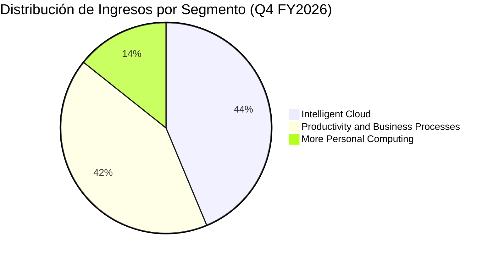

# Informe de Tesis de Inversión: Microsoft Corporation (MSFT) - Q4 FY2026 / Q2 2026
**Fecha:** 29 de Julio de 2026  
**Clasificación CQV:** ÉLITE  
**Calificación Final:** COMPRA ESCALONADA. Líder mundial indiscutible en software empresarial, infraestructura en la nube (Azure) y aceleración de Inteligencia Artificial (Copilot, OpenAI, Azure AI Foundry).

---

## 1. Resumen Ejecutivo

Microsoft Corporation (MSFT) reportó sus resultados correspondientes al cuarto trimestre del año fiscal 2026 (Q4 FY26 / Q2 2026 en año calendario), demostrando una fortaleza operativa excepcional impulsada por la aceleración en el consumo de nube e Inteligencia Artificial.

Los **ingresos consolidados alcanzaron los $90,000 millones**, lo que representa un **crecimiento del +18.0% YoY** (+17% en moneda constante), superando con creces las estimaciones del consenso de mercado ($87.6B). El **beneficio operativo aumentó un +18.0% YoY hasta los $40,600 millones**, manteniendo un margen operativo masivo del **45.11%**. El **beneficio neto GAAP creció un +31.0% YoY hasta los $35,800 millones** ($4.81 EPS diluido), mientras que el **beneficio neto Non-GAAP fue de $35,300 millones** (+22.0% YoY, $4.74 Non-GAAP EPS).

Los ingresos totales de **Microsoft Cloud aumentaron un +27% YoY hasta los $59,300 millones**, destacando un crecimiento acelerado del **+43% YoY en Azure y otros servicios de nube**. Por primera vez en la historia de la compañía, Azure superó los **$100,000 millones en ingresos anuales**.

Bajo el marco multifactorial **CQV v3.0 (Quality and Structural Value)**, Microsoft obtiene una puntuación de **9.59/10 (ÉLITE)**, consolidándose como uno de los compounders de mayor calidad y foso económico del planeta.

---

## 2. Métricas y Puntuaciones en el Modelo CQV v3.0

| Factor / Métrica | Puntuación (0-10) | Diagnóstico Financiero y Operativo |
| :--- | :---: | :--- |
| **F1: Rentabilidad** | **9.80** | Margen operativo del 45.11%, margen de nube del ~69% y ROIC real > 30%. Generación de caja masiva. |
| **F2: Solidez Financiera** | **9.85** | Calificación crediticia AAA. Posición neta de caja e inversiones extremadamente sólida; Deuda Neta/EBITDA ~0.1x. |
| **F3: Crecimiento** | **9.90** | Crecimiento de ingresos del +18.0% YoY a escala de $331.8B anuales. Azure acelerando al +43% YoY. |
| **F4: Foso Económico (Moat)** | **9.90** | Costes de cambio extremos y efectos de red en ecosistemas Windows, M365, Azure, GitHub y LinkedIn. |
| **F5: Proyecciones e IA** | **9.80** | Líder absoluto en la adopción de IA empresarial. M365 Copilot supera los 30M de asientos pagados. |
| **F6: Asignación de Capital** | **9.50** | Retorno constante de capital accionarial ($10,200M en Q4 mediante dividendos y recompras). |
| **F7: FCF Yield (Valuación)** | **8.20** | Generación de FCF anual > $75B. Valuación premium completamente justificada por la calidad del activo. |
| **F8: Antifragilidad** | **9.40** | Modelo altamente diversificado en B2B/B2C, SaaS, IaaS/PaaS y Gaming con alta recurrencia. |
| **CQV Score Promedio** | **9.59** | Calificación: **ÉLITE** |
| **Valuación PEG** | **8.60** | Cotizando a ~31x P/E NTM con crecimiento de EPS > 18% anual (PEG ~1.6x). |

---

## 3. Análisis Detallado del Estado de Resultados (Q4 FY2026 / Q2 2026)

### 3.1. Tabla Comparativa de Resultados Trimestrales / Anuales

| Métrica Clave (en millones $, excepto EPS) | Q4 FY2026 (Q2 26) | Q3 FY2026 (Q1 26) | Variación QoQ (%) | Q4 FY2025 (Q2 25) | Variación YoY (%) |
| :--- | :---: | :---: | :---: | :---: | :---: |
| **Ingresos Consolidados Totales** | **$90,000.0 M** | **$85,200.0 M** | **+5.6%** | **$76,440.0 M** | **+18.0%** |
| **-- Intelligent Cloud** | $39,300.0 M | $36,800.0 M | +6.8% | $29,770.0 M | +32.0% |
| **-- Productivity & Business Processes** | $37,800.0 M | $36,100.0 M | +4.7% | $33,160.0 M | +14.0% |
| **-- More Personal Computing** | $12,900.0 M | $12,300.0 M | +4.9% | $13,510.0 M | -4.5% |
| **Beneficio Operativo (Operating Income)** | **$40,600.0 M** | **$37,900.0 M** | **+7.1%** | **$34,390.0 M** | **+18.0%** |
| **Margen Operativo (%)** | **45.11%** | **44.48%** | **+63 bps** | **44.99%** | **+12 bps** |
| **Beneficio Neto (GAAP)** | **$35,800.0 M** | **$31,500.0 M** | **+13.7%** | **$27,330.0 M** | **+31.0%** |
| **Beneficio Neto (Non-GAAP)** | **$35,300.0 M** | **$31,200.0 M** | **+13.1%** | **$28,930.0 M** | **+22.0%** |
| **Diluted EPS (GAAP)** | **$4.81** | **$4.23** | **+13.7%** | **$3.64** | **+32.1%** |
| **Non-GAAP Diluted EPS** | **$4.74** | **$4.19** | **+13.1%** | **$3.85** | **+23.1%** |
| **Microsoft Cloud Revenue (Total)** | **$59,300.0 M** | **$54,800.0 M** | **+8.2%** | **$46,700.0 M** | **+27.0%** |
| **Retorno a Accionistas (Dividendo + Recompras)** | **$10,200.0 M** | **$9,800.0 M** | **+4.1%** | **$9,200.0 M** | **+10.9%** |

---

### 3.2. Desempeño por Segmentos de Negocio

*   **Intelligent Cloud ($39,300 M - 43.7% de los ingresos)**:
    *   **Crecimiento**: +32.0% YoY.
    *   *Drivers Clave*: Impulsado por el extraordinario crecimiento de **Azure y otros servicios de nube (+43% YoY)**. La demanda de infraestructura de computación e inferencia de IA superó la capacidad instalada, acelerando contratos multianuales de grandes empresas.
*   **Productivity and Business Processes ($37,800 M - 42.0% de los ingresos)**:
    *   **Crecimiento**: +14.0% YoY.
    *   *Drivers Clave*: Microsoft 365 Commercial cloud creció un **+16% YoY**, impulsado por la adopción de **Microsoft 365 Copilot**, que ya supera los **30 millones de usuarios pagados**. Crecimiento constante en LinkedIn y Dynamics 365.
*   **More Personal Computing ($12,900 M - 14.3% de los ingresos)**:
    *   **Crecimiento**: -4.5% YoY.
    *   *Drivers Clave*: Estabilización en licencias Windows OEM y ventas de Surface, compensado por ingresos sostenidos en contenidos y servicios de Xbox y publicidad en Bing.

---

### 3.3. Asignación de Capital y Estructura de Balance

*   **Retorno de Capital**: En el trimestre Q4 FY26, Microsoft devolvió **$10,200 millones** a los accionistas mediante dividendos y recompras de acciones en el mercado.
*   **Año Fiscal 2026 Completo**: En todo el año fiscal 2026, los ingresos alcanzaron **$331,800 millones** (+18.0% YoY) y el beneficio neto GAAP fue de **$133,700 millones**.
*   **Inversiones de Capital (CapEx)**: Microsoft continuó ampliando su infraestructura global de centros de datos de IA (adicionando más de 2 gigavatios de capacidad en el año) para satisfacer la demanda reprimida de capacidad de inferencia y entrenamiento.

---

## 4. Tesis de Inversión (Toro vs. Oso)

### Tesis A: El Argumento del Oso (Riesgos)
*   **Restricciones de CapEx e Infraestructura**: La alta demanda de GPUs y energía para centros de datos requiere un CapEx elevado que puede presionar marginalmente los márgenes de nube a corto plazo.
*   **Supervisión Regulatoria**: Escrutinio continuo por parte de reguladores antitrust en EE.UU. y Europa sobre alianzas de IA (OpenAI) y adquisiciones en Gaming.

### Tesis B: El Argumento del Toro (Moat & Oportunidad)
*   **Liderazgo de Plataforma en IA**: Microsoft es la compañía mejor posicionada para monetizar la tecnología de IA en capas de infraestructura (Azure) y de aplicación (Copilot en M365, GitHub, Security).
*   **Efecto de Red y Costes de Cambio**: La integración profunda de software empresarial (Office, Windows, Azure, Active Directory) hace que la tasa de retención de clientes sea imbatible (>95%).

---

## 5. Conclusión y Veredicto de Inversión

Microsoft reafirma su posición como la compañía tecnológica empresarial más completa y dominante del mundo. Con un crecimiento del +18% a escala de $331.8B, Azure creciendo al +43% YoY y la acelerada adopción de Copilot, el activo mantiene una visibilidad de flujos de caja inmejorable.

**Veredicto:** **COMPRA ESCALONADA. Clasificación ÉLITE (CQV Score: 9.59/10).**
