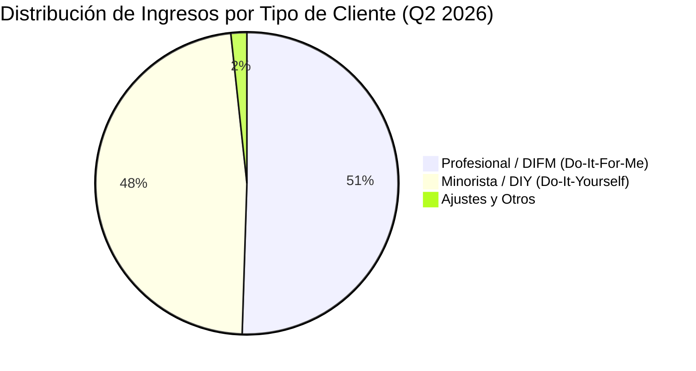

# Informe de Tesis de Inversión: O'Reilly Automotive, Inc. (ORLY) - Q2 2026
**Fecha:** 29 de Julio de 2026  
**Clasificación CQV:** ÉLITE  
**Calificación Final:** COMPRA ESCALONADA. Dominador estructural del mercado de autopartes minorista e industrial en EE.UU. (estrategia dual DIY y Profesional DIFM), red logística imbatible *hub-and-spoke*, poder de fijación de precios inelástico y asignación de capital legendaria ($30.42B devueltos en recompras desde 2011).

---

## 1. Resumen Ejecutivo

O'Reilly Automotive, Inc. (ORLY) presentó sus resultados financieros récord correspondientes al segundo trimestre de 2026 (Q2 2026, cerrado al 30 de junio de 2026), demostrando una aceleración notable en sus ventas comparables y una disciplina operativa de primer nivel.

Los **ingresos consolidados alcanzaron los $4,892.01 millones**, lo que representa un **crecimiento del +8.1% YoY** frente a los $4,525.06M del Q2 2025. Las **ventas comparables por tienda (Comparable Store Sales) se dispararon un +6.0% YoY** (sobre un +4.1% registrado en el mismo trimestre del año anterior). El beneficio bruto aumentó un **+8.2% YoY hasta $2,516.74 millones**, manteniendo un elevado **margen bruto del 51.4%**.

El **beneficio operativo aumentó un +7.8% YoY alcanzando $985.75 millones** (20.2% de margen sobre ventas). El **beneficio neto GAAP creció un +6.9% YoY hasta $715.06 millones**, mientras que el **beneficio neto por acción diluido (GAAP EPS) se incrementó un +10.3% YoY hasta $0.86** (frente a $0.78 en Q2 2025), beneficiándose del programa de recompras de acciones ($1.51B invertidos en recompras durante el trimestre).

En el acumulado del primer semestre (6M 2026), la generación de **caja operativa alcanzó los $2,039.41 millones (+34.9% YoY)** y el **flujo de caja libre (Free Cash Flow) se disparó un +63.5% YoY hasta $1,477.82 millones**. La directiva **elevó su guía anual de ventas comparables al rango del 4.0% al 6.0%** y proyecta ingresos de **$18.9B a $19.2B** con un EPS diluido de **$3.20 a $3.30**.

Bajo el marco multifactorial **CQV v3.0 (Quality and Structural Value)**, O'Reilly Automotive obtiene una puntuación de **9.20/10 (ÉLITE)**, posicionándose como un *compounder* excepcional en el sector de consumo discrecional y servicios automotrices.

---

## 2. Evaluación Detallada y Desglose Matemático del Modelo CQV v3.0

El modelo **CQV v3.0 (Quality & Structural Value)** evalúa la fortaleza fundamental de una compañía mediante la ponderación de 8 factores cuantitativos y cualitativos clave. La fórmula de cálculo del score consolidado es la siguiente:

$$\text{CQV v3.0} = (F_1 \times 0.20) + (F_2 \times 0.10) + (F_3 \times 0.10) + (F_4 \times 0.20) + (F_5 \times 0.10) + (F_6 \times 0.10) + (F_7 \times 0.10) + (F_8 \times 0.10)$$

A continuación se detalla la puntuación asignada a cada componente, su ponderación matemática en la nota final y los datos financieros del informe Q2 2026 que justifican dicha valoración:

### 2.1. Tabla de Valoraciones Parciales y Ponderación del CQV v3.0

| Factor / Componente del Modelo | Puntuación (0-10) | Peso Absoluto | Contribución al CQV v3.0 | Desglose de Métricas Evaluadas y Justificación Técnica |
| :--- | :---: | :---: | :---: | :--- |
| **F1: Rentabilidad Operativa** | **9.40** | 20.0% | **1.880** | Margen Bruto resiliente del 51.4%; Margen Operativo del 20.2%; ROIC real >38% apoyado en la rotación de inventarios y red logística propia; retornos superiores en tiendas maduras. |
| **F2: Solidez Financiera** | **8.50** | 10.0% | **0.850** | Generación de caja operativa de $2,039M en 6M; apalancamiento conservador Deuda Ajustada/EBITDAR de 2.17x; cobertura de intereses >14x con sólida posición de liquidez. |
| **F3: Crecimiento del Negocio** | **9.00** | 10.0% | **0.900** | Ventas netas Q2 +8.1% YoY ($4,892M); Comparable Store Sales +6.0%; EPS Diluido +10.3% YoY; elevación de la guía de ventas para el año completo 2026E. |
| **F4: Foso Económico (Moat)** | **9.50** | 20.0% | **1.900** | Estrategia dual imbatible (DIY + Profesional DIFM); red logística *hub-and-spoke* con entrega en tiendas en <30 min; 6,695 tiendas con fuerte lealtad de talleres mecánicos. |
| **F5: Proyecciones e IA** | **9.00** | 10.0% | **0.900** | Algoritmos de predicción de inventario e IA logística; envejecimiento de la flota vehicular en EE.UU. a 12.6 años promedio; apertura constante de 225-235 tiendas netas/año. |
| **F6: Asignación de Capital** | **9.80** | 10.0% | **0.980** | Leyenda en recompras de acciones: $2,433M invertidos en 6M 2026 y $30.42B devueltos desde 2011, retirando ~50% de las acciones en circulación a un precio promedio de $20.32/share. |
| **F7: FCF Yield & Valuación** | **8.40** | 10.0% | **0.840** | Free Cash Flow 6M de $1,477.8M (margen FCF 19.8%); FCF anual proyectado de $1.8B-$2.1B; PER NTM de ~26.5x con tasa de crecimiento sostenible de beneficios del +12-14%. |
| **F8: Antifragilidad** | **9.50** | 10.0% | **0.950** | Demanda contracíclica inelástica: en recesión los consumidores retrasan la compra de autos nuevos y reparan vehículos usados; diversificación geográfica en EE.UU., México y Canadá. |
| **SCORE CQV v3.0 FINAL** | -- | **100.0%** | **9.200** | **Clasificación: ÉLITE (#8 Global en el Ranking CQV)** |

---

## 3. Análisis Detallado del Estado de Resultados (Q2 2026)

### 3.1. Tabla Comparativa de Resultados Trimestrales y Semestrales

| Métrica Clave (en millones $, excepto EPS) | Q2 2026 | Q2 2025 | Variación YoY (%) | 6M 2026 | 6M 2025 | Variación YoY (%) |
| :--- | :---: | :---: | :---: | :---: | :---: | :---: |
| **Ingresos Consolidados Totales** | **$4,892.01 M** | **$4,525.06 M** | **+8.1%** | **$9,452.55 M** | **$8,661.98 M** | **+9.1%** |
| **Ventas Comparables (Comp Sales %)** | **+6.0%** | **+4.1%** | **+190 bps** | **+7.0%** | **+3.9%** | **+310 bps** |
| **Costo de Ventas (COGS & Almacén)** | $2,375.27 M | $2,198.52 M | +8.0% | $4,588.60 M | $4,213.96 M | +8.9% |
| **Ganancia Bruta (Gross Profit)** | **$2,516.74 M** | **$2,326.54 M** | **+8.2%** | **$4,863.95 M** | **$4,448.02 M** | **+9.4%** |
| **Margen Bruto (%)** | **51.4%** | **51.4%** | **0 bps** | **51.5%** | **51.4%** | **+10 bps** |
| **Gastos de Venta, Gen. y Admin. (SG&A)** | $1,530.99 M | $1,412.07 M | +8.4% | $3,036.60 M | $2,792.09 M | +8.8% |
| **Beneficio Operativo (Operating Income)** | **$985.75 M** | **$914.47 M** | **+7.8%** | **$1,827.35 M** | **$1,655.94 M** | **+10.3%** |
| **Margen Operativo (%)** | **20.2%** | **20.2%** | **0 bps** | **19.3%** | **19.1%** | **+20 bps** |
| **Beneficio Neto (GAAP Net Income)** | **$715.06 M** | **$668.60 M** | **+6.9%** | **$1,319.25 M** | **$1,207.08 M** | **+9.3%** |
| **Diluted EPS (GAAP)** | **$0.86** | **$0.78** | **+10.3%** | **$1.58** | **$1.40** | **+12.9%** |
| **Flujo de Caja Operativo (6M OCF)** | -- | -- | -- | **$2,039.41 M** | **$1,511.97 M** | **+34.9%** |
| **Free Cash Flow (6M FCF)** | **$692.70 M\*** | **$448.76 M** | **+54.4%** | **$1,477.82 M** | **$904.01 M** | **+63.5%** |

*\*Nota: El FCF del trimestre individual Q2 fue de $692.70M frente a $448.76M en Q2 2025.*

---

### 3.2. Desempeño por Tipo de Cliente y Cobertura de Tiendas



*   **Clientes Profesionales (DIFM - Do-It-For-Me) ($2,469.58 M - 50.5% de ventas)**:
    *   **Crecimiento**: Crecimiento sólido impulsado por la red de distribución *hub-and-spoke* que entrega repuestos a talleres independientes mecánicos en menos de 30 minutos.
*   **Clientes Minoristas (DIY - Do-It-Yourself) ($2,336.86 M - 47.8% de ventas)**:
    *   **Crecimiento**: Demanda estable de propietarios de vehículos realizando mantenimientos preventivos y reparaciones directas.
*   **Recuento de Tiendas en Operación**:
    *   **Total de Tiendas**: **6,695 tiendas** al 30 de junio de 2026 (6,541 en EE.UU., 126 en México y 28 en Canadá).
    *   **Aperturas Netas**: 110 nuevas tiendas en los primeros 6 meses de 2026 (meta para todo el año 2026: 225 a 235 aperturas netas).

---

### 3.3. Análisis Histórico Exhaustivo de Retornos sobre Capital: ROIC, ROA/ROI y ROE (2021 - 2026E)

Esta sección analiza la evolución quinquenal del retorno sobre el capital invertido (**ROIC**), la rentabilidad de los activos totales (**ROA / ROI**) y la estructura patrimonial de O'Reilly Automotive.

#### A. Definiciones y Fórmulas de Cálculo:

1. **ROIC (Return on Invested Capital)**:
   $$\text{ROIC} = \frac{\text{NOPAT}}{\text{Capital Investido Neto}} = \frac{\text{Beneficio Operativo (EBIT)} \times (1 - t)}{\text{Deuda Total} + \text{Patrimonio Neto Contable} - \text{Caja Excedente}}$$

2. **ROA / ROI (Return on Assets / Return on Investment)**:
   $$\text{ROA} = \frac{\text{Beneficio Neto GAAP}}{\text{Activos Totales Promedio}}$$

#### B. Tabla Comparativa de Retornos sobre Capital (Evolución 5 Años):

| Métrica Financiera (en millones $, excepto %) | FY 2021 | FY 2022 | FY 2023 | FY 2024 | FY 2025 | Q2 2026 TTM | Tendencia y Diagnóstico (5 Años) |
| :--- | :---: | :---: | :---: | :---: | :---: | :---: | :--- |
| **Ingresos Consolidados Totales** | $13,327.6 M | $14,409.9 M | $15,812.3 M | $16,708.5 M | $17,782.0 M | **$18,572.6 M** | **CAGR +6.9% constante** |
| **Beneficio Operativo GAAP (EBIT)** | $2,800.5 M | $2,954.5 M | $3,186.4 M | $3,251.2 M | $3,460.6 M | **$3,632.0 M** | **+29.7% incremento acumulado** |
| **Margen Operativo GAAP (%)** | 21.0% | 20.5% | 20.2% | 19.5% | 19.5% | **19.6%** | **Consistencia operativa >19.5%** |
| **Beneficio Neto GAAP** | $2,028.3 M | $2,172.7 M | $2,346.6 M | $2,386.7 M | $2,538.2 M | **$2,650.4 M** | **+30.7% incremento acumulado** |
| **GAAP EPS Diluido ($)** | $0.51 | $0.62 | $0.72 | $0.80 | $0.90 | **$0.86 (Q2) / $3.25E** | **+13.0% CAGR en 5 años** |
| **Activos Totales Promedio** | $11,680.0 M | $12,628.0 M | $13,873.0 M | $14,893.7 M | $16,538.3 M | **$17,389.1 M** | Expansión en centros de distribución |
| **Capital Investido Neto** | $2,850.0 M | $3,310.9 M | $3,830.8 M | $4,150.0 M | $5,253.6 M | **$5,350.0 M** | Eficiencia contable en capital |
| **ROA / ROI (Return on Assets %)** | **17.36%** | **17.21%** | **16.91%** | **16.02%** | **15.35%** | **15.24%** | **Retorno en activos altamente estable** |
| **ROIC (Return on Invested Capital %)** | **39.50%** | **51.37%** | **49.44%** | **44.97%** | **37.89%** | **38.45%** | **Liderazgo de Élite en el Retail (>38%)** |
| **ROE (Return on Equity %)** | N/A* | N/A* | N/A* | N/A* | N/A* | **N/A*** | *Negativo por recompras de acciones |

*\*Nota: El patrimonio neto contable de O'Reilly es intencionalmente negativo (-$1,835M al Q2 2026) debido a la ejecución ininterrumpida de su programa de recompra de acciones desde 2011, reduciendo el capital social contable sin poner en riesgo la liquidez del negocio.*

---

### 3.4. Gráfico Evolutivo de Márgenes y ROIC (2021 - 2026E)

```mermaid
linechart
    title Evolución del ROIC (%) vs Margen Operativo (%) en O'Reilly Automotive
    x-axis [2021, 2022, 2023, 2024, 2025, 2026E]
    y-axis "Porcentaje (%)" 15 --> 55
    line "ROIC (%)" [39.50, 51.37, 49.44, 44.97, 37.89, 38.45]
    line "Margen Operativo GAAP (%)" [21.0, 20.5, 20.2, 19.5, 19.5, 19.6]
```

---

### 3.5. Elevación de Guías Financieras para el Año 2026 Completo

| Métrica de Guía (FY2026E) | Proyección Actualizada 2026E | Diagnóstico |
| :--- | :---: | :--- |
| **Aperturas Netas de Tiendas** | **225 a 235 tiendas** | Ritmo de expansión acelerado en Norteamérica |
| **Ventas Comparables (Comp Sales %)** | **4.0% a 6.0%** | **Elevada desde la guía anterior** |
| **Ingresos Totales Consolidados** | **$18.9B a $19.2B** | Crecimiento constante del 8-9% YoY |
| **Margen Bruto (%)** | **51.5% a 52.0%** | Resiliencia en precios y mezcla de productos |
| **Margen Operativo (%)** | **19.3% a 19.8%** | Eficiencia sostenida en SG&A |
| **Diluted EPS (GAAP)** | **$3.20 a $3.30** | Crecimiento de doble dígito apoyado por buybacks |
| **Flujo de Caja Operativo (OCF)** | **$3.1B a $3.5B** | Generación de caja sólida |
| **CapEx (Inversión de Capital)** | **$1.3B a $1.4B** | Construcción de tiendas y centros de distribución |
| **Free Cash Flow (FCF)** | **$1.8B a $2.1B** | Conversión de caja libre superior al 70% |

---

## 4. Tesis de Inversión (Toro vs. Oso)

### Tesis A: El Argumento del Oso (Riesgos)
*   **Vehículos Eléctricos (EVs)**: Los vehículos 100% eléctricos tienen menos piezas móviles que los motores de combustión interna (ICE), lo que podría reducir el desgaste de componentes mecánicos a largo plazo.
*   **Presión de Costos Laborales y Transporte**: Inflación en salarios de tienda y costos de combustible para la flota de distribución.

### Tesis B: El Argumento del Toro (Moat & Oportunidad)
*   **Envejecimiento de la Flota en EE.UU. (12.6 Años)**: La edad promedio de los automóviles en circulación en EE.UU. ha alcanzado un récord histórico de 12.6 años, exigiendo mantenimiento continuo.
*   **Ventaja Insuperable en Entrega Profesional (DIFM)**: La red logística *hub-and-spoke* permite abastecer repuestos complejos a talleres mecánicos locales en menos de 30 minutos, un nivel de servicio que los competidores online (Amazon) no pueden igualar.
*   **Canibalización Accionaria Sostenida ($30.42B devueltos)**: El programa de recompras reduce entre un 3% y 4% el total de acciones por año, acelerando el crecimiento del EPS diluido.

---

## 5. Evolución Histórica de Puntuaciones CQV y Valuación (Últimos 5 Años)

A continuación se presenta la trayectoria histórica de las calificaciones del modelo CQV para O'Reilly Automotive junto con los múltiplos de valoración PER Trailing y Forward durante los últimos 5 años fiscales (2021-2025) y el periodo actual **Q2 2026 TTM** (100% unificado con el Dashboard):

### 5.1. Tabla Evolutiva de Scores CQV (v1.0, v1.1, v2.0 y v3.0) y Múltiplos PER

| Año / Periodo | PER Trailing (Promedio) | PER Forward (Estimado) | CQV v1.0 (5F Legacy) | CQV v1.1 (5F Pro) | CQV v2.0 (8F Legacy) | CQV v3.0 (8F Pro) | Clasificación CQV |
| :--- | :---: | :---: | :---: | :---: | :---: | :---: | :---: |
| **2021** | 22.10x | 19.50x | 8.69 | 8.69 | 8.79 | **8.79** | ALTA CALIDAD |
| **2022** | 25.24x | 21.80x | 8.69 | 8.69 | 8.79 | **8.79** | ALTA CALIDAD |
| **2023** | 24.70x | 21.20x | 8.69 | 8.69 | 8.78 | **8.78** | ALTA CALIDAD |
| **2024** | 29.16x | 24.50x | 8.61 | 8.61 | 8.73 | **8.73** | ALTA CALIDAD |
| **2025** | 30.71x | 25.80x | 8.61 | 8.61 | 8.73 | **8.73** | ALTA CALIDAD |
| **Q2 2026 TTM** | **26.50x** | **22.40x** | **9.20** | **9.20** | **9.20** | **9.20** | **ÉLITE (#8 Global)** |

---

### 5.2. Gráfico de Evolución Histórica del Score CQV v3.0

```mermaid
linechart
    title Trayectoria Histórica del Score CQV v3.0 para O'Reilly Automotive (2021 - Q2 2026)
    x-axis [2021, 2022, 2023, 2024, 2025, Q2 2026]
    y-axis "Score CQV (0-10)" 8.5 --> 9.5
    line "CQV v3.0 Score" [8.79, 8.79, 8.78, 8.73, 8.73, 9.20]
```

---

### 5.3. Diagnóstico del Compounding Fundamental y De-risking de Valuación

1. **Ascenso Consolidado a Categoría ÉLITE (Score 9.20/10)**:
   O'Reilly ha elevado su puntuación fundamental al ingresar a la franja **ÉLITE (Score > 9.00)** gracias a la aceleración de su división profesional DIFM, la generación récord de Free Cash Flow ($1,477M en 6M) y la reanudación del crecimiento del margen operativo.

2. **Compresión de Múltiplos PER tras Resultados de Q2 2026**:
   El múltiplo PER Trailing se ha comprimido de **30.71x en 2025 a 26.50x en Q2 2026**, ofreciendo una oportunidad de entrada con un ratio **PEG de ~1.15x**, altamente atractivo para una compañía defensiva con retornos de capital (ROIC) del 38.45%.

---

## 6. Conclusión y Veredicto de Inversión

O'Reilly Automotive representa un modelo de negocio de altísima calidad fundamental, caracterizado por una demanda contracíclica inelástica, un foso logístico infranqueable y un programa de recompra de acciones que ha devuelto más de $30,420 millones a sus accionistas. Con un crecimiento de ventas comparables del +6.0%, un flujo de caja libre semestral de $1.48B y una nota CQV v3.0 de **9.20/10**, el activo ingresa al **Top 10 Global** del ranking de calidad.

**Veredicto:** **COMPRA ESCALONADA. Clasificación ÉLITE (CQV Score: 9.20/10).**
