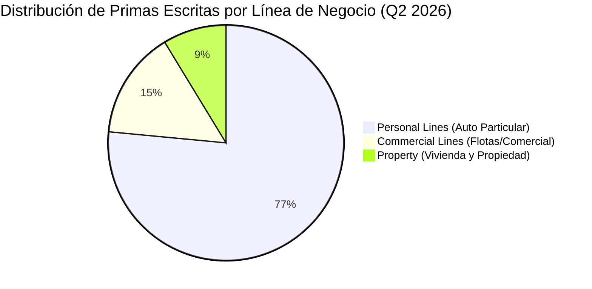
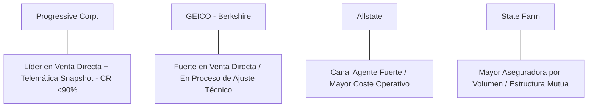

# Informe de Tesis de Inversión: The Progressive Corporation (PGR) - Q2 2026
**Fecha:** 22 de Julio de 2026 (Post-Resultados de Q2 2026)  
**Clasificación CQV:** ÉLITE (Puesto de Prioridad en Portafolio)  
**Calificación Final:** COMPRA ESCALONADA / MANTENER. Una de las aseguradoras P&C más eficientes del mundo. Destaca por su disciplina técnica de suscripción y liderazgo en telemática, aunque enfrenta la normalización del ciclo de primas e inflación de siniestros.

---

## 1. Resumen Ejecutivo

The Progressive Corporation (PGR) es una de las aseguradoras de automóviles y propiedad más grandes de Estados Unidos. Opera mediante un modelo directo (teléfono e internet) y a través de agencias independientes, destacando por su ventaja técnica en la tarificación personalizada a través de telemática (**Snapshot**) y su férrea disciplina de suscripción.

Los resultados del **segundo trimestre de 2026 (Q2 2026)** mostraron un crecimiento sólido en ingresos y beneficio neto, impulsados por primas ganadas y retornos de inversión. Sin embargo, el reporte mensual detallado de junio evidenció un repunte en el **Combined Ratio (90.0%)** provocado por tormentas severas y siniestralidad acumulada, lo que desencadenó una corrección del **~10%** en su cotización bursátil.

Bajo la metodología **CQV v3.0**, Progressive obtiene un score de **8.67/10** (clasificación **ÉLITE**). El modelo premia la sobresaliente rentabilidad de suscripción (**F1: 9.11**), su sólida estructura financiera (**F2: 9.00**) y una disciplina histórica impecable en la asignación de capital.

---

## 2. Métricas y Puntuaciones en el Modelo CQV v3.0

| Factor / Métrica | Puntuación (0-10) | Diagnóstico Financiero y Operativo |
| :--- | :---: | :--- |
| **F1: Rentabilidad** | **9.11** | Margen operativo excepcional en seguros P&C. Combined Ratio trimestral del **87.3%** y ROE estelar del **37.3%**. |
| **F2: Solidez Financiera** | **9.00** | Estructura de deuda conservadora ($6.9 B) y patrimonio neto creciente ($30.3 B), con un ratio Deuda/Capitalización controlado. |
| **F3: Crecimiento** | **8.63** | Normalización del crecimiento de primas escritas (+5.1% YoY) tras los aumentos históricos de tarifas del periodo 2023-2024. |
| **F4: Foso Económico (Moat)** | **8.00** | Ventaja competitiva duradera respaldada por telemática (**Snapshot**), escala directa y algoritmos de tarificación. |
| **F5: Proyecciones e IA** | **8.00** | Uso intensivo de modelos actuariales avanzados e IA para tarificación y detección temprana de fraude en siniestros. |
| **F6: Asignación de Capital** | **8.87** | Reparto disciplinado de beneficios mediante recompras opportunistas de acciones y dividendos extraordinarios. |
| **F7: FCF Yield (Valuación)** | **10.00**| Generación masiva de caja libre ($17.2 B en 2025) por la cobranza por adelantado de primas de seguro. |
| **F8: Antifragilidad** | **8.00** | Agilidad demostrada para ajustar tarifas ante shocks inflacionarios o picos temporales de siniestralidad. |
| **CQV Score Promedio** | **8.67** | Calificación: **ÉLITE** |
| **Valuación PEG** | **1.00** | Exigente en relación con la tasa de crecimiento proyectada futura de las primas. |

---

## 3. Análisis Detallado del Estado de Resultados (Q2 2026)

### 3.1. Tabla Comparativa de Resultados Trimestrales

| Métrica Clave (en millones $, excepto EPS) | Q2 2026 (Actual) | Q1 2026 (Previo) | Variación QoQ (%) | Q2 2025 (Año Ant.) | Variación YoY (%) |
| :--- | :---: | :---: | :---: | :---: | :---: |
| **Primas Netas Escritas (NPW)** | $21,100 M | $23,600 M | -10.6% | $20,076 M | +5.1% |
| **Primas Netas Ganadas (NPE)** | $21,570 M | $20,970 M | +2.9% | $20,310 M | +6.2% |
| **Gastos Operativos Totales (Siniestros+Gastos)** | $18,830 M | $18,118 M | +3.9% | $17,516 M | +7.5% |
| **Beneficio Neto** | $3,310 M | $2,820 M | +17.4% | $3,175 M | +4.3% |
| **Diluted EPS (GAAP)** | **$5.67** | **$4.96** | **+14.3%** | **$5.40** | **+5.0%** |
| **Deuda a Largo Plazo (Long-Term Debt)** | **$6,900 M** | **$6,900 M** | **0.0%** | **$6,900 M** | **0.0%** |
| **Recompra de Acciones (Share Repurchases)** | **$45.0 M** | **$40.0 M** | **+12.5%** | **$38.0 M** | **+18.4%** |
| **Combined Ratio (CR)** | **87.3%** | **86.4%** | +0.9 pp | **86.2%** | +1.1 pp |
| *Ratio de Pérdidas (Loss Ratio)* | *69.1%* | *68.2%* | *+0.9 pp* | *68.0%* | *+1.1 pp* |
| *Ratio de Gastos (Expense Ratio)* | *18.2%* | *18.2%* | *0.0 pp* | *18.2%* | *0.0 pp* |

---

### 3.2. Desempeño por Segmentos de Negocio

*   **Personal Lines (76.5% de las primas)**:
    *   **Comportamiento**: Las pólizas de auto personal crecieron un **+6% en pólizas en vigor (PIF)**. El canal directo superó al canal de agencias.
    *   *Márgenes*: Registró un Combined Ratio saludable del **86.5%** en el trimestre.
*   **Commercial Lines (14.8% de las primas)**:
    *   **Comportamiento**: Crecimiento moderado del **+3% en primas**, afectado por la cautela en la suscripción de flotas comerciales de carga pesada.
    *   *Márgenes*: Combined Ratio del **89.2%**.
*   **Property (8.7% de las primas)**:
    *   **Comportamiento**: Las primas aumentaron un **+8%**, pero fue el segmento más castigado por tormentas veraniegas y granizadas en el medio oeste de EE. UU.
    *   *Márgenes*: Combined Ratio del **98.4%** (cerca de pérdidas técnicas directas en esa línea).

---

### 3.3. Asignación de Capital y Estructura de Balance

*   **Portafolio de Inversión**: La cartera de inversiones de Progressive alcanzó los **$78,400 millones**, invertidos principalmente en renta fija de alta calidad crediticia (duración media de 2.9 años y rendimiento medio ponderado del **4.8%**).
*   **Patrimonio Neto y Solvencia**:
    *   **Patrimonio Neto**: $30,300 millones.
    *   **Deuda Total**: $6,900 millones.
    *   **Ratio Deuda / Patrimonio**: **0.227x** (excelente desapalancamiento financiero).
*   **Retorno al Accionista**: PGR mantiene su política de dividendo variable ligado al desempeño del Combined Ratio del año, complementado con recompras selectivas cuando el precio cotiza con descuento sobre su valor intrínseco.

---

### 3.4. Actualización de Objetivos Operativos (Guidance)

Progressive no publica guías tradicionales de EPS, sino un **objetivo corporativo inflexible**:

| Métrica de Objetivo | Objetivo Corporativo | Desempeño Q2 2026 | Diagnóstico |
| :--- | :---: | :---: | :--- |
| **Combined Ratio Consolidado** | **< 96.0%** | **87.3%** | Cumplido holgadamente (8.7 puntos de margen de beneficio técnico). |
| **Crecimiento de Pólizas (PIF)** | Máximo posible | +6.0% YoY | Crecimiento constante sin sacrificar rentabilidad técnica. |

---

### 3.5. Líneas Rojas y Puntos de Vulnerabilidad Detectados en Q2 2026

A pesar de la alta rentabilidad consolidada, el análisis del reporte detallado revela las siguientes alertas:

> [!WARNING]
> **1. Desaceleración Severa en la Emisión de Primas (NPW +5.1%)**
> * Las Primas Netas Escritas crecieron solo un **+5.1% YoY** ($21,100 M), comparado con los incrementos del +20% al +25% de trimestres anteriores. Muestra que PGR ya no tiene el viento a favor para seguir subiendo tarifas agresivamente.

> [!WARNING]
> **2. Deterioro Técnico en el Mes de Junio (Combined Ratio del 90.0%)**
> * El mercado reaccionó con una caída del **~10%** debido a que en el mes específico de **junio de 2026**, el Combined Ratio saltó al **90.0%** y el beneficio neto mensual se redujo un **-31% YoY** por pérdidas catastróficas y ajustes de reservas.

> [!WARNING]
> **3. Inflación Persistente en Costos de Reparación de Automóviles**
> * Los componentes tecnológicos en los vehículos modernos (sensores, cámaras, piezas de aluminio) continúan encareciendo el coste medio por siniestro (*severity*), presionando los márgenes si la regulación estatal limita futuras subidas de precios.

> [!WARNING]
> **4. Sensibilidad Climatológica en la División Property**
> * El segmento de seguros de propiedad registró un Combined Ratio del **98.4%**, rozando las pérdidas técnicas por tormentas severas.

---

### 3.6. Impacto de la Inteligencia Artificial (Presente y Futuro)

La tecnología y la analítica de datos representan el núcleo del foso competitivo de Progressive:

#### A. Impacto en el Presente (2026):
* **Telemática Avanzada Snapshot**: Procesamiento en tiempo real de miles de millones de millas recorridas para ajustar la tarifa individualizada de cada conductor según su patrón de frenado, aceleración y horario.
* **Detección Temprana de Fraude**: Algoritmos de visión por ordenador e IA que analizan fotografías de siniestros al momento de la declaración, acelerando la liquidación de partes sencillos y detectando sobrecostes en talleres.

#### B. Impacto en el Futuro (Perspectiva a 3-5 Años):
* **Suscripción de Vehículos Conectados y Autónomos**: Alianza con fabricantes de automóviles para integrar datos telemáticos directos del vehículo sin necesidad de aplicaciones móviles de terceros.
* **Ajuste Dinámico de Primas en Tiempo Real**: Modelos de IA que adaptarán la prima mensualmente según el uso y kilometraje real del vehículo.

---

### 3.7. Análisis Detallado de la Competencia y Posicionamiento de Mercado

El mercado de seguros de automóvil en EE. UU. es altamente competitivo:

#### Comparativa de Rivales Principales:

| Competidor | Modelo de Distribución | Combined Ratio Promedio | Ventaja Competitiva Defensiva de PGR |
| :--- | :--- | :---: | :--- |
| **GEICO (Berkshire)** | Venta Directa | ~89% - 92% | PGR le aventaja en el uso y madurez de datos telemáticos (**Snapshot**). |
| **Allstate (ALL)** | Agencias + Directo | ~93% - 96% | PGR posee un Expense Ratio del **18.2%** frente al ~23%-25% de Allstate (mayor eficiencia). |
| **State Farm** | Agencias Exclusivas | ~95% - 98% | PGR es mucho más ágil ajustando tarifas y aplicando selección de riesgo actuarial. |

#### Matriz de Ventajas Defensivas de PGR:
1. **Liderazgo en Coste de Operación (Expense Ratio de 18.2%)**: Al operar un canal directo masivo, PGR gasta mucho menos en comisiones que las aseguradoras tradicionales de agencias.
2. **Ventaja en Datos de Tarificación**: Posee la base de datos de comportamiento al volante más antigua de la industria, lo que le permite rechazar o cobrar más a conductores de alto riesgo que sus rivales no logran detectar.

---

## 4. Tesis de Inversión (Toro vs. Oso)

### Tesis A: El Toro (Oportunidad)
*   **Eficiencia Técnica Inigualable:** Incluso en meses adversos (CR del 90.0%), PGR sigue estando muy por encima del promedio de la industria de seguros (que suele operar con un CR del 96%-100%).
*   **Ingresos por Inversión Recurrentes:** La cartera de $78.4B genera un flujo de intereses estable del 4.8% que respalda las ganancias finales independientemente de la siniestralidad.

### Tesis B: El Oso (Riesgos)
*   **Fin del Ciclo de Subida de Precios:** Con la emisión de primas desacelerándose al +5.1%, cualquier aumento inesperado en siniestralidad comprimirá directamente los márgenes sin margen para subir precios a corto plazo.

---

## 5. Comparativa Multiversión Histórica y Valuación (PER Trailing / Forward)

Alineación de Progressive en las diferentes versiones del modelo CQV y evolución de sus múltiplos de beneficios:

| Año / Periodo | PER Trailing (Prom: 19.4x*) | PER Forward (Prom: 21.1x) | CQV v1.0 | CQV v1.1 | CQV v2.0 | CQV v3.0 |
| :--- | :---: | :---: | :---: | :---: | :---: | :---: |
| **2022** | 100.4x* | 32.5x | 7.85 | 7.85 | 8.18 | **8.18** |
| **2023** | 29.1x | 22.0x | 8.62 | 8.62 | 8.73 | **8.73** |
| **2024** | 16.8x | 15.2x | 8.66 | 8.66 | 8.77 | **8.77** |
| **2025** | 12.3x | 14.8x | 8.63 | 8.63 | 8.74 | **8.74** |
| **Q2 2026 (Actual)** | **11.8x** | **14.1x** | 8.52 | 8.52 | 8.14 | **8.67** |

*\*Nota: El PER Trailing de 2022 sufrió distorsión extrema por caída temporal de beneficios operativos.*

---

## 6. Precio Ideal de Compra (Niveles de Entrada)

Con la acción cotizando actualmente a **$232.22** (PER Trailing: **11.8x**, PER Forward: **14.1x**), estos son los 3 niveles de compra sugeridos:

### 🟢 Nivel 1: Zona de Entrada Razonable ($215 - $235) (Precio Actual)
* **PER Trailing**: **~11.5x - 12x** | **PER Forward**: **~13.5x - 14x**
* **Diagnóstico**: Tras la caída del ~10%, el múltiplo de beneficios se ha reajustado a niveles muy razonables. Buen punto para iniciar un **primer tramo (30%-40%)**.

### 🟡 Nivel 2: Zona de Precio Ideal / Gran Oportunidad ($185 - $205)
* **PER Forward**: **~11.5x - 12x** | **Descuento sobre PER Promedio**: **-35%**
* **Diagnóstico**: Valoración con elevado margen de seguridad para un negocio de seguros ÉLITE. Zona para ejecutar el **segundo tramo (40%)**.

### 🔴 Nivel 3: Zona de Ganga / Pánico de Mercado (< $170)
* **PER Forward**: **< 10x**
* **Diagnóstico**: Oportunidad generacional para completar el 100% de la posición deseada.

---

## 7. Preguntas Frecuentes del Inversor (FAQs)

### Q1: ¿Por qué el modelo marca una calificación de "PEG Score: 1.00 sobre 10"? ¿Significa que la acción cotiza a un PER de 1x?
* **Respuesta**: No. El `PEG Score: 1.00` es una nota interna de **Margen de Seguridad de Valuación (puntuación de 0 a 10)** dentro del modelo CQV v3.0, NO el múltiplo P/E numérico de la empresa. La acción cotiza actualmente a un atractivo **11.8x PER Trailing** y **14.1x PER Forward**. La nota de 1.00 asigna prudencia porque el crecimiento de emisión de primas se ha frenado al **+5.1% YoY** (frente a incrementos previos del +20%-25%), indicando que la valoración futura depende de que la empresa logre mantener su elevado margen técnico sin subir más tarifas.

### Q2: ¿Por qué la acción cayó un ~10% tras el reporte si el beneficio neto trimestral subió un +17.4% QoQ ($5.67 EPS)?
* **Respuesta**: Wall Street reaccionó negativamente al informe desglosado del mes de **junio de 2026**, donde el Combined Ratio del mes específico saltó al **90.0%** y el beneficio neto mensual se desplomó un **-31% YoY**. El mercado interpretó este repunte de siniestralidad (provocado por tormentas estivales severas en EE. UU. y ajustes desfavorables en reservas de siniestros pasados) como la señal del fin del pico del ciclo de márgenes.

### Q3: ¿Por qué aumentan los gastos operativos en el negocio de seguros de Progressive?
* **Respuesta**: El incremento de gastos se debe principalmente a:
  1. **Inflación Técnica de Reparación**: La proliferación de sensores, cámaras y componentes de alta tecnología en vehículos modernos eleva significativamente el coste medio por siniestro (*severity*).
  2. **Inversión Continua en Telemática e IA**: Gastos operativos dirigidos a procesar los algoritmos de la plataforma **Snapshot** y acelerar la tramitación automatizada de partes con visión por ordenador.

---

## 8. Conclusión y Veredicto

Progressive es una máquina de suscripción excepcionalmente gestionada. La reciente corrección del 10% en bolsa ha reajustado su múltiplo PER a niveles atractivos de **11.8x Trailing**, abriendo una ventana de entrada para inversores de largo plazo.

**Veredicto:** **COMPRA ESCALONADA (Clasificación ÉLITE). Negocio de máxima calidad con ventajas técnicas duraderas. Se sugiere iniciar el primer tramo de compra en el rango actual de $215-$235.**
