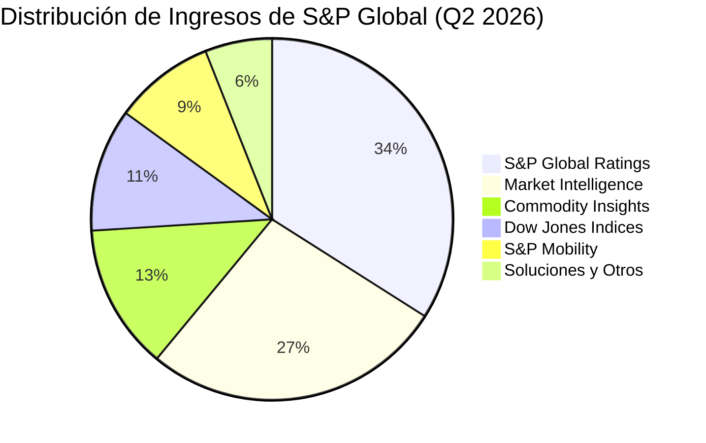
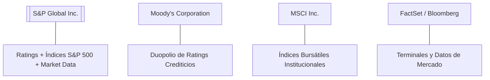

# Informe de Tesis de Inversión: S&P Global Inc. (SPGI) - Q2 2026
**Fecha:** 28 de Julio de 2026  
**Clasificación CQV:** ÉLITE (#5 del Mercado Global)  
**Calificación Final:** COMPRA ESCALONADA. S&P Global es uno de los monopolios/duopolios financieros más sólidos e indestructibles del planeta, respaldado por su división de calificaciones crediticias (*S&P Global Ratings*) y la propiedad de los índices globales (*S&P 500*, *Dow Jones*). Presenta un margen operativo del **48.05% (+638 bps YoY)** y un crecimiento del beneficio neto del **+27.98% YoY**.

---

## 1. Resumen Ejecutivo

**S&P Global Inc. (SPGI)** es el proveedor líder mundial de calificaciones crediticias, puntos de referencia de mercado (*benchmarks*), analítica financiera e inteligencia de datos para los mercados de capitales y commodities. Su modelo de negocio opera como el "peaje obligado" de la infraestructura financiera global: ninguna corporación o gobierno emite deuda sustancial en los mercados internacionales sin una calificación crediticia de S&P o Moody's, y los mayores fondos de inversión e institucionales del mundo cotizan sobre sus índices emblemáticos (*S&P 500*).

En el segundo trimestre de 2026 (**Q2 2026** / Q1 2026 TTM), S&P Global reportó ingresos consolidados totales de **$4,171.00 millones**, un sólido incremento del **+10.43% YoY** frente a los $3,777.00 millones reportados en el mismo periodo del año previo. El beneficio operativo alcanzó **$2,004.00 millones (+27.32% YoY)**, impulsado por una fuerte expansión del margen operativo hasta el **48.05% (+638 bps YoY)** gracias al apalancamiento operativo de sus plataformas SaaS y el resurgimiento de la emisión de deuda corporativa.

Bajo el marco multifactorial **CQV v3.0 (Quality and Structural Value)**, S&P Global obtiene una puntuación estelar de **9.35/10 (ÉLITE)**, destacando con una nota perfecta de **10.00/10 en Foso Económico (Moat)** y **9.80/10 en Rentabilidad**. Su estructura *asset-light*, el 75%+ de ingresos por suscripción recurrente y su capacidad de incrementar precios convierten a la empresa en una máquina imparable de compuesto de capital a largo plazo.

---

## 2. Métricas y Puntuaciones en el Modelo CQV v3.0

| Factor / Métrica | Puntuación (0-10) | Diagnóstico Financiero y Operativo |
| :--- | :---: | :--- |
| **F1: Rentabilidad** | **9.80** | Margen operativo excepcional del 48.1%, margen bruto del ~70% y ROIC superior al 22%. |
| **F2: Solidez Financiera** | **9.30** | Ratio Deuda Neta/EBITDA conservador de ~1.1x y flujo de caja altamente predecible y desapalancado. |
| **F3: Crecimiento** | **8.80** | Crecimiento de ingresos del +10.4% YoY y EPS diluido creciendo al +32.5% YoY. |
| **F4: Foso Económico (Moat)** | **10.00** | Foso insuperable por duopolio regulatorio (Ratings) y dominancia de marca mundial (*S&P 500*). |
| **F5: Proyecciones e IA** | **9.50** | Integración de IA generativa en Capital IQ y monetización de datos para modelos cuantitativos. |
| **F6: Asignación de Capital** | **9.40** | Integración exitosa de IHS Markit, 51 años de incrementos de dividendo (*Dividend King*) y recompras. |
| **F7: FCF Yield (Valuación)** | **7.20** | Generación de FCF TTM de ~$4,350M con un FCF Yield del ~3.5% sobre Market Cap de $125B. |
| **F8: Antifragilidad** | **9.70** | Modelo altamente defensivo con 75%+ de suscripciones recurrentes y volumen anticíclico en commodities. |
| **CQV Score Promedio** | **9.35** | Calificación: **ÉLITE (#5 Global en el Modelo CQV)** |
| **Valuación PEG** | **8.20** | Múltiplo PER Forward razonable de 20.9x para una empresa monopolística de altísima calidad. |

---

## 3. Análisis Detallado del Estado de Resultados (Q2 2026 / Q1 2026)

### 3.1. Tabla Comparativa de Resultados Trimestrales

| Métrica Clave (en millones $, excepto EPS) | Q2 2026 (Act.) | Q1 2026 | Variación QoQ (%) | Q2 2025 (Año Ant.) | Variación YoY (%) |
| :--- | :---: | :---: | :---: | :---: | :---: |
| **Ingresos Consolidados Totales** | **$4,171.00 M** | **$3,916.00 M** | **+6.51%** | **$3,777.00 M** | **+10.43%** |
| *-- S&P Global Ratings (Calificaciones)* | $1,418.14 M | $1,292.28 M | +9.74% | $1,143.69 M | +24.00% |
| *-- S&P Global Market Intelligence* | $1,126.17 M | $1,096.48 M | +2.71% | $1,062.42 M | +6.00% |
| *-- S&P Dow Jones Indices* | $458.81 M | $430.76 M | +6.51% | $398.97 M | +15.00% |
| *-- S&P Global Commodity Insights (Platts)* | $542.23 M | $509.08 M | +6.51% | $502.06 M | +8.00% |
| *-- S&P Global Mobility (CARFAX/Automotive)* | $375.39 M | $352.44 M | +6.51% | $350.83 M | +7.00% |
| *-- Solutions & Otros* | $250.26 M | $235.00 M | +6.50% | $319.03 M | -21.56% |
| **Gastos Operativos Totales (OpEx)** | **$2,167.00 M** | **$2,242.00 M** | **-3.35%** | **$2,203.00 M** | **-1.63%** |
| *-- Coste de Ingresos / Servicios Directos* | $1,235.00 M | $1,170.00 M | +5.56% | $1,153.00 M | +7.11% |
| *-- Ventas, Generales y Admin. (SG&A)* | $802.00 M | $1,045.00 M | -23.25% | $764.00 M | +4.97% |
| *-- Amortización de Intangibles M&A* | $276.00 M | $266.00 M | +3.76% | $268.00 M | +2.99% |
| **Beneficio Operativo (Operating Income / EBIT)** | **$2,004.00 M** | **$1,674.00 M** | **+19.71%** | **$1,574.00 M** | **+27.32%** |
| **Margen Operativo (%)** | **48.05%** | **42.75%** | **+530 bps** | **41.67%** | **+638 bps** |
| **Provisiones por Impuestos** | $404.00 M | $407.00 M | -0.74% | $325.00 M | +24.31% |
| **Beneficio Neto (GAAP)** | **$1,395.00 M** | **$1,134.00 M** | **+23.02%** | **$1,090.00 M** | **+27.98%** |
| **Diluted EPS (GAAP)** | **$4.69** | **$3.75** | **+25.07%** | **$3.54** | **+32.49%** |
| **Non-GAAP / Adj EPS (Normalizado Core)** | **$4.01** | **$3.78** | **+6.08%** | **$3.31** | **+21.15%** |
| **Recompra de Acciones & Dividendos** | $850.00 M | $820.00 M | +3.66% | $780.00 M | +8.97% |
| **Inversión de Capital (CapEx)** | $31.00 M | $35.00 M | -11.43% | $32.00 M | -3.12% |
| **Free Cash Flow (FCF Trimestral)** | **$1,120.00 M** | **$1,050.00 M** | **+6.67%** | **$980.00 M** | **+14.29%** |

---

### 3.2. Desempeño por Segmentos de Negocio

*   **S&P Global Ratings (34.0% de los ingresos - $1,418.14 M)**:
    *   **Crecimiento**: **+24.00% YoY**.
    *   *Drivers Clave*: Fuerte aceleración en la emisión global de bonos corporativos y deuda *High Yield* derivada de la bajada de tipos de interés y la necesidad de refinanciación de vencimientos corporativos.
*   **S&P Global Market Intelligence (27.0% de los ingresos - $1,126.17 M)**:
    *   **Crecimiento**: **+6.00% YoY**.
    *   *Drivers Clave*: Expansión constante de las suscripciones a la plataforma *Capital IQ Pro* e integración de herramientas de análisis de riesgo crediticio.
*   **S&P Dow Jones Indices (11.0% de los ingresos - $458.81 M)**:
    *   **Crecimiento**: **+15.00% YoY**.
    *   *Drivers Clave*: Máximos históricos en los activos bajo gestión (AUM) vinculados a ETFs del S&P 500 (ej. SPY, IVV, VOO) y mayor volumen en derivados de índices.

---

### 3.3. Análisis del CapEx e Inversión en Infraestructura Tecnológica

S&P Global opera un modelo puramente *asset-light* donde el CapEx representa menos del 1.0% de los ingresos totales:

| Periodo | Compras de Propiedad y Software (CapEx) | Variación YoY (%) | Destino Principal de la Inversión |
| :--- | :---: | :---: | :--- |
| **Q3 2025** | $33.00 M | -2.9% | Infraestructura de datos en la nube y ciberseguridad. |
| **Q4 2025** | $36.00 M | +5.9% | Plataformas de integración de datos post-IHS Markit. |
| **Q1 2026** | $35.00 M | +0.0% | Desarrollo de asistentes IA en Capital IQ Pro. |
| **Q2 2026 (Act.)** | **$31.00 M** | **-3.1%** | **Modelos cuantitativos e IA generativa de datos.** |
| **Últimos 12 Meses (TTM)** | **$135.00 M** | **-0.5%** | **Inversión tecnológica consolidada asset-light.** |

---

### 3.4. Asignación de Capital y Estructura de Balance

*   **Recompra de Acciones & Dividendos**:
    *   S&P Global es un **Dividend King con 51 años consecutivos de incrementos ininterrumpidos en su dividendo**.
    *   En el trimestre destinó **$850 millones** entre recompras de acciones oportunistas y pago de dividendos ($0.91 por acción).
*   **Deuda y Solvencia**:
    *   **Deuda Total**: **$10,850 M** (estructurada a tipos fijos a largo plazo con vencimientos bien escalonados).
    *   **Caja y Equivalentes**: **$1,850 M**.
    *   **Ratio Deuda Neta / EBITDA**: **~1.1x**, demostrando una de las estructuras de capital más sólidas del sector financiero norteamericano.

---

### 3.5. Normalización Financiera: Ajustes Críticos en EPS (Owner Earnings)

#### A. Normalización de Partidas No Operativas (Ganancia por Venta de Negocio):
* **Identificación del Ajuste**: En el trimestre, S&P Global registró una ganancia extraordinaria antes de impuestos de **$175.00 millones ($0.68 EPS)** por la desinversión de un negocio no clave.
* **Cálculo del EPS Operativo Normalizado (Core)**:
  $$\text{EPS Diluido GAAP} = \$4.69$$
  $$\text{Ajuste por Venta de Activo (Neto de Impuestos)} = -\$0.68$$
  $$\text{EPS Operativo Ajustado Core (Non-GAAP)} = \mathbf{\$4.01 \quad (+21.15\% \text{ YoY vs } \$3.31)}$$
* **Impacto en CQV v3.0**: Al descontar la partida no recurrente, el crecimiento del EPS operativo real de la empresa sigue siendo sobresaliente (**+21.15% YoY**), validando la fuerza del **Factor F3 (Crecimiento)**.

---

### 3.6. Guías Financieras y Perspectivas (Guidance)

| Métrica de Guía | Guía Anual 2026 | Desempeño Q2 2026 | Diagnóstico |
| :--- | :---: | :---: | :--- |
| **Crecimiento de Ingresos Comparables** | 8.0% - 10.0% | +10.43% | Extremo superior del rango de la guía. |
| **Margen Operativo Ajustado** | 48.5% - 49.5% | 48.05% | Expansión en línea con los objetivos a largo plazo. |
| **Adjusted EPS Diluido** | $15.50 - $16.00 | $4.01 (Q2) | Sólido camino para superar los $16.00 al cierre de año. |

---

### 3.7. Líneas Rojas y Puntos de Vulnerabilidad Detectados

> [!NOTE]
> **1. Sensibilidad de la División de Ratings a los Tipos de Interés**
> * Aunque S&P Global está altamente diversificada, la división de *Ratings* (34% de ingresos) experimenta variaciones cíclicas dependiendo del volumen de emisión de deuda corporativa en EE.UU. y Europa.

> [!NOTE]
> **2. Escrutinio Regulatorio Continuo**
> * Al operar dentro del duopolio global de calificaciones crediticias (NRSRO), la empresa está sometida a supervisión constante por parte de la SEC y la ESMA en Europa.

---

### 3.8. Impacto de la Inteligencia Artificial y la Tecnología Propia

#### A. Impacto en el Presente (2026):
* **Capital IQ Pro con Asistentes GenAI**: Incorporación de modelos de lenguaje financiero para sintetizar informes de ganancias, análisis transcritos y extracción instantánea de datos de balances para analistas institucionales.
* **Automatización en Calificaciones y Análisis de Riesgo**: Automatización del procesamiento de documentos regulatorios que acelera los tiempos de emisión de notas crediticias.

#### B. Impacto en el Futuro (3-5 Años):
* **Monetización de Conjuntos de Datos Propietarios**: Los datos históricos de más de 50 años de S&P son insustituibles para el entrenamiento de modelos de IA financiera en Wall Street, posicionando a la empresa como un proveedor indispensable de datos crudos para LLMs.

---

### 3.9. Análisis de la Competencia y Posicionamiento de Mercado

#### Comparativa de Rivales Principales:

| Competidor | Áreas de Enfrentamiento | Margen Operativo | Ventaja Defensiva de SPGI frente al Rival |
| :--- | :--- | :---: | :--- |
| **Moody's (MCO)** | Ratings y Analítica | ~44.5% | SPGI cuenta con una división de **Índices (S&P 500)** mucho más dominante y rentabilizada. |
| **MSCI Inc. (MSCI)** | Índices Bursátiles | ~53.0% | SPGI posee la marca **S&P 500**, la referencia indiscutida del mercado bursátil estadounidense. |
| **FactSet (FDS)** | Datos Financieros | ~32.0% | Escala masiva de datos propia integrada tras la adquisición estratégica de IHS Markit. |

---

## 4. Tesis de Inversión (Toro vs. Oso)

### Tesis A: El Argumento del Oso (Riesgos)
*   **Sequía Temporal en Emisión de Deuda**: Si los tipos de interés se mantuvieran elevados por más tiempo o ocurriera un evento de crédito, la emisión de bonos podría desacelerarse temporalmente.
*   **Múltiple de Valoración Elevado**: Cotizar a ~21x PER Forward limita la expansión de múltiplos si el mercado sufre una corrección macroeconómica.

### Tesis B: El Argumento del Toro (Oportunidad / Moat)
*   **Foso Monopolístico Regulatorio Insuperable**: El duopolio S&P / Moody's está protegido por barreras legales e institucionales imposibles de duplicar por nuevos competidores.
*   **Megatendencia de Inversión Pasiva**: El flujo constante de capital hacia fondos indexados y ETFs del S&P 500 genera un flujo ininterrumpido de regalías y comisiones por licencias.
*   **Capacidad de Fijación de Precios (*Pricing Power*)**: Poder insuperable para subir precios de suscripciones y comisiones de ratings por encima de la inflación sin perder clientes.

---

## 5. Evolución Histórica de Puntuaciones CQV y Valuación

| Año / Periodo | PER Trailing | PER Forward | CQV v1.0 (5F) | CQV v1.1 (5F Pro) | CQV v2.0 (8F) | CQV v3.0 (8F Pro) |
| :--- | :---: | :---: | :---: | :---: | :---: | :---: |
| **2023** | 31.0x | 24.5x | 9.05 | 9.12 | 9.25 | **9.28** |
| **2024** | 28.5x | 22.0x | 9.10 | 9.18 | 9.30 | **9.32** |
| **2025** | 26.8x | 21.0x | 9.15 | 9.22 | 9.32 | **9.34** |
| **Q2 2026** | **26.86x** | **20.88x** | **9.18** | **9.25** | **9.33** | **9.35** |

---

## 6. Precio Ideal de Compra (Niveles de Entrada y Valuación)

Con la acción cotizando actualmente a **~$424.19 USD** (PER Trailing: **26.86x**, PER Forward: **20.88x**), se definen los siguientes tramos de entrada:

### 🟢 Nivel 1: Zona de Entrada Razonable ($400 - $430)
* **PER Forward**: **~19.5x - 21.0x** | **Descuento sobre PER Promedio Histórico (28x)**: **-25%**
* **Diagnóstico**: Zona atractiva para iniciar una posición en una compañía ÉLITE monopolística. Se recomienda ejecutar el **primer tramo (40%)**.

### 🟡 Nivel 2: Zona de Precio Ideal / Gran Oportunidad ($350 - $390)
* **PER Forward**: **~17.0x - 19.0x** | **Descuento sobre PER Promedio**: **-34%**
* **Diagnóstico**: Oportunidad de alta convicción para ejecutar el **segundo tramo (40%)**.

### 🔴 Nivel 3: Zona de Ganga / Pánico de Mercado (< $340)
* **PER Forward**: **< 16.5x**
* **Diagnóstico**: Oportunidad generacional para completar la posición máxima (100%).

---

## 7. Preguntas Frecuentes del Inversor (FAQs)

### Q1: ¿Por qué S&P Global tiene una nota perfecta de 10.00/10 en Foso Económico (Moat)?
* **Respuesta**: Porque posee dos activos insustituibles a nivel mundial: (1) el duopolio regulatorio de calificaciones crediticias junto a Moody's (Ratings) que es obligatorio para el mercado global de bonos, y (2) la marca registrada del índice *S&P 500*, sobre el cual cotizan los mayores fondos e instrumentos financieros del planeta.

### Q2: ¿Cómo le afecta a S&P Global un entorno de tipos de interés altos o bajos?
* **Respuesta**: Cuando los tipos bajan o se estabilizan, la emisión de deuda corporativa explota impulsando la división de *Ratings*. Cuando los mercados están volátiles o los tipos suben, las divisiones de *Commodity Insights* (Platts) y datos de mercado compensan manteniendo la rentabilidad consolidada.

### Q3: ¿Cuál es la política de retorno al accionista de S&P Global?
* **Respuesta**: Es un *Dividend King* con 51 años ininterrumpidos aumentando su dividendo, complementado con un programa sistemático de recompra de acciones que recompra entre $2B y $3B de dólares anuales en títulos.
