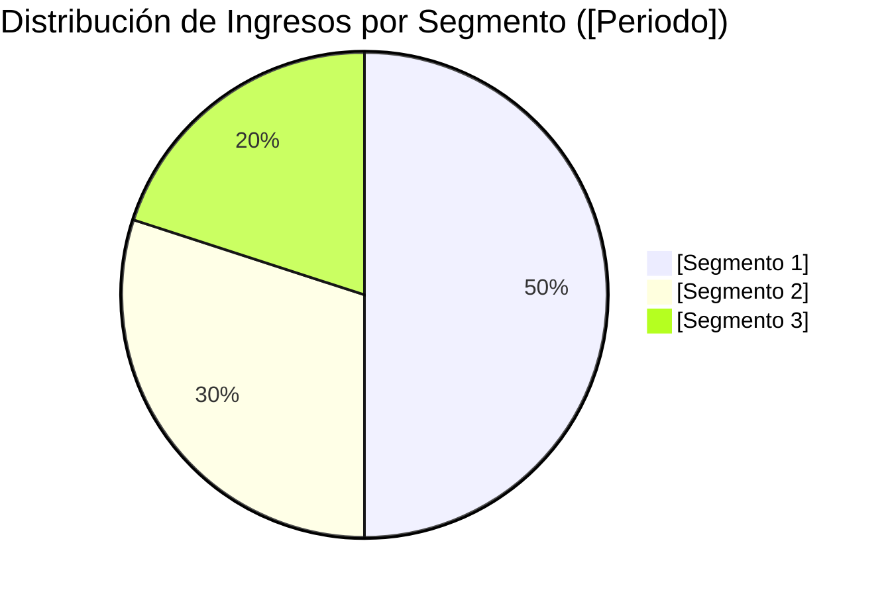

# Informe de Tesis de Inversión: [Nombre de la Empresa] ([TICKER]) - [Trimestre/Año ej. Q2 2026]
**Fecha de Emisión:** [Fecha del Informe]  
**Clasificación CQV Calidad v4.0:** [ÉLITE / ALTA CALIDAD / EN OBSERVACIÓN / VULNERABLE]  
**Veredicto Final Operativo v4.0:** [COMPRAR / ACUMULAR / MANTENER / EVITAR]. [Resumen en una frase del veredicto principal].

---

## 1. Resumen Ejecutivo y Bloque de Salida Final CQV v4.0

> [!NOTE]
> ### 📊 BLOQUE OFICIAL DE SALIDA MATRIZ CQV v4.0 (SECCIÓN 9.6)
> ```text
> CQV Calidad (F1-F8):   [X.XX] / 10
> Value Score:           [X.XX] / 10
> PEG Bruto:             [X.XX]
> Score PEG normalizado: [X.XX] / 10
> Valor Intrínseco:      $[X.XX] por acción
> Margen de Seguridad:   [X.X]%
> Confianza:             [Alta / Media / Baja]
> Veredicto Final:       [Comprar / Acumular / Mantener / Evitar]
> ```

### 📋 Matriz Identificadora de Métricas Emitidas por CQV v4.0

| Parámetro Emitido por CQV v4.0 | Valor Obtenido | Rango / Escala | Diagnóstico Operativo |
| :--- | :---: | :---: | :--- |
| **CQV Calidad Fundamental (F1-F8):** | **[X.XX] / 10** | 0.00 – 10.00 | **[ÉLITE ≥9.00 / ALTA CALIDAD 8.00-8.99]** |
| **Value Score (Capa de Valoración):** | **[X.XX] / 10** | 0.00 – 10.00 | **[Atractivo ≥8.00 / Exigente <6.00]** |
| **PEG Bruto (EPS Growth / PER Fwd * 10):** | **[X.XX]** | Sin acotación | Métrica auditada bruta de crecimiento vs múltiplo. |
| **Score PEG Normalizado:** | **[X.XX] / 10** | 0.00 – 10.00 | Métrica acotada para cálculo de Value Score. |
| **Valor Intrínseco Estimado (DCF Base):** | **$[X.XX]** | En USD ($) | Estimación por Descuento de Flujos y Múltiplos. |
| **Precio Actual de Mercado:** | **$[X.XX]** | En USD ($) | Cotización de la accion. |
| **Margen de Seguridad (%):** | **[X.X]%** | En porcentaje (%) | Diferencial entre Valor Intrínseco y Precio Mercado. |
| **Nivel de Confianza de Datos:** | **[Alta / Media]** | Alta / Media / Baja | Calidad y completitud auditada de estados financieros. |
| **Veredicto Final Operativo v4.0:** | **[Veredicto]** | 4 Categorías | **[Comprar / Acumular / Mantener / Evitar]** |

---

[Descripción breve del modelo de negocio, industria, propuesta de valor y fuente de ventaja competitiva].

[Resumen de los últimos resultados trimestrales/anuales, indicando crecimiento de ingresos, expansión/contracción de márgenes y generación de caja libre].

Bajo el marco multifactorial **CQV v4.0 (Quality, Resilience and Value)**, la empresa obtiene una puntuación de calidad fundamental de **[X.XX]/10**, destacando en [mención de los factores F1-F8 más fuertes].

---

## 2. Métricas y Puntuaciones en el Modelo CQV Calidad v4.0

El modelo **CQV v4.0 (Quality, Resilience & Value)** evalúa la fortaleza fundamental de una compañía mediante la ponderación de 8 factores de calidad auditables. La fórmula de cálculo del score de calidad consolidado es la siguiente:

$$\text{CQV Calidad v4.0} = (F_1 \times 0.20) + (F_2 \times 0.15) + (F_3 \times 0.15) + (F_4 \times 0.15) + (F_5 \times 0.10) + (F_6 \times 0.10) + (F_7 \times 0.05) + (F_8 \times 0.10)$$

### 2.1. Tabla de Valoraciones Parciales y Desglose de Cálculo

| Factor / Componente del Modelo | Puntuación (0-10) | Peso Absoluto | Contribución Parcial | Diagnóstico Financiero y Sub-componentes Evaluados |
| :--- | :---: | :---: | :---: | :--- |
| **F1: Economía del Negocio & Rentabilidad** | **[X.XX]** | 20.0% | **[F1 * 0.20]** | [Margen bruto, margen operativo GAAP/Non-GAAP, ROIC real y conversión de FCF]. |
| **F2: Solidez Financiera** | **[X.XX]** | 15.0% | **[F2 * 0.15]** | [Estructura de deuda, ratio Deuda/EBITDA, cobertura de intereses, liquidez y estabilidad de FCF]. |
| **F3: Crecimiento Durable** | **[X.XX]** | 15.0% | **[F3 * 0.15]** | [CAGR 3-5 años de ingresos, EPS normalizado, retención NRR y dilución neta por SBC]. |
| **F4: Moat Competitivo** | **[X.XX]** | 15.0% | **[F4 * 0.15]** | [Costes de cambio, ventajas de red/datos, cuota de mercado global y durabilidad del foso]. |
| **F5: Asignación de Capital** | **[X.XX]** | 10.0% | **[F5 * 0.10]** | [Reinversión orgánica (ROIC vs WACC), recompras netas accionarías, M&A e historial de dividendos]. |
| **F6: Dirección & Ejecución Operativa** | **[X.XX]** | 10.0% | **[F6 * 0.10]** | [Alineación directiva, estructura de incentivos y consistencia en el cumplimiento de guías]. |
| **F7: Opcionalidad Futura & Disrupción** | **[X.XX]** | 5.0% | **[F7 * 0.05]** | [Monetización demostrada en megatendencias e IA, inmunidad a la desintermediación por LLMs]. |
| **F8: Antifragilidad & Recurrencia** | **[X.XX]** | 10.0% | **[F8 * 0.10]** | [Porcentaje de ingresos recurrentes, resistencia recesiva, diversificación de clientes y flexibilidad]. |
| **SCORE CQV Calidad v4.0 FINAL** | -- | **100.0%** | **[SUMA PARCIALES]** | **Calificación: [ÉLITE / ALTA CALIDAD / EN OBSERVACIÓN]** |

---

## 3. Análisis Detallado del Estado de Resultados ([Periodo ej. Q2 2026])

### 3.1. Tabla Comparativa de Resultados Trimestrales / Anuales

| Métrica Clave (en millones $, excepto EPS) | [Periodo Actual] | [Periodo Previo] | Variación QoQ (%) | [Mismo Periodo Año Ant.] | Variación YoY (%) |
| :--- | :---: | :---: | :---: | :---: | :---: |
| **Ingresos Consolidados Totales** | $[X] M | $[X] M | [X]% | $[X] M | [X]% |
| **[División / Segmento Principal 1]** | $[X] M | $[X] M | [X]% | $[X] M | [X]% |
| *-- [Sub-línea o Producto 1.1]* | $[X] M | $[X] M | [X]% | $[X] M | [X]% |
| *-- [Sub-línea o Producto 1.2]* | $[X] M | $[X] M | [X]% | $[X] M | [X]% |
| **[División / Segmento Principal 2]** | $[X] M | $[X] M | [X]% | $[X] M | [X]% |
| **Gastos Operativos Totales (OpEx)** | $[X] M | $[X] M | [X]% | $[X] M | [X]% |
| *-- Investigación y Desarrollo (I+D / R&D)* | $[X] M | $[X] M | [X]% | $[X] M | [X]% |
| *-- Ventas, Generales y Admin. (SG&A)* | $[X] M | $[X] M | [X]% | $[X] M | [X]% |
| **Beneficio Operativo (Operating Income)** | **$[X] M** | **$[X] M** | **[X]%** | **$[X] M** | **[X]%** |
| **Margen Operativo (%)** | **[X]%** | **[X]%** | **[X] bps** | **[X]%** | **[X] bps** |
| **EBITDA Ajustado** | $[X] M | $[X] M | [X]% | $[X] M | [X]% |
| **Margen EBITDA Ajustado (%)** | **[X]%** | **[X]%** | [X] bps | **[X]%** | [X] bps |
| **Otros Ingresos / (Gastos) Netos No Operativos** | $[X] M* | $[X] M | -- | $[X] M | -- |
| **Beneficio Neto (GAAP)** | **$[X] M** | **$[X] M** | **[X]%** | **$[X] M** | **[X]%** |
| **Diluted EPS (GAAP)** | **$[X]** | **$[X]** | **[X]%** | **$[X]** | **[X]%** |
| **Non-GAAP / Adj EPS (Normalizado)** | **$[X]** | **$[X]** | **[X]%** | **$[X]** | **[X]%** |
| **Recompra de Acciones & Dividendo** | $[X] M | $[X] M | [X]% | $[X] M | [X]% |
| **Inversión de Capital (CapEx)** | $[X] M | $[X] M | [X]% | $[X] M | [X]% |
| **Free Cash Flow (FCF Trimestral)** | **$[X] M** | **$[X] M** | **[X]%** | **$[X] M** | **[X]%** |

*\*Nota: [Aclaración de partidas no operativas extraordinarias como revalorizaciones no realizadas de inversiones o costes de litigios/M&A].*

---

### 3.2. Desempeño por Segmentos de Negocio / Líneas de Producto



---

### 3.3. Análisis Histórico de Eficiencia de Capital: ROIC, ROI/ROA y ROE (Serie Histórica desde 2020)

| Métrica de Eficiencia de Capital | 2020 | 2021 | 2022 | 2023 | 2024 | 2025 | [Año Actual TTM] | Tendencia y Diagnóstico (Desde 2020) |
| :--- | :---: | :---: | :---: | :---: | :---: | :---: | :---: | :--- |
| **Ingresos Totales (M$)** | $[X] M | $[X] M | $[X] M | $[X] M | $[X] M | $[X] M | **$[X] M** | [Tasa CAGR de ingresos]. |
| **Beneficio Operativo GAAP (M$)** | $[X] M | $[X] M | $[X] M | $[X] M | $[X] M | $[X] M | **$[X] M** | [Crecimiento de EBITDA/EBIT]. |
| **Margen Operativo Non-GAAP (%)** | [X]% | [X]% | [X]% | [X]% | [X]% | [X]% | **[X]%** | [Expansión/contracción en bps]. |
| **Beneficio Neto GAAP (M$)** | $[X] M | $[X] M | $[X] M | $[X] M | $[X] M | $[X] M | **$[X] M** | [Evolución de ganancias netas]. |
| **Activos Totales (M$)** | $[X] M | $[X] M | $[X] M | $[X] M | $[X] M | $[X] M | **$[X] M** | [Crecimiento de la base de activos]. |
| **Capital Investido Neto (M$)** | $[X] M | $[X] M | $[X] M | $[X] M | $[X] M | $[X] M | **$[X] M** | [Capital neto operativo]. |
| **ROA / ROI (Return on Assets %)** | **[X]%** | **[X]%** | **[X]%** | **[X]%** | **[X]%** | **[X]%** | **[X]%** | **[Diagnóstico de eficiencia en activos]** |
| **ROE (Return on Equity %)** | **[X]%** | **[X]%** | **[X]%** | **[X]%** | **[X]%** | **[X]%** | **[X]%** | **[Diagnóstico de retorno sobre capital]** |
| **ROIC (Return on Invested Capital %)** | **[X]%** | **[X]%** | **[X]%** | **[X]%** | **[X]%** | **[X]%** | **[X]%** | **[Diagnóstico de retorno sobre inversión]** |
| **Margen de Free Cash Flow (%)** | [X]% | [X]% | [X]% | [X]% | [X]% | [X]% | **[X]%** | [Conversión de caja libre]. |

---

## 4. Tesis de Inversión (Toro vs. Oso)

---

## 5. Evolución Histórica de Puntuaciones CQV y Valuación (Serie Histórica desde 2020)

| Año / Periodo | PER Trailing | PER Forward | CQV v1.0 | CQV v1.1 | CQV v2.0 | CQV v3.0 | CQV v4.0 | Clasificación CQV v4.0 |
| :--- | :---: | :---: | :---: | :---: | :---: | :---: | :---: | :---: |
| **2020** | [X.X]x | [X.X]x | [X.XX] | [X.XX] | [X.XX] | [X.XX] | **[X.XX]** | [Clasificación] |
| **2021** | [X.X]x | [X.X]x | [X.XX] | [X.XX] | [X.XX] | [X.XX] | **[X.XX]** | [Clasificación] |
| **2022** | [X.X]x | [X.X]x | [X.XX] | [X.XX] | [X.XX] | [X.XX] | **[X.XX]** | [Clasificación] |
| **2023** | [X.X]x | [X.X]x | [X.XX] | [X.XX] | [X.XX] | [X.XX] | **[X.XX]** | [Clasificación] |
| **2024** | [X.X]x | [X.X]x | [X.XX] | [X.XX] | [X.XX] | [X.XX] | **[X.XX]** | [Clasificación] |
| **2025** | [X.X]x | [X.X]x | [X.XX] | [X.XX] | [X.XX] | [X.XX] | **[X.XX]** | [Clasificación] |
| **[Periodo Actual TTM]** | **[X.X]x** | **[X.X]x** | **[X.XX]** | **[X.XX]** | **[X.XX]** | **[X.XX]** | **[X.XX]** | **[Clasificación]** |

---

### 5.2. Gráfico de Evolución Histórica del Score CQV v4.0 (2020 - Presente)

```mermaid
linechart
    title Trayectoria Histórica del Score CQV v4.0 ([TICKER])
    x-axis [2020, 2021, 2022, 2023, 2024, 2025, Periodo Actual]
    y-axis "Score CQV (0-10)" 7.0 --> 10.0
    line "CQV v4.0 Score" [[Score-2020], [Score-2021], [Score-2022], [Score-2023], [Score-2024], [Score-2025], [Score Actual]]
```

---

## 6. Capa Complementaria de Valoración Intrínseca y Value Score

Con la acción cotizando actualmente a **$[Precio Actual]** (PER Trailing: **[X]x**, PER Forward: **[X]x**), se desglosa el **Value Score** y los tramos de entrada:

$$\text{Value Score} = 0.40(\text{Score FCF Yield}) + 0.30(\text{Score PEG}) + 0.30(\text{Score Margen de Seguridad})$$

$$\text{PEG Bruto} = \left(\frac{\text{Crecimiento EPS NTM (\%)}} {\text{PER Forward}}\right) \times 10 \implies \text{Score PEG Normalizado} = \min(10.0, \max(0.0, \text{PEG Bruto}))$$

### 🟢 Nivel 1: Zona de Entrada Razonable ($[Rango Precio 1])
### 🟡 Nivel 2: Zona de Precio Ideal / Gran Oportunidad ($[Rango Precio 2])
### 🔴 Nivel 3: Zona de Ganga / Pánico de Mercado (< $[Precio 3])

---

## 7. Preguntas Frecuentes del Inversor (FAQs)

---

## 8. Conclusión y Veredicto Final Operativo v4.0

**Veredicto Final:** **[COMPRAR / ACUMULAR / MANTENER / EVITAR]. Clasificación [ÉLITE / ALTA CALIDAD]. [Instrucciones finales de ejecución en cartera].**
