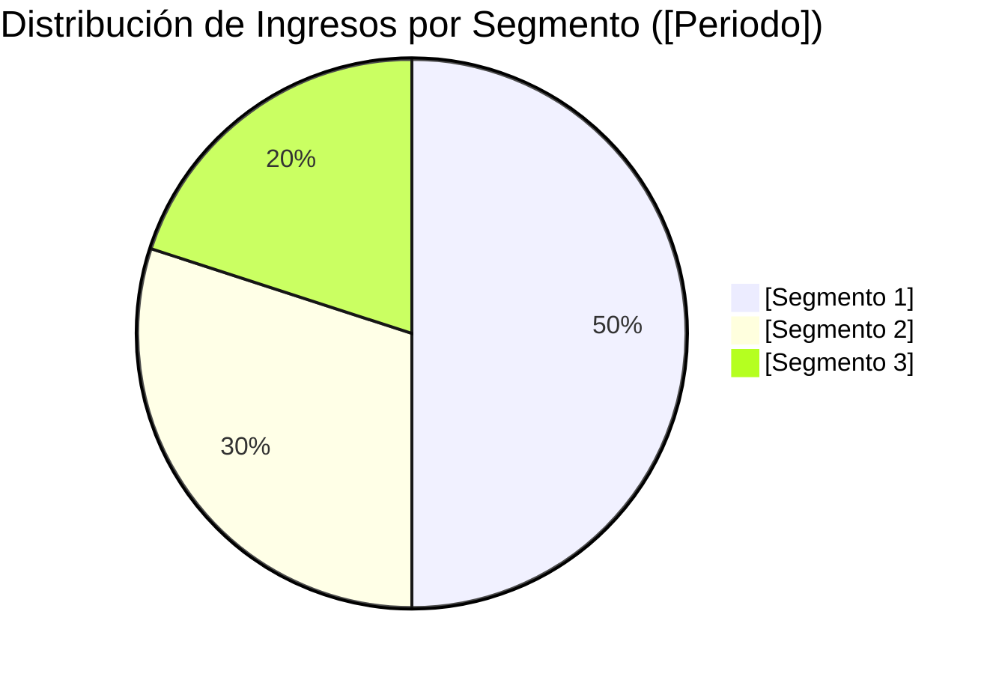
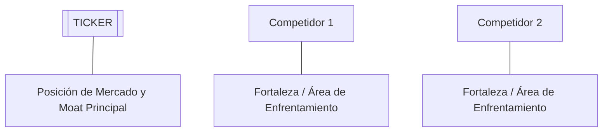

# Informe de Tesis de Inversión: [Nombre de la Empresa] ([TICKER]) - [Trimestre/Año ej. Q2 2026]
**Fecha:** [Fecha del Informe]  
**Clasificación CQV:** [ÉLITE / ALTA CALIDAD / EN OBSERVACIÓN]  
**Calificación Final:** [COMPRA / COMPRA ESCALONADA / MANTENER / VENTA]. [Resumen en una frase del veredicto principal].

---

## 1. Resumen Ejecutivo

[Descripción breve del modelo de negocio, industria, propuesta de valor y fuente de ventaja competitiva].

[Resumen de los últimos resultados trimestrales/anuales, indicando crecimiento de ingresos, expansión/contracción de márgenes y generación de caja libre].

Bajo el marco multifactorial **CQV v3.0 (Quality and Structural Value)**, la empresa obtiene una puntuación de **[X.XX]/10**, destacando en [mención de los factores F1-F8 más fuertes].

---

## 2. Métricas y Puntuaciones en el Modelo CQV v3.0

El modelo **CQV v3.0 (Quality & Structural Value)** evalúa la fortaleza fundamental de una compañía mediante la ponderación de 8 factores cuantitativos y cualitativos clave. La fórmula de cálculo del score consolidado es la siguiente:

$$\text{CQV v3.0} = (F_1 \times 0.20) + (F_2 \times 0.10) + (F_3 \times 0.10) + (F_4 \times 0.20) + (F_5 \times 0.10) + (F_6 \times 0.10) + (F_7 \times 0.10) + (F_8 \times 0.10)$$

### 2.1. Tabla de Valoraciones Parciales y Desglose de Cálculo

| Factor / Componente del Modelo | Puntuación (0-10) | Peso Absoluto | Contribución Parcial | Diagnóstico Financiero y Sub-componentes Evaluados |
| :--- | :---: | :---: | :---: | :--- |
| **F1: Rentabilidad Operativa** | **[X.XX]** | 20.0% | **[F1 * 0.20]** | [Margen bruto, margen operativo GAAP/Non-GAAP, ROIC real, ROE y cumplimiento de la Rule of 40/45]. |
| **F2: Solidez Financiera** | **[X.XX]** | 10.0% | **[F2 * 0.10]** | [Estructura de deuda, ratio Deuda/EBITDA, caja neta, cobertura de intereses y liquidez en balance]. |
| **F3: Crecimiento del Negocio** | **[X.XX]** | 10.0% | **[F3 * 0.10]** | [Crecimiento YoY de ingresos, billings/contratos, EBITDA y EPS diluido normalizado]. |
| **F4: Foso Económico (Moat)** | **[X.XX]** | 20.0% | **[F4 * 0.20]** | [Tipo de moat: costes de cambio, efecto red, patentes/ASIC, cuota de mercado global]. |
| **F5: Proyecciones e IA** | **[X.XX]** | 10.0% | **[F5 * 0.10]** | [Resiliencia tecnológica, adopción de IA empresarial, crecimiento de ARR en nube y TAM objetivo]. |
| **F6: Asignación de Capital** | **[X.XX]** | 10.0% | **[F6 * 0.10]** | [Recompras de acciones, dividendos, adquisiciones (M&A) y ratio de calidad GAAP/Non-GAAP (disciplina SBC)]. |
| **F7: FCF Yield & Valuación** | **[X.XX]** | 10.0% | **[F7 * 0.10]** | [Rendimiento del flujo de caja libre ajustado (Owner Earnings), FCF Margin y ratio PEG]. |
| **F8: Antifragilidad** | **[X.XX]** | 10.0% | **[F8 * 0.10]** | [Porcentaje de ingresos recurrentes, diversificación geográfica/clientes y resiliencia en recesiones]. |
| **SCORE CQV v3.0 FINAL** | -- | **100.0%** | **[SUMA PARCIALES]** | **Calificación: [ÉLITE / ALTA CALIDAD / EN OBSERVACIÓN]** |

---

## 3. Análisis Detallado del Estado de Resultados ([Periodo ej. Q2 2026])

### 3.1. Tabla Comparativa de Resultados Trimestrales / Anuales

| Métrica Clave (en millones $, excepto EPS) | [Periodo Actual] | [Periodo Previo] | Variación QoQ (%) | [Mismo Periodo Año Ant.] | Variación YoY (%) |
| :--- | :---: | :---: | :---: | :---: | :---: |
| **Ingresos Consolidados Totales** | $[X] M | $[X] M | [X]% | $[X] M | [X]% |
| **[División / Segmento Principal 1]** | $[X] M | $[X] M | [X]% | $[X] M | [X]% |
| *-- [Sub-línea o Producto 1.1]* | $[X] M | $[X] M | [X]% | $[X] M | [X]% |
| *-- [Sub-línea o Producto 1.2]* | $[X] M | $[X] M | [X]% | $[X] M | [X]% |
| **[División / Segmento Principal 2]** | $[X] M | $[X] M | [X]% | $[X] M | [X]% |
| **Gastos Operativos Totales (OpEx)** | $[X] M | $[X] M | [X]% | $[X] M | [X]% |
| *-- Investigación y Desarrollo (I+D / R&D)* | $[X] M | $[X] M | [X]% | $[X] M | [X]% |
| *-- Ventas, Generales y Admin. (SG&A)* | $[X] M | $[X] M | [X]% | $[X] M | [X]% |
| **Beneficio Operativo (Operating Income)** | **$[X] M** | **$[X] M** | **[X]%** | **$[X] M** | **[X]%** |
| **Margen Operativo (%)** | **[X]%** | **[X]%** | **[X] bps** | **[X]%** | **[X] bps** |
| **EBITDA Ajustado** | $[X] M | $[X] M | [X]% | $[X] M | [X]% |
| **Margen EBITDA Ajustado (%)** | **[X]%** | **[X]%** | [X] bps | **[X]%** | [X] bps |
| **Otros Ingresos / (Gastos) Netos No Operativos** | $[X] M* | $[X] M | -- | $[X] M | -- |
| **Beneficio Neto (GAAP)** | **$[X] M** | **$[X] M** | **[X]%** | **$[X] M** | **[X]%** |
| **Diluted EPS (GAAP)** | **$[X]** | **$[X]** | **[X]%** | **$[X]** | **[X]%** |
| **Non-GAAP / Adj EPS (Normalizado)** | **$[X]** | **$[X]** | **[X]%** | **$[X]** | **[X]%** |
| **Recompra de Acciones & Dividendo** | $[X] M | $[X] M | [X]% | $[X] M | [X]% |
| **Inversión de Capital (CapEx)** | $[X] M | $[X] M | [X]% | $[X] M | [X]% |
| **Free Cash Flow (FCF Trimestral)** | **$[X] M** | **$[X] M** | **[X]%** | **$[X] M** | **[X]%** |

*\*Nota: [Aclaración de partidas no operativas extraordinarias como revalorizaciones no realizadas de inversiones o costes de litigios/M&A].*

---

### 3.2. Desempeño por Segmentos de Negocio / Líneas de Producto



*   **[Segmento 1] ([X]% de los ingresos - $[X] M)**:
    *   **Ingresos & Crecimiento**: $[X] millones ([X]% YoY).
    *   **Margen / Rentabilidad**: [X]%.
    *   *Drivers Clave*: [Motivos de aceleración o desaceleración, adopción de productos e IA].
*   **[Segmento 2] ([X]% de los ingresos - $[X] M)**:
    *   **Ingresos & Crecimiento**: $[X] millones ([X]% YoY).
    *   *Drivers Clave*: [Motivos de aceleración o desaceleración].

---

### 3.3. Análisis Histórico de Eficiencia de Capital: ROIC, ROI/ROA y ROE (Comparativa 5 Años)

Esta sección analiza la evolución quinquenal del retorno del capital invertido (**ROIC**), la eficiencia en el uso de activos totales (**ROA / ROI**) y la rentabilidad sobre patrimonio neto (**ROE**).

#### A. Definiciones y Fórmulas de Cálculo:

1. **ROIC (Return on Invested Capital)**:
   $$\text{ROIC} = \frac{\text{NOPAT}}{\text{Capital Investido}} = \frac{\text{Beneficio Operativo (EBIT)} \times (1 - t)}{\text{Deuda Total} + \text{Patrimonio Neto} - \text{Caja Excedente}}$$
   *Mide la capacidad real de los activos operativos del negocio para generar retornos netos.*

2. **ROA / ROI (Return on Assets / Return on Investment)**:
   $$\text{ROA} = \frac{\text{Beneficio Neto GAAP}}{\text{Activos Totales Promedio}}$$
   *Mide la eficiencia en la utilización de la infraestructura total y planta del balance.*

3. **ROE (Return on Equity)**:
   $$\text{ROE} = \frac{\text{Beneficio Neto GAAP}}{\text{Patrimonio Neto Promedio}}$$
   *Refleja el apalancamiento de retornos capturado por los accionistas comunes.*

#### B. Tabla Comparativa de Retornos sobre Capital (Evolución 5 Años):

| Métrica de Eficiencia de Capital | [Año -4] | [Año -3] | [Año -2] | [Año -1] | [Año Actual] | Tendencia y Diagnóstico (5 Años) |
| :--- | :---: | :---: | :---: | :---: | :---: | :--- |
| **Ingresos Totales (M$)** | $[X] M | $[X] M | $[X] M | $[X] M | **$[X] M** | [Tasa CAGR de ingresos]. |
| **Beneficio Operativo GAAP (M$)** | $[X] M | $[X] M | $[X] M | $[X] M | **$[X] M** | [Crecimiento de EBITDA/EBIT]. |
| **Margen Operativo Non-GAAP (%)** | [X]% | [X]% | [X]% | [X]% | **[X]%** | [Expansión/contracción en bps]. |
| **Beneficio Neto GAAP (M$)** | $[X] M | $[X] M | $[X] M | $[X] M | **$[X] M** | [Evolución de ganancias netas]. |
| **Activos Totales (M$)** | $[X] M | $[X] M | $[X] M | $[X] M | **$[X] M** | [Crecimiento de la base de activos]. |
| **Capital Investido Neto (M$)** | $[X] M | $[X] M | $[X] M | $[X] M | **$[X] M** | [Capital neto operativo]. |
| **ROA / ROI (Return on Assets %)** | **[X]%** | **[X]%** | **[X]%** | **[X]%** | **[X]%** | **[Diagnóstico de eficiencia en activos]** |
| **ROE (Return on Equity %)** | **[X]%** | **[X]%** | **[X]%** | **[X]%** | **[X]%** | **[Diagnóstico de retorno sobre capital]** |
| **ROIC (Return on Invested Capital %)** | **[X]%** | **[X]%** | **[X]%** | **[X]%** | **[X]%** | **[Diagnóstico de retorno sobre inversión]** |
| **Margen de Free Cash Flow (%)** | [X]% | [X]% | [X]% | [X]% | **[X]%** | [Conversión de caja libre]. |

---

### 3.4. Análisis Detallado del CapEx y la Inversión en Infraestructura / Planta

El gasto en inversión de capital (CapEx) debe evaluarse trimestralmente para medir la intensidad de la reinversión y la velocidad de expansión:

| Periodo | Compras de Propiedad y Equipo (CapEx) | Variación YoY (%) | Destino de la Inversión / Proyectos |
| :--- | :---: | :---: | :--- |
| **[Periodo -3]** | $[X] M | [X]% | [Servidores, data centers, plantas o equipo]. |
| **[Periodo -2]** | $[X] M | [X]% | [Servidores, data centers, plantas o equipo]. |
| **[Periodo -1]** | $[X] M | [X]% | [Servidores, data centers, plantas o equipo]. |
| **[Periodo Actual]** | **$[X] M** | **[X]%** | **[Destino principal del CapEx actual]** |
| **Últimos 12 Meses (TTM)** | **$[X] M** | **[X]%** | **Inversión total acumulada de capital.** |

* **Preguntas Clave del CapEx**:
  1. **¿Por qué está invirtiendo $[X]M trimestrales en CapEx?**: [Explicación de la demanda del mercado o crecimiento de divisiones].
  2. **Retorno de la Inversión (ROI/ROIC)**: [Medición de la monetización de la infraestructura o capacidad instalada].

---

### 3.5. Asignación de Capital y Estructura de Balance

*   **Recompra de Acciones & Dividendos**: [Detalles de buybacks en el trimestre, precio medio de recompra y dividendo por acción].
*   **Deuda y Solvencia**:
    *   **Deuda Total**: $[X] millones.
    *   **Caja y Equivalentes**: $[X] millones.
    *   **Ratio Deuda Neta / EBITDA**: [X]x (vs. objetivo corporativo).
*   **M&A / Adquisiciones**: [Detalles de compras o adquisiciones recientes y su impacto financiero].

---

### 3.6. Normalización Financiera: Ajustes Críticos en EPS y CapEx (Owner Earnings)

*(Sección obligatoria cuando existan distorsiones contables por ingresos/gastos no operativos o picos extraordinarios de inversión de capital CapEx)*.

#### A. Normalización de Ganancias / Pérdidas No Operativas (Accionarias / Extraordinarias):
* **Identificación del Ajuste GAAP vs. Non-GAAP**:
  * Detectar partidas contables no recurrentes como: revalorizaciones no realizadas de inversiones en renta variable (*unrealized equity gains/losses*), ventas de activos, costes extraordinarios de litigios o M&A.
  * **Cálculo del EPS Operativo Normalizado**:
    $$\text{Beneficio Neto Operativo Ajustado} = \text{Beneficio Operativo (EBIT)} \times (1 - \text{Tasa Impuesto Efectiva})$$
    $$\text{EPS Diluido Operativo Normalizado} = \frac{\text{Beneficio Neto Operativo Ajustado}}{\text{Acciones Diluidas en Circulación}}$$
* **Impacto en CQV v3.0**: Se debe utilizar el EPS Operativo Ajustado para evitar múltiplos PER irrealmente distorsionados (falsos chollos o múltiplos inflados) y para evaluar el crecimiento operativo real (**Factor F3**).

#### B. Normalización del CapEx de Expansión vs. CapEx de Mantenimiento (Owner Earnings):
* **Descomposición del CapEx Total**:
  * **CapEx de Mantenimiento (*Maintenance CapEx*)**: Capital recurrente necesario para mantener las operaciones y activos actuales.
  * **CapEx de Crecimiento / Expansión (*Growth CapEx*)**: Inversión discrecional en nuevos proyectos de expansión (ej. superclústeres de IA, construcción de plantas o nuevas líneas).
* **Cálculo de Owner Earnings (FCF Normalizado de Operación)**:
  $$\text{Owner Earnings (FCF Ajustado)} = \text{Flujo de Caja Operativo (OCF)} - \text{CapEx de Mantenimiento}$$
* **Impacto en CQV v3.0 (Factor F7 - FCF Yield)**: Cuando un pico temporal de *Growth CapEx* comprima el Free Cash Flow GAAP, el modelo **CQV v3.0** debe recalcular el **FCF Yield** utilizando los *Owner Earnings* para reflejar la verdadera generación de caja del negocio maduro.

---

### 3.7. Actualización de Guías Financieras (Guidance)

| Métrica de Guía | Guía Actual ([Año]) | Guía Anterior ([Periodo]) | Diagnóstico |
| :--- | :---: | :---: | :--- |
| **Ingresos / Ventas** | $[X]M - $[X]M | $[X]M - $[X]M | [Mantención / Incremento / Recorte] |
| **Gasto Operativo** | $[X]M - $[X]M | $[X]M - $[X]M | [Diagnóstico de costes] |
| **Free Cash Flow (FCF)** | **$[X]M - $[X]M** | **$[X]M - $[X]M** | **[Diagnóstico de generación de caja]** |

---

### 3.8. Líneas Rojas y Puntos de Vulnerabilidad Detectados

A continuación se resumen las principales alertas y focos de atención identificados en los estados financieros:

> [!WARNING]
> **1. [Línea Roja 1: ej. Desaceleración en Segmento Clave / Caída de Ventas Netas]**
> * [Detalle cuantitativo de la métrica que cayó o se deterioró].

> [!WARNING]
> **2. [Línea Roja 2: ej. Contracción de Márgenes Operativos o EBITDA]**
> * [Detalle cuantitativo de compresión de margen en bps y causa].

> [!WARNING]
> **3. [Línea Roja 3: ej. Distorsión de Beneficio Neto por Partidas No Operativas / CapEx de IA]**
> * [Detalle de normalización en EPS o compresión puntual de FCF].

---

### 3.9. Impacto de la Inteligencia Artificial (Presente y Futuro)

#### A. Impacto en el Presente ([Año Actual]):
* **[Caso de Uso 1]**: [Implementaciones actuales de IA en productos o servicios].
* **[Eficiencia Interna]**: [Uso de IA para reducir costos operativos o acelerar desarrollo].

#### B. Impacto en el Futuro (Perspectiva a 3-5 Años):
* **[Oportunidad Futura 1]**: [Monetización de datos, automatización avanzada o nuevos productos IA].

---

### 3.10. Análisis Detallado de la Competencia y Posicionamiento de Mercado



#### Comparativa de Rivales Principales:

| Competidor | Plataforma / Producto | Estado Actual | Ventaja Defensiva de [TICKER] frente al Rival |
| :--- | :--- | :--- | :--- |
| **[Competidor 1]** | [Producto Rival] | [Cuota / Estado] | [Ventaja exclusiva de nuestra empresa]. |
| **[Competidor 2]** | [Producto Rival] | [Cuota / Estado] | [Ventaja exclusiva de nuestra empresa]. |

#### Matriz de Ventajas Defensivas (Moat):
1. **[Ventaja 1: ej. Costes de Cambio / Marca / Efecto Red]**: [Descripción].
2. **[Ventaja 2: ej. Escala de Datos / Propiedad Intelectual]**: [Descripción].

---

## 4. Tesis de Inversión (Toro vs. Oso)

### Tesis A: El Argumento del Oso (Trampa de Valor / Riesgos)
*   **[Riesgo 1]**: [Descripción del riesgo operativo o competitivo].
*   **[Riesgo 2]**: [Descripción del riesgo de valoración o deuda].

### Tesis B: El Argumento del Toro (Oportunidad / Moat)
*   **[Catalizador 1]**: [Descripción del motor de crecimiento principal].
*   **[Catalizador 2]**: [Descripción del poder de fijación de precios o expansión de márgenes].

---

## 5. Evolución Histórica de Puntuaciones CQV y Valuación (Últimos 5 Años)

Esta sección monitorea el comportamiento de las calificaciones del modelo CQV a lo largo del tiempo para verificar si la compañía atraviesa un proceso de **compounding fundamental (mejora continua de la calidad)** o un deterioro estructural.

### 5.1. Tabla Evolutiva de Scores CQV (v1.0, v1.1, v2.0 y v3.0) y Múltiplos PER

| Año / Periodo | PER Trailing (Promedio) | PER Forward (Estimado) | CQV v1.0 (5F Legacy) | CQV v1.1 (5F Pro) | CQV v2.0 (8F Legacy) | CQV v3.0 (8F Pro) | Clasificación CQV |
| :--- | :---: | :---: | :---: | :---: | :---: | :---: | :---: |
| **[Año -4]** | [X.X]x | [X.X]x | [X.XX] | [X.XX] | [X.XX] | **[X.XX]** | [Clasificación] |
| **[Año -3]** | [X.X]x | [X.X]x | [X.XX] | [X.XX] | [X.XX] | **[X.XX]** | [Clasificación] |
| **[Año -2]** | [X.X]x | [X.X]x | [X.XX] | [X.XX] | [X.XX] | **[X.XX]** | [Clasificación] |
| **[Año -1]** | [X.X]x | [X.X]x | [X.XX] | [X.XX] | [X.XX] | **[X.XX]** | [Clasificación] |
| **[Periodo Actual]** | **[X.X]x** | **[X.X]x** | **[X.XX]** | **[X.XX]** | **[X.XX]** | **[X.XX]** | **[Clasificación]** |

---

### 5.2. Gráfico de Evolución Histórica del Score CQV v3.0

```mermaid
linechart
    title Trayectoria Histórica del Score CQV v3.0 ([TICKER])
    x-axis [[Año -4], [Año -3], [Año -2], [Año -1], [Periodo Actual]]
    y-axis "Score CQV (0-10)" 7.0 --> 10.0
    line "CQV v3.0 Score" [[Score-4], [Score-3], [Score-2], [Score-1], [Score Actual]]
```

---

### 5.3. Diagnóstico del Compounding Fundamental y De-risking de Múltiplos

1. **Evaluación de Permanencia en Categorías de Calidad**:
   - Analizar si el activo se mantiene de forma estable en la franja **ÉLITE (Score > 9.00)** o **ALTA CALIDAD (8.00 - 8.99)** a lo largo de los ciclos económicos.
2. **Tendencia del Score CQV v3.0**:
   - Explicar los drivers detrás de la aceleración o compresión de la nota fundamental (expansión de márgenes, apalancamiento operativo, crecimiento de FCF).
3. **Relación entre Múltiplos PER y Beneficios (De-risking)**:
   - Diagnosticar si la compresión del múltiplo PER unida a un aumento en el score CQV v3.0 genera una ventana de compra con amplio margen de seguridad (ratio PEG < 1.2x).

---

## 6. Precio Ideal de Compra (Niveles de Entrada y Valuación)

Con la acción cotizando actualmente a **$[Precio Actual]** (PER Trailing: **[X]x**, PER Forward: **[X]x**), se definen los siguientes tramos de entrada:

### 🟢 Nivel 1: Zona de Entrada Razonable ($[Rango Precio 1])
* **PER Forward**: **~[X]x** | **Descuento sobre PER Promedio**: **-[X]%**
* **Diagnóstico**: [Nivel idóneo para iniciar el primer tramo del 30%-40%].

### 🟡 Nivel 2: Zona de Precio Ideal / Gran Oportunidad ($[Rango Precio 2])
* **PER Forward**: **~[X]x** | **Descuento sobre PER Promedio**: **-[X]%**
* **Diagnóstico**: [Nivel de alta convicción para ejecutar el segundo tramo del 40%].

### 🔴 Nivel 3: Zona de Ganga / Pánico de Mercado (< $[Precio 3])
* **PER Forward**: **< [X]x**
* **Diagnóstico**: [Oportunidad generacional para completar la posición máxima].

---

## 7. Preguntas Frecuentes del Inversor (FAQs)

### Q1: ¿Por qué aumentan los gastos operativos e inversiones sin un impacto inmediato en las ventas netas?
* **Respuesta**: [Explicación del ciclo de inversión tecnológica/IA, digestión de M&A y desfase temporal entre el gasto actual y la monetización institucional futura].

### Q2: ¿Es sostenible la tasa de crecimiento actual y la estructura de deuda?
* **Respuesta**: [Diagnóstico del nivel de apalancamiento, cobertura de intereses por EBITDA y capacidad de refinanciación].

### Q3: ¿Cómo afecta el entorno macroeconómico y de tipos al modelo de negocio?
* **Respuesta**: [Evaluación del impacto de la volatilidad bursátil en comisiones por AUM y presupuestos de los clientes].

---

## 8. Conclusión y Veredicto de Inversión

[Resumen ejecutivo final reconectando la calidad del negocio, las líneas rojas, las guías y la valoración actual].

**Veredicto:** **[COMPRA / COMPRA ESCALONADA / MANTENER]. Clasificación [ÉLITE / ALTA CALIDAD]. [Instrucciones finales de ejecución en cartera].**
