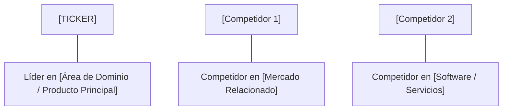

# Informe de Tesis de Inversión: [Nombre de la Empresa] ([TICKER]) - [Trimestre/Año ej. Q2 2026]
**Fecha de Emisión:** [Fecha del Informe]  
**Fecha de Publicación del Resultado Analizado:** [DD/MM/AAAA]  
**Fecha de Valoración:** [DD/MM/AAAA]  
**Fecha del Precio Utilizado:** [DD/MM/AAAA]  
**Mercado / Fuente del Precio:** [NASDAQ/NYSE/etc. — Fuente]  
**Metodología Aplicada:** [CQV v4.0 / CQV v5.0]  
**Clasificación CQV Calidad:** [ÉLITE / ALTA CALIDAD / EN OBSERVACIÓN / VULNERABLE]  
**Veredicto Final Operativo:** [COMPRAR / ACUMULAR / MANTENER / EVITAR]. [Resumen en una frase del veredicto principal].

---

## 1. Resumen Ejecutivo y Bloque de Salida Final CQV [v4.0 / v5.0]

> [!NOTE]
> ### 📊 BLOQUE OFICIAL DE SALIDA MATRIZ CQV [v4.0 / v5.0] (SECCIÓN 9.6 / 7.1)
> ```text
> CQV Calidad (F1-F8):   [X.XX] / 10
> Value Score:           [X.XX] / 10
> Score Crecimiento/Múltiplo (o PEG): [X.XX] / 10
> Valor Intrínseco:      $[X.XX] por acción
> Precio Actual:         $[X.XX]
> Margen de Seguridad:   [X.X]%
> Confianza:             [Alta / Media / Baja]
> Metodología:           [v4.0 / v5.0]
> Veredicto Final:       [Comprar / Acumular / Mantener / Evitar]
> ```

### 📋 Matriz Identificadora de Métricas Emitidas por CQV [v4.0 / v5.0]

| Parámetro Emitido por CQV | Valor Obtenido | Rango / Escala | Diagnóstico Operativo |
| :--- | :---: | :---: | :--- |
| **CQV Calidad Fundamental (F1-F8):** | **[X.XX] / 10** | 0.00 – 10.00 | **[ÉLITE ≥9.00 / ALTA CALIDAD 8.00-8.99]** |
| **Value Score (Capa de Valoración):** | **[X.XX] / 10** | 0.00 – 10.00 | **[Atractivo ≥6.00 / Exigente <5.00]** |
| **PEG Bruto (v4) / Crecimiento-Múltiplo Bruto (v5):** | **[X.XX]** | Sin acotación | Métrica auditada bruta de crecimiento vs múltiplo. |
| **Score PEG (v4) / Score Crecimiento-Múltiplo (v5):** | **[X.XX] / 10** | 0.00 – 10.00 (o N/D si growth ≤0 en v5) | Métrica para el cálculo de Value Score. |
| **Valor Intrínseco Estimado (DCF Base):** | **$[X.XX]** | En USD ($) | Estimación por Descuento de Flujos y Múltiplos. |
| **Precio de Mercado a la Fecha de Valoración:** | **$[X.XX]** | En USD ($) | Cierre de la misma fecha que la publicación/valoración; nunca precio actual para informes históricos. |
| **Margen de Seguridad (%):** | **[X.X]%** | En porcentaje (%) | Diferencial entre Valor Intrínseco y Precio Mercado. |
| **Nivel de Confianza de Datos:** | **[Alta / Media]** | Alta / Media / Baja | Calidad y completitud auditada de estados financieros. |
| **Veredicto Final Operativo:** | **[Veredicto]** | 4 Categorías | **[Comprar / Acumular / Mantener / Evitar]** |

---

[Descripción breve del modelo de negocio, industria, propuesta de valor y fuente de ventaja competitiva].

[Resumen de los últimos resultados trimestrales/anuales, indicando crecimiento de ingresos, expansión/contracción de márgenes y generación de caja libre].

Bajo el marco multifactorial **CQV [v4.0 / v5.0] (Quality, Resilience and Value)**, la empresa obtiene una puntuación de calidad fundamental de **[X.XX]/10**, destacando en [mención de los factores F1-F8 más fuertes].

---

## 2. Métricas y Puntuaciones en el Modelo CQV Calidad [v4.0 / v5.0]

El modelo **CQV [v4.0 / v5.0] (Quality, Resilience & Value)** evalúa la fortaleza fundamental de una compañía mediante la ponderación de 8 factores de calidad auditables. La fórmula de cálculo del score de calidad consolidado es la siguiente:

$$\text{CQV Calidad} = (F_1 \times 0.20) + (F_2 \times 0.15) + (F_3 \times 0.15) + (F_4 \times 0.15) + (F_5 \times 0.10) + (F_6 \times 0.10) + (F_7 \times 0.05) + (F_8 \times 0.10)$$

### 2.1. Tabla de Valoraciones Parciales y Desglose Auditado (F1-F8)

| Factor / Componente del Modelo | Puntuación (0-10) | Peso Absoluto | Contribución Parcial | Diagnóstico Financiero y Evidencia Cuantitativa |
| :--- | :---: | :---: | :---: | :--- |
| **F1: Economía del Negocio & Rentabilidad** | **[X.XX]** | 20.0% | **[F1 * 0.20]** | [Margen bruto, margen operativo GAAP/Non-GAAP, ROIC real y conversión de FCF]. |
| **F2: Solidez Financiera** | **[X.XX]** | 15.0% | **[F2 * 0.15]** | [Estructura de deuda, ratio Deuda/EBITDA, cobertura de intereses, refinanciación, liquidez y estrés]. |
| **F3: Crecimiento Durable** | **[X.XX]** | 15.0% | **[F3 * 0.15]** | [CAGR 3-5 años de ingresos, EPS normalizado, retención NRR y dilución neta por SBC]. |
| **F4: Moat Competitivo** | **[X.XX]** | 15.0% | **[F4 * 0.15]** | [Costes de cambio, ventajas de red/datos, cuota de mercado global y durabilidad del foso]. |
| **F5: Asignación de Capital** | **[X.XX]** | 10.0% | **[F5 * 0.10]** | [Reinversión orgánica (ROIC incremental vs WACC), recompras netas, M&A e historial de dividendos]. |
| **F6: Dirección & Ejecución Operativa** | **[X.XX]** | 10.0% | **[F6 * 0.10]** | [Alineación directiva, estructura de incentivos y consistencia en el cumplimiento de guías]. |
| **F7: Opcionalidad Futura & Disrupción** | **[X.XX]** | 5.0% | **[F7 * 0.05]** | [Monetización demostrada en megatendencias e IA, inmunidad a la desintermediación por LLMs]. |
| **F8: Resiliencia Operativa** | **[X.XX]** | 10.0% | **[F8 * 0.10]** | [Porcentaje de ingresos recurrentes, ciclicidad, diversificación de clientes y flexibilidad]. |
| **SCORE CQV Calidad FINAL** | -- | **100.0%** | **[SUMA PARCIALES]** | **Calificación: [ÉLITE / ALTA CALIDAD / EN OBSERVACIÓN / VULNERABLE]** |

---

## 3. Análisis Detallado del Estado de Resultados ([Periodo ej. Q2 2026])

### 3.1. Tabla Comparativa de Resultados Trimestrales / Anuales

| Métrica Clave (en millones $, excepto EPS) | [Periodo Actual] | [Periodo Previo] | Variación QoQ (%) | [Mismo Periodo Año Ant.] | Variación YoY (%) |
| :--- | :---: | :---: | :---: | :---: | :---: |
| **Ingresos Consolidados Totales** | $[X] M | $[X] M | [X]% | $[X] M | [X]% |
| **Gastos Operativos Totales (OpEx)** | $[X] M | $[X] M | [X]% | $[X] M | [X]% |
| **Beneficio Operativo (Operating Income)** | **$[X] M** | **$[X] M** | **[X]%** | **$[X] M** | **[X]%** |
| **Margen Operativo (%)** | **[X]%** | **[X]%** | **[X] bps** | **[X]%** | **[X] bps** |
| **Beneficio Neto (GAAP)** | **$[X] M** | **$[X] M** | **[X]%** | **$[X] M** | **[X]%** |
| **Diluted EPS (GAAP)** | **$[X]** | **$[X]** | **[X]%** | **$[X]** | **[X]%** |
| **Free Cash Flow (FCF Trimestral)** | **$[X] M** | **$[X] M** | **[X]%** | **$[X] M** | **[X]%** |

---

### 3.2. Posicionamiento Competitivo y Matriz de Moat



#### Comparativa de Rivales Principales:

| Competidor | Áreas de Solapamiento | Ventaja Relativa de [TICKER] frente al Rival | Rango de Moat |
| :--- | :--- | :--- | :---: |
| **[Competidor 1]** | [Línea de producto o segmento coincidente]. | [Diferencial competitivo / switching costs]. | **Excepcional** |
| **[Competidor 2]** | [Línea de producto o segmento coincidente]. | [Propuesta de valor / pricing power]. | **Alto** |

---

### 3.3. Análisis Histórico de Eficiencia de Capital: ROIC, ROI/ROA y ROE (Serie Histórica desde 2020)

| Métrica de Eficiencia de Capital | 2020 | 2021 | 2022 | 2023 | 2024 | 2025 | [Año Actual TTM] | Tendencia y Diagnóstico (Desde 2020) |
| :--- | :---: | :---: | :---: | :---: | :---: | :---: | :---: | :--- |
| **ROA / ROI (Return on Assets %)** | **[X]%** | **[X]%** | **[X]%** | **[X]%** | **[X]%** | **[X]%** | **[X]%** | **[Diagnóstico de eficiencia en activos]** |
| **ROE (Return on Equity %)** | **[X]%** | **[X]%** | **[X]%** | **[X]%** | **[X]%** | **[X]%** | **[X]%** | **[Diagnóstico de retorno sobre capital]** |
| **ROIC (Return on Invested Capital %)** | **[X]%** | **[X]%** | **[X]%** | **[X]%** | **[X]%** | **[X]%** | **[X]%** | **[Diagnóstico de retorno sobre inversión]** |

---

### 3.4. Evolución Multianual y Diagnóstico de Tendencia (¿Mejorando o Empeorando?)

| Eje Financiero / Operativo | Hace 2 Años (FY-2) | Año Anterior (FY-1) | Año Actual (FY) | Diagnóstico de Tendencia (¿Mejorando o Empeorando?) |
| :--- | :---: | :---: | :---: | :--- |
| **Ingresos Consolidados ($B)** | $[X]B | $[X]B | $[X]B | **[🟢 Mejorando / 🟡 Estabilidad / 🔴 Empeorando]** — [Explicación del ritmo de aceleración/desaceleración]. |
| **Crecimiento Orgánico (%)** | [X]% | [X]% | [X]% | **[🟢 Mejorando / 🟡 Estabilidad / 🔴 Empeorando]** — [Tendencia en volumen y fijación de precios]. |
| **Margen Operativo (%)** | [X]% | [X]% | [X]% | **[🟢 Mejorando / 🟡 Estabilidad / 🔴 Empeorando]** — [Evolución de apalancamiento operativo y costos]. |
| **Beneficio por Acción (EPS Non-GAAP)** | $[X] | $[X] | $[X] | **[🟢 Mejorando / 🟡 Estabilidad / 🔴 Empeorando]** — [Ritmo de expansión del beneficio por acción]. |
| **Flujo de Caja Operativo (OCF $B)** | $[X]B | $[X]B | $[X]B | **[🟢 Mejorando / 🟡 Estabilidad / 🔴 Empeorando]** — [Conversión de caja libre y calidad de ganancias]. |

> [!NOTE]
> **Síntesis del Desempeño Multianual:**  
> [Conclusión resumida sobre si la compañía presenta una trayectoria de mejora continua, meseta estructural o deterioro operativo en comparación con ejercicios pasados].

---

### 3.5. Guidance y Perspectivas Futuras para Próximos Periodos

#### 🎯 Proyecciones Oficiales de la Compañía (Próximo Ejercicio Fiscal / Próximos Periodos)
* **Ingresos Consolidados Estimados:** **$[X.XX]B – $[X.XX]B** (Crecimiento proyectado del **+[X]% al +[X]%**).
* **Beneficio por Acción Ajustado (EPS Non-GAAP):** **$[X.XX] – $[X.XX]** (Expansión del **+[X]%**).
* **Flujo de Caja Libre / Margen Operativo:** Target de margen del **[X]%**.

#### 📊 Guidance Desglosado por Segmentos Clave
1. **[Segmento Principal 1]:** Crecimiento proyectado del **+[X]% al +[X]%**.
2. **[Segmento Principal 2]:** Crecimiento proyectado del **+[X]% al +[X]%**.
3. **[Segmento 3 / Nuevas Iniciativas]:** Crecimiento proyectado del **+[X]%**.

#### 🛠️ Cambios Estratégicos, Contables o de Reporte para Próximos Ejercicios
- **[Cambio 1]:** [Detalle de cambios en la estructura de segmentos, reconocimientos de ingresos o ajustes contables].
- **[Cambio 2]:** [Planes de asignación de capital, recompras o aceleración de inversiones en IA / I+D].

---

## 4. Tesis de Inversión (Toro vs. Oso)

### Tesis A: El Argumento del Oso (Riesgos)
*   **[Riesgo 1]**: [Descripción del riesgo principal].
*   **[Riesgo 2]**: [Descripción de vulnerabilidades o compresión de márgenes].

### Tesis B: El Argumento del Toro (Moat & Oportunidad)
*   **[Fortaleza 1]**: [Descripción del moat o catalizador de crecimiento].
*   **[Fortaleza 2]**: [Generación de caja libre y rentabilidad superior].

---

### 🚨 Líneas Rojas y Puntos de Atención Post-Resultados Trimestrales

| Punto de Atención / Línea Roja | Diagnóstico Cuantitativo / Cualitativo | Severidad | Mitigación Operativa o Impacto a Largo Plazo |
| :--- | :--- | :---: | :--- |
| **[Escrutinio 1: Múltiplos Exigentes]** | PER Trailing / Forward elevado exige superación continua de expectativas. | Media | Ajuste de múltiplo objetivo en el modelo DCF y colchón de seguridad. |
| **[Escrutinio 2: Mezcla de Crecimiento]** | Crecimiento dependiente de subidas de precios vs volumen físico estancado. | Media | Monitoreo trimestral de volúmenes de transacción en originaciones. |
| **[Escrutinio 3: Guía de CapEx / OpEx]** | Inversiones aceleradas en infraestructura cloud diluyen margen marginal temporal. | Baja | Sinergias operativas previstas en 4-8 trimestres con ROIC de reinversión superior. |
| **[Escrutinio 4: Entorno Regulatorio]** | Regulación o escrutinio de tarifas de intermediación. | Media | Diversificación de producto y expansión internacional. |

---

#### 🔮 Diagnóstico de Dimensiones de Riesgo y Prospectiva de Cotización (3-6 meses vs. 12-36 meses)

##### A. Cuadro Diagnóstico por Dimensiones de Negocio

| Dimensión Analizada | Diagnóstico de Salud y Riesgo | ¿Hay Deterioro Estructural? |
| :--- | :--- | :---: |
| **Salud Financiera y Moat** | ROIC y márgenes operativos en niveles máximos históricos. Foso económico inalterado. | ❌ **NO** |
| **Cuota de Mercado** | Retención neta de clientes clave >110%. Sin pérdida de cuota frente a rivales. | ❌ **NO** |
| **Origen de la Fricción** | Factores macroeconómicos temporales (ej. tasas de interés elevadas) o ciclos de inversión. | ⚠️ **Factor Temporal** |

##### B. Prospectiva del Comportamiento de la Acción por Horizontes Temporales

* **📉 Corto Plazo (Próximos 3 a 6 meses) — Consolidación y Volatilidad:**  
  La cotización puede experimentar un periodo de compresión de múltiplos PER hacia niveles más sostenibles y una consolidación en rango lateral mientras el mercado digiere los resultados y ajusta expectativas.
* **📈 Mediano / Largo Plazo (12 a 36 meses) — Recuperación por Catalizadores:**  
  A medida que maduren las inversiones de CapEx y se flexibilicen las condiciones macroeconómicas (recortes de tasas), la empresa volverá a acelerar la generación de flujo de caja libre, impulsando la revalorización de la cotización hacia su valor intrínseco.

---

## 5. Owner Earnings, FCF Yield y Desglose del Value Score

### 5.1. Cálculo de Owner Earnings y FCF Yield Real
- **Flujo de Caja Operativo (OCF TTM):** **$[X] M**
- **CapEx de Mantenimiento (CapEx TTM):** **$[X] M**
- **Owner Earnings (OCF - Maint. CapEx):** **$[X] M**
- **FCF Yield Real del Propietario:** **[X.XX]%**
- **Score FCF Yield (Rúbrica Normalizada):** **[X.XX] / 10**

---

### 5.2. Score Crecimiento / Múltiplo (v5.0) / PEG Bruto (v4.0)
- **Crecimiento Proyectado de EPS NTM (%):** **[X.X]%**
- **Múltiplo PER Forward:** **[X.XX]x**
- **Ratio Bruto (EPS Growth / PER Forward * 10):** **[X.XX]**
- **Score Crecimiento/Múltiplo (o Score PEG):** **[X.XX] / 10** *(o N/D si crecimiento ≤ 0 en v5.0)*

---

### 5.3. Margen de Seguridad y Value Score Consolidado
- **Precio Actual de Mercado:** **$[X.XX]**
- **Valor Intrínseco Estimado (DCF Base):** **$[X.XX]**
- **Margen de Seguridad (%):** **[X.X]%**
- **Score Margen de Seguridad:** **[X.XX] / 10**

#### Ecuación Consolidada del Value Score:
$$\text{Value Score} = 0.40(\text{Score FCF Yield}) + 0.30(\text{Score Crecimiento/Múltiplo}) + 0.30(\text{Score Margen de Seguridad})$$
*(Nota: En v5.0, si falta un componente, los pesos se reponderan proporcionalmente entre los componentes disponibles).*

---

## 6. Valuación por Descuento de Flujos de Caja (DCF) y Sensibilidad

### 6.1. Escenarios de Valoración DCF

| Escenario de Valoración | Crecimiento FCF 1-5a | Crecimiento FCF 6-10a | WACC | Tasa Terminal ($g$) | Valor Intrínseco por Acción | Probabilidad |
| :--- | :---: | :---: | :---: | :---: | :---: | :---: |
| **Escenario Pesimista (Bear)** | [X]% | [X]% | 10.0% | 2.5% | **$[X.XX]** | 25% |
| **Escenario Base (Base Case)** | **[X]%** | **[X]%** | **9.0%** | **3.0%** | **$[X.XX]** | **50%** |
| **Escenario Optimista (Bull)** | [X]% | [X]% | 8.0% | 3.5% | **$[X.XX]** | 25% |

---

### 6.2. Tabla de Análisis de Sensibilidad (WACC vs. Tasa Terminal $g$)

| WACC \ Tasa Terminal ($g$) | 2.5% | 3.0% (Base) | 3.5% |
| :---: | :---: | :---: | :---: |
| **8.0% (Bajo)** | $[X] | $[X] | $[X] |
| **9.0% (Base)** | $[X] | **$[X.XX]** | $[X] |
| **10.0% (Alto)** | $[X] | $[X] | $[X] |

---

### 6.3. Expectativas Implicadas por el Precio y Comparativa de Consenso Wall Street

- **Crecimiento Implícito por el Precio:** [Tasa de crecimiento de ingresos/EPS que descuenta la cotización actual].
- **Margen Operativo Implícito:** [Margen requerido para justificar el precio].
- **Prueba de Expectativas (Reverse DCF):** [¿El precio exige supuestos superiores al Escenario Optimista? Sí / No].

| Escenario / Fuente | Escenario Pesimista (Bear) | Escenario Base (Neutro) | Escenario Optimista (Bull) | Diagnóstico de Brecha de Mercado |
| :--- | :---: | :---: | :---: | :--- |
| **Valor Intrínseco DCF** | **$[DCF Bear]** | **$[DCF Base]** | **$[DCF Bull]** | Estimación multifactorial de caja propia a largo plazo. |
| **Consenso Analistas Wall Street (12M)** | **$[Target Low]** | **$[Target Mean]** | **$[Target High]** | Basado en el consenso de [N] analistas institucionales. |
| **Cotización Actual de Mercado** | **$[Precio]** | **$[Precio]** | **$[Precio]** | Potencial de revalorización al Target Mean: **+[X.X]%**. |

---

## 7. Registro Auditado de Riesgos y Preguntas Frecuentes (FAQs)

| Riesgo Identificado | Probabilidad (0-1) | Impacto (1-5) | Mitigación (0-1) | Indicador Adelantado | Responsable / Seguimiento | Riesgo Ajustado |
| :--- | :---: | :---: | :---: | :--- | :--- | :---: |
| **[Riesgo 1: Regulativo / Competitivo]** | 0.3 | 4 | 0.5 | [Indicador clave] | [Analista] | [Score] |

---

## 8. Evolución Histórica de Puntuaciones CQV y Valuación por Trimestres (Serie 2020 - Presente)

### 8.1. Desglose Trimestral Histórico (Q1, Q2, Q3, Q4 por Año)

> [!NOTE]
> La tabla debe incorporar todos los trimestres disponibles (`Q1`, `Q2`, `Q3`, `Q4`) para cada año registrado en `cqv_history.json`. Se muestran las columnas de CQV correspondientes a cada versión histórica.

| Año / Trimestre | PER Trailing | PER Forward | CQV v1.0 | CQV v2.0 | CQV v3.0 | CQV v4.0 | CQV v5.0 | Clasificación |
| :--- | :---: | :---: | :---: | :---: | :---: | :---: | :---: | :---: |
| **2024 Q1** | [X.X]x | [X.X]x | [X.XX] | [X.XX] | [X.XX] | [X.XX] | [X.XX] | [Clasificación] |
| **2024 Q2** | [X.X]x | [X.X]x | [X.XX] | [X.XX] | [X.XX] | [X.XX] | [X.XX] | [Clasificación] |
| **2024 Q3** | [X.X]x | [X.X]x | [X.XX] | [X.XX] | [X.XX] | [X.XX] | [X.XX] | [Clasificación] |
| **2024 Q4** | [X.X]x | [X.X]x | [X.XX] | [X.XX] | [X.XX] | [X.XX] | [X.XX] | [Clasificación] |
| **2025 Q1** | [X.X]x | [X.X]x | [X.XX] | [X.XX] | [X.XX] | [X.XX] | [X.XX] | [Clasificación] |
| **2025 Q2** | [X.X]x | [X.X]x | [X.XX] | [X.XX] | [X.XX] | [X.XX] | [X.XX] | [Clasificación] |
| **2025 Q3** | [X.X]x | [X.X]x | [X.XX] | [X.XX] | [X.XX] | [X.XX] | [X.XX] | [Clasificación] |
| **2025 Q4** | [X.X]x | [X.X]x | [X.XX] | [X.XX] | [X.XX] | [X.XX] | [X.XX] | [Clasificación] |
| **2026 Q1** | [X.X]x | [X.X]x | [X.XX] | [X.XX] | [X.XX] | [X.XX] | [X.XX] | [Clasificación] |
| **2026 Q2** | **[X.X]x** | **[X.X]x** | **[X.XX]** | **[X.XX]** | **[X.XX]** | **[X.XX]** | **[X.XX]** | **[Clasificación]** |

---

### 8.2. Gráfico de Evolución Histórica Trimestral del Score CQV ([TICKER])

```mermaid
linechart
    title Trayectoria Histórica Trimestral del Score CQV ([TICKER])
    x-axis [Q1-25, Q2-25, Q3-25, Q4-25, Q1-26, Q2-26]
    y-axis "Score CQV (0-10)" 7.0 --> 10.0
    line "CQV Score" [[Score-Q1-25], [Score-Q2-25], [Score-Q3-25], [Score-Q4-25], [Score-Q1-26], [Score-Q2-26]]
```

---

## 9. Conclusión y Veredicto Final Operativo

**Veredicto Final:** **[COMPRAR / ACUMULAR / MANTENER / EVITAR]. Metodología [CQV v4.0 / v5.0]. Clasificación [ÉLITE / ALTA CALIDAD / EN OBSERVACIÓN / VULNERABLE]. [Instrucciones finales de ejecución en cartera].**

---

## 10. Auditoría, Observaciones y Recomendaciones del Analista / Auditor

### 10.1. Matriz de Auditoría y Verificación de Coherencia SSOT vs. Informe

| Elemento Auditado | Valor en Dataset SSOT (`cqv_data.json`) | Valor en Informe (`inform/[ticker].md`) | Estado de Coherencia | Diagnóstico del Auditor |
| :--- | :---: | :---: | :---: | :--- |
| **Metodología Aplicada** | **[v4.0 / v5.0]** | **[v4.0 / v5.0]** | 🟢 **COHERENTE** | Verificada coincidencia de versión metodológica. |
| **Score CQV Calidad** | **[X.XX]** | **[X.XX]** | 🟢 **COHERENTE** | Verificado mediante la suma ponderada de F1 a F8. |
| **Value Score (Capa Valoración)** | **[X.XX]** | **[X.XX]** | 🟢 **COHERENTE** | Verificado mediante fórmula/reponderación correspondiente. |
| **Score PEG / Crecimiento-Múltiplo** | **[X.XX] / [X.XX]** | **[X.XX] / [X.XX]** | 🟢 **COHERENTE** | Auditada la fórmula (growth/PER) según versión. |
| **Owner Earnings / FCF Yield** | **$[X]M / [X.XX]%** | **$[X]M / [X.XX]%** | 🟢 **COHERENTE** | Verificado OCF minus CapEx Mantenimiento / Market Cap. |
| **Valor Intrínseco / MoS (%)** | **$[X.XX] / [X.X]%** | **$[X.XX] / [X.X]%** | 🟢 **COHERENTE** | Verificado diferencial vs cotización actual. |
| **Veredicto Final Operativo** | **[Veredicto]** | **[Veredicto]** | 🟢 **COHERENTE** | Coincidencia 100% con la matriz de decisión. |

---

### 10.2. Registro de Correcciones, Campos N/D y Observaciones de Integridad
- **Ajustes y Correcciones Realizadas:** [Detalle de cualquier error tipográfico, de redondeo o ajuste realizado durante el proceso de auditoría].
- **Evaluación de Campos N/D y Limitaciones de Datos:** [Registro de cualquier métrica no disponible (N/D), falta de desglose en informes SEC o advertencias sobre el nivel de confianza de los datos].
- **Puntos Ciegos y Vulnerabilidades Identificadas:** [Resumen de cualquier riesgo estructural no cubierto completamente por los estados financieros tradicionales].

---

### 10.3. Recomendaciones Operativas para la Toma de Decisiones y Cartera
1. **Estrategia de Ejecución en Cartera:** [Recomendación sobre si ejecutar la compra en un solo tramo o mediante compras escalonadas según el margen de seguridad actual].
2. **Nivel de Activación de Stop-Loss Fundamental:** [Criterio de re-evaluación si la nota CQV cae por debajo de 8.00 o si cambia el equipo directivo/moat].
3. **Frecuencia de Revisión Recomendada:** [Próxima fecha de revisión trimestral post-resultados SEC 10-Q/10-K].
