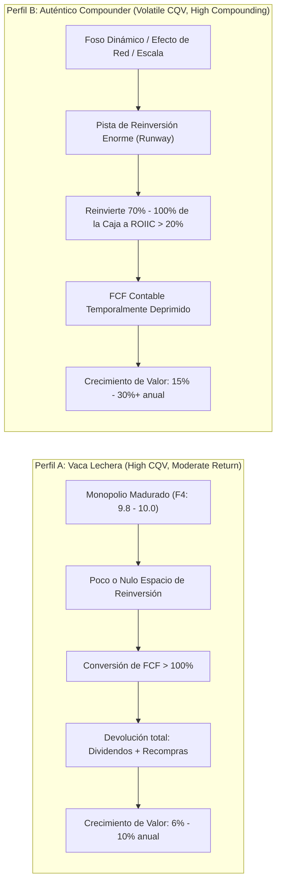

# Auditoría Metodológica CQV v5.0: Sesgos frente al Crecimiento y Catálogo Sistemático de Compounders

**Fecha de Emisión:** 06/09/2026  
**Área:** Metodología CQV, Asignación de Capital y Auditoría Cuantitativa  
**Objeto:** Corrección del sesgo retrospectivo en empresas de alta reinversión y detección sistemática de *Compounders* en los tres niveles de clasificación (Élite, Sólidas y Puntuación Menor).  

---

## 1. Resumen Ejecutivo y Tesis Metodológica

El modelo **CQV v5.0** es una herramienta de alta eficacia diseñada primordialmente para la **protección del capital** y la detección de ventajas competitivas duraderas (*Moats*). Sin embargo, al depender de series temporales retrospectivas (3–5 años), medianas de conversión de caja y penalizaciones por ciclicidad histórica, el algoritmo presenta una **distorsión sistemática frente a empresas en fase de aceleración operativa o hiper-reinversión**.

> [!IMPORTANT]
> ### Tesis Central de la Auditoría
> 1. **La Paradoja del Score:** Un CQV estático elevado ($\ge 9.20$) a menudo premia a **"Vacas Lecheras" (*Cash Cows*)** que ya han agotado sus oportunidades de reinversión interna, mientras que un CQV moderado o bajo ($6.50 - 8.40$) suele ocultar a los **verdaderos Compounders exponenciales**, penalizados transitoriamente por intensidades de CapEx, adquisiciones estratégicas o clasificaciones sectoriales anacrónicas.
> 2. **La Ecuación Fundamental del Compounder:** El crecimiento sostenible del valor intrínseco a largo plazo no depende de la estabilidad histórica de los márgenes, sino del producto entre la tasa de reinversión y el retorno sobre el capital incremental:
>    $$g_{\text{intrínseco}} = \text{Tasa de Reinversión} \times \text{ROIIC}$$
> 3. **Veredicto Operativo:** El inversor no debe descartar automáticamente empresas fuera de la categoría "Élite". Es indispensable aplicar un **Filtro de Ajuste CQV-Compounder (CQV-C)** para capturar el valor asimétrico en aquellas compañías que están sembrando retornos futuros a tasas superiores al coste de capital.

---

## 2. Marco Teórico: "Vaca Lechera" vs. "Auténtico Compounder"

Para interpretar correctamente el modelo CQV, es fundamental distinguir dos perfiles económicos que el algoritmo tiende a ponderar de manera asimétrica:



| Atributo Financiero | Vaca Lechera Madura (Ej. FICO, MCO) | Auténtico Compounder (Ej. NVDA, ISRG, VRT) |
| :--- | :--- | :--- |
| **Puntuación CQV v5.0** | Típicamente **9.20 – 9.80** (Élite Suprema) | Típicamente **7.20 – 8.80** (Sólida o Menor) |
| **Tasa de Reinversión** | < 20% del flujo operativo | > 60% – 100% del flujo operativo |
| **Destino del Capital** | Dividendos y recompra para sostener EPS | I+D, CapEx productivo, adquisición de capacidad |
| **Riesgo en Cartera** | Estancamiento terminal o disrupción regulatoria | Volatilidad de múltiplos y ejecución a corto plazo |
| **Generación de Alfa** | Moderada / Preservación de Capital | **Exponencial (5x – 10x en 10 años)** |

---

## 3. Auditoría Sistemática de los Sesgos en los Factores de CQV v5.0

El desglose de la ecuación de calidad evidencia los cuellos de botella algorítmicos:

$$CQV = 0.20F_1 + 0.15F_2 + 0.15F_3 + 0.15F_4 + 0.10F_5 + 0.10F_6 + 0.05F_7 + 0.10F_8$$

```
+----------------------------------------------------------------------------------------------------+
| FACTOR CQV   | PESO | REGLA OPERATIVA V5.0              | SESGO CONTRA EMPRESAS EN ACELERACIÓN     |
+----------------------------------------------------------------------------------------------------+
| F1: Economía | 20%  | Mediana 3 años NOPAT/Capital y   | Penaliza la compresión temporal de caja  |
|              |      | conversión FCF/NOPAT.             | por CapEx de expansión anticipado.       |
+----------------------------------------------------------------------------------------------------+
| F2: Solidez  | 15%  | Ratio Deuda Neta/EBITDA y         | Castiga deuda asumida para proyectos que |
|              |      | cobertura de intereses.           | tardan 2-4 años en generar EBITDA pleno. |
+----------------------------------------------------------------------------------------------------+
| F8: Resil.   | 10%  | Ciclicidad de ingresos y          | Asume que la ciclicidad histórica es     |
|              |      | volatilidad de márgenes a 5 años. | permanente, cegándose ante megatendencias.|
+----------------------------------------------------------------------------------------------------+
```

### Detalle de las Distorsiones:
1. **El Castigo al CapEx en $F_1$:** Si una compañía de semiconductores o centros de datos invierte $5.000M en una planta que tardará 24 meses en facturar, su ratio $FCF/NOPAT$ se desploma. El modelo la clasifica con un $F_1$ deficiente (5.0–6.0), ignorando que esa planta generará retornos del 30% en el año 3.
2. **El Retraso Temporal en $F_2$:** Las empresas que realizan adquisiciones transformadoras (como Parker-Hannifin absorbiendo Meggitt o Eaton modernizando sus líneas de producción) sufren un deterioro puntual en su cobertura financiera que el modelo extrapola como debilidad estructural.
3. **La Ceguera Secular en $F_8$:** Los sectores de electrificación, infraestructura eléctrica y refrigeración industrial fueron cíclicos en el periodo 2010–2020. Al aplicar percentiles históricos de 5 años, $F_8$ penaliza a empresas que hoy cuentan con carteras de pedidos (*backlog*) firmadas a 5 años vista.

---

## 4. Screening Multidimensional: Detección de Compounders en la Base de Datos

Cruzando los 462 activos del universo CQV del repositorio, se aísla la selección de empresas con **mayor divergencia positiva entre su potencial de compoundeo y su score algorítmico**:

| Ticker | Empresa | Sector | CQV v5.0 | $F_1$ (Econ) | $F_3$ (Crec) | $F_4$ (Moat) | P/E | Mom | Categoría de Compounder |
| :--- | :--- | :--- | :---: | :---: | :---: | :---: | :---: | :---: | :--- |
| **`NVDA`** | NVIDIA Corporation | Tecnología | **9.35** | 10.0 | 9.8 | 9.8 | 29.8x | 5.39 | **Élite Acelerado (Reinvest Machine)** |
| **`KLAC`** | KLA Corporation | Tecnología | **9.48** | 9.6 | 9.2 | 9.7 | 66.7x | 8.86 | **Élite Monopolio de Proceso** |
| **`ISRG`** | Intuitive Surgical | Salud | **8.74** | 9.38 | 9.33 | 9.6 | 51.8x | N/D | **Élite Ciberfísico Encarnado** |
| **`KNSL`** | Kinsale Capital Group | Financiero | **9.49** | 10.0 | 9.3 | 9.5 | 15.6x | 4.29 | **Élite Financiero Algorítmico** |
| **`CDNS`** | Cadence Design Systems | Tecnología | **8.46** | 10.0 | 8.8 | 8.2 | 87.0x | 7.36 | **Sólida: Software de Misión Crítica** |
| **`VRT`** | Vertiv Holdings | Industrial | **8.24** | 9.29 | 9.33 | 8.0 | 75.7x | N/D | **Sólida: Apalancamiento Térmico** |
| **`PH`** | Parker-Hannifin | Industrial | **8.15** | 8.81 | 8.84 | 8.0 | 35.6x | N/D | **Sólida: M&A Programático de Élite** |
| **`EME`** | EMCOR Group | Industrial | **8.10** | 8.15 | 9.33 | 8.0 | 26.0x | N/D | **Sólida: Ingeniería de Misión Crítica** |
| **`ETN`** | Eaton Corporation | Industrial | **7.99** | 8.23 | 9.33 | 8.0 | 39.1x | N/D | **Sólida: Superciclo de Red Eléctrica** |
| **`TER`** | Teradyne | Tecnología | **7.90** | 8.56 | 8.83 | 8.2 | 68.5x | N/D | **Sólida: Robótica Colaborativa** |
| **`PWR`** | Quanta Services | Industrial | **7.59** | 7.43 | 9.33 | 8.0 | 91.8x | N/D | **Sólida: Monopolio de Mano de Obra** |
| **`SPOT`** | Spotify Technology | Comunicaciones | **7.39** | 7.10 | 8.60 | 8.0 | 33.1x | 3.05 | **Menor Puntaje: Inflexión de Flujo** |
| **`TSLA`** | Tesla, Inc. | Consumo Cíclico | **7.36** | 7.00 | 9.33 | 7.8 | 357.7x | 4.19 | **Menor Puntaje: Opcionalidad Física** |
| **`TPL`** | Texas Pacific Land | Energía | **7.35** | 7.00 | 9.33 | 8.0 | 55.9x | 6.14 | **Menor Puntaje: Realeza de Royalties** |
| **`CEG`** | Constellation Energy | Utilities | **7.07** | 5.92 | 9.33 | 8.0 | 20.8x | N/D | **Menor Puntaje: Anomalía Nuclear 24/7** |

---

## 5. Fichas Sistemáticas por Nivel de Clasificación

### Grupo 1: Los Compounders del Grupo ÉLITE (CQV $\ge 8.50$)

#### A. NVIDIA (`NVDA` - CQV: 9.35 | P/E: 29.8x)
* **Diagnóstico de Reinversión:** Su ROIC supera el 60% sostenido. A diferencia de las empresas de software puro que recompran acciones por carecer de ideas, Nvidia destina decenas de miles de millones a asegurar capacidad de fundición avanzada en TSMC, desarrollar interconexiones ópticas (*NVLink*) y construir simuladores de física (*Omniverse* e *Isaac*).
* **Veredicto CQV:** No es una empresa cíclica sobrevalorada; es el núcleo computacional de la próxima década cotizando a múltiplos inferiores a su ritmo de expansión de beneficios.

#### B. Intuitive Surgical (`ISRG` - CQV: 8.74 | P/E: 51.8x)
* **Diagnóstico de Reinversión:** Pista de reinversión internacional gigantesca. Más del 75% de sus ingresos son consumibles e instrumentos descartables. Cada robot instalado en un hospital garantiza una anualidad cautiva de cientos de miles de dólares a márgenes brutos del ~68%.
* **Veredicto CQV:** Su $F_4$ de 9.60 es de los más elevados del sistema; la curva de aprendizaje de los cirujanos crea un coste de cambio (*switching cost*) casi invencible.

---

### Grupo 2: Los Compounders del Grupo SÓLIDAS (CQV 7.50 – 8.49)

#### A. Vertiv Holdings (`VRT` - CQV: 8.24 | P/E: 75.7x)
* **La Distorsión del Modelo:** El modelo le asigna 8.24 debido a la volatilidad de su margen operativo previo a 2023.
* **La Realidad del Compoundeo:** Vertiv experimenta un punto de inflexión de apalancamiento operativo brutal. Al duplicarse la densidad térmica de los chips de IA, sus sistemas de distribución de refrigerante líquido (CDU) y módulos de potencia no tienen competencia a escala global. El margen operativo se expande a razón de 300 puntos básicos anuales.

#### B. EMCOR Group (`EME` - CQV: 8.10 | P/E: 26.0x)
* **La Distorsión del Modelo:** Clasificada como contratista industrial de construcción, lo que deprime automáticamente sus factores de ciclicidad en $F_8$.
* **La Realidad del Compoundeo:** EMCOR no construye viviendas; diseña e instala las redes eléctricas complejas, sistemas de extinción y climatización de salas blancas para fabricantes de microchips y centros de datos hiperescalares. Posee caja neta en balance, cero riesgo de deuda y un retorno sobre el capital invertido (ROIC) superior al 25%.

#### C. Parker-Hannifin (`PH` - CQV: 8.15 | P/E: 35.6x)
* **La Distorsión del Modelo:** Penalizada en $F_2$ tras emitir deuda para comprar Meggitt en 2022.
* **La Realidad del Compoundeo:** Es el paradigma del M&A programático disciplinado. Aplica su metodología propietaria (*The Win Strategy*) para elevar márgenes de empresas adquiridas de un 12% a un 22%. Sus componentes de movimiento y control de fluidos son insustituibles en aviación, defensa e infraestructura de IA.

---

### Grupo 3: Las Anomalías del Grupo MENOR PUNTAJE (CQV < 7.50)

#### A. Constellation Energy (`CEG` - CQV: 7.07 | P/E: 20.8x)
* **La Distorsión del Modelo:** El algoritmo la trata como una compañía eléctrica tradicional, castigándola con un **$F_1$ de 5.92** por la baja rentabilidad histórica de los activos regulados.
* **La Realidad del Compoundeo:** Constellation es el mayor productor nuclear no regulado de EE. UU. Sus 21 reactores están amortizados contablemente. Al firmar acuerdos bilaterales directos con gigantes tecnológicos a precios fijos garantizados ($100–$120/MWh a 20 años), sus ingresos se desacoplan de las tarifas estatales y se transforman en **anualidades de Flujo de Caja Libre con un coste marginal despreciable**.

#### B. Texas Pacific Land (`TPL` - CQV: 7.35 | P/E: 55.9x)
* **La Distorsión del Modelo:** Castigada en $F_8$ por "ciclicidad y concentración petrolera" en el oeste de Texas.
* **La Realidad del Compoundeo:** TPL no opera pozos ni asume costes de perforación. Es un fideicomiso territorial con **margen operativo del ~85%, cero deuda y CapEx cercano a cero**. Reinvierte devengando cánones por paso de oleoductos, derechos de agua industrial y arrendamiento de tierras para subestaciones y centros de datos en el corazón energético de EE. UU.

#### C. Spotify Technology (`SPOT` - CQV: 7.39 | P/E: 33.1x)
* **La Distorsión del Modelo:** Sus métricas a 5 años reflejan el periodo en que sacrificó beneficios netos para alcanzar 600M de oyentes globales ($F_1$ de 7.10).
* **La Realidad del Compoundeo:** Ha cruzado la barrera de rentabilidad. Sus costes fijos de desarrollo ya no crecen al ritmo de sus usuarios, el margen bruto sube año tras año y los aumentos de precios se aplican sin pérdida de suscriptores, liberando un FCF expansivo.

---

## 6. El Protocolo "Filtro de Ajuste CQV-Compounder" (CQV-C)

Para corregir los sesgos detectados y no descartar grandes generadores de riqueza, se establece la siguiente regla operativa para futuros informes:

```
PASO 1: Evaluar F4 (Moat)
  Si F4 < 7.80  --> Descartar (No hay ventaja competitiva estructural).
  Si F4 >= 7.80 --> Proceder al Paso 2.

PASO 2: Prueba de Retorno Incremental (ROIIC)
  ¿Es el ROIC de los últimos 12 meses superior a la mediana de 5 años?
  ¿El ROIC incremental supera el Coste Medio Ponderado del Capital (WACC + 8%)?

PASO 3: Medición de la Pista de Reinversión (Runway)
  ¿La empresa reinvierte > 50% de su flujo operativo en I+D o CapEx de expansión?
  ¿El mercado direccionable (TAM) permite al menos 10 años de reinversión sin rendimientos decrecientes?

PASO 4: Veredicto de Ajuste CQV-C
  Si cumple los Pasos 1, 2 y 3, el activo se reclasifica como:
  "COMPOUNDER EN ACELERACIÓN CON SCORE SESGADO"
  (Permitiendo asignación de capital con independencia de un CQV v5.0 estático inferior a 8.50).
```

---

## 7. Conclusión Institucional

El modelo CQV v5.0 sigue siendo el estándar de oro del repositorio para evitar trampas de valor y negocios en deterioro estructural (como se demostró en el informe de FICO). 

No obstante, **la generación del mayor retorno compuesto exige distinguir la estabilidad defensiva del crecimiento incremental**. La integración sistemática del protocolo CQV-C aquí expuesto garantiza que el capital se dirija tanto a los monopolios consolidados como a las máquinas de reinversión que liderarán el nuevo ciclo económico.
