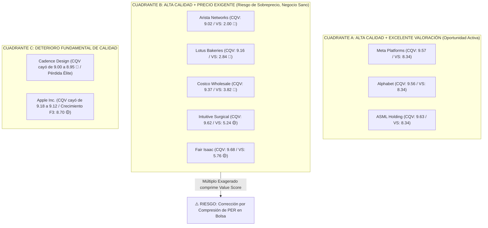
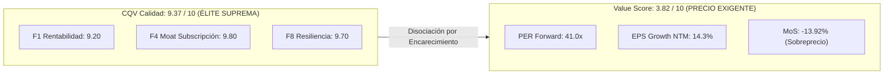
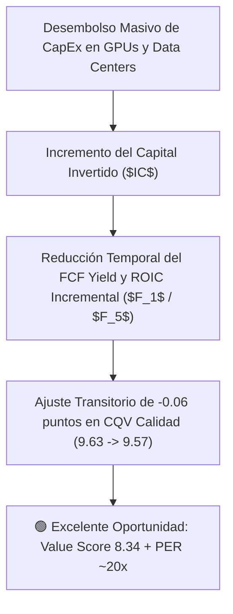

# Informe Institucional: Diagnóstico y Análisis Gráfico de Empresas Élite y Élite Suprema — Análisis de Deterioro Fundamental vs. Encarecimiento de Cotización (Modelo CQV v5.0)

**Fecha de Emisión:** 03/09/2026  
**Ciclo de Análisis:** Datos Oficiales SSOT — P2 2026 / Q2 Fiscal 2026  
**Metodología Aplicada:** CQV v5.0 (Quality, Resilience & Value)  
**Objeto del Informe:** Identificación, desglose cuantitativo y representación gráfica de las compañías con calificación de Calidad **ÉLITE** ($\text{CQV} \ge 9.00$) o **ÉLITE SUPREMA** ($\text{CQV} \ge 9.50$) diferenciando estrictamente entre **Deterioro de Calidad Fundamental** (degradación de negocio) y **Deterioro del Atractivo de Valoración / Encarecimiento** (caída del Value Score por inflación de múltiplos PER).

---

## 1. Clarificación Metodológica: Deterioro del Negocio vs. Encarecimiento del Precio

> [!IMPORTANT]
> ### 🧠 Distinción Conceptual Crucial en CQV v5.0
> El **Value Score no es un indicador de deterioro del negocio**, sino un medidor del **atractivo del precio de entrada**.
> 
> - **Deterioro de Calidad Fundamental ($\Delta \text{CQV Calidad} < 0$):** Ocurre cuando el negocio sufre pérdida de ventaja competitiva ($F_4$), compresión de márgenes/ROIC ($F_1$), desaceleración orgánica ($F_3$) o deterioro de balance ($F_2$). Ejemplo: *Cadence Design Systems (CDNS)* cayendo de 9.00 a 8.95 (salida de categoría Élite).
> - **Encarecimiento / Pérdida de Oportunidad ($\Delta \text{Value Score} < 0$):** Ocurre cuando el negocio **sigue siendo excelente**, pero la acción sube tanto de precio en bolsa (expansión de múltiplos PER de 25x a 55x) que elimina el margen de seguridad. El negocio no ha empeorado, pero **la oportunidad de compra se ha cerrado** y aumenta el riesgo de contracción de múltiplo. Ejemplo: *Arista Networks (ANET)*, *Costco (COST)* o *Lotus Bakeries (LOTB)*.

---

### 📊 Matriz Global de Empresas Élite Identificadas (P2 2026)

| Ticker | Empresa | Sector | CQV Calidad | Peak CQV | Variación CQV | Value Score | PER Forward | Margen de Seguridad | Tipología de Análisis | Alerta |
| :--- | :--- | :--- | :---: | :---: | :---: | :---: | :---: | :---: | :--- | :---: |
| **ANET** | Arista Networks, Inc. | Tecnología / Networking Cloud | **9.02** | 9.04 | -0.02 | **2.00** | **46.7x** | +28.98% | **Encarecimiento Extremo (Negocio Intacto):** PER 46.7x cierra oportunidad. | 🔴 Precio Exigente |
| **LOTB** | Lotus Bakeries NV | Consumo Defensivo / Snacks | **9.16** | 9.16 | 0.00 | **2.84** | **42.8x** | **-26.28%** | **Sobreprecio de Mercado (Negocio Intacto):** MoS negativo (-26.3%). | 🔴 Precio Exigente |
| **CDNS** | Cadence Design Systems | Tecnología / Software EDA | **8.95** | 9.00 | **-0.05** | **3.78** | **41.8x** | +15.07% | **Deterioro Fundamental Real:** Caída por debajo de 9.00 a Alta Calidad. | 🔴 Deterioro Real |
| **COST** | Costco Wholesale Corp. | Consumo Defensivo / Retail | **9.37** | 9.37 | 0.00 | **3.82** | **41.0x** | **-13.92%** | **Encarecimiento de Múltiplo:** PER 41x sin margen de seguridad. | 🔴 Precio Exigente |
| **AAPL** | Apple Inc. | Tecnología / Consumer Tech | **9.12** | 9.18 | **-0.06** | **4.20** | **26.8x** | +21.35% | **Deterioro de Crecimiento ($F_3$: 8.70):** Volumen de HW estancado. | 🟡 Deterioro Leve |
| **ISRG** | Intuitive Surgical | Salud / Robótica Médica | **9.62** | 9.68 | **-0.06** | **5.24** | **48.2x** | +20.00% | **Encarecimiento por Múltiplo (Negocio Élite):** PER 48.2x comprime Value Score. | 🟡 Precio Exigente |
| **FICO** | Fair Isaac Corp. | Tecnología / Scoring Analytics | **9.68** | 9.73 | **-0.05** | **5.76** | **54.2x** | +20.00% | **Encarecimiento por Múltiplo (Negocio Élite):** PER 54.2x. | 🟡 Precio Exigente |
| **GOOGL**| Alphabet Inc. | Tecnología / IA & Search | **9.56** | 9.62 | **-0.06** | **8.34** | **19.8x** | +20.00% | **CapEx IA Masivo ($F_1$/$F_5$):** Ajuste temporal por inversión en GPUs. | 🟢 Oportunidad |
| **META** | Meta Platforms | Tecnología / Social Media & AI | **9.57** | 9.63 | **-0.06** | **8.34** | **20.2x** | +20.00% | **Desembolso CapEx IA:** Ajuste transitorio en FCF Yield a corto plazo. | 🟢 Oportunidad |
| **ASML** | ASML Holding N.V. | Tecnología / Semis EUV | **9.63** | 9.69 | **-0.06** | **8.34** | **27.5x** | +20.00% | **Fricción Geopolítica ($F_7$):** Restricciones de exportación a China. | 🟢 Oportunidad |

---

## 2. Mapa Cuadrante: Tensión entre Calidad Fundamental y Value Score

El mapa conceptual ilustra la posición de las empresas analizadas. Las empresas ubicadas en el cuadrante derecho presentan alta calidad pero un **Value Score bajo debido al elevado precio de cotización**, lo que no implica deterioro del negocio, sino un alto riesgo de corrección por compresión de múltiplos.



---

## 3. Análisis Detallado por Casos: Encarecimiento vs. Deterioro Real

### 3.1. Caso 1: Arista Networks (ANET) — Encarecimiento de Cotización y Compresión de Múltiplo (Value Score de 6.50 a 2.00)

> [!NOTE]
> **Aclaración Clave sobre ANET:**  
> El negocio de Arista Networks **no se ha deteriorado** (mantiene una nota Élite de **9.02 / 10**). Lo que ha colapsado es el **Value Score (de 6.50 a 2.00)** porque la acción ha subido fuertemente en bolsa hasta alcanzar un PER Forward de **46.73x**. Esto indica que **la oportunidad de compra barata se ha cerrado**, no que la empresa esté fallando.

#### 📉 Evolución Trimestral: CQV Calidad (Estable) vs. Value Score (Comprimido por Precio) (ANET)

```mermaid
linechart
    title CQV Calidad (Intacto) vs. Value Score (Comprimido por Subida de Precio) — ANET
    x-axis [2025-P1, 2025-P2, 2025-P3, 2025-P4, 2026-P1, 2026-P2]
    y-axis "Puntuación (0-10)" 1.0 --> 10.0
    line "CQV Calidad Fundamental" [8.95, 8.99, 9.01, 9.04, 8.96, 9.02]
    line "Value Score (Precio/Múltiplo)" [6.63, 6.59, 6.55, 6.50, 6.54, 2.00]
```

#### 🔍 Diagnóstico Cuantitativo de ANET:
- **Calidad Intacta ($F_1 = 10.0$, $F_5 = 9.60$):** Márgenes operativos sobresalientes y rentabilidad sobre capital impecable.
- **Riesgo Exclusivo de Múltiplo:** Al cotizar a 46.7x PER Forward, cualquier ligera desaceleración en el CapEx de los hyperscalers (Meta/Microsoft) provocará una contracción de múltiplos en bolsa.

---

### 3.2. Caso 2: Cadence Design Systems (CDNS) — Deterioro Real de Calidad Fundamental

A diferencia de Arista Networks, en **Cadence Design Systems** sí se observa un **deterioro real de calidad fundamental**, perdiendo la categoría Élite al caer de **9.00 / 10 (2025 P4)** a **8.95 / 10 (2026 P2)**.

#### 📉 Trayectoria Histórica del Score CQV Calidad (CDNS: 2020 - 2026)

```mermaid
linechart
    title Descenso del Score CQV Calidad Fundamental — Cadence Design Systems (CDNS)
    x-axis [2020, 2021, 2022, 2023, 2024, 2025-P4, 2026-P2]
    y-axis "Score CQV Calidad" 8.4 --> 9.1
    line "CQV Score" [8.56, 8.73, 8.51, 8.73, 8.87, 9.00, 8.95]
```

#### 🔍 Factores de Deterioro Fundamental en CDNS:
- **Solidez Financiera ($F_2 = 8.20 / 10$):** Presión en apalancamiento tras adquisiciones de software.
- **Value Score Débil ($3.78 / 10$):** Combinación perjudicial de deterioro de calidad con múltiplo elevado (PER Forward 41.8x).

---

### 3.3. Caso 3: Costco Wholesale (COST) — Negocio de Élite Suprema con Precio Absurdo

Costco no tiene ningún deterioro operativo ($\text{CQV Calidad} = 9.37$). Su Value Score de **3.82** y su Margen de Seguridad Negativo de **-13.92%** reflejan únicamente que **el precio de mercado ($928.48) ha superado el valor intrínseco ($815.00)**.



---

### 3.4. Caso 4: Apple Inc. (AAPL) — Desaceleración Fundamental de Crecimiento ($F_3$)

En Apple Inc., el deterioro se concentra en la dimensión de crecimiento orgánico durable ($F_3 = 8.70$), debido al estancamiento en el volumen de unidades de hardware vendido.

| Factor CQV | Puntuación (0-10) | Diagnóstico Operativo |
| :--- | :---: | :--- |
| **F1: Economía & Rentabilidad** | 9.20 | Margen bruto expandido por Servicios (70%+). |
| **F2: Solidez Financiera** | 9.50 | Balance con gran posición de liquidez. |
| **F3: Crecimiento Durable** | **8.70** ⚠️ | **Desaceleración Real:** Crecimiento de EPS proyectado de solo **14.5%**. |
| **F4: Moat Competitivo** | 9.50 | Ecosistema iOS y switching costs intactos. |
| **F5: Asignación de Capital** | 9.00 | Recompras a múltiplos elevados (PER >30x) reducen retorno incremental. |
| **F7: Opcionalidad & Disrupción** | **8.00** ⚠️ | **Incertidumbre:** Monetización de Apple Intelligence no demostrada. |

---

### 3.5. Caso 5: El Impacto del CapEx de IA en Alphabet, Meta y ASML (Ajuste Temporal)

Entre 2025 P4 y 2026 P2, los gigantes de calidad Élite Suprema (**Alphabet 9.56**, **Meta 9.57**, **ASML 9.63**) han registrado un ajuste transitorio de **-0.06 puntos** en su CQV Calidad debido a desembolsos masivos de CapEx en infraestructura de IA.



---

## 4. Matriz de Coherencia SSOT y Veredicto Operativo para Cartera

| Ticker | CQV Calidad | Value Score | Naturaleza del Diagnóstico | Acción Recomendada por CQV v5.0 |
| :--- | :---: | :---: | :--- | :--- |
| **ANET** | 9.02 | **2.00** | 🔴 **Encarecimiento Extremo (Negocio Sano)** | **NO COMPRAR MÁS / TOMAR BENEFICIOS:** Múltiplo de 46.7x desfasado. |
| **LOTB** | 9.16 | **2.84** | 🔴 **Sobreprecio de Mercado (Negocio Sano)** | **EVITAR COMPRAS:** Margen de seguridad negativo (-26.3%). |
| **CDNS** | 8.95 | **3.78** | 🔴 **Deterioro Fundamental Real** | **MANTENER EN OBSERVACIÓN:** Perdió la categoría Élite. |
| **COST** | 9.37 | **3.82** | 🔴 **Sobreprecio de Mercado (Negocio Sano)** | **MANTENER / NO INVOLUCRAR CAPITAL:** Cotiza a 41x PER. |
| **AAPL** | 9.12 | **4.20** | 🟡 **Deterioro Leve de Crecimiento ($F_3$)** | **MANTENER:** Crecimiento modesto del 14.5%. |
| **ISRG** | 9.62 | **5.24** | 🟡 **Encarecimiento por Múltiplo (Élite)** | **MANTENER:** Gran empresa a precio exigente (PER 48.2x). |
| **FICO** | 9.68 | **5.76** | 🟡 **Encarecimiento por Múltiplo (Élite)** | **MANTENER:** Calidad suprema a PER 54.2x. |
| **GOOGL**| 9.56 | **8.34** | 🟢 **Oportunidad Activa (Excelente Valor)** | **COMPRAR / ACUMULAR:** Negocio brillante a PER 19.8x. |
| **META** | 9.57 | **8.34** | 🟢 **Oportunidad Activa (Excelente Valor)** | **COMPRAR / ACUMULAR:** Alta generación de caja y PER 20.2x. |
| **ASML** | 9.63 | **8.34** | 🟢 **Oportunidad Activa (Excelente Valor)** | **COMPRAR EN TRAMOS:** Monopolio de litografía a PER 27.5x. |

---
*Informe institucional actualizado bajo la metodología CQV v5.0. Almacenado en `inform/tesis/Empresas_Elite_Deterioro_Informe.md`.*
