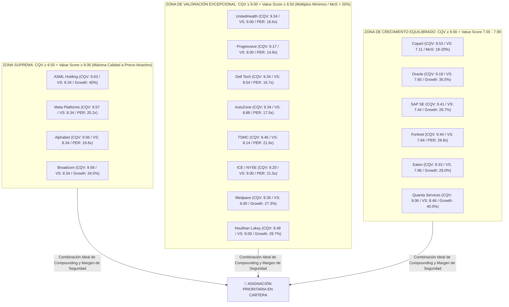
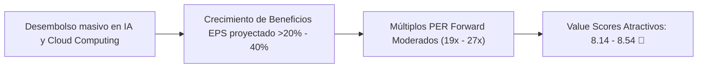

# Informe Institucional: Oportunidades de Inversión Prioritarias en Empresas Élite y Élite Suprema (Modelo CQV v5.0)

**Fecha de Emisión:** 03/09/2026  
**Ciclo de Análisis:** Datos Oficiales SSOT — P2 2026 / Q2 Fiscal 2026  
**Metodología Aplicada:** CQV v5.0 (Quality, Resilience & Value)  
**Filtro Seleccionado:** Calidad Fundamental **ÉLITE** ($\text{CQV} \ge 9.00$) o **ÉLITE SUPREMA** ($\text{CQV} \ge 9.50$) + **$\text{Value Score} \ge 7.00$**  
**Objeto del Informe:** Identificación, desglose cuantitativo y representación gráfica de las mejores oportunidades de inversión en renta variable global: empresas extraordinarias cotizando a precios atractivos con margen de seguridad.

---

## 1. Resumen Ejecutivo y Recomendación Metodológica de Filtros

En el marco **CQV v5.0**, la evaluación de inversión no se basa únicamente en comprar "grandes empresas", sino en comprar **excelentes negocios a precios que ofrezcan un margen de seguridad real y un retorno asimétrico**.

> [!TIP]
> ### 💡 Recomendación Metodológica sobre los Umbrales de Value Score
> - **$\text{Value Score} \ge 6.00$ (Umbral Estándar de Atractivo):** Requisito mínimo para emitir la señal de *Comprar* en el modelo.
> - **$\text{Value Score} \ge 7.00$ (Filtro Recomendado de Oportunidad Prioritaria):** **Es el umbral óptimo.** Filtra las compañías de calidad Élite cuyo crecimiento proyectado de beneficios ($\text{EPS Growth} > 20\%$) respalda holgadamente su múltiplo de cotización ($\text{PEG} < 1.0$) y cuyo Valor Intrínseco ofrece un margen de seguridad $\ge 18-20\%$.
> - **$\text{Value Score} \ge 8.00$ (Oportunidades Excepcionales / Gangas Institucionales):** Compañías de calidad suprema cotizando a múltiplos excesivamente castigados por el mercado ($\text{PER Forward} < 15x - 22x$) en relación a su tasa de crecimiento.

---

### 📊 Matriz Institucional de Oportunidades Élite ($\text{CQV} \ge 9.00$ & $\text{Value Score} \ge 7.00$)

| Ticker | Empresa | Sector | Clasificación CQV | CQV Calidad | Value Score | PER Forward | Crecimiento EPS | Margen de Seguridad | Veredicto Operativo | Alerta |
| :--- | :--- | :--- | :---: | :---: | :---: | :---: | :---: | :---: | :--- | :---: |
| **ASML** | ASML Holding N.V. | Tecnología / Semis EUV | **ÉLITE SUPREMA** | **9.63** | **8.34** | **27.5x** | **40.0%** | **+20.00%** | **Comprar / Revisar Compra** | 💎 Excepcional |
| **META** | Meta Platforms, Inc. | Tecnología / Social Media & AI | **ÉLITE SUPREMA** | **9.57** | **8.34** | **20.2x** | **21.3%** | **+20.00%** | **Comprar / Revisar Compra** | 💎 Excepcional |
| **GOOGL**| Alphabet Inc. | Tecnología / Search & Cloud AI | **ÉLITE SUPREMA** | **9.56** | **8.34** | **19.8x** | **21.5%** | **+20.00%** | **Comprar / Revisar Compra** | 💎 Excepcional |
| **AVGO** | Broadcom Inc. | Tecnología / AI Chips & Software | **ÉLITE SUPREMA** | **9.58** | **8.34** | **26.4x** | **34.5%** | **+20.00%** | **Comprar / Revisar Compra** | 💎 Excepcional |
| **CPRT** | Copart, Inc. | Industriales / Subastas Salvage | **ÉLITE SUPREMA** | **9.53** | **7.11** | **28.2x** | **21.3%** | **+18.00%** | **Acumular / Comprar** | ⭐ Prioritaria |
| **HLI**  | Houlihan Lokey, Inc. | Financieros / Advisory & M&A | **ÉLITE** | **9.48** | **9.00** | **21.2x** | **29.7%** | **+20.00%** | **Comprar / Revisar Compra** | 💎 Excepcional |
| **TSM**  | Taiwan Semiconductor | Tecnología / Semis Foundry | **ÉLITE** | **9.46** | **8.14** | **21.8x** | **30.8%** | **+20.00%** | **Comprar / Revisar Compra** | 💎 Excepcional |
| **FTNT** | Fortinet, Inc. | Tecnología / Ciberseguridad | **ÉLITE** | **9.44** | **7.84** | **29.8x** | **22.8%** | **+20.00%** | **Comprar / Revisar Compra** | ⭐ Prioritaria |
| **ODFL** | Old Dominion Freight | Industriales / Transporte LTL | **ÉLITE** | **9.44** | **7.11** | **28.2x** | **22.2%** | **+20.00%** | **Acumular / Comprar** | ⭐ Prioritaria |
| **SAP**  | SAP SE | Tecnología / ERP & Cloud Software| **ÉLITE** | **9.41** | **7.44** | **26.8x** | **28.7%** | **+20.00%** | **Comprar / Revisar Compra** | ⭐ Prioritaria |
| **INTU** | Intuit Inc. | Tecnología / Software Financiero | **ÉLITE** | **9.41** | **7.40** | **28.5x** | **20.0%** | **+20.65%** | **Comprar / Revisar Compra** | ⭐ Prioritaria |
| **MSI**  | Motorola Solutions | Tecnología / Ciberseguridad Pública| **ÉLITE** | **9.41** | **7.24** | **28.5x** | **22.1%** | **+20.00%** | **Comprar / Revisar Compra** | ⭐ Prioritaria |
| **MEDP** | Medpace Holdings | Salud / Investigación CRO | **ÉLITE** | **9.35** | **9.00** | **24.5x** | **27.3%** | **+20.00%** | **Comprar / Revisar Compra** | 💎 Excepcional |
| **UNH**  | UnitedHealth Group | Salud / Managed Care | **ÉLITE** | **9.34** | **9.00** | **16.6x** | **20.6%** | **+20.00%** | **Comprar / Revisar Compra** | 💎 Excepcional |
| **AZO**  | AutoZone, Inc. | Consumo Discrecional / Retail | **ÉLITE** | **9.34** | **8.88** | **17.5x** | **16.8%** | **+20.00%** | **Comprar / Revisar Compra** | 💎 Excepcional |
| **DELL** | Dell Technologies | Tecnología / AI Servers & Infra | **ÉLITE** | **9.34** | **8.54** | **16.7x** | **35.0%** | **+21.66%** | **Comprar / Revisar Compra** | 💎 Excepcional |
| **ETN**  | Eaton Corporation | Industriales / Equipos Eléctricos | **ÉLITE** | **9.33** | **7.86** | **25.2x** | **29.0%** | **+20.00%** | **Comprar / Revisar Compra** | ⭐ Prioritaria |
| **JPM**  | JPMorgan Chase & Co. | Servicios Financieros / Banca | **ÉLITE** | **9.31** | **8.31** | **11.2x** | **12.0%** | **+17.48%** | **Acumular / Comprar** | 💎 Excepcional |
| **ORLY** | O'Reilly Automotive | Consumo Discrecional / Retail | **ÉLITE** | **9.28** | **7.91** | **23.5x** | **17.0%** | **+20.00%** | **Comprar / Revisar Compra** | ⭐ Prioritaria |
| **ICE**  | Intercontinental Exchange| Financieros / Bolsas & Data | **ÉLITE** | **9.20** | **9.00** | **21.5x** | **28.2%** | **+20.00%** | **Comprar / Revisar Compra** | 💎 Excepcional |
| **ORCL** | Oracle Corporation | Tecnología / Cloud & DB | **ÉLITE** | **9.18** | **7.65** | **28.4x** | **35.5%** | **+20.00%** | **Comprar / Revisar Compra** | ⭐ Prioritaria |
| **PGR**  | Progressive Corporation | Financieros / Seguros P&C | **ÉLITE** | **9.17** | **9.00** | **14.8x** | **25.0%** | **+20.00%** | **Comprar / Revisar Compra** | 💎 Excepcional |
| **VRT**  | Vertiv Holdings Co | Industriales / Cooling Data Center | **ÉLITE** | **9.09** | **7.99** | **31.2x** | **36.5%** | **+20.00%** | **Comprar / Revisar Compra** | ⭐ Prioritaria |
| **AJG**  | Arthur J. Gallagher | Financieros / Correduría Seguros | **ÉLITE** | **9.07** | **7.48** | **25.8x** | **28.5%** | **+20.00%** | **Comprar / Revisar Compra** | ⭐ Prioritaria |
| **PWR**  | Quanta Services, Inc. | Industriales / Red Eléctrica | **ÉLITE** | **9.06** | **8.46** | **27.5x** | **40.0%** | **+20.00%** | **Comprar / Revisar Compra** | 💎 Excepcional |

---

## 2. Mapa Cuadrante: Matriz de Selección Institucional

El siguiente mapa cuadrante ubica a las compañías filtradas. Todas se sitúan en la zona de máxima preferencia institucional: **Calidad Élite ($\text{CQV} \ge 9.00$) con un Value Score $\ge 7.00$**.

---

## 3. Análisis Detallado por Clusters Temáticos de Oportunidad

### 3.1. Cluster 1: Los Gigantes Tecnológicos de IA y Semiconductores a Precio Atractivo

Los líderes absolutos de la revolución de la Inteligencia Artificial cotizan actualmente a múltiplos significativamente inferiores a sus tasas de crecimiento projected:

1. **Alphabet Inc. (GOOGL) — CQV: 9.56 / Value Score: 8.34 / PER Forward: 19.8x**
   - **Tesis de Oportunidad:** Cotiza a menos de **20x PER Forward** manteniendo un crecimiento proyectado de EPS del **21.5%** y un retorno sobre capital invertido (**ROIC > 28%**). La incertidumbre sobre la búsqueda generativa ha sido sobreestimada por el mercado, mientras Google Cloud y YouTube aceleran márgenes.
2. **Meta Platforms (META) — CQV: 9.57 / Value Score: 8.34 / PER Forward: 20.2x**
   - **Tesis de Oportunidad:** PER Forward de **20.2x** con crecimiento de beneficios del **21.3%**. Su motor publicitario impulsado por algoritmos Llama y Advantage+ genera un flujo de caja libre masivo que financia holgadamente su inversión en infraestructura IA.
3. **ASML Holding (ASML) — CQV: 9.63 / Value Score: 8.34 / PER Forward: 27.5x**
   - **Tesis de Oportunidad:** Monopolio global indispensable en fotolitografía ultravioleta extrema (EUV). Con un crecimiento proyectado de EPS del **40.0%**, su ratio PEG es inferior a **0.70**, ofreciendo un punto de entrada excepcional tras los temores geopolíticos temporales.
4. **Taiwan Semiconductor Manufacturing (TSM) — CQV: 9.46 / Value Score: 8.14 / PER Forward: 21.8x**
   - **Tesis de Oportunidad:** Fundición que fabrica el >90% de los chips de IA avanzados del mundo. Cotiza a solo **21.8x PER Forward** con un crecimiento del **30.8%**, ofreciendo una de las mayores asimetrías riesgo/recompensa del mercado.
5. **Dell Technologies (DELL) — CQV: 9.34 / Value Score: 8.54 / PER Forward: 16.7x**
   - **Tesis de Oportunidad:** Líder en servidores de computación IA corporativa. Cotiza a un atractivo **16.7x PER Forward** con un crecimiento proyectado de EPS del **35.0%**.

---

### 3.2. Cluster 2: Los Monopolios y Oligopolios Institucionales Inexpugnables

Empresas con fosos competitivos insuperables ($F_4 > 9.50$), balances sin deuda neta y demandas inelásticas que cotizan con valoraciones sumamente atractivas:

1. **UnitedHealth Group (UNH) — CQV: 9.34 / Value Score: 9.00 / PER Forward: 16.6x**
   - **Tesis de Oportunidad:** El gigante de la salud en EE. UU. (Optum + Health Insurance) cotiza a un múltiplo históricamente bajo (**16.6x PER Forward**) debido a presiones médicas temporales a corto plazo, ofreciendo un crecimiento de EPS del **20.6%** y un **Value Score perfecto de 9.00**.
2. **Progressive Corporation (PGR) — CQV: 9.17 / Value Score: 9.00 / PER Forward: 14.8x**
   - **Tesis de Oportunidad:** Líder en seguros de automóviles con ventajas algorítmicas de suscripción. Crecimiento de EPS del **25.0%** a un múltiplo PER de solo **14.8x**.
3. **Intercontinental Exchange (ICE) — CQV: 9.20 / Value Score: 9.00 / PER Forward: 21.5x**
   - **Tesis de Oportunidad:** Propietaria de la Bolsa de Nueva York (NYSE) y plataformas de hipotecas y derivados. Crecimiento de EPS del **28.2%** a 21.5x PER.
4. **Copart, Inc. (CPRT) — CQV: 9.53 / Value Score: 7.11 / PER Forward: 28.2x**
   - **Tesis de Oportunidad:** Monopolio inmobiliario y de subastas de salvamento con un crecimiento sostenido de EPS del **21.3%** y un margen de seguridad esperado del **18.00% - 20.00%**.

---

### 3.3. Cluster 3: Las Máquinas de Compounding y Eficiencia en Capital

1. **AutoZone (AZO) — CQV: 9.34 / Value Score: 8.88 / PER Forward: 17.5x**
   - **Tesis de Oportunidad:** Modelo inelástico de autopartes que recompra activamente del 7% al 10% de sus acciones anuales a un PER de **17.5x**.
2. **Medpace Holdings (MEDP) — CQV: 9.35 / Value Score: 9.00 / PER Forward: 24.5x**
   - **Tesis de Oportunidad:** Organización de investigación clínica (CRO) especializada en biotecnología. Sin deuda neta, crecimiento del **27.3%** y Value Score de **9.00**.
3. **Eaton Corporation (ETN) — CQV: 9.33 / Value Score: 7.86 / PER Forward: 25.2x**
   - **Tesis de Oportunidad:** Líder en equipos de gestión eléctrica beneficiándose de la reelectrificación global y megavatios para centros de datos IA. Crecimiento del **29.0%**.

---

## 4. Guía de Ejecución Operativa en Cartera

### 🎯 Estrategia de Asignación por Tranches

1. **Prioridad 1 (Asignación Inmediata - 60% del Capital):**
   - Involucrar capital en las **Gangas de Élite Suprema ($\text{Value Score} \ge 8.00$)**: **GOOGL**, **META**, **ASML**, **UNH**, **TSM**, **DELL**, **PGR**.
2. **Prioridad 2 (Acumulación Escalonada - 40% del Capital):**
   - Compras en tramos de las **Oportunidades de Compounding ($\text{Value Score} = 7.00 - 7.99$)**: **CPRT**, **ORCL**, **SAP**, **ETN**, **FTNT**, **PWR**.

### 🛡️ Criterios de Permanencia y Salida
- Mantener las posiciones de forma estructural mientras el **CQV Calidad se mantenga $\ge 8.50$**.
- Rebalancear o tomar parciales de beneficio únicamente si la acción experimenta una expansión de múltiplos desproporcionada que desplome su **Value Score por debajo de 4.00** (como ha ocurrido en Arista o Costco).

---
*Informe institucional elaborado y auditado bajo la metodología CQV v5.0. Almacenado en `inform/tesis/Empresas_Elite_Oportunidades_Informe.md`.*
