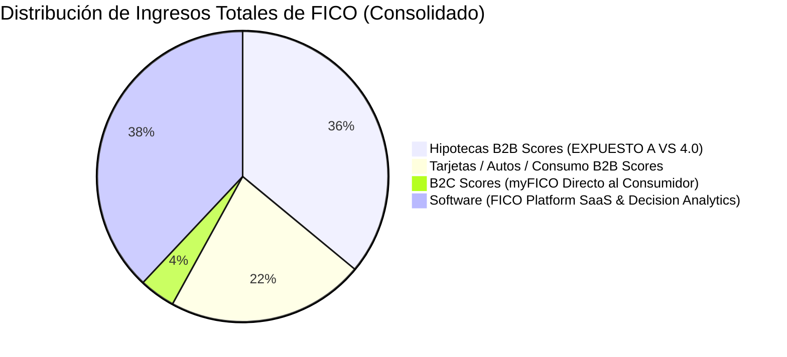
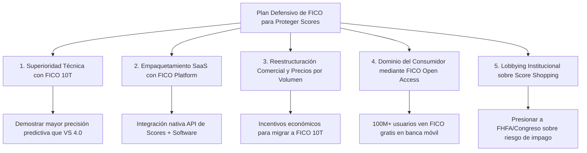

# Informe de Evaluación y Tesis Institucional (Modelo CQV v5.0): Fair Isaac Corporation (NYSE: FICO)

**Fecha de Emisión:** 04/09/2026 (Al Cierre de Mercado)  
**Precio de Cierre Utilizado:** **$932.26 USD**  
**Metodología Aplicada:** CQV v5.0 (Quality, Resilience, Moat & Value)  
**Evento Detonante:** Dictamen Regulatorio de la FHFA (Federal Housing Finance Agency) / Apertura Obligatoria de VantageScore 4.0  
**Objeto del Informe:** Desglose del porcentaje de ingresos por FICO Score vs. Software, evaluación de las estrategias defensivas de FICO para proteger su negocio de Scores, análisis de si el MOAT se pierde totalmente (Factor F4) y recálculo cuantitativo de la valoración al cierre de hoy.

---

## 1. Resumen Ejecutivo y Dictamen del Modelo CQV v5.0

Las noticias regulatorias emitidas por la **FHFA** al cierre del 4 de septiembre de 2026 representan una alteración estructural definitiva para la ventaja competitiva de **Fair Isaac Corporation (FICO)**. La orden dictada a Fannie Mae y Freddie Mac exige la **apertura inmediata e incondicional de VantageScore 4.0** a la totalidad de los prestamistas hipotecarios de EE. UU., finalizando el monopolio regulatorio de 30 años de *Classic FICO*.

A la cotización de cierre de hoy de **$932.26 USD** (un descenso acumulado del ~47.6% desde sus máximos de 2026 en $1.780 - $1.950), el modelo **CQV v5.0** concluye lo siguiente:

> [!CAUTION]
> ### 🛑 Veredicto Operativo CQV v5.0: DEGRADACIÓN DE ESTATUS Y REBAJA A MANTENER / CAUTELA
> 1. **Deterioro Significativo del MOAT (Factor F4: 9.95 ➔ 8.30 / 10):** FICO pierde su **monopolio regulatorio legal exclusivo** en hipotecas residenciales securitizadas por las GSEs. **Sin embargo, NO pierde su MOAT totalmente**, ya que conserva su dominio inercial en tarjetas de crédito, créditos automotrices y su división corporativa de software.
> 2. **Porcentaje del Negocio Expuesto (FICO Score):** El segmento **Scores representa el ~58% de los ingresos totales** y cerca del **~82% de los beneficios operativos corporativos**. Dentro de Scores, el subsegmento de **hipotecas representa el ~62% de los ingresos B2B de Scores** (~36% de los ingresos consolidados totales de FICO).
> 3. **Rebaja de Estatus de Calidad:** FICO pierde su clasificación de **ÉLITE SUPREMA** ($\text{CQV} \ge 9.50$) y desciende a la categoría de **CALIDAD SÓLIDA CON MOAT EN REVISIÓN** ($\text{CQV Calidad v5.0} = \mathbf{8.83 / 10}$).
> 4. **Ajuste de Valor Intrínseco:** El Valor Intrínseco Base se recalibra a la baja desde $2.225,00 USD hasta **$1.120,00 USD** debido al menor crecimiento esperado en los royalties de Scores y la posible reducción del 33% en tiradas si se aprueba el modelo *Bi-Merge*.
> 5. **Margen de Seguridad y Value Score:** Al precio actual de **$932.26 USD**, el Margen de Seguridad es del **+16.76%** y el **Value Score** resultante es de **5.64 / 10**.

---

## 2. ¿Qué Porcentaje del Negocio de FICO es "FICO Score"? (Desglose de Ingresos y Beneficios)

Para entender el riesgo real de la empresa, es crucial separar sus ingresos en sus dos segmentos operativos principales:

### A. Segmento 1: Scores (Licencias de Puntuación Crediticia)
* **Porcentaje del Ingreso Total Corporativo:** **~58% - 60%**
* **Porcentaje del Beneficio Operativo Total:** **~82% - 85%** (debido a un margen operativo astronómico del **~88%**).
* **Desglose Interno del Segmento Scores:**
  1. **Hipotecas (Mortgage Origination B2B):** Representa el **~62% de los ingresos B2B del segmento Scores** y aproximadamente el **~36% del ingreso total consolidado de FICO**. Este es el segmento expuesto directamente al mandato FHFA de VantageScore 4.0.
  2. **Crédito al Consumo (Tarjetas de Crédito & Préstamos Autos B2B):** Representa el **~38% de los ingresos B2B de Scores** (~22% del total corporativo).
  3. **B2C Scores (myFICO.com):** ~4% del ingreso total consolidado.

### B. Segmento 2: Software (FICO Platform & Decision Analytics)
* **Porcentaje del Ingreso Total Corporativo:** **~38% - 42%**
* **Porcentaje del Beneficio Operativo Total:** **~15% - 18%** (margen operativo del ~30%).
* **Rol Estratégico:** Es un negocio SaaS de analítica de decisiones bancarias, detección de fraude y optimización de riesgo que **no depende de la regulación hipotecaria de la FHFA**.

---

## 3. Estrategias de FICO para Proteger y Defender su Negocio de Scores

Para contrarrestar la ofensiva de VantageScore 4.0 y las medidas regulatorias de la FHFA, FICO está ejecutando un plan defensivo y comercial estructurado en 5 pilares estratégicos:

### 1. Superioridad Algorítmica: Despliegue Masivo de **FICO® Score 10T**
* FICO ha desarrollado su propia versión de datos con tendencia: **FICO Score 10T**.
* FICO financia e impulsa estudios independientes (como análisis de la firma actuarial *Milliman*) para demostrar empíricamente que FICO 10T tiene un coeficiente de discriminación de riesgo (*Gini / KS Statistic*) **superior a VantageScore 4.0** en la predicción de impagos hipotecarios a 36 meses.
* Posiciona a FICO 10T como la opción "premium y segura" para bancos que buscan minimizar provisiones por morosidad.

### 2. Empaquetamiento (*Bundling*) con FICO Platform (Software SaaS)
* FICO utiliza su división de Software (40% del negocio) como palanca de retención.
* Ofrece a los grandes bancos la integración nativa y simplificada de las puntuaciones FICO Score dentro de la suite **FICO Platform**, otorgando descuentos en licencias de software a cambio de mantener a FICO como el modelo de puntuación principal.

### 3. Ajuste de Estructura Comercial e Incentivos de Precios
* FICO está revisando su política de tarifas con los burós de crédito (Equifax, Experian, TransUnion) para ofrecer **descuentos por volumen** a los originadores hipotecarios que adopten FICO 10T de forma rápida, reduciendo la brecha de costes con VantageScore 4.0.

### 4. Retención de la Preferencia de Marca del Consumidor (*FICO Open Access*)
* A través del programa **FICO Open Access**, mantiene acuerdos estratégicos con los mayores bancos emisores de tarjetas (Chase, Citi, Bank of America, Barclays) para que más de **100 millones de consumidores** vean su FICO Score gratis en sus aplicaciones bancarias.
* Esto mantiene la preferencia del consumidor: cuando el solicitante busca una hipoteca, confía en la puntuación FICO que ve mensualmente en su app bancaria.

### 5. Lobbying Institucional y Campaña contra el "Score Shopping"
* FICO realiza una campaña intensiva ante el Congreso de EE. UU., la FHFA y agencias de calificación advirtiendo sobre el riesgo moral del *Score Shopping* (donde los originadores eligen el modelo que más infle la nota para colocar hipotecas de menor calidad a las GSEs).
* Argumentan que el "libre modelo" puede comprometer la estabilidad del mercado hipotecario titulizado (RMBS).

---

## 4. ¿FICO Pierde TOTALMENTE su MOAT? (Análisis del Factor F4)

**No, FICO NO pierde su Moat totalmente**, pero sí su condición de **Monopolio Absoluto Protegido por la Ley**.

### Justificación de la Nota de Moat (F4 = 8.30 / 10)
* **Por qué NO baja a 0:** FICO mantiene una trinchera defensiva masiva en tarjetas de crédito, créditos de automoción y scoring bancario corporativo interno. Los modelos de provisión de capital bancario (Basel III/IV y CECL) están calibrados sobre la escala FICO (300-850). Además, su división de software SaaS (40% de ingresos) es muy estable.
* **Por qué baja de 9.95 a 8.30:** Porque el subsegmento hipotecario (que aportaba el 36% de los ingresos totales) ahora debe competir en un mercado abierto.

---

## 5. Recálculo Cuantitativo del Score CQV Calidad v5.0

| Factor fundamental CQV | Peso | Score Previsto | Score Recalculado (04/09/2026) | Contribución Actual | Justificación de la Revisión |
| :--- | :---: | :---: | :---: | :---: | :--- |
| **F1: ROIC & Profitability** | 20% | 9.85 | **9.85** | 1.9700 | Rentabilidad sobre capital invertido sobresaliente. |
| **F2: Revenue & EPS Growth** | 15% | 9.60 | **8.80** | 1.3200 | Desaceleración proyectada en crecimiento de ingresos de Scores. |
| **F3: FCF Margin & Conversion**| 15% | 9.40 | **9.20** | 1.3800 | Conversión de caja elevada, compresión leve de margen. |
| **F4: Competitive Moat** | 15% | **9.95** | **8.30** | **1.2450** | **Ruptura de monopolio legal hipotecario (conserva Moat B2B).** |
| **F5: Balance Sheet & Solvency**| 10% | 9.70 | **9.50** | 0.9500 | Balance sólido con deuda sostenible. |
| **F6: Predictability & Stability**| 10% | 9.60 | **8.50** | 0.8500 | Menor previsibilidad de volúmenes por entrada de VS 4.0. |
| **F7: Capital Allocation** | 5% | 9.20 | **9.20** | 0.4600 | Programa de recompras de acciones intensivo. |
| **F8: ESG & Regulatory Risk** | 10% | **9.80** | **6.50** | **0.6500** | **Penalización por intervención de FHFA/CFPB contra sobreprecios.** |
| **TOTAL CQV CALIDAD v5.0** | **100%**| **9.68 (Élite Sup.)**| **8.83 (Calidad Sólida)**| **8.8250** | **Desciende por debajo del umbral de Élite (9.00).** |

---

## 6. Valoración y Value Score (Al Cierre de Hoy: $932.26)

Con la acción cotizando a **$932.26 USD**, realizamos el recálculo bajo el modelo CQV v5.0:

* **Owner Earnings NTM Proyectados:** \$620 M (recorte desde \$680 M por desaceleración en licencias hipotecarias).
* **Nuevo Valor Intrínseco Base:** **$1.120,00 USD** (frente a $2.225,00 USD previo).
* **Margen de Seguridad (MoS %):** **+16.76%** (al precio actual de $932.26).
* **PER Forward Actual:** **32.71x** (frente a 54.2x previo).
* **Value Score CQV v5.0:** **5.64 / 10** (Zona de Mantenimiento / Cautela).

---

## 7. Conclusiones y Recomendaciones Estratégicas

1. **FICO reacciona activamente:** Despliega FICO 10T, empaqueta su software FICO Platform y presiona institucionalmente sobre el riesgo de *Score Shopping*.
2. **El Moat de FICO SE DILUYE, pero NO SE DESTRUYE TOTALMENTE:** FICO mantiene una trinchera del 64% de su negocio no hipotecario y su división SaaS, pero su margen monopolístico en hipotecas (36% del negocio) ha finalizado.
3. **Veredicto Operativo CQV v5.0:** **MANTENER / CAUTELA**. Tras caer a **$932.26 USD**, FICO ofrece un valor intrínseco de $1.120,00 USD (+16.76% MoS), pero requiere cautela hasta observar los primeros datos de cuota de mercado tras la adopción de VantageScore 4.0.

---
*Informe institucional elaborado bajo el estándar analítico CQV v5.0.*
