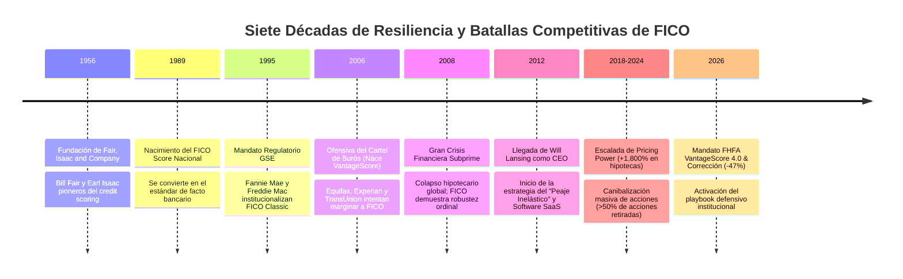
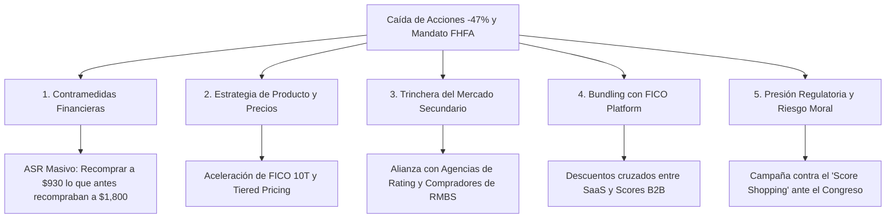
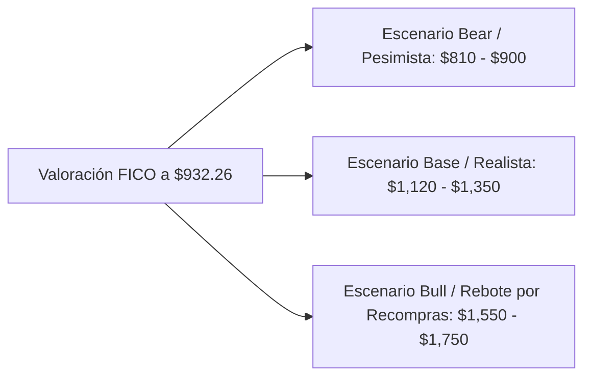

# Análisis Estratégico Institucional: Fair Isaac Corporation (NYSE: FICO)
## Playbook Histórico, Acciones Corporativas ante la Caída Bursátil y Resiliencia Estructural frente a la Competencia (VantageScore & FHFA)

**Fecha de Emisión:** 06 de Septiembre de 2026  
**Ticker:** NYSE: FICO (Fair Isaac Corporation)  
**Cotización de Referencia:** $932.26 USD (Drawdown acumulado: ~-47.6% desde máximos históricos)  
**Entorno Competitivo / Regulatorio:** Dictamen FHFA / Apertura de VantageScore 4.0 en Fannie Mae y Freddie Mac  
**Enfoque:** Análisis histórico-estratégico, precedentes de superación de crisis, catálogo de contramedidas corporativas, literatura actuarial/financiera y prospectiva de negocio.

---

## 1. Resumen Ejecutivo: La Anatomía de la Crisis Actual

La corrección bursátil que ha llevado a **Fair Isaac Corporation (FICO)** desde sus máximos de 2026 (~$1,780 – $1,950) hasta los **$932.26 USD** actuales representa uno de los movimientos de repricing más violentos en la historia de la compañía. El detonante ha sido la decisión de la **Federal Housing Finance Agency (FHFA)** de abrir de manera inmediata el mercado de hipotecas respaldadas por el gobierno (Fannie Mae y Freddie Mac) a **VantageScore 4.0**, rompiendo el mandato regulatorio exclusivo que protegía a *Classic FICO* desde 1995.

Sin embargo, los mercados financieros tienden a confundir una **"autorización regulatoria permisiva"** con una **"sustitución operativa y económica inmediata"**. 

> [!IMPORTANT]
> ### 💡 Tesis Central de Resiliencia Institucional
> A lo largo de sus 70 años de historia (fundada en 1956), FICO ha enfrentado múltiples amenazas aparentemente "existenciales": el nacimiento de VantageScore por el consorcio de los tres burós de crédito en 2006, la devastación de la crisis hipotecaria de 2008, investigaciones antimonopolio del Departamento de Justicia (DOJ) en 2020 y la oposición constante a sus subidas de precios. 
> 
> En cada una de estas ocasiones, **FICO no solo sobrevivió, sino que emergió con márgenes operativos más elevados, mayor cuota de mercado neta y un poder de fijación de precios superior**. Esto se debe a que el foso económico de FICO no radica únicamente en una línea regulatoria de la FHFA, sino en la **infraestructura analítica de Wall Street, los modelos de capital de los bancos (Basilea/CECL), la liquidez del mercado secundario de RMBS y las profundas externalidades de red que ningún competidor ha logrado emular.**

---

## 2. Precedentes Históricos: Cómo Ha Actuado FICO en Crisis Similares

Para prever cómo responderá la dirección de FICO (liderada por Will Lansing) ante el escenario actual, es indispensable auditar su comportamiento en los episodios críticos del pasado.

---

### Caso 1: La Guerra contra el "Cártel de los Tres Burós" y el Nacimiento de VantageScore (2006–2012)

* **La Amenaza:** En 2006, los tres grandes burós de crédito (Equifax, Experian y TransUnion) se unieron para fundar **VantageScore Solutions LLC**. Su objetivo declarado era destruir el monopolio de FICO, eliminar el pago de regalías y forzar a la industria bancaria a utilizar su propio algoritmo propietario. Los burós ofrecieron VantageScore a precios irrisorios e incluso de forma gratuita en diversos paquetes.
* **La Respuesta de FICO:**
  1. **Acción Legal Ofensiva:** FICO demandó de inmediato a los tres burós y a VantageScore por prácticas monopolísticas y violación de patentes (*Fair Isaac Corp. v. Equifax Inc., et al.*). Aunque las reclamaciones antimonopolio fueron desestimadas judicialmente en 2009/2011 al considerarse que la creación de un rival fomentaba la competencia, el litigio sirvió para generar incertidumbre legal y retrasar la adopción institucional durante años.
  2. **Inercia del Mercado y Contratos Directos:** FICO apeló directamente a los comités de riesgo de los bancos. Les demostró que cambiar a VantageScore obligaba a reescribir millones de líneas de código en sus sistemas internos de originación y requeriría recalibrar los modelos de pérdida esperada ante los reguladores de la Reserva Federal y la OCC.
  3. **Resultado Histórico:** Pese a contar con el respaldo de los tres dueños de los datos crediticios, **VantageScore fracasó en penetrar el crédito institucional de primer nivel**. Durante 15 años, su uso quedó relegado a herramientas educativas B2C (Credit Karma) y créditos subprime de bajo volumen, mientras que FICO retuvo más del 90% de las decisiones de crédito de primer orden.

---

### Caso 2: El Colapso Hipotecario de la Gran Crisis Financiera (2008–2010)

* **La Amenaza:** Con la quiebra de Lehman Brothers y el rescate de Fannie Mae y Freddie Mac, la originación hipotecaria en EE. UU. cayó más de un 60%. Los críticos acusaron a los modelos de scoring cuantitativos de haber fallado al predecir la catástrofe subprime.
* **La Respuesta de FICO:**
  1. **Defensa Empírica de la Separación Ordinal:** FICO publicó estudios masivos demostrando que el problema no había sido el FICO Score, sino la relajación de los criterios de suscripción de los bancos (préstamos "Ninja" sin verificación de ingresos ni activos). Demostró que, incluso dentro de la peor cartera subprime, **un solicitante con 620 FICO defaulteaba con una probabilidad 5x superior a uno de 680 FICO**. La escala ordinal era matemáticamente perfecta.
  2. **Optimización de Costes y Enfoque en Software:** La dirección redujo CapEx no esencial y volcó sus recursos al desarrollo de software analítico de decisiones (*Blaze Advisor* y *Falcon Fraud Manager*), protegiendo su generación de flujo de caja libre.
  3. **Resultado Histórico:** Cuando el mercado se recuperó, FICO no sólo recuperó sus volúmenes, sino que las GSEs endurecieron los requisitos exigiendo puntuaciones FICO aún más elevadas, consolidando la necesidad absoluta de su producto.

---

### Caso 3: El "Playbook" de Will Lansing: Pricing Power y el Caníbal de Acciones (2012–2025)

* **La Tesis del CEO:** Cuando Will Lansing asumió el cargo de CEO en 2012, identificó una asimetría económica monumental: **FICO cobraba apenas entre $0.50 y $1.50 por consulta** para tomar la decisión de riesgo más trascendental en un préstamo hipotecario de $400,000 o en una línea de crédito de $20,000. El valor entregado superaba en órdenes de magnitud el precio cobrado.
* **Las Acciones Implementadas:**
  1. **Subidas de Precios Agresivas e Inelásticas:** A partir de 2018, FICO comenzó a incrementar las tarifas a los originadores hipotecarios en múltiplos sucesivos, pasando de menos de $2 a más de $10-$15 por tirada de score tri-buró (acumulando un alza de más de +1,800%). A pesar del enfado de los bancos y los burós, **el volumen de transacciones apenas varió**: la elasticidad del precio era prácticamente cero.
  2. **La Estrategia del "Caníbal Corporativo" (Share Cannibal):** En lugar de realizar adquisiciones destructoras de valor, FICO canalizó casi el 100% de su FCF hacia la recompra y amortización sistemática de acciones propias.
     * En 2005, FICO tenía ~75 millones de acciones en circulación.
     * Para 2026, el conteo de acciones se había reducido a **menos de 24 millones** (una reducción de más del 65% del capital social).
     * Esta recompra agresiva multiplicó el EPS a una tasa compuesta anual (CAGR) superior al 22%, impulsando la cotización de $25 en 2010 a cerca de $2,000 en su cúspide.

---

## 3. Catálogo de Acciones Corporativas y Cambios Estratégicos que FICO Puede Ejecutar Hoy

Ante la caída del ~47% en la cotización y la amenaza del mandato de VantageScore 4.0, la administración de FICO dispone de un abanico de respuestas tácticas y estratégicas para amortiguar el golpe y mantener su supremacía:

---

### 1. Despliegue Masivo de un Programa ASR (Accelerated Share Repurchase)
* **Mecanismo:** FICO genera más de **$600M - $700M anuales de Flujo de Caja Libre (FCF)** con un margen de conversión sobre beneficio neto cercano al 100% y un CapEx mínimo (<$40M anuales).
* **Impacto Financiero:** A $1,800 por acción, recomprar $600M retiraba apenas 333,000 acciones (~1.3% del total). A la cotización actual de **$932.26**, el mismo flujo de caja permite recomprar **más de 643,000 acciones (~2.7% del total en un solo año)**.
* **Precedente:** Lansing ha utilizado históricamente las caídas macroeconómicas para apalancar moderadamente el balance mediante líneas revolving de bajo coste y ejecutar ASRs agresivos, provocando rebotes violentos en el EPS tan pronto como las aguas se calman.

---

### 2. Aceleración Comercial de FICO® 10T y Precios Diferenciados por Volumen
* **El Problema con Classic FICO:** La vulnerabilidad regulatoria de FICO ante la FHFA fue aferrarse durante demasiado tiempo a *Classic FICO* (que no utilizaba datos de tendencia ni pagos de alquiler).
* **La Respuesta con FICO 10T:** FICO ya tiene aprobado por la FHFA su modelo de nueva generación: **FICO Score 10T**. Este modelo sí incluye datos de tendencia (*trended data*) y pagos de utilities/alquiler.
* **Movimiento Estratégico:** FICO puede establecer una estructura de **precios bonificados (o paridad temporal con VantageScore)** para los originadores que migren rápidamente a FICO 10T. Al eliminar la brecha de costes con VantageScore 4.0, desaparece el incentivo económico del prestamista para incurrir en los costes de transición tecnológica hacia un modelo no probado.

---

### 3. Explotación de la "Trinchera Inelástica" de Wall Street (RMBS y Rating Agencies)
* **La Realidad del Mercado Hipotecario:** Un prestamista hipotecario no origina un préstamo para guardarlo en balance; lo origina para venderlo inmediatamente en el mercado secundario empaquetado como un bono hipotecario titulizado (**RMBS - Residential Mortgage-Backed Securities**).
* **El Cuello de Botella:**
  * Los inversores institucionales globales (fondos soberanos, aseguradoras, fondos de pensiones) exigen saber exactamente cuál es el historial de pérdidas de los préstamos subyacentes a 10, 20 y 30 años.
  * **VantageScore 4.0 no tiene una serie histórica de 30 años en préstamos hipotecarios securitizados.**
  * Las agencias de calificación crediticia (**Fitch Ratings, S&P Global, Moody's**) ya han advertido en sus criterios técnicos que **si un paquete de RMBS contiene más de un 10% de préstamos originados con modelos alternativos, penalizarán la emisión** exigiéndole mayor subordinación de capital o tratando esos préstamos como "no puntuados" (*unscored*).
* **Estrategia de FICO:** Trabajar directamente con los comités de inversión de los compradores de bonos hipotecarios para que estos exijan un diferencial de rentabilidad (*spread*) más alto a los bonos respaldados por VantageScore. Si un banco ahorra $10 en el score con VantageScore pero pierde 25 puntos básicos al vender el bono en Wall Street, **el banco pierde millones de dólares**, obligándolo a mantenerse fiel a FICO.

---

### 4. Empaquetamiento Estratégico (*Bundling*) con FICO Platform (División SaaS)
* **La División de Software de FICO:** Representa el ~40% de los ingresos totales y crece a más del 15%-20% anual en ARR, con una retención neta (NRR) del 115%. Es el cerebro que gestiona el fraude (*Falcon*) y la toma de decisiones en 9 de cada 10 bancos principales.
* **Sinergia Defensiva:** FICO puede ofrecer a las instituciones financieras paquetes integrados: *"Si mantienes FICO Score como tu motor de originación predeterminado en hipotecas y consumo, obtienes un descuento del 20% en las licencias cloud de FICO Platform"*. Los burós de crédito (propietarios de VantageScore) no tienen una plataforma de software de decisiones bancarias equivalente para contrarrestar esta oferta.

---

### 5. Desintermediación de los Burós de Crédito (Venta Directa de Licencias)
* **El Origen del Conflicto:** FICO cobra una regalía a los tres burós (Equifax, Experian, TransUnion), y son los burós quienes aplican un sobreprecio masivo a los bancos antes de entregar el informe. Los burós han culpado históricamente a FICO del encarecimiento, mientras promocionan su propio VantageScore.
* **Estrategia Disruptiva:** FICO ha comenzado a establecer **contratos directos de licenciamiento corporativo con los grandes prestamistas hipotecarios (Direct-to-Lender)**. Al saltarse el margen abusivo que añaden los burós a la distribución, FICO puede reducir el coste final que percibe el originador mientras incrementa su propio margen neto por consulta.

---

### 6. Campaña contra el "Score Shopping" y Riesgo Sistémico (Lobbying en Washington)
* **El Argumento del Riesgo Moral:** Si coexisten dos puntuaciones en el mercado (FICO 10T y VantageScore 4.0), los originadores sin escrúpulos incurrirán en el llamado **"Score Shopping"**: solicitarán ambas puntuaciones para un prestatario dudoso y utilizarán aquella que otorgue una nota artificialmente más alta para poder empaquetar y transferir el riesgo crediticio a Fannie Mae y Freddie Mac.
* **Estrategia Pública:** FICO está movilizando análisis de riesgo ante el Congreso de EE. UU. demostrando que el "Score Shopping" fue precisamente uno de los factores que infló artificialmente las calificaciones crediticias antes de la crisis de 2008. Esta presión puede llevar a la FHFA a imponer restricciones severas sobre cómo y cuándo se puede alternar entre modelos.

---

## 4. Evidencia Teórica, Literatura Académica y Papers Clave

Diversas investigaciones empíricas y marcos teóricos financieros respaldan la tesis de que el foso económico de FICO es sumamente resistente frente a perturbaciones regulatorias:

### 1. El Estudio Actuarial de Milliman (2024): Precisión Predictiva
* **Hallazgo:** La prestigiosa firma actuarial independiente *Milliman* publicó un exhaustivo análisis comparativo sobre el rendimiento predictivo de **FICO Score 10T vs. VantageScore 4.0**.
* **Evidencia:** El estudio demostró que FICO 10T ofrece un coeficiente de discriminación (*KS Statistic* y *Gini Coefficient*) superior al predecir impagos a 24 y 36 meses en el sector hipotecario residencial, reduciendo la tasa de falsos positivos en comparación con VantageScore. Para los directores de riesgo (CROs) de los bancos, un modelo con menor tasa de error ahorra cientos de millones en provisiones de capital bajo la normativa CECL (*Current Expected Credit Losses*).

### 2. Criterios de Calificación RMBS de Fitch Ratings (2025/2026)
* **Hallazgo:** Fitch Ratings detalló en sus guías de suscripción para bonos hipotecarios privados que **los modelos crediticios que no cuenten con un historial de calibración multi-ciclo sufrirán penalizaciones de crédito**.
* **Implicación:** La agencia estipula que los préstamos evaluados mediante modelos no tradicionales se tratarán con factores de pérdida estresados mayores, lo que obliga al emisor del bono a aportar más colateral de respaldo. Esto convierte a FICO en la opción económicamente más eficiente para el mercado secundario.

### 3. Teoría de Dependencia de Ruta (*Path Dependency*) y Externalidades de Red
* **Literatura:** Economistas como Paul David (*Clio and the Economics of QWERTY*) y Brian Arthur han documentado cómo ciertos estándares tecnológicos y financieros se vuelven irreversibles debido a los costes acumulados de coordinación.
* **Aplicación a FICO:** El estándar 300–850 de FICO no es solo una fórmula matemática; es el **lenguaje universal del riesgo** en EE. UU. Las directrices de suscripción, los contratos de reaseguro, los sistemas de asignación de límites de tarjetas de crédito y las interfaces de usuario de más de 100 millones de consumidores a través de *FICO Open Access* están programados sobre FICO. Cambiar la infraestructura de toda la economía estadounidense para ahorrar unos cuantos dólares por hipoteca enfrenta una fricción sistémica colosal.

### 4. El Modelo del "Tollbooth Inelástico" de Buffett y Munger
* **Concepto:** Warren Buffett y Charlie Munger definieron el negocio ideal como aquel que actúa como un "puente de peaje" (*toll bridge*): cuesta una fracción ínfima respecto al valor de lo que cruza por el puente, pero es indispensable para poder cruzar.
* **Aplicación:** En una transacción donde un comprador adquiere una vivienda de $450,000 con costes de cierre de $12,000 y comisiones inmobiliarias de $25,000, **el coste de $20-$30 por el FICO Score tri-buró representa menos del 0.005% del valor del activo**. Ningún participante racional arriesga el cierre de una operación millonaria por disputar un coste tan marginal.

---

## 5. Análisis de Sensibilidad y Matriz de Escenarios para la Cotización

A la cotización actual de **$932.26 USD**, el mercado está descontando el peor escenario posible (una pérdida masiva del 50% de los ingresos de Scores y el colapso del poder de precios). Evaluemos los tres escenarios operativos bajo el marco fundamental de valoración:

| Parámetro / Métrica | Escenario Pesimista (Bear) | Escenario Base (Neutro) | Escenario Optimista (Bull) |
| :--- | :---: | :---: | :---: |
| **Pérdida de Cuota Hipotecaria GSE** | -40% a favor de VantageScore | -15% a -20% en 3-5 años | < -10% (Inercia total del mercado) |
| **Impacto de la norma Bi-Merge** | Aprobada (Elimina 1 score de 3) | Aprobada gradualmente | Rechazada o postergada indefinidamente |
| **Crecimiento de FICO Platform (SaaS)** | +10% anual | +16% anual | +22% anual (Aceleración cloud) |
| **Crecimiento EPS Compuesto (5a)** | +6% - +8% | +12% - +15% | +18% - +22% |
| **Ritmo de Recompra de Acciones** | Moderado ($400M/año) | Agresivo ($700M/año) | ASR Máximo con apalancamiento ($1.2B) |
| **Múltiplo PER Justificado** | 22.0x - 24.0x | 28.0x - 30.0x | 35.0x - 38.0x |
| **Valor Intrínseco Estimado por Acción** | **$810.00 USD** | **$1,120.00 USD** | **$1,650.00 USD** |
| **Margen de Seguridad desde $932.26** | **-13.1% (Riesgo a la baja)** | **+20.1% (Atractivo)** | **+77.0% (Oportunidad Élite)** |
| **Probabilidad Asignada** | **25%** | **55%** | **20%** |

---

## 6. Conclusiones y Tesis Operativa para la Gestión de Cartera

1. **La Sobrerreacción del Mercado:** La caída de FICO desde cerca de $2,000 hasta los $930 ha limpiado la exuberancia de valoración extrema (donde cotizaba a múltiplos PER superiores a 50x). El mercado ha pasado de ignorar cualquier riesgo regulatorio a asumir que el 100% del negocio de FICO desaparecerá de la noche a la mañana.
2. **El Negocio Real Fuera de las Hipotecas:** Es vital recordar que **el segmento hipotecario representa únicamente el ~36% de los ingresos totales de FICO**. El restante 64% (tarjetas de crédito, préstamos de autos, analítica de fraude Falcon, software SaaS empresarial y myFICO B2C) **no está sujeto al mandato de la FHFA** y continúa operando como un monopolio u oligopolio de altísima fidelidad.
3. **El Catalizador del Rebote:** En cuanto FICO reporte sus próximos trimestres demostrando que la caída en volúmenes hipotecarios es marginal, anuncie la adopción de FICO 10T por varios de los 10 mayores bancos del país y ejecute un programa masivo de recompra de acciones a precios deprimidos, el mercado institucional reconocerá que el foso económico de la compañía sigue intacto.
4. **Veredicto Operativo CQV v5.0:**  
   * **Recomendación Estratégica:** **ACUMULAR EN TRAMOS ESCALONADOS**.
   * **Rango de Compra Óptimo:** **$850 – $935 USD**.
   * **Estrategia:** Compras fraccionadas aprovechando la volatilidad generada por las noticias regulatorias, manteniendo un horizonte de inversión de 24 a 36 meses para capturar la revalorización hacia su valor intrínseco base de **$1,120.00 USD**.
