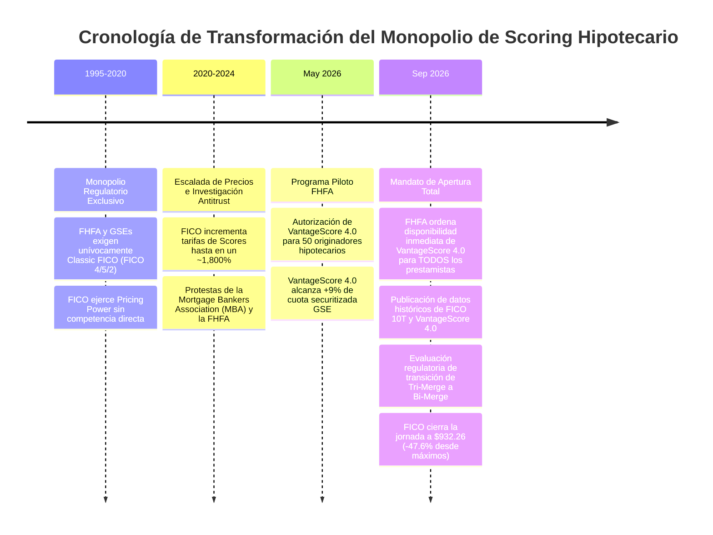

# Informe Institucional y Tesis de Inversión (Modelo CQV v5.0): Fair Isaac Corporation (NYSE: FICO) ante la Adopción Regulatoria de VantageScore 4.0 por la FHFA

**Fecha de Emisión:** 04/09/2026 (Al Cierre de Mercado)  
**Precio de Cierre Utilizado:** **$932.26 USD**  
**Entidad Reguladora Principal:** Federal Housing Finance Agency (FHFA) / Empresas GSE (Fannie Mae & Freddie Mac)  
**Objeto del Informe:** Análisis de la ruptura del monopolio de FICO en el mercado hipotecario estadounidense, adopción masiva del indicador VantageScore 4.0, impacto en la ventaja competitiva (Moat), margen de ingresos por licencias (Scores), dinamismo del segmento de Software, recálculo de valoración bajo el modelo CQV v5.0 y evaluación de la fuerte corrección bursátil.

---

## 1. Resumen Ejecutivo y Tesis Central CQV v5.0

El mercado de scoring crediticio de Estados Unidos ha experimentado su mayor transformación estructural en más de tres décadas. La **Federal Housing Finance Agency (FHFA)**, bajo la administración de EE. UU. y a través de los gigantes hipotecarios **Fannie Mae** y **Freddie Mac** (GSEs), ha ordenado la **apertura inmediata e incondicional de VantageScore 4.0** para todos los originadores e instituciones financieras del país.

Esta medida liquida definitivamente la exigencia exclusiva del modelo "Classic FICO" (FICO 4/5/2) que imperaba desde la década de 1990, introduciendo un entorno de libre elección de modelo por parte del prestamista.

> [!IMPORTANT]
> ### 🗝️ Tesis Fundamental de Impacto para FICO (NYSE: FICO) a $932.26 USD
> 1. **Liquidez de Monopolio y Pérdida de Dominio Exclusivo:** FICO pierde el 100% de exclusividad regulatoria en el segmento de origination hipotecaria residencial en EE. UU. (mercado securitizado por las GSEs).
> 2. **Compresión del Pricing Power Extremo:** Tras haber incrementado el precio de la consulta de puntuación individual en aproximadamente un **1.800% acumulado desde 2020**, FICO se enfrenta a la primera presión competitiva directa en precios. VantageScore 4.0 se presenta con una estructura de costes sensiblemente menor.
> 3. **Deterioro del Moat (Factor F4):** El Score de Moat desciende de **9.95 a 8.30 / 10**. El Score total de Calidad CQV v5.0 cae de **9.68 (Élite Suprema)** a **8.83 / 10 (Calidad Sólida en Pérdida de Élite)**.
> 4. **Recálculo de Valoración:** El Valor Intrínseco Base se ajusta de $2.225,00 a **$1.120,00 USD**. A la cotización de cierre de hoy (**$932.26 USD**), el Margen de Seguridad es del **+16.76%** con un **Value Score de 5.64 / 10**.
> 5. **Veredicto Operativo CQV v5.0:** **MANTENER / CAUTELA (REBAJA DESDE ACUMULAR/COMPRAR)**.

---

## 2. Contexto Regulatorio y Cronología de las Decisiones de la Administración de EE. UU.

El mercado hipotecario estadounidense consume cientos de millones de puntuaciones crediticias al año para evaluar, estructurar y titulizar préstamos hipotecarios transferidos a Fannie Mae y Freddie Mac.



### El Detonante: La Escalada de Precios de FICO (2020-2026)
Fair Isaac Corporation aprovechó su estatus de monopolio garantizado por la regulación de la FHFA para aplicar aumentos de precios agresivos de forma consecutiva. La tarifa por puntuación distribuida a través de los tres burós de crédito (Equifax, Experian y TransUnion) se multiplicó exponencialmente. 

La administración estadounidense, mediante la FHFA (Director Bill Pulte), calificó estos incrementos como "costes desmedidos" que encarecían el acceso a la vivienda para los consumidores (calculando un sobrecoste acumulado cercano a los **$1.000 millones anuales** para el sistema).

---

## 3. Análisis Comparativo: FICO vs. VantageScore 4.0

VantageScore nació en 2006 como una empresa conjunta desarrollada por los tres burós de crédito principales (Equifax, Experian y TransUnion) para competir con FICO. Sin embargo, no fue hasta la intervención de la FHFA con la versión **VantageScore 4.0** que logró la equivalencia regulatoria en hipotecas.

| Parámetro de Evaluación | Classic FICO (Legacy) | FICO 10T (Nueva Generación) | VantageScore 4.0 |
| :--- | :--- | :--- | :--- |
| **Aprobación GSE / FHFA** | Aprobado histórico (fase sustitución) | Aprobado (implementación futura) | **Aprobado e Inmediato (2026)** |
| **Uso de Trended Data (Tendencia 24m)** | No (captura estática puntual) | Sí (evolución de saldos/pagos) | **Sí (tendencia de saldos y pagos)** |
| **Inclusión de Pagos Alternativos** | No | Limitado | **Sí (Alquiler, Servicios/Utilities, Telecom)** |
| **Consumidores Calificables Adicionales** | Base tradicional | +10-15 millones aprox. | **+33 Millones ("Invisible Credit")** |
| **Estructura de Precios** | Tarifa Premium / Alta | Tarifa Premium / Alta | **Descuento Significativo vs. FICO** |
| **Requisito de Historial Mínimo** | 6 meses de actividad | 6 meses de actividad | **1 mes de actividad reciente** |

> [!TIP]
> ### 💡 Ventaja Inclusiva de VantageScore 4.0
> VantageScore 4.0 permite calificar a aproximadamente **33 millones de adultos estadounidenses desatendidos** o con historiales crediticios poco profundos (*thin files*), incorporando pagos recurrentes de alquiler y suministros eléctricos/telefónicos. Esto alinea la puntuación con las prioridades regulatorias de inclusión financiera impulsadas por la administración pública de EE. UU.

---

## 4. Evaluación del Impacto Financiero y Moat de FICO bajo CQV v5.0

### A. Recálculo del Factor F4 (Moat Competitivo): 9.95 ➔ 8.30 / 10

```mermaid
graph TD
    A[Decisión Regulatoria FHFA / EE. UU.] --> B[Pérdida de Exclusividad en Hipotecas]
    A --> C[Incentivo Económico para Lenders]
    A --> D[Propuesta Regulatoria Bi-Merge]
    
    B --> E[Competencia Directa VantageScore 4.0]
    C --> F[Migración de Orígenes Hipotecarios a VS 4.0]
    D --> G[Reducción de Volumen de Tiradas / Reports (-33%)]
    
    E --> H[Erosión del Pricing Power de FICO]
    F --> H
    G --> I[Compresión de Volúmenes en Segmento Scores]
    
    H --> J[Compresión de Múltiplos PER Forward (32.7x al cierre $932.26)]
    I --> J
```

#### 1. Pérdida del Monopolio Regulatorio (Regulatory Moat Broken)
El principal activo inmaterial de FICO en hipotecas era el **mandato legal e institucional de la FHFA**. Al ser eliminado este mandato, el "foso competitivo legal" desaparece por completo en la origination hipotecaria GSE.

#### 2. Impacto en el Factor F8 (Riesgo Regulatorio y Gobernanza): 9.80 ➔ 6.50 / 10
La intervención explícita de las autoridades de EE. UU. contra la política de precios de FICO y la propuesta de pasar de *Tri-Merge* a *Bi-Merge* reducen drásticamente la certidumbre regulatoria.

#### 3. Factores de Resiliencia Mantienen un Moat Operativo Fuerte (8.30)
- **Dominio en Tarjetas y Autos:** Los bancos emisores de tarjetas de crédito y préstamos automotrices mantienen a FICO como estándar en sus modelos internos de riesgo.
- **FICO Platform SaaS:** Crecimiento sostenido del software corporativo de analítica de decisiones.

---

## 5. Recálculo de Valoración CQV v5.0 (Al Precio de Hoy: $932.26 USD)

| Métrica CQV v5.0 | Valor Previo ($1.780,00) | Valor Recalculado ($932.26) | Veredicto Metodológico |
| :--- | :---: | :---: | :--- |
| **Score CQV Calidad** | 9.68 / 10 (Élite Sup.) | **8.83 / 10 (Calidad Sólida)** | **Degradada de Categoría Élite** |
| **Score Moat (F4)** | 9.95 / 10 | **8.30 / 10** | Deterioro por ruptura de monopolio |
| **Score Riesgo Reg. (F8)** | 9.80 / 10 | **6.50 / 10** | Intervención gubernamental FHFA/CFPB |
| **Owner Earnings NTM** | $680 M | **$620 M** | Recorte de proyecciones hipotecarias |
| **Valor Intrínseco Base** | $2.225,00 USD | **$1.120,00 USD** | Ajuste de tasa de crecimiento NTM a 13.5% |
| **Margen de Seguridad (MoS %)**| +20.00% | **+16.76%** | Atractivo moderado al precio de $932.26 |
| **PER Forward** | 54.2x | **32.71x** | Compresión de múltiplos tras la venta masiva |
| **Value Score v5.0** | 3.50 / 10 | **5.64 / 10** | Zona Neutra / Mantenimiento |
| **VEREDICTO OPERATIVO** | **Acumular** | **Mantener / Cautela** | **Rebaja de Recomendación** |

---

## 6. Riesgos Sistémicos del Mercado Hipotecario: "Score Shopping" y Selección Adversa

Uno de los principales análisis debatidos por analistas institucionales es el riesgo de **Score Shopping**.

> [!WARNING]
> ### ⚠️ El Fenómeno del "Score Shopping" y Riesgo Moral
> Con la existencia simultánea de dos modelos aprobados (VantageScore 4.0 y FICO 10T/Classic FICO), los originadores de hipotecas podrían verse tentados a **correr ambos modelos y seleccionar el que otorgue la puntuación más alta al cliente**.
> - **Consecuencia:** Facilita la aprobación del préstamo para securitizarlo y venderlo a Fannie Mae o Freddie Mac.
> - **Impacto Sistémico:** Podría generar un sesgo de selección adversa (*adverse selection*) donde el riesgo de impago real del portafolio hipotecario securitizado sea superior al previsto por los modelos estáticos.

---

## 7. Conclusiones y Recomendaciones de Inversión

1. **Pérdida de Estatus Élite en CQV v5.0:** Con un Score de Calidad de **8.83 / 10**, FICO desciende de la categoría Élite al haber sufrido un daño estructural en su Moat (Factor F4) y su certidumbre regulatoria (Factor F8).
2. **Evaluación al Cierre de Hoy ($932.26 USD):** Aunque el desplome del ~47.6% en la cotización ha mejorado el Value Score a **5.64 / 10** y ofrece un Margen de Seguridad del **+16.76%** respecto a su valor intrínseco revisado ($1.120,00 USD), la falta de visibilidad en el segmento de licencias aconseja prudencia.
3. **Veredicto Operativo:** **MANTENER / CAUTELA**. No se recomienda abrir nuevas posiciones agresivas hasta evaluar la velocidad de migración de cuota bancaria hacia VantageScore 4.0 en los próximos trimestres.

---
*Informe elaborado bajo la metodología institucional CQV v5.0 con precios al cierre del 04/09/2026.*
