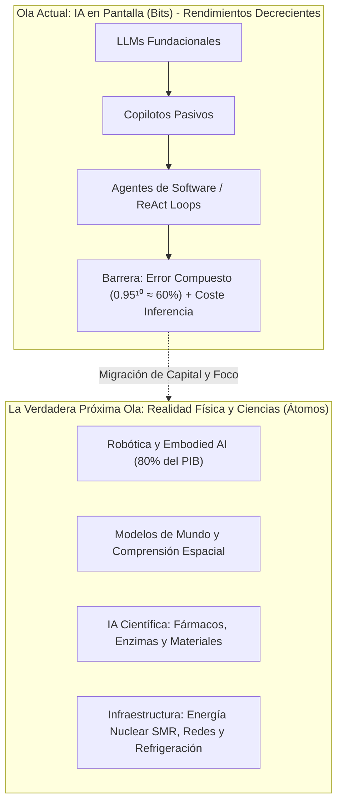
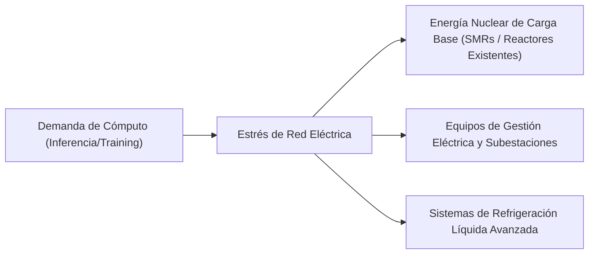

# Tesis Estratégica Macroeconómica: Agentes Inteligentes vs. La Verdadera Próxima Ola Tecnológica

**Fecha de Emisión:** 06/09/2026  
**Área:** Estrategia Tecnológica, Asignación de Capital & Tesis de Inversión Global  
**Enfoque:** Separación de Narrativa de Mercado (*Hype*) vs. Viabilidad Técnico-Económica y Retorno sobre Capital Invertido (ROIC)  

---

## 1. Resumen Ejecutivo y Tesis Central

El consenso actual de los mercados de capitales sitúa a los **Agentes Inteligentes Autónomos (Agentic AI)** como la "próxima gran ola de disrupción corporativa", proyectando la sustitución acelerada de la fuerza laboral administrativa y una expansión ilimitada del software empresarial (SaaS). 

Tras una rigurosa evaluación cuantitativa y operativa, esta tesis concluye que:

> [!IMPORTANT]
> ### Veredicto Estratégico
> 1. **Los Agentes de Software NO constituyen una nueva ola paradigmática independiente:** Son una **evolución de la interfaz de usuario** (*Language User Interface* / LUI) y una iteración avanzada de automatización de procesos (*RPA 2.0*). Chocan contra barreras matemáticas de fiabilidad compuesta, costos de inferencia no lineales y vacíos de responsabilidad jurídica corporativa.
> 2. **La Verdadera Nueva Ola se traslada de los "Bits" a los "Átomos":** La IA generativa centrada en pantallas (redactar correos, resumir documentos, mover datos entre CRMs) impacta menos del 20% del PIB global. El superciclo de capital 2026-2035 se concentrará en **Inteligencia Física Encarnada (Robótica/Embodied AI)**, **Modelos de Mundo Tridimensionales**, **IA para Descubrimiento Científico/Materiales** y el cuello de botella físico habilitador: **Infraestructura de Energía Crítica y Redes**.



---

## 2. Desmitificación y Refutación de los Agentes de Software

Aunque el relato comercial promete que "ejércitos de agentes sustituirán departamentos enteros", la realidad técnica y financiera expone fragilidades críticas:

### A. El Problema del Error Compuesto (*Compounding Error Problem*)
Los modelos de lenguaje son motores probabilísticos no deterministas. En una cadena de razonamiento y acción (*ReAct loop*), cada paso tiene una probabilidad de acierto $p < 1.0$.

$$\text{Probabilidad de Éxito Global} = p^n$$

Donde $n$ es el número de pasos autónomos ejecutados:

| Precisión por Paso ($p$) | Éxito en 5 Pasos ($n=5$) | Éxito en 10 Pasos ($n=10$) | Éxito en 20 Pasos ($n=20$) | Viabilidad en Producción Empresarial |
| :---: | :---: | :---: | :---: | :--- |
| **99%** | 95.1% | 90.4% | 81.8% | Marginalmente aceptable en flujos no críticos |
| **95%** | 77.4% | **59.8%** | **35.8%** | **Inviable:** 4 de cada 10 transacciones fallan |
| **90%** | 59.0% | 34.8% | 12.1% | Destructivo para la operación |

> [!WARNING]
> En industrias como banca, contabilidad, legal o medicina, un margen de fallo acumulado del 20% al 40% es intolerable. Requiere la intervención de un revisor humano constante (*Human-in-the-Loop*), lo que destruye la tesis de reducción de costes operativos y convierte al agente en un simple asistente.

### B. El Trilema de Eficiencia Económica vs. Determinismo
* **Explosión de Tokens e Inferencia:** Un flujo simple que un script tradicional de Python/SQL ejecuta en 15 milisegundos a un coste de $0.00001 USD requiere, en un agente autónomo, múltiples llamadas a modelos de razonamiento, autocrítica y reintentos, elevando la latencia a 10-30 segundos y el coste en tokens por un factor de **100x a 1.000x**.
* **La trampa del RPA 2.0:** La mayor parte del valor que hoy se atribuye a los "agentes" es simplemente integración de APIs convencionales con un traductor semántico al frente. Cuando la novedad desaparece, el cliente corporativo exige rentabilidad directa medible en EBITDA.

### C. El Vacío de Responsabilidad Jurídica y Regulatoria (*Liability*)
Si un agente autónomo:
1. Aprueba una transferencia bancaria fraudulenta o una operación crediticia discriminatoria.
2. Vuelca datos corporativos sensibles infringiendo GDPR, CCPA o normativas bancarias.
3. Modifica código en producción introduciendo una vulnerabilidad crítica de día cero.

¿Quién responde ante los tribunales? ¿El proveedor del modelo, la consultora integradora o el consejo de administración? Hasta que no exista jurisprudencia consolidada y seguros de caución algorítmica, **los directores de tecnología mantendrán a los agentes atados a tareas de consulta de sólo lectura**, impidiendo la autonomía plena.

---

## 3. ¿Cuál es la Verdadera Nueva Ola? Los 4 Pilares Disruptivos

El valor económico más relevante de la próxima década surge al conectar la inteligencia computacional con la **materia, la física y los límites de la energía**:

```
+-----------------------------------------------------------------------------------+
|                        EL MAPA DE LA PRÓXIMA OLA (2026-2035)                      |
+-----------------------------------------------------------------------------------+
|  1. ROBÓTICA & EMBODIED AI    | Modelos VLA operando en la economía de átomos.    |
|  2. MODELOS DE MUNDO          | Comprensión espacial, gravedad y física causal.   |
|  3. IA PARA LA CIENCIA        | Descubrimiento acelerado de fármacos y materiales.|
|  4. INFRAESTRUCTURA Y ENERGÍA | SMRs nucleares, redes de distribución y refrigeración.|
+-----------------------------------------------------------------------------------+
```

### Pilar I: Robótica de Propósito General e IA Física Encarnada (*Embodied AI*)
* **Fundamento Económico:** La economía mundial genera más del **80% de su valor en el mundo físico**: mover palés, recolectar cosechas, ensamblar piezas mecánicas, soldar infraestructuras, limpiar hospitales y asistir a una población demográficamente envejecida.
* **El Cambio Paradigmático:** La transición de LLMs entrenados con texto web a modelos **Vision-Language-Action (VLA)** entrenados mediante teleoperación humana, visión 3D multimodal y simulación física masiva (Nvidia Isaac Gym).
* **Impacto:** Los robots humanoides y cuadrúpedos no necesitan que el mundo se adapte a ellos; operan en entornos diseñados para la anatomía humana.
* **Empresas Mejor Posicionadas:**
  * **Pioneros en Robótica y Flotas:** Tesla (`TSLA` - Optimus), Boston Dynamics (Hyundai), Figure AI.
  * **Componentes Críticos (Sensores y Actuadores):** Keyence (`6861.T`), Harmonic Drive Systems, Sony (`SONY` - sensórica CMOS de alta velocidad).

---

### Pilar II: Modelos de Mundo e Inteligencia Espacial (*World Models & Spatial AI*)
* **Límite Actual:** Los LLMs actuales no "entienden" el mundo; son memorizadores asociativos avanzados. No tienen intuición sobre inercia, colisión, fricción o volumen tridimensional.
* **La Tesis:** Para que la automatización sea segura y verdaderamente autónoma (conducción autónoma FSD Nivel 4/5, navegación en interiores sin mapas precalculados), los modelos deben generar simulaciones internas consistentes de la realidad física y temporal.
* **Líderes de la Frontera:** World Labs (liderado por Fei-Fei Li), laboratorios de modelos fundacionales con visión física, y proveedores de gemelos digitales industriales como Siemens (`SIE.DE`) y Nvidia (`NVDA` - Omniverse).

---

### Pilar III: IA Científica: Biología Molecular, Química y Materiales (*AI for Science*)
* **Fundamento:** Resolver un problema de atención al cliente ahorra centavos; resolver el diseño de una batería de estado sólido o encontrar una cura oncológica dirigida genera billones de dólares en capitalización real.
* **Revolución Demostrable:**
  * Modelos de plegamiento y diseño *de novo* de proteínas (derivados de AlphaFold, RFdiffusion).
  * Cribado de millones de estructuras cristalinas inorgánicas para superconductores y catalizadores de captura de carbono.
* **Ganadores Estructurales:**
  * Farmacéuticas bio-computacionales y plataformas de síntesis genética (Recursion Pharmaceuticals `RXRX`, Illumina `ILMN`, gigantes de Farma aliadas con compute providers).

---

### Pilar IV: El Cuello de Botella Ineludible: Infraestructura Energética y Redes
El despliegue de cualquier computación avanzada exige una variable física insustituible: **electrones limpios y estables 24/7**.



* **La Tesis de Inversión más Defendible:** Las empresas que venden energía de base limpia y equipos para modernizar subestaciones eléctricas poseen monopolios geográficos, contratos garantizados a décadas vista y poder de fijación de precios (*pricing power*).
* **Empresas Destacadas:**
  * **Energía Nuclear e IPPs:** Constellation Energy (`CEG`), Vistra (`VST`), Cameco (`CCJ`).
  * **Equipamiento y Gestión de Potencia:** Eaton Corporation (`ETN`), Schneider Electric (`SU.PA`), Vertiv Holdings (`VRT`), GE Vernova (`GEV`).

---

## 4. Comparativa Estratégica: Narrativa vs. Realidad de Inversión

| Criterio | Narrativa de Agentes de Software (SaaS 2.0) | La Verdadera Próxima Ola (Átomos / Ciencia / Energía) |
| :--- | :--- | :--- |
| **Barrera de Entrada (Moat)** | **Baja / Frágil:** Fácilmente copiable vía APIs; riesgo de comoditización constante. | **Extrema:** Requiere manufactura física pesada, patentes moleculares o licencias regulatorias de energía. |
| **Sensibilidad a Errores** | **Muy Alta:** Un 5% de error en decisiones empresariales anula el valor. | **Tolerante en fase de diseño:** Si la IA genera 10.000 moléculas candidatas y 1 funciona, el ROI es infinito. |
| **Tamaño del Mercado (TAM)** | ~$300B - $500B (Software corporativo y soporte). | **> $50 Trillones** (Manufactura, logística, salud, generación energética mundial). |
| **Monetización** | Cobro por token / consumo (presión deflacionaria de márgenes). | Venta de energía, royalties de fármacos, reducción directa de costes de mano de obra física. |

---

## 5. Conclusión y Recomendación de Posicionamiento

1. **Evitar la sobreexposición a proveedores puros de "agentes de software"**: La mayoría son envoltorios temporales sobre modelos de terceros, destinados a sufrir compresión de márgenes conforme los modelos fundacionales integren esas capacidades de forma nativa.
2. **Priorizar el foso defensivo de datos y distribución existente**: Si se invierte en software, únicamente en quienes poseen la custodia obligatoria del dato transaccional (plataformas de gobernanza como Palantir o ERPs indispensables como SAP).
3. **Rotar capital hacia la economía de átomos**: Asignar peso estructural en las carteras hacia la **infraestructura de potencia eléctrica (energía nuclear y gestión térmica)** y hacia los pioneros en **robótica física y biotecnología computacional**, donde reside el auténtico multiplicador de riqueza económica de la próxima década.

---

## 6. Oportunidades Concretas de Inversión: Screening CQV de la Nueva Ola

Cruzando los cuatro pilares de la tesis con la base de datos cuantitativa y cualitativa del **Modelo CQV (Quality, Resilience, Moat & Value)** de la firma, se identifican las siguientes oportunidades estratégicas según su foso defensivo (*Moat*), calidad fundamental y palanca operativa ante la economía física:

### Resumen de Métricas del Screening CQV

| Ticker | Empresa | Subsector / Rol en la Nueva Ola | Calidad CQV | Moat (F4) | P/E Ratio | Tesis Central de Captura de Valor |
| :--- | :--- | :--- | :---: | :---: | :---: | :--- |
| **`NVDA`** | NVIDIA Corporation | Motores de Simulación Física (Omniverse) | **9.35** | **9.80** | 29.8x | Monopolio de la infraestructura de cómputo para entrenamiento de modelos espaciales y VLA. |
| **`ANET`** | Arista Networks | Interconexión de Redes de Ultra-Baja Latencia | **8.88** | **9.10** | 55.0x | Vital para clústeres de inferencia distribuida y simulación masiva sin cuellos de botella. |
| **`ISRG`** | Intuitive Surgical | Robótica Quirúrgica Encarnada (*Embodied Medical*) | **8.74** | **9.60** | 51.8x | Mayor flota de robots de precisión con datos de teleoperación de millones de procedimientos reales. |
| **`APH`** | Amphenol Corp. | Conectores de Densidad Extrema y Fibra | **8.34** | **8.20** | 47.4x | Cada acelerador de IA y robot móvil requiere arneses y conectores físicos resistentes a alta vibración y temperatura. |
| **`GEV`** | GE Vernova | Turbinas de Gas y Electrificación de Redes | **8.25** | **8.00** | 32.6x | Expansión inmediata de generación eléctrica de ciclo combinado para centros de datos y fábricas electrificadas. |
| **`VRT`** | Vertiv Holdings | Refrigeración Líquida & Gestión Térmica | **8.24** | **8.00** | 75.7x | *Pure-play* esencial: la densidad de vatios por rack de los nuevos chips hace inviable la refrigeración por aire tradicional. |
| **`PH`** | Parker-Hannifin | Control de Movimiento, Hidráulica y Válvulas | **8.15** | **8.00** | 35.6x | Componentes mecánicos de precisión y acoples rápidos para refrigeración líquida y robótica pesada. |
| **`EME`** | EMCOR Group | Ingeniería Mecánica y Eléctrica de Misión Crítica | **8.10** | **8.00** | 26.0x | Contratista líder en la construcción física, cableado y climatización de instalaciones de alta densidad. |
| **`ROK`** | Rockwell Automation | Automatización Industrial y Control Físico de Planta | **8.05** | **8.00** | 49.0x | La pasarela entre los algoritmos de IA y la maquinaria en las líneas de ensamblaje automotriz y manufactura. |
| **`ETN`** | Eaton Corporation | Equipos de Distribución y Conmutación Eléctrica | **7.99** | **8.00** | 39.1x | Equipamiento de media y alta tensión indispensable para conectar megavatios de la red a los servidores. |
| **`TER`** | Teradyne | Robótica Colaborativa (Cobots) & Verificación | **7.90** | **8.20** | 68.5x | Dueño de Universal Robots (UR) y MiR (robots móviles autónomos para almacenes). |
| **`PWR`** | Quanta Services | Infraestructura de Líneas de Transmisión Eléctrica | **7.59** | **8.00** | 91.8x | La mano de obra especializada indispensable para tender miles de kilómetros de líneas de alta tensión. |
| **`CEG`** | Constellation Energy | Generación Nuclear Limpia de Base 24/7 | **7.07** | **8.00** | 20.8x | Mayor operador de reactores en EE. UU.; acuerdos directos a 20 años con Big Tech para energía dedicada. |

---

### Análisis Cualitativo Detallado por Empresa

#### 1. Intuitive Surgical (`ISRG`) – La Victoria de la Robótica Encarnada
* **Por qué supera a la IA de software:** No es un algoritmo sugiriendo un texto; es un sistema ciberfísico ejecutando microdisecciones dentro del cuerpo humano.
* **Foso Defensivo:** Efecto de red en entrenamiento de cirujanos y millones de horas de telemetría de movimientos reales que ninguna startup de IA puede replicar sintéticamente.
* **Modelo de Negocio:** Modelo "cuchilla y navaja" con más del 75% de ingresos recurrentes por instrumental descartable y mantenimiento.

#### 2. Vertiv Holdings (`VRT`) & Eaton (`ETN`) – Los Guardianes de la Termodinámica
* **El Cuello de Botella Físico:** Los chips de nueva generación (como las plataformas GB200 / B200) superan los 1.000 vatios por procesador y 100 kW por rack, haciendo obsoleta la refrigeración por aire.
* **Vertiv (`VRT`):** Domina el diseño de unidades de distribución de refrigerante (CDUs) y placas frías directamente al chip.
* **Eaton (`ETN`):** Proporciona la columna vertebral de protección: UPS masivos, transformadores y disyuntores para evitar que fluctuaciones de corriente quemen clústeres de miles de millones de dólares.

#### 3. Teradyne (`TER`) – El Caballo de Troya de la Robótica Colaborativa
* **Ventaja Estratégica:** A través de sus filiales **Universal Robots (brazos colaborativos)** y **Mobile Industrial Robots (MiR)**, lidera el despliegue de robots que trabajan codo a codo con humanos en líneas de producción flexibles.
* **Palanca:** Conforme los modelos VLA mejoren la percepción visual, los brazos robóticos de Teradyne pasarán de seguir trayectorias programadas rígidamente a manipular objetos no estructurados de forma autónoma.

#### 4. Constellation Energy (`CEG`) – El Monopolio de los Electrones Verdes
* **La Realidad Energética:** Los centros de datos de IA consumen energía plana 24 horas al día, 7 días a la semana. La energía solar y eólica no proporcionan esa estabilidad sin baterías inviables a escala de gigavatios.
* **El Activo Estratégico:** Constellation posee la mayor flota nuclear no regulada de EE. UU. (ejemplo: reapertura de Three Mile Island / Crane Clean Energy Center con contrato exclusivo a 20 años con Microsoft). Su valoración actual (P/E de ~20.8x) ofrece un margen de seguridad defensivo frente a los múltiplos exigentes del sector tecnológico.

