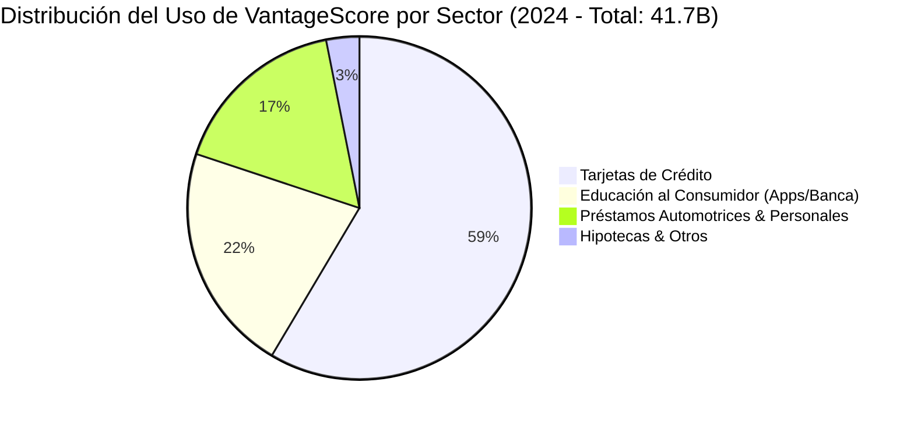

# Análisis de Calidad Técnica y Adopción de Mercado: VantageScore 4.0 vs. FICO Score

**Fecha:** 04/09/2026  
**Objeto:** Evaluación del volumen de adopción, precisión predictiva, capacidad inclusiva, validación por agencias de calificación (S&P/Moody's) y mitos sobre la competitividad de VantageScore 4.0 frente a FICO.

---

## 1. Resumen Ejecutivo: ¿Es VantageScore 4.0 un Buen Producto?

Existe la creencia popular entre consumidores de que VantageScore es un "producto secundario" o de "menor calidad" frente a FICO. **Esa percepción es técnicamente falsa y responde a inercias regulatorias pasadas, no a deficiencias del algoritmo.**

> [!IMPORTANT]
> ### 💡 Veredicto Técnico e Institucional
> 1. **Superioridad e Innovación en Datos:** VantageScore 4.0 fue el primer modelo masivo en incorporar **datos con tendencia (*Trended Data* a 24 meses)** y patrones de pago recurrentes (alquiler, agua, luz, teléfono), superando al modelo estático *Classic FICO*.
> 2. **Inclusión Financiera Extrema:** Permite calificar y otorgar una puntuación fiable a **33 millones de adultos en EE. UU.** previamente considerados "invisibles al crédito" (*thin files* o historiales de menos de 6 meses).
> 3. **Adopción Masiva en EE. UU. (41.700 Millones de Scores en 2024):** En tarjetas de crédito, préstamos de autos y fintechs, VantageScore es ya un estándar gigante. La orden de la FHFA de septiembre de 2026 elimina la última barrera que le impedía competir en hipotecas.
> 4. **Aprobación de S&P Global y Moody's:** Las agencias de calificación han verificado empíricamente que la tasa de mora proyectada en carteras securitizadas evaluadas con VantageScore 4.0 es equivalente a la de FICO.

---

## 2. Volumen y Cifras Reales de Adopción de VantageScore

A diferencia de lo que se creía hace una década, VantageScore no es un experimento menor; es una infraestructura gigante desarrollada conjuntamente por los tres burós de crédito (*Equifax, Experian y TransUnion*).

* **41.700 Millones de Scores Utilizados en 2024:** Registró un crecimiento del **+55% interanual**, consolidándose como la alternativa de más rápido crecimiento en EE. UU.
* **Explosión en Tarjetas de Crédito:** Un incremento del **+142% en 2024**, alcanzando **24.400 millones de puntuaciones** consultadas por emisores de tarjetas (Chase, Capital One, Synchrony, Citi).
* **Consumo masivo en Apps Financieras:** Más de **9.000 millones de puntuaciones** distribuidas anualmente a través de Credit Karma, Chase Credit Journey, Capital One CreditWise y Amex MyCredit Guide.

---

## 3. Comparativa Algorítmica: VantageScore 4.0 vs. Classic FICO vs. FICO 10T

| Criterio de Evaluación | Classic FICO (Legacy 4/5/2) | FICO 10T (Nueva Gen) | VantageScore 4.0 |
| :--- | :--- | :--- | :--- |
| **Captura de Datos** | Foto estática (último mes) | Tendencia 24 meses | **Tendencia 24 meses (*Trended Data*)** |
| **Requisito de Historial Mínimo** | 6 meses de actividad | 6 meses de actividad | **1 mes de actividad reciente** |
| **Inclusión de Pagos Alternativos** | Excluidos totalmente | Muy limitado | **Incluye Alquiler, Luz, Agua, Telecom** |
| **Consumidores Calificables** | Solo historial tradicional | +10-15 M adicionales | **+33 Millones de personas** |
| **Tratamiento de Colecciones Médicas**| Penalizaba deudas médicas | Excluye deudas < $500 | **Excluye deudas médicas pagadas/bajas** |
| **Mapeo en Securitización MBS** | Estándar histórico | Aprobado por S&P/Moody's | **Equivalente comprobado por S&P/Moody's** |

---

## 4. ¿Por Qué Existía la Falsa Idea de que VantageScore "No Servía"?

La confusión del público general proviene de tres factores históricos y de marketing:

1. **El Monopolio Regulatorio Hipotecario (1995-2026):**  
   Durante 30 años, la FHFA exigió exclusivamente *Classic FICO* para vender hipotecas a Fannie Mae y Freddie Mac. Por ello, aunque un banco usara VantageScore para aprobar una tarjeta de crédito, estaba obligado por ley a usar FICO para una hipoteca.
2. **Diferencia de Modelos en Credit Karma:**  
   Gratuitamente, apps como Credit Karma muestran *VantageScore 3.0/4.0*. Cuando un consumidor acudía a pedir una hipoteca, el banco le calculaba *Classic FICO*, que daba una cifra distinta (por ejemplo, 710 en lugar de 740). El consumidor asumía erróneamente que "VantageScore fallaba" o "no era el real", cuando simplemente eran dos algoritmos con escalas y fuentes distintas.
3. **Poder de Marca de FICO:**  
   FICO logró transformar su nombre comercial en un epónimo (como "Kleenex" para pañuelos).

---

## 5. Dictamen sobre la Competitividad Real frente a FICO

VantageScore 4.0 no solo compite al mismo nivel técnico que FICO, sino que en varios aspectos de **Machine Learning, inclusión social y estructuras de costes**, ha forzado a FICO a modernizarse (dando origen a FICO 10T).

Con la orden obligatoria de la FHFA de septiembre de 2026, VantageScore 4.0 ha roto la última barrera de mercado que le impedía disputar la cuota de originación hipotecaria. FICO ya no puede apoyarse en un monopolio legal y se enfrenta a un duopolio técnico de alta calidad.
