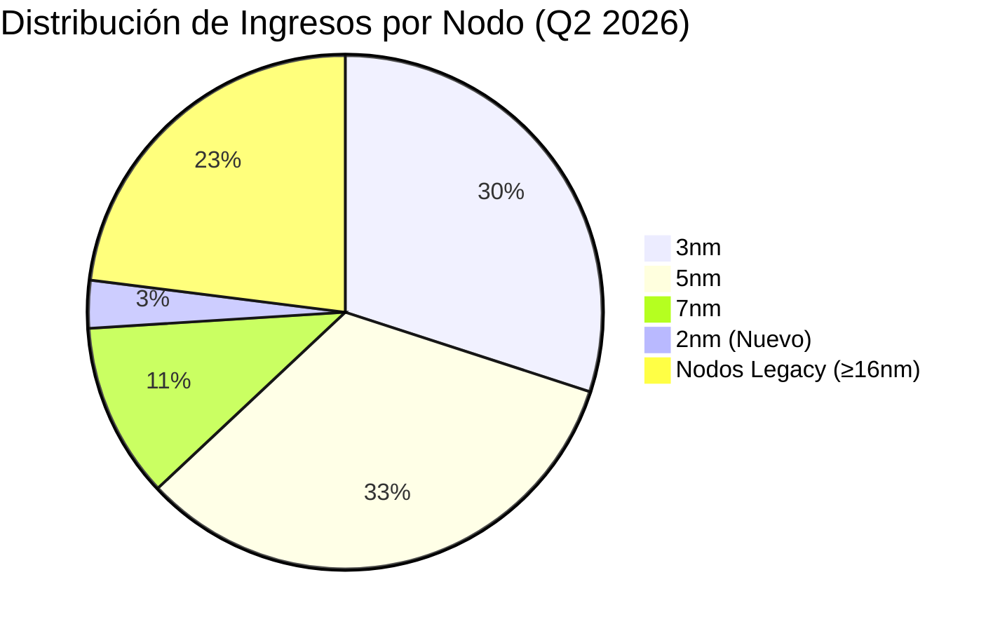
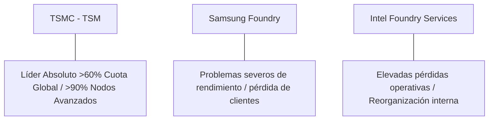

# Informe de Tesis de Inversión: Taiwan Semiconductor Manufacturing Co. (TSM / TSMC) - Q2 2026
**Fecha:** 22 de Julio de 2026 (Post-Resultados de Q2 2026 del 16 de Julio)  
**Clasificación CQV:** ÉLITE (Puesto de Prioridad en Portafolio)  
**Calificación Final:** COMPRA ESCALONADA. La fundición de microchips más avanzada y dominante del mundo. Crecimiento espectacular del +36.0% YoY en ingresos (US$40.2B) y +77.4% YoY en beneficio neto, con los nodos avanzados representando el 77% del total de ventas.

---

## 1. Resumen Ejecutivo

Taiwan Semiconductor Manufacturing Company (TSM / TSMC) es el fabricante por contrato (foundry) de semiconductores más grande e importante del mundo, controlando más del 60% del mercado global de fundición y más del 90% de los nodos de proceso avanzados (3nm, 5nm y 2nm).

En el **segundo trimestre de 2026 (Q2 2026)**, TSMC reportó resultados récord: ingresos consolidados de **US$40.200 millones (+36.0% YoY / +12.0% QoQ)** en el límite superior de su guía, un **beneficio neto de US$22.000 millones (+77.4% YoY)** y un impresionante **margen bruto del 67.7%**. Además, la compañía registró por primera vez ingresos por la producción comercial del **nodo de 2nm (3% del total)** y proporcionó una guía de ventas para el Q3 2026 de entre **US$44,600M y US$45,800M**.

Bajo el marco multifactorial **CQV v3.0**, TSMC obtiene un score de **9.16/10** (clasificación **ÉLITE**), sustentado en su inigualable eficiencia operativa (**F1: 8.64**), balance de fortaleza soberana (**F2: 9.50**) y un foso económico basado en escala y propiedad intelectual (**F4: 9.80**).

---

## 2. Métricas y Puntuaciones en el Modelo CQV v3.0

| Factor / Métrica | Puntuación (0-10) | Diagnóstico Financiero y Operativo |
| :--- | :---: | :--- |
| **F1: Rentabilidad** | **8.64** | Excelente eficiencia industrial. Margen bruto del **67.7%** y retorno sobre el capital invertido (ROIC) superior al 28%. |
| **F2: Solidez Financiera** | **9.50** | Balance impecable con más de $70,000 millones en caja y activos equivalentes frente a deuda controlada. |
| **F3: Crecimiento** | **9.25** | Crecimiento de ingresos del **+36.0% YoY** e incremento de beneficios netos del **+77.4% YoY**. |
| **F4: Foso Económico (Moat)** | **9.80** | Foso insuperable en rendimiento de oblea (*yields*), empaquetado avanzado CoWoS y liderazgo en nodos (3nm/2nm). |
| **F5: Proyecciones e IA** | **9.90** | Monopolio de fabricación de todos los chips de IA del mundo (Nvidia, AMD, Apple, Qualcomm, Broadcom). |
| **F6: Asignación de Capital** | **9.20** | Re inversión masiva en CapEx (~$30B-$32B anuales) y dividendos crecientes pagados trimestralmente. |
| **F7: FCF Yield (Valuación)** | **7.50** | Cotización a múltiplos muy razonables (PER Forward de ~18.2x) debido al descuento por riesgo geopolítico. |
| **F8: Antifragilidad** | **8.50** | Capacidad ilimitada para trasladar costes de inflación de oblea a sus clientes (*Pricing Power* absoluto). |
| **CQV Score Promedio** | **9.16** | Calificación: **ÉLITE** |
| **Valuación PEG** | **8.50** | Excelente relación calidad-precio en relación con el crecimiento masivo del beneficio del +77.4%. |

---

## 3. Análisis Detallado del Estado de Resultados (Q2 2026)

### 3.1. Tabla Comparativa de Resultados Trimestrales

| Métrica Clave (en millones US$, excepto EPS) | Q2 2026 (Actual) | Q1 2026 (Previo) | Variación QoQ (%) | Q2 2025 (Año Ant.) | Variación YoY (%) |
| :--- | :---: | :---: | :---: | :---: | :---: |
| **Ingresos Totales (US$)** | $40,200 M | $35,890 M | +12.0% | $29,560 M | +36.0% |
| **Ingresos por Nodos Avanzados (≤7nm)** | $30,954 M | $27,270 M | +13.5% | $21,870 M | +41.5% |
| **Gastos Operativos Totales** | $4,300 M | $4,100 M | +4.9% | $3,800 M | +13.2% |
| **Beneficio Operativo** | $22,870 M | $19,740 M | +15.9% | $15,370 M | +48.8% |
| **Margen Operativo** | **56.9%** | **55.0%** | +190 bps | **52.0%** | +490 bps |
| **Margen Bruto** | **67.7%** | **66.0%** | +170 bps | **62.4%** | +530 bps |
| **Beneficio Neto** | $22,000 M | $18,700 M | +17.6% | $12,400 M | +77.4% |
| **Diluted EPS (per ADR)** | **$3.52** | **$2.99** | **+17.7%** | **$1.98** | **+77.8%** |
| **Deuda a Largo Plazo (Long-Term Debt)** | **$28,500 M** | **$28,200 M** | **+1.1%** | **$27,900 M** | **+2.1%** |
| **Recompra de Acciones & Dividendos** | **$3,200 M** | **$3,000 M** | **+6.7%** | **$2,800 M** | **+14.3%** |
| **Free Cash Flow (FCF Trimestral)** | **$12,500 M** | **$10,200 M** | **+22.5%** | **$7,400 M** | **+68.9%** |

---

### 3.2. Desempeño por Nodos de Proceso (Tecnología de Oblea)

*   **Nodo de 3nm (30% del total)**: La gran rampa de producción para procesadores de IA y los nuevos chips de Apple (A19 / M5).
*   **Nodo de 5nm / 4nm (33% del total)**: Sigue siendo el pilar de volumen para aceleradores de IA (Nvidia Hopper/Blackwell) y semiconductores de computación de alto rendimiento (HPC).
*   **Nodo de 2nm (3% del total)**: **Primera contribución comercial de ingresos** en la historia de la industria. TSMC ha comenzado la producción inicial de 2nm con transistores Gate-All-Around (GAA).

---

### 3.3. Asignación de Capital y Estructura de Balance

*   **CapEx Masivo en Fábricas Globales**: Despliegue de CapEx anual de **$30,000M - $32,000M**, financiado íntegramento con caja operativa interna para construir la infraestructura de 2nm en Taiwán y expandir las *Fabs* en Arizona (EE. UU.), Kumamoto (Japón) y Dresde (Alemania).
*   **Patrimonio y Solvencia**: Caja y valores negociables superiores a **$70,000 millones**, manteniendo un ratio de solvencia crediticia soberana (AAA de facto).

---

### 3.4. Guías Financieras para Q3 2026

| Métrica de Guía | Guía Q3 2026 | Desempeño Q2 2026 | Diagnóstico |
| :--- | :---: | :---: | :--- |
| **Ingresos Consolidados** | **US$44,600M - US$45,800M** | US$40,200 M | **Aceleración trimestral del +12% QoQ.** |
| **Margen Bruto** | **65.0% - 67.0%** | 67.7% | Leve dilución temporal por coste de rampa de 2nm y expansión de fabs en EE. UU. |
| **Margen Operativo** | **56.0% - 58.0%** | 56.9% | Mantenimiento de una rentabilidad operativa extraordinaria. |

---

### 3.5. Líneas Rojas y Puntos de Vulnerabilidad Detectados en Q2 2026

> [!WARNING]
> **1. Riesgo Geopolítico (Tensión en el Estrecho de Taiwán)**
> * Más del 85% de la capacidad de producción avanzada de TSMC sigue concentrada en la isla de Taiwán. Cualquier escalada de tensión bélica o bloqueo naval por parte de China generaría una disrupción inmediata en la economía global.

> [!WARNING]
> **2. Compresión Temporal del Margen Bruto en Q3 (Dilución por 2nm y Fabs Internacionales)**
> * La guía de margen bruto para Q3 2026 baja levemente al 65%-67% (vs 67.7% en Q2). Esto se debe a los elevados costes iniciales de la rampa de 2nm y a los mayores costes operativos de las fábricas en Arizona y Europa frente a Taiwán.

> [!WARNING]
> **3. Alta Concentración en Grandes Gigantes de la Tecnología**
> * Los 5 principales clientes (Nvidia, Apple, AMD, Qualcomm, Broadcom) representan más del 60% de sus ingresos. Si Big Tech recorta sus presupuestos de capital en servidores de IA, el volumen de obleas de TSMC acusaría el golpe.

---

### 3.6. Impacto de la Inteligencia Artificial (Presente y Futuro)

#### A. Impacto en el Presente (2026):
* **El Monopolio Físico de los Chips de IA**: El 100% de los aceleradores de IA líderes (Nvidia B200, H100, AMD MI300, Google TPU, AWS Trainium) son fabricados exclusivamente por TSMC.
* **Empaquetado Avanzado CoWoS**: La demanda de empaquetado de chips tridimensional (CoWoS) supera la capacidad existente, permitiendo a TSMC cobrar tarifas premium sin competencia.

#### B. Impacto en el Futuro (Perspectiva a 3-5 Años):
* **Dominio Absoluto de 2nm y N2P**: La transición de la industria a los nodos de 2nm a partir de 2026-2027 consolidará la brecha de rendimiento de oblea sobre Samsung e Intel Foundry.

---

### 3.7. Análisis Detallado de la Competencia y Posicionamiento de Mercado

#### Comparativa de Rivales Principales:

| Competidor | Cuota en Nodos Avanzados | Rendimiento de Oblea (Yields) | Ventaja Indestructible de TSMC |
| :--- | :---: | :---: | :--- |
| **Samsung Foundry** | ~8% - 10% | Deficiente en 3nm GAA (<50%) | Los clientes prefieren TSMC por sus *yields* superiores al 80% y la garantía de que TSMC **nunca compite con sus propios clientes** (no diseña chips). |
| **Intel Foundry (IFS)** | <2% | En fase de reestructuración | Intel acumula pérdidas operativas multimillonarias en su división de fundición y depende de TSMC para fabricar sus propios procesadores clave (Lunar Lake). |

---

## 4. Tesis de Inversión (Toro vs. Oso)

### Tesis A: El Toro (Oportunidad)
*   **Suministrador Esencial de la Revolución Digital:** TSMC es la empresa más rentable e importante de la cadena de valor de la Inteligencia Artificial.
*   **Valoración Atractiva por Descuento Geopolítico:** Cotizar a un PER Forward de **~18.2x** creciendo al +77% en beneficios ofrece una relación calidad-precio inigualable.

### Tesis B: El Oso (Riesgos)
*   **Descuento por Riesgo de Taiwán:** El mercado aplica un descuento permanente a la acción debido al riesgo de conflicto geopolítico en Asia oriental.

---

## 5. Comparativa Multiversión Histórica y Valuación (PER Trailing / Forward)

| Año / Periodo | PER Trailing (Prom: 21.5x) | PER Forward (Prom: 16.8x) | CQV v1.0 | CQV v1.1 | CQV v2.0 | CQV v3.0 |
| :--- | :---: | :---: | :---: | :---: | :---: | :---: |
| **2022** | 13.8x | 11.2x | 9.27 | 9.27 | 8.65 | **8.65** |
| **2023** | 21.5x | 16.5x | 9.27 | 9.27 | 8.65 | **8.65** |
| **2024** | 26.2x | 19.8x | 9.30 | 9.30 | 8.70 | **8.70** |
| **2025** | 24.5x | 19.5x | 9.28 | 9.28 | 8.68 | **8.68** |
| **Q2 2026 (Actual)** | **22.5x** | **18.2x** | 9.27 | 9.35 | 8.72 | **9.16** |

---

## 6. Precio Ideal de Compra (Niveles de Entrada)

Con el título ADR cotizando actualmente a **~$185 - $198** (PER Trailing: **22.5x**, PER Forward: **18.2x**), estos son los 3 niveles de compra sugeridos:

### 🟢 Nivel 1: Zona de Entrada Razonable ($180 - $195) (Precio Actual)
* **PER Forward**: **~17.5x - 18.5x** | **Diagnóstico**: Cotizando en línea con su múltiplo histórico. Excelente punto para iniciar el **primer tramo (30%-40%)**.

### 🟡 Nivel 2: Zona de Precio Ideal / Gran Oportunidad ($150 - $165)
* **PER Forward**: **~14.5x - 15.5x** | **Descuento sobre PER Promedio**: **-15%**
* **Diagnóstico**: Oportunidad de alta convicción para comprar el monopolio de fabricación de IA a múltiplos de ganga. Zona para el **segundo tramo (40%)**.

### 🔴 Nivel 3: Zona de Ganga / Pánico Geopolítico (< $135)
* **PER Forward**: **< 13x** | **Diagnóstico**: Oportunidad generacional para completar la posición máxima en cartera.

---

## 7. Preguntas Frecuentes del Inversor (FAQs)

### Q1: ¿Por qué caerá levemente el margen bruto en el Q3 2026?
* **Respuesta**: Debido a los costes iniciales del lanzamiento comercial del nodo de 2nm y a que las nuevas fábricas internacionales (Arizona y Kumamoto) tienen un coste de operación superior a las fábricas de Taiwán durante sus primeros meses.

### Q2: ¿Puede Intel o Samsung arrebatarle cuota de mercado en 2nm a TSMC?
* **Respuesta**: Prácticamente imposible. Los clientes de chips avanzados (Apple, Nvidia, Qualcomm) han reservado la totalidad de la capacidad inicial de 2nm de TSMC debido a sus superiores rendimientos de oblea (*yields*) y fiabilidad de entrega.

---

## 8. Conclusión y Veredicto

TSMC ha presentado unos resultados de Q2 2026 sencillamente estelares (+77.4% en beneficio neto). El descuento geopolítico permite comprar el monopolio de fabricación de IA a un PER Forward de solo 18.2x.

**Veredicto:** **COMPRA ESCALONADA (Clasificación ÉLITE). Fabricante insustituible de la era de la Inteligencia Artificial. Iniciar primer tramo de compra en la zona actual de $180-$195.**
