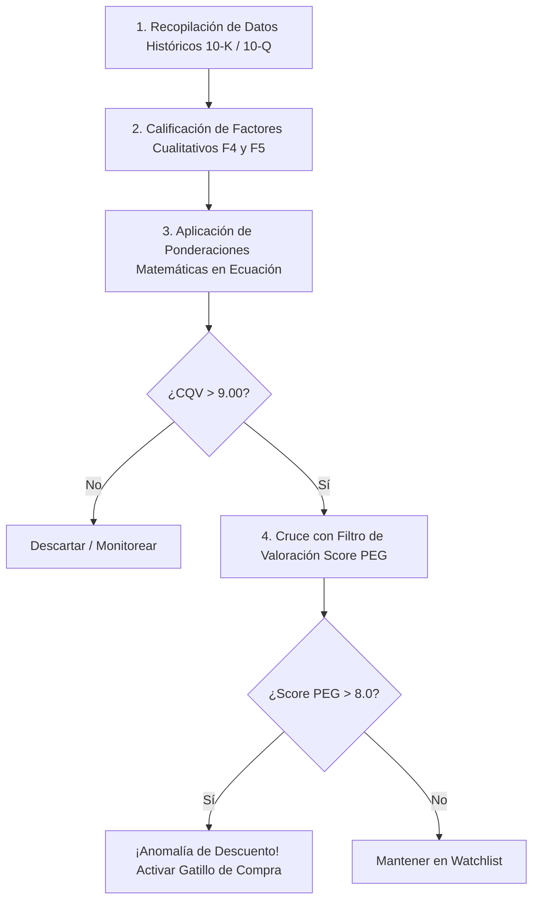

# Manual Metodológico: Cálculo del Score CQV
## (Quality and Structural Value)

Este manual metodológico establece el protocolo quirúrgico y sistemático para el cálculo del **CQV (Quality and Structural Value) Score**. Este sistema está diseñado para eliminar por completo la subjetividad, el sesgo de confirmación y el ruido del mercado, transformando la narrativa de un negocio en una puntuación matemática consolidada para la toma de decisiones de inversión.

---

## 📐 La Ecuación Matriz del CQV

El Score CQV se calcula mediante una suma ponderada de 5 macro-factores estratégicos. Cada factor se califica en una escala del **1.0 al 10.0** (donde 10.0 representa la perfección teórica).

$$CQV = (F_1 \times 0.25) + (F_2 \times 0.15) + (F_3 \times 0.15) + (F_4 \times 0.25) + (F_5 \times 0.20)$$

### Resumen de Factores y Ponderaciones

| Factor | Concepto | Peso | Descripción |
| :--- | :--- | :---: | :--- |
| **$F_1$** | Rentabilidad | 25% | Eficiencia en la generación de caja y retornos sobre el capital. |
| **$F_2$** | Solidez Financiera | 15% | Capacidad de supervivencia y estructura de deuda (antifragilidad). |
| **$F_3$** | Crecimiento Eficiente | 15% | Expansión orgánica y control de la dilución al accionista. |
| **$F_4$** | Moat Actual | 25% | Barreras de entrada y fosos competitivos consolidados. |
| **$F_5$** | Proyección Futura | 20% | Opcionalidad tecnológica, megatendencias y resiliencia disruptiva. |

---

## 🗂️ Protocolo de Calificación Detallado (Factor por Factor)

Para hallar la nota de cada macro-factor ($F_n$), se promedian las calificaciones de sus sub-componentes obligatorios.

### $F_1$: Rentabilidad (Peso: 25%) — *La Máquina de Efectivo*
Mide la eficiencia del negocio para extraer valor de sus operaciones y del capital invertido.

* **Márgenes Operativos:**
  * **Nota 10.0:** Margen EBITDA $> 35\%$ o Margen Operativo GAAP $> 30\%$ de forma recurrente (ej. negocios de Software o Datos).
  * **Nota 7.0 - 8.0:** Márgenes del $15\% - 25\%$ con alta estabilidad (ej. logística premium como ODFL).
  * **⚠️ Penalización:** Volatilidad interanual superior a $500$ puntos básicos debido a exposición a materias primas baja automáticamente la nota a menos de **6.0**.
* **Retorno sobre el Capital Invertido ($ROIC$):**
  * **Nota 10.0:** $ROIC$ superior al $15\% - 20\%$ de forma consistente, demostrando generación masiva de retornos por cada dólar reinvertido.
* **Conversión de Caja:**
  * Porcentaje de beneficio neto que se transforma en Flujo de Caja Libre ($FCF$). El objetivo ideal es una conversión cercana o superior al **$100\%$**.

---

### $F_2$: Solidez Financiera (Peso: 15%) — *El Escudo Antifrágil*
Determina la capacidad de supervivencia de la empresa en entornos de tasas altas y contracción del crédito.

* **Apalancamiento Neto:**
  * **Nota 9.5 - 10.0:** Ratio $\text{Deuda Neta} / \text{EBITDA} < 1.5\text{x}$ o posición neta de Caja Neta.
  * **💡 Excepción Analítica:** Si opera con patrimonio neto negativo de forma intencional (ej. FICO, MSCI, MCO) debido a recompras de acciones agresivas, se valida el score óptimo si la cobertura de intereses ($\text{EBITDA} / \text{Intereses}$) es mayor a **$8\text{x}$**.
* **Predecibilidad del Flujo:**
  * Vulnerabilidad de la caja ante recesiones. Los peajes regulados o contratos B2B SaaS altamente recurrentes aseguran la máxima calificación en este sub-componente.

---

### $F_3$: Crecimiento Eficiente (Peso: 15%) — *La Línea Roja de la Dilución*
Mide la expansión del negocio cuidando estrictamente la riqueza del accionista común.

* **Crecimiento Orgánico:**
  * Ritmo constante del **$6\%$ al $8\%$** mínimo en ingresos, siendo el escenario ideal el doble dígito bajo ($10\% - 15\%$).
* **Maestría en M&A y Asignación de Capital:**
  * Capacidad para ejecutar estrategias de adquisición tipo *Roll-up* o compras disciplinadas sin sobrepagar por *Goodwill* (ejemplos notables: HEICO, Constellation Software).
* **🛑 Filtro Anti-Dilución (Penalizador Clave):**
  * Se audita la Compensación Basada en Acciones ($SBC$). Si la empresa emite acciones de forma excesiva para pagar a empleados y diluye el flotante neto (ej. sector tecnológico/NVIDIA), el factor baja automáticamente a un rango de **7.5 - 8.5**, a menos que las recompras netas destruyan activamente más acciones de las que se emiten.

---

### $F_4$: Moat Actual (Peso: 25%) — *Los Fosos de Peaje Indestructibles*
Evalúa las barreras de entrada reales que protegen los retornos de la empresa frente a la competencia.

* **Propiedad Intelectual y Patentes:**
  * Algoritmos, datos exclusivos, o patentes especializadas (aeroespaciales/médicas).
* **Coste de Cambio (Switching Costs):**
  * Fricción operativa o financiera que sufriría el cliente al apagar el producto (ej. QuickBooks de Intuit o los flujos de ServiceNow). La tasa de renovación bruta ideal debe ser mayor al **$96\%$**.
* **Efecto Red e Intangibles Regulatorios:**
  * Estándares institucionales aprobados por ley o *de facto* donde la industria está obligada a usar el servicio (ej. Moody's con las calificaciones NRSRO o FICO con las decisiones hipotecarias).

---

### $F_5$: Proyección Futura (Peso: 20%) — *Opcionalidad Tecnológica y Adaptación*
Analiza la resiliencia del modelo de negocio de cara a la próxima década.

* **Piezas Clave en Megatendencias:**
  * Empresas posicionadas como proveedores críticos e inamovibles (cuello de botella) en la fabricación de semiconductores avanzados, automatización de laboratorios o infraestructura de IA agéntica corporativa.
* **Inmunidad a la Disrupción:**
  * Negocios cuyo núcleo operativo no pueda ser desintermediado fácilmente por modelos de lenguaje abiertos (LLMs) o software genérico. Las bases de datos corporativas complejas y la infraestructura física puntúan sustancialmente más alto que la creación de contenido plano.

---

## 🛠️ Plantilla de Ejecución: El Algoritmo en 4 Pasos

Para auditar una empresa nueva, siga esta secuencia metodológica:

### 1. Recopilación de Datos Históricos (10-K y 10-Q)
* **Paso Inicial:** Extraiga los datos financieros de los últimos 5 años.
* **Métricas clave:** Margen Operativo GAAP, $ROIC$, Deuda Neta/EBITDA, evolución del flotante de acciones (dilución neta por SBC) y tasa de retención de clientes.

### 2. Calificación de Factores Cualitativos
* **Análisis de Foso:** Evalúe el Moat ($F_4$) y la Proyección Futura ($F_5$).
* **Pregunta de Control:** *“Si tuviera 10,000 millones de dólares en efectivo, ¿podría replicar o destruir este negocio en 3 años?”* Si la respuesta es un no rotundo debido a barreras regulatorias, legales o contractuales, la calificación debe ser mayor a **9.5**.

### 3. Aplicación de Ponderaciones Matemáticas
* **Cálculo del Score:** Introduzca las calificaciones (escala 1.0 - 10.0) de cada factor en la ecuación matriz.
* **Ajuste:** Recuerde aplicar el castigo correspondiente en $F_3$ si hay dilución neta por compensación basada en acciones ($SBC$).

### 4. Cruce con el Filtro de Valoración (Score PEG)
* **Decisión de Compra:** Una vez obtenido el score CQV, si este es mayor a **9.00** (Calidad Élite):
  1. Divida la tasa de crecimiento estimada entre el PER forward y multiplique el resultado por 10 para hallar el **Score PEG**:
     $$\text{Score PEG} = \left( \frac{\text{Crecimiento (\%)}}{\text{PER Forward}} \right) \times 10$$
  2. Si el Score PEG resultante es mayor a **8.0** (lo que indica que se está pagando muy poco por un alto crecimiento), se declara una *Anomalía de Descuento* y se activa automáticamente el gatillo de compra.

---

## 📝 Ejemplo de Script de Auditoría Rápida: Caso FICO (Fair Isaac Corp.)

A continuación, se detalla la aplicación de la metodología CQV para FICO:

* **`[F1: Rentabilidad]`** $\rightarrow$ Margen Op: 41%, ROIC: Infinito (Asset-light) $\rightarrow$ **Nota: 9.9**
* **`[F2: Solidez Financiera]`** $\rightarrow$ Patrimonio Negativo Intencional, EBITDA/Intereses $> 10\text{x}$ $\rightarrow$ **Nota: 8.8**
* **`[F3: Crecimiento Efic]`** $\rightarrow$ Pricing power salvaje, recompras netas puras $\rightarrow$ **Nota: 9.6**
* **`[F4: Moat Actual]`** $\rightarrow$ Monopolio legal de facto institucional $\rightarrow$ **Nota: 9.9**
* **`[F5: Proyección Futura]`** $\rightarrow$ IA integrada en análisis de datos de riesgo $\rightarrow$ **Nota: 9.5**

### Cálculo Final:

$$CQV = (9.9 \times 0.25) + (8.8 \times 0.15) + (9.6 \times 0.15) + (9.9 \times 0.25) + (9.5 \times 0.20)$$

$$CQV = 2.475 + 1.320 + 1.440 + 2.475 + 1.900 = \mathbf{9.61}$$

> [!TIP]
> **Resultado de la Auditoría:** Con un score CQV de **9.61**, FICO califica sólidamente en el rango de **Calidad Élite** ($CQV > 9.00$). El siguiente paso es calcular su ratio PEG para determinar si activa el gatillo de compra.
